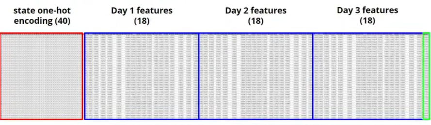
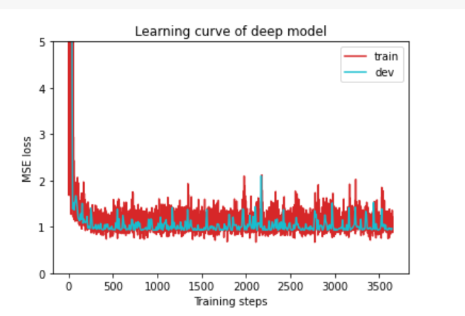
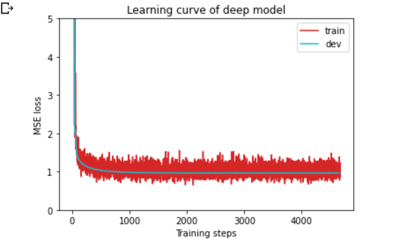

# 作业一的细节

## 一. 设置种子

```python
myseed = 42069  # set a random seed for reproducibility
torch.backends.cudnn.deterministic = True
# 代表每个种子每次卷积出来的结果固定
torch.backends.cudnn.benchmark = False
# 开始前是否寻找高效卷积算法
np.random.seed(myseed) # np的随机数字也确定
torch.manual_seed(myseed) # torch 种子
if torch.cuda.is_available():
    torch.cuda.manual_seed_all(myseed) # gpu种子
```

## 二. 数据集的定义(基于csv)

### 1. 数据集结构介绍

我们拥有不同模式的数据集,有train,dev,test

数据说明:40州+(疑似(4)+行为(8)+心理健康(5)+阳性比例(1))第一天,第二天,第三天

40州是one-hot vector,即40个州中只有一个州为1



### 2. 编码init

1. 读取csv

```python
# 读取csv,去掉头,去掉左边序号
with open(path,'r') as f:
    data = list(csv.reader(f))
    data = np.array(data[1:])[:,1:].astype(float)
```

2. target方案

```python
    # 这里意思是,如果只要target,那么feats只取0-39,57,75,即只取州和发病率
if not target_only:
    feats = list(range(93)) # 原来有94列,第94列是test positive,我们可能不需要用
else:
    # TODO: Using 40 states & 2 tested_positive features (indices = 57 & 75)
    pass
```

3. mode方案

```python
if mode == 'test':
    data = data[:,feats]
    # data: 893 x 93 (40 states + day 1 (18) + day 2 (18) + day 3 (17))
    self.data = torch.FloatTensor(data)
else:
    # 最后一列是第三天的正确结果
    target = data[:,-1]
    data= data[:,feats]
    # Splitting training data into train & dev sets
    # 这里分出训练和校验数据,将非10的倍数的数据作为训练,剩下的作为校验
    if mode == 'train':
        indices = [i for i in range(len(data)) if i % 10 != 0]
    elif mode == 'dev':
        indices = [i for i in range(len(data)) if i % 10 == 0]
    self.data = torch.FloatTensor(data) # tensor化放入数据集
    self.target = torch.FloatTensor(target)
```

4. **Normalize**

   有点难度,先原样保留,后面学

```python
# Normalize features (you may remove this part to see what will happen)
self.data[:, 40:] = \
(self.data[:, 40:] - self.data[:, 40:].mean(dim=0, keepdim=True)) \
/ self.data[:, 40:].std(dim=0, keepdim=True)

self.dim = self.data.shape[1]

print('Finished reading the {} set of COVID19 Dataset ({} samples found, each dim = {})'
.format(mode, len(self.data), self.dim))
```

如果没有这段代码,数据是这样的



有这段代码



### 3. 剩下两个

```python
def __len__(self):
    return len(self.data)
def __getitem(self,index):
    # Returns one sample at a time
    if self.mode in ['train', 'dev']:
        # For training
        return self.data[index], self.target[index]
    else:
        # For testing (no target)
        return self.data[index]
```

### 4. 创建dataLoader

```python
def getDataDataLoader(path,mode,batch_size,n_jobs=0,target_only=False):
  dataset = CVDataset(path,mode=mode,target_only=target_only)
  dataloader = DataLoader(
      dataset,batch_size,
      shuffle = (mode == 'train', drop_last=False,
        num_workers=n_jobs, pin_memory=True)
  )
    # pin_memory内存寄存
    # num_workers子进程数量
    # drop_last丢掉最后一个batch的数据
  return dataloader
```


## 三. 神经网络的定义

### 1.  初始化

```python
def __init__(self,input_dim):
    super(NeiralNet,self).__init__()

    # Define your neural network here
    # TODO: How to modify this model to achieve better performance? 
    # Sequential: 按顺序添加模块,形成神经网络
    self.net = nn.Sequential(
        nn.Linear(input_dim, 64),
        nn.ReLU(),
        nn.Linear(64, 1)
    )

    # Mean squared error loss
    self.criterion = nn.MSELoss(reduction='mean')
```

### 2. 其他

```python
def __forward__(self,x):
    ''' Given input of size (batch_size x input_dim), compute output of the network '''
    return self.net(x).squeeze(1)

def __cal_loss__(self,pred,target):
    ''' Calculate loss '''
    # TODO: you may implement L2 regularization here
    return self.criterion(pred, target)
```

## 四. 训练函数

```python
def train(tr_set,dv_set,model,config,device):
    # 训练集和校验集
    # 模型,自定义的config(hyperparameter),设备
    
```

### 1. 准备工作

```python
n_epochs = config['n_epochs']
optimizer = getattr(torch.optim,config['optimizer'])(model.parameters(),**config['optim_hparas']) # 创建optimizer
min_mse = 1000.
loss_record = {'train':[],'dev':[]} # 准备存储loss
early_stop_cnt = 0
epoch = 0
```

### 2. 训练

```python
while epoch < n_epoches:
    # 一个epoch生成一个结果,需要多次筛选,也不能太多次,不然过拟合
    model.train() # 开练
    for x,y in tr_set: # 优化loss
        optimizer.zero_grad()# 清除梯度 
        x,y = x.to(device),y.to(device)
        pred = model(x) # 输出结果
        mse_loss = model.cal_loss(pred,y) # 计算loss
        mse_loss.backward() # 梯度结果
        optimizer.step() # 根据backward的结果step
        losss_record['train'].append(mse_loss.detach().cpu().item())
        # 阻止反向传播,放入cpu,返回单个值
```

### 3. 校验

校验发生在一个epoch内

```python
 # 每个epoch都需要校验一次(校验函数还没写)
    dev_mse = dev(dv_set,model,device)
    if dev_mse < min_mse:
      min_mse = dev_mse
      print('Saving model (epoch = {:4d}, loss = {:.4f})'
                .format(epoch + 1, min_mse))
      # 训练输出保存
      torch.save(model.state_dict(),config['save_path'])
      # 早结束,在多个epoch没有更新之后提前结束防止过拟合
      early_stop_cnt = 0
    else: 
      early_stop_cnt += 1
    epoch += 1
    loss_record['dev'].append(dev_mse)
    if early_stop_cnt > config['early_stop']:
      # Stop training if your model stops improving for "config['early_stop']" epochs.
      break
```

### 4. 收尾

```python
print('Finished training after {} epochs'.format(epoch))
return min_mse, loss_record
```

## 五. 校验/测试函数

### 1. 校验

校验就是一个计算平均loss的过程

```python
def dev(dv_set, model, device):
    model.eval()                                # set model to evalutation mode
    total_loss = 0
    for x, y in dv_set:                         # iterate through the dataloader
        x, y = x.to(device), y.to(device)       # move data to device (cpu/cuda)
        with torch.no_grad():                   # disable gradient calculation
            pred = model(x)                     # forward pass (compute output)
            mse_loss = model.cal_loss(pred, y)  # compute loss
        total_loss += mse_loss.detach().cpu().item() * len(x)  # accumulate loss
    total_loss = total_loss / len(dv_set.dataset)              # compute averaged loss

    return total_loss
```

### 2. 测试

```python
def test(tt_set, model, device):
    model.eval()                                # set model to evalutation mode
    preds = []
    for x in tt_set:                            # iterate through the dataloader
        x = x.to(device)                        # move data to device (cpu/cuda)
        with torch.no_grad():                   # disable gradient calculation
            pred = model(x)                     # forward pass (compute output)
            preds.append(pred.detach().cpu())   # collect prediction
    preds = torch.cat(preds, dim=0).numpy()     # concatenate all predictions and convert to a numpy array
    return preds
```

## 六. 主程序

### 1. 设置参数

```python
device = get_device()                 # 自定义的获取设备的函数
os.makedirs('models', exist_ok=True)  # The trained model will be saved to ./models/
target_only = True                  #

# TODO: How to tune these hyper-parameters to improve your model's performance?
config = {
    'n_epochs': 3000,                # maximum number of epochs
    'batch_size': 270,               # mini-batch size for dataloader
    'optimizer': 'SGD',              
    'optim_hparas': {                
        'lr': 0.001,                 # learning rate of SGD
        'momentum': 0.9              # momentum for SGD
    },
    'early_stop': 200,               # early stopping epochs (the number epochs since your model's last improvement)
    'save_path': 'models/model.pth'  # your model will be saved here
}
```

### 2. 设置loader

```python
tr_set = prep_dataloader(tr_path, 'train', config['batch_size'], target_only=target_only)
dv_set = prep_dataloader(tr_path, 'dev', config['batch_size'], target_only=target_only)
tt_set = prep_dataloader(tt_path, 'test', config['batch_size'], target_only=target_only)
```

### 3. 开练

```python
model = NeuralNet(tr_set.dataset.dim).to(device)  # Construct model and move to device
model_loss, model_loss_record = train(tr_set, dv_set, model, config, device)
```

