# 机器学习

## 一. 介绍

机器学习就是让机器寻找一个函数的过程.

### 1. 分类

`Regression回归`: 寻找输出一个**数值**的函数

`Classification分类`: 寻找输出一个**类别**的函数

`Structed learning`: 生成有结构性物体的函数

### 2. 训练步骤和线性模型

1. 第一步: 定义model

`Model`: 生成的带有**未知参数的function**

以最简单的**y=b+wx**线性模型为例

* `feature`: 已知参数

* `weight`: 权重,未知参数

* `bias`: 偏移,未知参数

2. 第二步: 从数据中定义一个loss

`Loss`: 一个**函数**,输入weight和bias,**衡量该组数值的优秀程度**

**L(b,w)**

* `Label`: 真实值

* `mean absolute error(MAE平均误差)`: 利用 <u>和真实值的差值 的 绝对值</u> 之 <u>平均值</u>来衡量好坏

* `Error Surface`: 根据不同参数-Loss绘制的等高线图

3. 第三步: 优化 optimization

抽取Loss最好的参数

方法: `Gradient Descent梯度下降`

思路:

* 先找一个随机的初始w值w0,计算偏微分L/w;

* 根据斜率判断应该提高w还是降低,偏移程度与`learning rate`和偏微分的大小(乘积)决定

> `hyperparameter`: 在机器学习过程中人为定义的参数,比如learning rate
>
> `local minima`: Loss局部极小值
>
> `global minima`: Loss全局最小值

### 3. 模型选择(逻辑回归)

来自model的精度限制称为`bias`

* **Piecewise Linear模型**

  * 将所有连续的曲线都近似成折线,每段折线使用 constant + a set of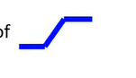(hard sigmoid)即可

  * 该形状用*Sigmoid*函数逼近,其中c为上限

    记为
    $$
    c*sigmoid(b+wx_1)
    $$
    

    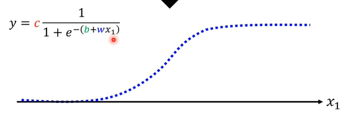

    > sigmoid中,c改变高度,w改变斜率,b改变左右

    $$
    模型公式Activation\quad function\\
    y = b + \Sigma_ic_isigmoid(b_i+\Sigma_jw_{ij}x_1)\\
    y=b+ \Sigma_{2i}c_imax(0,b_i+\Sigma_jw_{ij}x_1)
    $$

  * 我们可以将所有未知参数,w,c,b,b集合为$\theta$向量

    > 另一种拟合线称为`ReLU`,$cmax(0,b+wx)$,两个ReLU可以形成一个hard sigmoid

2. Loss设计

   Loss进化为L($\theta$ ),依然可以使用Gradient Descent,MAE的方式,

   其中,我们称各个参数偏导的向量为`gradient`
   $$
   g=\nabla L(\theta^0)
   $$

3. loss实际操作

   将所有成果分为一个一个的Batch,每个batch生成一个结果

   然后根据batch的结果一次又一次的update theta,这整个过程称为一个`ehoch`

4. `overfitting过拟合`: 在训练过的资料上表现良好,预测时表现更差

### 附. 示例

* 不止可以做一次,可以套娃
* 每个sigmoid看做一个神经元(或hidden layer),该过程就是一个神经网络,也就是深度学习

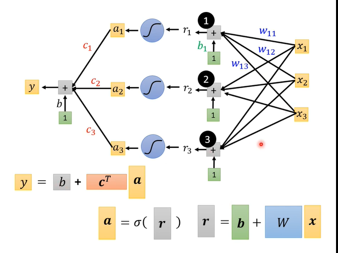

## 工具. pytorch

Pytorch是facebook ai机器学习框架,拥有两个特性:

* `tensor`计算(类似numpy),GPU加速
* `tape-based autograd系统`深度神经网络

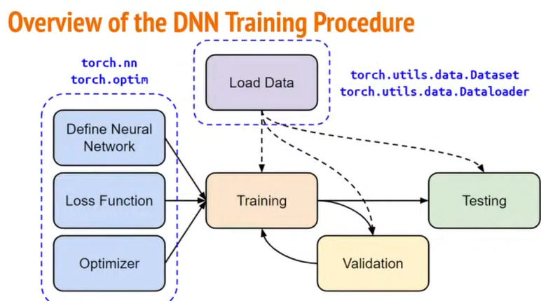

### 1. tensor

高纬度矩阵,一般存浮点数和整数(torch.float和torch.long 对应 torch.FloatTensor,torch.LongTensor)

* 构造器

  ```python
  x = torch.tensor([[1,2],[3,4]]);
  x = torch.form_numpy(np.array([[2,2],[2,2]]));
  
  x = zeros([2,3]);#0矩阵,参数为形状
  x = ones([1,2,3]);#1矩阵,参数为形状
  ```

* 运算

  ```python
  x.shape # torch.Size([2, 2]) 返回形状
  #下面看不懂
  x.squeeze(N)#去掉第n维
  x.unsqueeze(N)#增加维度
  
  x.transpose();#转置
  w = torch.cat([a,b,c],dim=1); # 根据dimension拼接矩阵
  
  x.dtype # 数据类型
  ```

  torch.cat():

  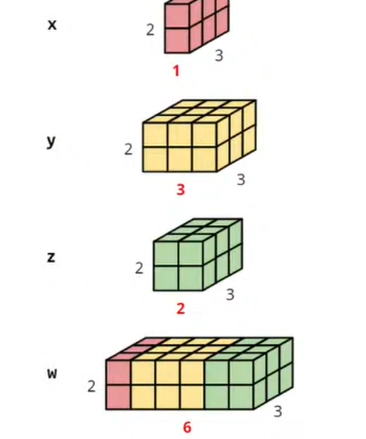

* 在gpu跑

  ```python
  torch.cuda.is_available() # 检查gpu是否可用
  x.to('gpu')
  ```

  

### 2. 一些使用

1. 算偏导

   实例: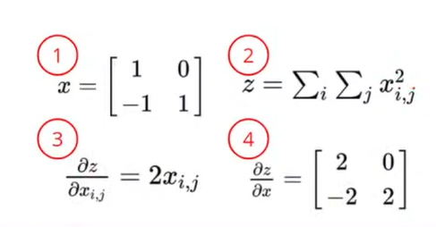 

```python
x = torch.tensor([[1.,0.],[-1.,1.]],requires_grad=True)
z = x.pow(2).sum()
z.backward() # 算微分
x.grad
```

2. 读data之定义dataset

   ```python
   from torch.utils.data import Dataset,DataLoader
   class MyDataset(Dataset): #继承Dataset
       def __init__(self,file):
         self.data = ... # 读,预处理数据
       def __getitem__(self,index): #取得一个数据
         return self.data[index] 
       def __len__(self):
         return len(self.data) #返回长度
   ```

   使用dataset

   ```python
   dataset = MyDataset(file)
   dataloader = DataLoader(dataset,batch_size,shuffle=True)
   # shuffle: 是否乱序
   ```

   使用dataloader:

   每次从dataloader中可以抽取出一个batch_size大小的数据

   

### 3. 使用: 建立neural network

```python
torch.nn.Linear(输入的fearure的维度,输出的feature的维度)
```

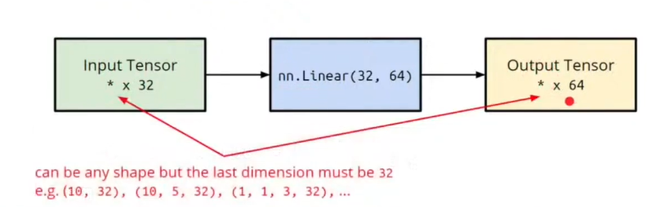

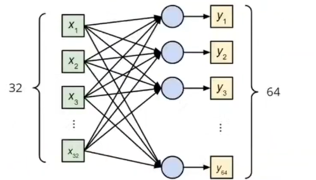

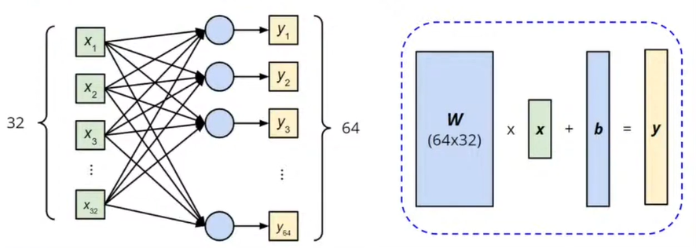

```python
#Activation Function
nn.Sigmoid()
nn.ReLU()
#Loss
nn.MSELoss()
nn.CorssEntropyLoss()
```

**建立模型**

```python
import torch.nn as nn
class MyModel(nn.Module): # 继承Module
    def __init__(self):
      super(MyModel,self).__init__()
      self.net = nn.Sequential( # 定义网
          nn.Linear(10,32),
          nn.Sigmoid(),
          nn.Linear(32,1)
      ) # 现在还感性认识,之后深入
    def forward(self,x): # 算output
      return self.net(x) # 可见net是一个函数
```

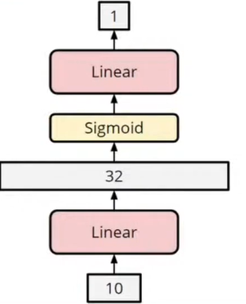

optim:

```python
torch.opsim.SGD(params,lr,momentum=0) # 梯度下降
# 传入model.parametes,learning rate
```

### 4. 完整模板

```python
dataset = MyDataset(file) # 读数据集
tr_set = DataLoader(dataset,16,shuffle=True) # 放进loader
model = MyModel().to(device) # 设置模型在哪跑
criterion = nn.MSELoss() # 定义loss
optimizer = torch.optim.SGD(model.parameters(),0.1) # 定义优化器
```

训练过程

```python
for epoch in range(n_epochs): #自己定义跑多少epoch
    model.train()
    for x,y in tr_set:
        optimizer.zero_grad() # 把gradient重置
        x,y = x.to(device),y.to(device) #移动数据到设备(gpu)
        pred = model(x) # 计算model的output
        loss = criterion(pred,y) #算loss
        loss.backword() # 算gradient
        optimizer.step() #更新参数
```

校验过程

```python
model.eval() #设置model为evaluation mode
total_loss = 0;
for x,y in dv_set:
    x,y = x.to(device),y.to(device)
    with torch.no_grad(): # 不希望在输入时计算,提高效率
        pred = model(x)
        loss = criterion(pred,y)
    total_loss += loss.cpu().item() * len(x) # 计算loss总和
    avg_loss = total_loss / len(dv_set.dataset) # 计算平均
```

测试过程

```python
model.eval()
preds = []
for x in tt_set:
    x = x.to(device)
    with torch.no_grad():
        pred = model(x)
        preds.append(pred.cpu())
```

保存/读取

```python
# 存
torch.save(model.state_dict(),path)

# 读
ckpt = torch.load(path)
model.load_state_dict(ckpt)
```

## 附. backpropagation反向传播算法

基于深度学习gradient descent的计算量太大,我们需要一个有效率的算法,即backpropagation

### 1. 链式法则

即微分中的连式法则

### 2. 反向传播

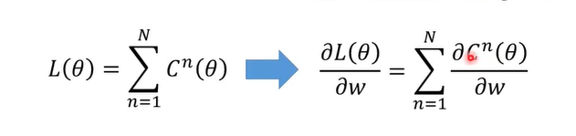

我们有$z=x_1w_1+x_2w_2+b$
$$
\frac{\partial C}{\partial w} = \frac{\partial z}{\partial w}\frac{\partial C}{\partial z}
$$
这两个偏微分:

z/w称为forward pass,值即为fearture

,C/z称为backward pass,

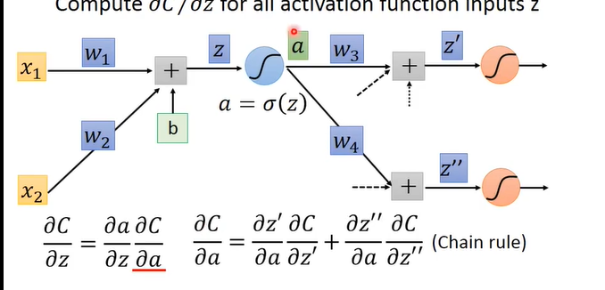

## 二. 编码

### 1. 数据集的构成

`Training data`: 由feature和真实值构成

`Testing data`: 由一组输入feature构成

### 2. 做作业

1. 检查training data的loss

   * 过大: **model bias**(通过增加feature)或者**没有optimization好**(比如local minima)
   * 如果更好,就检查testing data的loss

2. testing data loss过大:

   overfitting(过拟合退化,过于依赖训练资料)或者mismatch

   * 增加训练资料
   * **data augmentation** 根据已有资料,自己创造新的资料
   * **constrained** 人为增加约束

## 三. optimization失败的处理

### 1. critical point

梯度为0: `critical point`

* local minima
* `saddle point`鞍点

需要区分是哪一种critical point,因为saddle point比local minima更需要处理

#### 1.1 区分

取一个给定$\theta$附近的点,有泰勒展开: 

g是梯度向量,H是二阶导Hessian矩阵

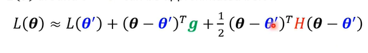

在critical point,g为0,中间这项去掉,即可根据H知道状态,即微积分学的

> H正定,为**local minima**
>
> H负定为极大值
>
> H有时大于0,有时小于0,是**saddle point**

#### 1.2 鞍点

在鞍点的时候,g为0,H指明前进方向

取**负值特征值**的特征向量u,让$\theta = \theta ' + u$即可

### 2. batch and momentum

#### 2.1 为什么要batch

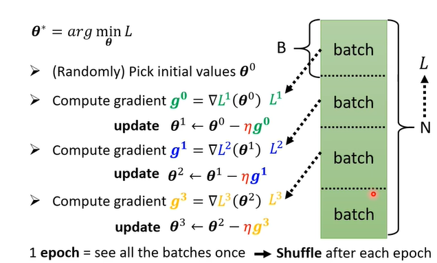

我们是对每个batch的min L进行微分计算的,为什么要这么做?

1. `Shuffle`: 每个epoch之后都会进行shuffle,即重新分batch

2. `full batch`: 不分batch
3. 分batch即每次送入一个batch_size的数据进行训练,并更新参数

* 原因:
  * 在不分batch的情况下,我们每次更新参数都需要看所有的资料,但是准确(powerful)
  * 而分batch下只需要看batch_size大小的资料,但是不准确(noisy)
  * 然而,__noisy的结果更适合训练__

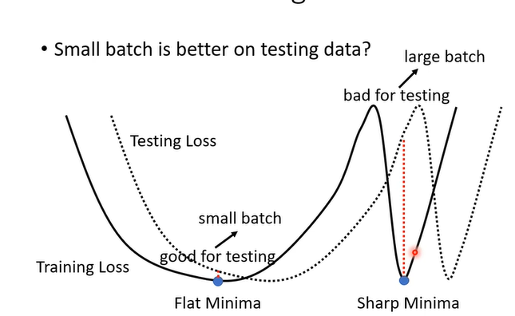

#### 2.2 momentum

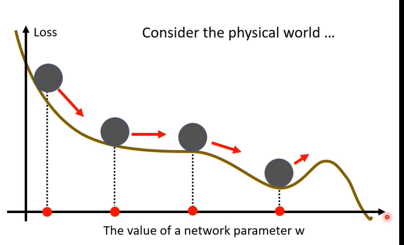

一个球在物理上,从高处滚下来可能不会被saddle point和local minima卡住;

在实现上: 通过gradient方向 + 前一步方向 来移动

### 3. learning rate

当loss变小的时候,参数可能在山谷间来回的震荡,导致没有到达真正的minima

但是太大或者太小的learning rate都有问题,所以我们要`动态的learning rate`

* 原则:

  * 如果陡峭,希望learning rate小一点; 反之,希望learning rate大一点

* 改写1(Adagrad):

  * 改成parameter dependent learning rate

    $\theta^{t+1}_i<-\theta^t_i-\frac{\eta}{\sigma^t_i}g^t_i$

  * 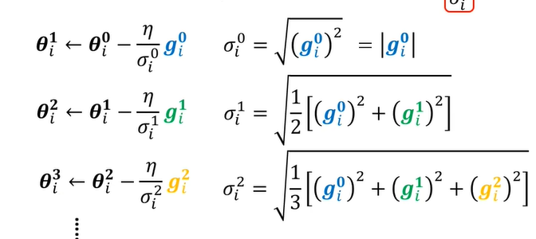

* 改写2(RMSProp):
  * 之前的问题: 希望在同一个参数同一个方向动态调整
  * 即在之前的基础上,可以用hyperparameter调整前面gradient的权重
  * 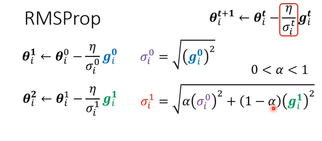

* 最终版本: **Adam = RMSProp + Momentum**

2. learning rate的另一个问题: 通过积累使错误轴的势头累积,冲向错误的方向

   `learning rate scheduling`: 将$\eta$跟时间有关

   * learning rate decay: 随着时间降低
   * warm up: 上升再下降

### 4. loss

MSE

分类上更常用的: `Cross-entropy交叉熵`: 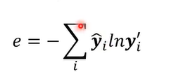,y'的含义见`附. 分类`

### 5. batch normalization

制造好的dimension来改变error surface的形状,使用标准化

当方差比较大时,error surface比较难找

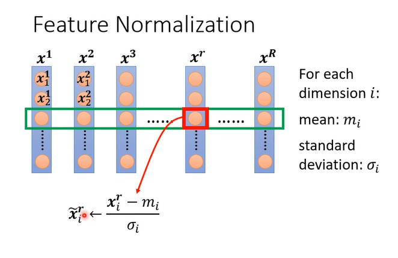

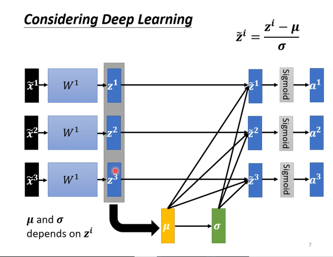

## 附. 分类classfication

分类就是依然输出标量,将类别也标量化,并经过softmax映射或者sigmoid映射

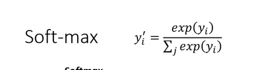

## 四. CNN卷积神经网络

### 1. 介绍

`CNN(Convolutional Neural Network)`卷积神经网络应用于图片

模型的目标是输入一张固定大小的图片,输出一个分类

* 图像的表示:
  * 图片 = 3d tensor(长,宽,3*channels(rgb))
  * 比如一张100 * 100 的图片,我们将其排成一排,称为3 * 100 * 100大小的数组
  * 这样的数组成为nn的输入

#### 1.1 引入1

* 问题1:
  * full connection造成weight的数目过大,容易造成overfitting
* 观察1:
  * 一张图片的分类可以通过Pattern(特征)来判断,并不需要每一个neural都看完整的图片
* 简化1:
  * 设定一个区域叫`Receptive field`,每一个neural只需要关注这一个范围即可
  * Receptive field可以重叠
  * 经典receptive field:
    * 会看所有的channel(rgb),只在乎长和宽(`kernel size`),一般为3*3
    * 每个receptive field会有__一组__neural去处理
    * 有间隔的选择receptive field,一般`stride`为2,最好有重叠
    * 如果有一部分超出了范围,即创建为`padding`,向超出范围大小的部分填写值,比如0

* 观察2:
  * pattern会出现在不同图片的不同地方
  * 每个receptive field的每个神经元都是在侦测不同的pattern
  * 不同recept field都会有一簇神经元检测同样的特征
* 简化2:
  * 不同receptive field相同目的的神经元**共享参数**,称为`Filter`

> Convolutional Layer = Receptive Field + Parameter Sharing
>
> 卷积层的model bias较大,但不容易overfitting

#### 1.2 引入2

图片->Convolution里面包含了很多**Filter**(3 * 3 * channel(rgb/bw) tensor)

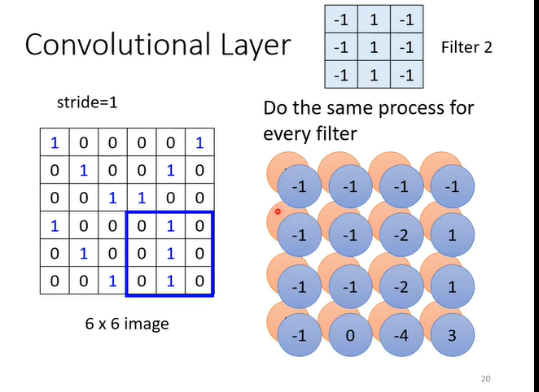

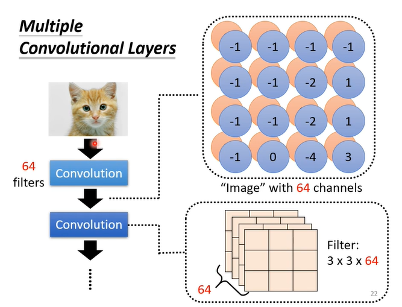

#### 1.3 pooling

pooling就是一个操作减少运算量,比如max pooling,将图像分为各个pool,选择最大的作为代表,其他丢弃

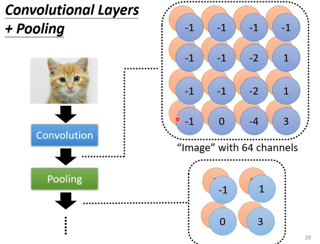

#### 1.4 flatten

在经过convolution和pooling几轮后拉直成一条,经过fully connected network再softmax获得最终结果

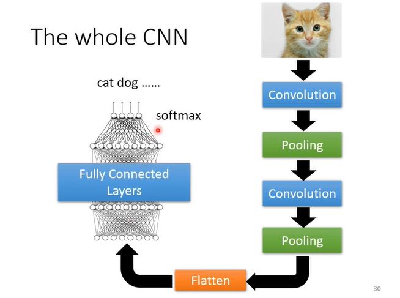

## 五. self-attention

### 1. 引入

输入是**Sequence并且seq大小会改变的vertor,**就算是CNN都没有做到

输出: 

1. 每一个vector都有对应的label,比如文字-词性`Sequence Labeling`
2. 整个seq输出一个label
3. 不知道输出多少label(`seq2seq`)

比如: 输入的是一句句子

### 2. 表示法

1. `one-hot encoding`: 假设所有词汇没有关联

   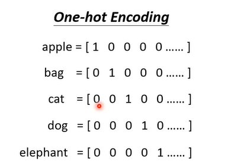

2. `word embedding`:给每个词汇一个向量

   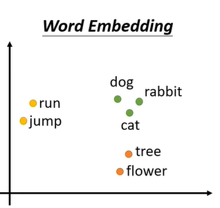


### 3. Sequence Labeling注意力

#### 3.1 前提

直觉: fully connected做法,但是对于相同的输入一定会给出相同的结果

优化: 分window而不是孤立,如果要考虑整个sequence的话就无法解决

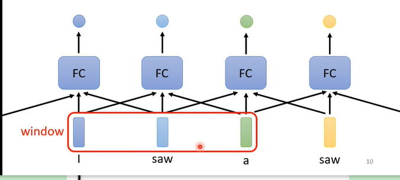

#### 3.2 self attention

`self-attention`来自于Transformer,接收一整个seq,并且对应每个vector输出label

可以与FC交替使用

### 4. 运作方式

1. 确定输入$a_1$与其他输入之间的关联$\alpha$ (attention score)

   * 计算方式: 

     1. dot-product: $\alpha = (W^qa_1) * (W^ka_2)$

     2. Additive:

        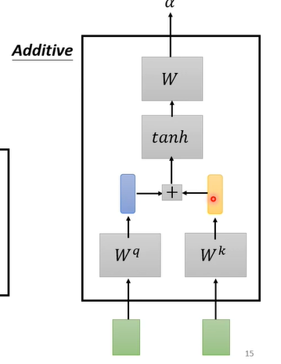

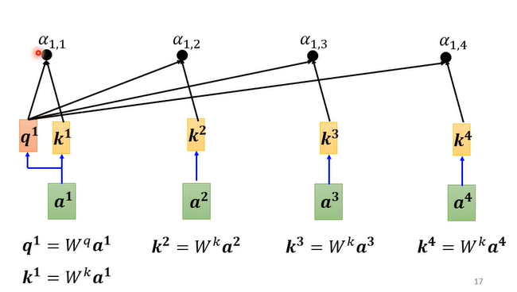

2. 然后把$\alpha$做__softmax__
3. 接着再把a * $W^v$得到新的向量v,将$v *\alpha'$再相加得到b1(a1对应的结果)

> 带W的都是要训练的

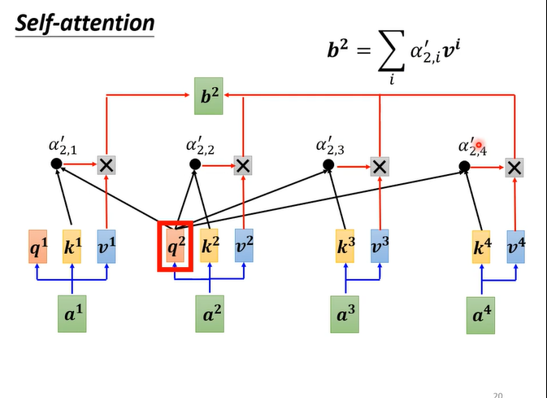

### 5 矩阵运作方式

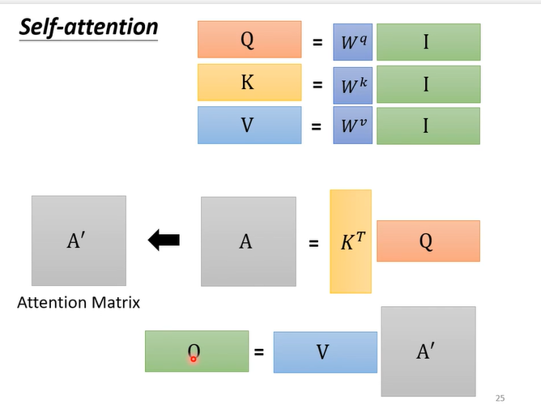

### 6. 输入位置判断

`Positional Encoding`: 给每个输入设置一个位置资讯vector $e^i$,并加到$a^i$上

$e^i$的取值:

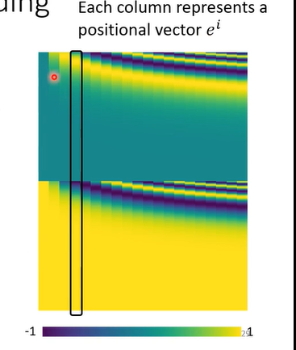