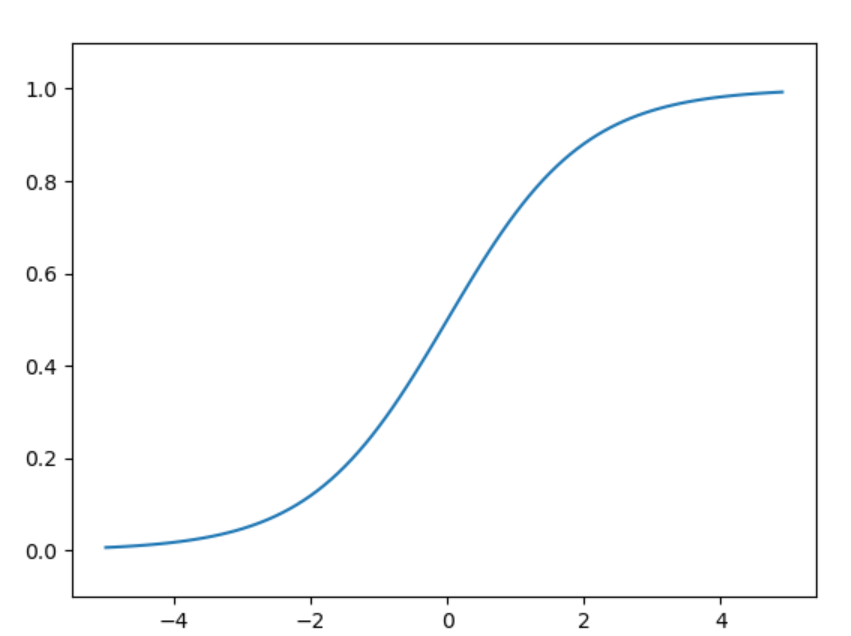
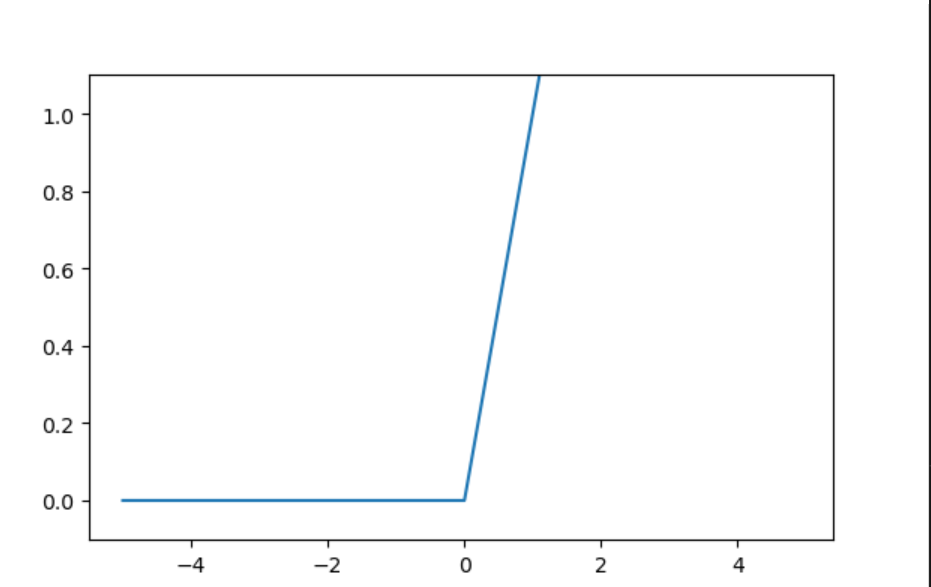
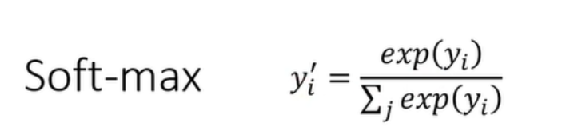
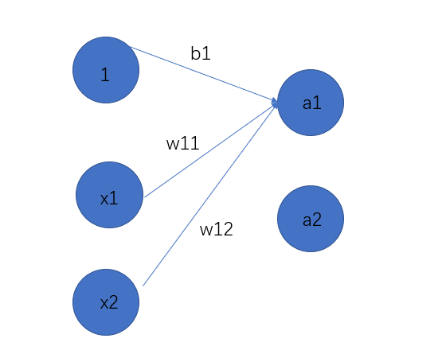
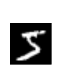
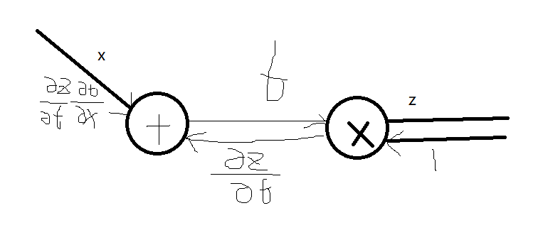
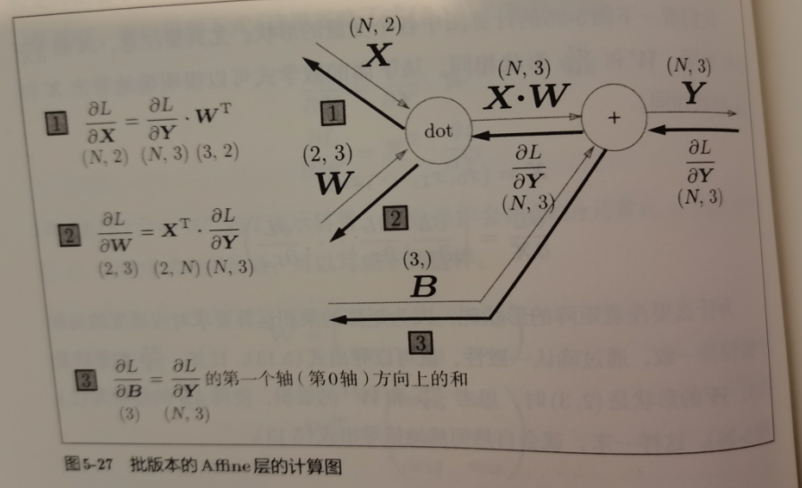
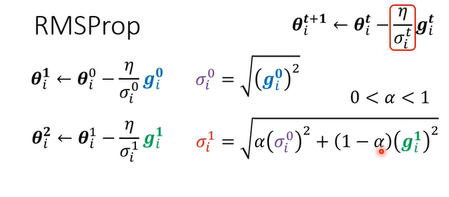
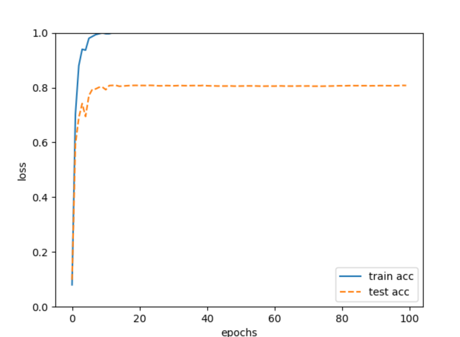
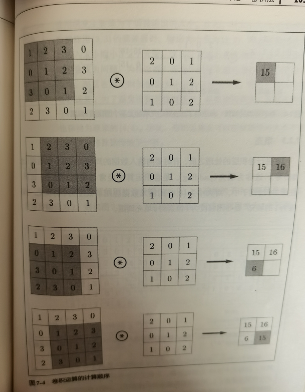

# 深度学习入门

## 一. 从感知机到神经网络

### 1. 激活函数

`Activation Function`决定如何激活输入信号的总和.

信号总和经过激活函数后进行信号输出,激活函数的返回值即为最终输出

激活函数的运行过程包含在一个神经元中
$$
\sigma(wx+b)
$$

* 感知机的激活函数
  * 感知机的激活函数即: 总和>0取1,总和<=0取0

#### 1.2 常见激活函数

`sigmoid`,`阶跃函数(即感知机的激活函数)`,`reLU`,`softmax`	

```python
# 阶跃函数实现和绘图
def step_function(x):
    y = x > 0
    return y.astype(np.int)
x = np.arange(-5.0,5.0,0.1)
y = step_function(x)
plt.plot(x,y)
plt.ylim(-0.1,1.1)
plt.show()
```

```python
# sigmoid的实现和绘图
def sigmoid(x):
    retrun 1 / (1+np.exp(-x))
```



```python
# ReLU的实现和绘图

def relu(x):
    return np.maximum(0,x)
```



* softmax

  

  ```python
  def softmax(x):
      exp_x = np.exp(x)
      sum_x = np.sum(exp_x)
      return exp_x / sum_x
  ```

#### 1.3 softmax的优化

softmax在分子上或分母上造成的数字可能会溢出,所以我们上下同时乘以一个常数
$$
y' = \frac{exp(y - C)}{\Sigma exp(y - C)},C可以取样本中的最大值
$$

```python
def softmax(x):
    C =  np.max(x)
    exp_x = np.exp(x - C)
    sum_x = np.sum(exp_x)
    return exp_x / sum_x

```

#### 1.4 softmax的性质

* 0到1之间,输出总和为1,所以可以解释为`概率`

#### 1.5 二维softmax

```python

def softmax(x):
    if x.ndim == 2:
        x = x.T
        # np.max(x, axis=0) 获取每列的最大值
        x = x - np.max(x, axis=0)
        # np.sum(np.exp(x), axis=0) 计算每一列的和
        y = np.exp(x) / np.sum(np.exp(x), axis=0)
        return y.T
     x = x - np.max(x)  # 溢出对策
    return np.exp(x) / np.sum(np.exp(x))
```

为什么要转置?

```python
# 为什么这里要这样实现？ 使用转置的方式
   # 假设不用转置的方式实现，输入数据为n行m列的矩阵
   # 对每一行进行溢出处理，需要使用如下方法
   # max = np.max(x, axis=1)
   # c = x - max,表示对x的每一行减去行最大值
   # 此时 x 的形状为n行m列，max的形状为n个元素的一维
   # 所以 x - max 不能进行运算
   
   # 使用如上转置方式，同样分析
   # x 为n行m列， 则y 为m行n列
   # 此时再求 max = np.max(y, axis=0) 就要按照列求最大值
   # 因为此时一列才是原来的一个样本数据
   # 此时max 的形状为有n个元素的一维
   # y - max 可以计算
   # 最后结果转置即为原来的结果  
```


### 2. 三层full connection的实现

2-3-2-2(输出)结构



#### 1.1 第一层

```python
# feature
X = array([1.0,0.5])
# 输入到第一层的weight,由于是3个输出所以是3*2
W1 = np.array([[0.1,0.3,0.5],[0.2,0.4,0.6]])
#  bias,对应三个第一层输出
B1= np.array([0.1,0.2,0.3])

# 第一层输出
A1 = np.dot(X,W1) + B1
```

#### 1.2 sigmoid激活

```python
A1 = np.dot(X,W1) + B1
Z1 = sigmoid(A1)
```

#### 1.3 下一层

```python

W2 = np.array([[0.1,0.4],[0.2,0.5],[0.3,0.6]])
B2 = np.array([0.1,0.2])

A2 = np.dot(Z1,W2) + B2
Z2 = sigmoid(A2)
```

#### 1.5 输出层

```python
def identity_function(x):
    return x

W3 = np.array([[0.1,0.3],[0.2,0.4]])
B3 = np.array([0.1,0.2])
A3 = np.dot(Z2,W3) + B3
# sigma激活函数,保持一致,输出不变 ; 
# 在分类问题上,使用softmax
Y = identity_function(A3)
print(Y)
```

#### 1.6 总结

综上,神经网络就是输入乘权重加bias,经过激活再输出的过程

### 3. 手写数字识别

#### 3.1 MNIST数据集

我们使用MINIST手写数字图像集

```python
"""
Parameters
    ----------
    normalize : 将图像的像素值正规化为0.0~1.0
    one_hot_label : 
        one_hot_label为True的情况下，标签作为one-hot数组返回
        one-hot数组是指[0,0,1,0,0,0,0,0,0,0]这样的数组
    flatten : 是否将图像展开为一维数组
    Returns
    -------
    (训练图像, 训练标签), (测试图像, 测试标签)
"""
from dataset.mnist import load_mnist
(x_train,t_train),(x_test,t_test) = load_mnist(flatten=True,normalize=False)
```

### 3.2 图像展示

```python
def img_show(img):
    pil_img = Image.fromarray(np.uint8(img))
    pil_img.show()

img = x_train[0]
label = t_train[0]
print(label) # 5
# 将图像展开
img.reshape(28,28)
img_show(img)
```



#### 3.3 神经网络的处理

分析:

* 输入: 784个神经元(像素数量)
* 输出: 10个神经元
* 设置两个隐藏层

```python
# 使用训练出来的w和b
# pickle(pkl)类似json,可以快速读入和存储对象
import pickle
def init_network():
    with open("sample_weight.pkl","rb") as f:
        network = pickle.load(f)
    return network
```

```python
# 处理和输出
def predict(network,x):
     W1,W2,W3 = network['W1'],network['W2'],network['W3']
    b1,b2,b3 = network['b1'],network['b2'],network['b3']

    a1 = np.dot(x,W1) + b1
    z1 = sigmoid(a1)
    a2 = np.dot(z1,W2) + b2
    z2 = sigmoid(a2)
    a3 = np.dot(z2,W3) + b3
    y = identity_function(a3)
    return y
```

#### 3.4 验证

```python
x,t = get_data()
network = init_network()
accuracy_cnt = 0
for i in range(len(x)):
    y = predict(network,x[i])
    p = np.argmax(y) # 获得最高的索引
    if p == t[i]:
        accuracy_cnt += 1
print("Accuracy: " + str(float(accuracy_cnt) / len(x)))
```

* 批处理

原来输入的是1 * 784的矩阵,但是我们可以输入100 * 784的输入,输出100 * 10,形成批处理

np对高维数组处理进行了优化,所以效率往往更高

```python
batch_size = 100
for i in range(0,len(x),batch_size):
    y = predict(network,x[i:i + batch_size])
    p = np.argmax(y,axis=1) # 获得每个1维度中最高的索引
    accuracy_cnt += np.sum(p == t[i:i + batch_size])
```

## 二. 神经网络学习

学习即从训练数据中获取最优权重参数的过程

### 1. 识别数字的方案

方案1: 人思考的算法

方案2 : 计算机视觉特征量SIFT,HOG -> 机器学习SVM,KNN

方案3: 深度学习

### 2. loss

t为真实值,y为输出

#### 1.1 MSE

Mean squared error:
$$
E = \frac{1}{2}\Sigma_k(y_k-t_k)^2
$$

```python
def mean_squared_error(y,t):
    return 0.5 * np.sum((y - t) ** 2)
```

#### 1.2 Cross entropy

$$
E = -\Sigma_kt_klny_k
$$

```python
def cross_entropy_error(y,t):
    delta = 1e-7 # 防止出现log0
    return -np.sum(t * np.log(y + delta))
```

#### 1.3 计算和训练方案

训练一次之后,我们需要求出__所有训练样本loss的总和/平均值__

也可以分batch训练,按batch计算loss的总和/平均

* 分batch: 随机分

  ```python
  # 获取样本数量
  train_size = x_train.shape[0]
  batch_size = 10
  # 抽取一个batch_size大小,最大不到train_size的数组
  batch_mask = np.random.choice(train_size,batch_size)
  # 提取batch
  x_batch = x_train[batch_mask]
  t_batch = t_train[batch_mask]
  ```

* 分batch交叉熵(相加取平均)

  ```python
  # t为one-hot形式时
  # 此时与t不匹配的数字都为0,不计入交叉熵
  def cross_entropy_error(y,t):
      if y.ndim == 1:
          t = t.reshape(1,t.size)
          y = y.reshape(1,y.size)
      batch_size = y.shape[0]
      return -np.sum(t * np.log(y + 1e-7)) / batch_size
  ```

  改进:

  ```python
  # t为12345678形式时
  # 此时与t不匹配的数字都为0,不计入交叉熵
  # 只取每个样本中和t匹配的结果算log,行为上和one-hot一致
  def cross_entropy_error(y,t):
      if y.ndim == 1:
          t = t.reshape(1,t.size)
          y = y.reshape(1,y.size)
      batch_size = y.shape[0]
      return -np.log(y[np.arrange(batch_size),t] + 1e-7) / batch_size
  ```

  

### 3. 梯度

梯度下降的出现使我们不需要再枚举,而是从一个初始的weight点开始,根据梯度更新参数

#### 3.1 导数的实现

```python
def numerical_diff(f,x):
    h = 1e-4
    # 中心差分减小误差
    return (f(x + h) - f(x - h)) / (2 * h)
```

#### 3.2 梯度的实现

```python

def numerical_gradient(f,x):
    h = 1e-4
    grad = np.zeros_like(x)
	# 一个一个求偏导
    for idx in range(x.size):
        tmp_val = x[idx]
        # 右边
        x[idx] = tmp_val + h
        fxh1 = f(x)
        # 左边
        x[idx] = tmp_val - h
        fxh2 = f(x)
		# 偏导
        grad[idx] = (fxh1 - fxh2) / (2 * h)

        x[idx] = tmp_val
    return grad
```

#### 3.3 gradient descent的实现

> 梯度下降不需要到0的时候立刻停止,而是到一定规模的停止

$$
x_1 = x_0 - \eta g
$$

```python
# 泛用性梯度下降
def gradient_descent(f,init_x,lr=0.01,step_num=100):
    x = init_x
    for i in range(step_num):
        grad = numerical_gradient(f,x)
        x -= lr * grad
    return x
```

* 实例: 梯度下降求$x^2+y^2$的最小值

  ```python
  init_x = np.array([-3.,4])
  res = gradient_descent(lambda x:x[0]**2 + x[1] ** 2,init_x)
  print(res)
  ```

#### 3.4 适合多维的梯度

```python
def numerical_gradient(f, x):
    h = 1e-4 # 0.0001
    grad = np.zeros_like(x)
    
    # 线性迭代器
    it = np.nditer(x, flags=['multi_index'], op_flags=['readwrite'])
    while not it.finished:
        # 迭代索引
        idx = it.multi_index
        tmp_val = x[idx]
        x[idx] = float(tmp_val) + h
        fxh1 = f(x) # f(x+h)
        
        x[idx] = tmp_val - h 
        fxh2 = f(x) # f(x-h)
        grad[idx] = (fxh1 - fxh2) / (2*h)
        
        x[idx] = tmp_val # 还原值
        it.iternext()   
    return grad
```


### 4. 简单神经网络

* 神经网络class

```python
class simpleNet:
    def __init__(self):
        # 高斯初始化
        self.W = np.random.randn(2,3)
    def predict(self,x):
        return np.dot(x,self.W)
    def loss(self,x,t):
        z = self.predict(x)
        y = softmax(z)
        loss = cross_entropy_error(y,t)
        return loss
```

* 求L/W的梯度

  ```python
  # 该函数只是根据W返回Loss的值,实际上只要经过输入x和net.loss即可
  def f(W):
      return net.loss(x,t)
  # 该函数实际上通过修改net.W来计算梯度
  dW = numerical_gradient(f,net.W)
  print(dW)
  ```


### 5. 二层神经网络的实现

```python
class TwoLayerNetwork:
    def __init__(self,input_size,hidden_size,output_size,weight_init_std=0.01):
        # hidden_size: 隐藏层大小
        self.params = {}
        self.params['W1'] = weight_init_std * np.random.randn(input_size,hidden_size)
        self.params['b1'] = np.zeros(hidden_size)
        self.params['W2'] = weight_init_std * np.random.randn(hidden_size,output_size)
        self.params['b2'] = np.zeros(output_size)
    def predict(self,x):
        W1,W2 = self.params['W1'],self.params['W2']
        b1,b2 = self.params['b1'],self.params['b2']

        a1 = np.dot(x,W1) + b1
        z1 = sigmoid(a1)
        a2 = np.dot(z1,W2) + b2
        y = softmax(a2)
        return y
    def loss(self,x,t):
        y = self.predict(x)
        return cross_entropy_error(y,t)
    def accuracy(self,x,t):
        y = self.predict(x)
        y = np.argmax(y,axis = 1)
        t = np.argmax(t,axis = 1)
        accuracy = np.sum(y == t) / float(x.shape[0])
        return accuracy
    
    def numerical_gradient(self,x,t):
        loss_W = lambda W:self.loss(x,t)

        grads = {}
        grads['W1'] = numerical_gradient(loss_W,self.params['W1'])        
        grads['b1'] = numerical_gradient(loss_W,self.params['b1'])
        grads['W2'] = numerical_gradient(loss_W,self.params['W2'])        
        grads['b2'] = numerical_gradient(loss_W,self.params['b2'])       
        return grads  

```

属性:

`params`

方法:

`__init__(input_size,hidden_size,output_size)`

`predict(x)`

`loss(x,t)`

`accuracy(x,t)`

`numerical_gradient(x,t)`

#### 5.2 按batch训练

```python
train_loss_list = []

# hyperparameter
iters_number = 1000 # 改变参数的次数
train_size = x_train.shape[0] # 训练集的大小
batch_size = 1000 # batch的大小
learning_rate = 0.01

network = TwoLayerNetwork(input_size = 784,hidden_size = 50,output_size = 10)
for i in range(iters_number):
    # 一次循环改变一次参数
    batch_mask = np.random.choice(train_size,batch_size)
    x_batch = x_train[batch_mask]
    t_batch = t_train[batch_mask]

    grad = network.numerical_gradient(x_batch,t_batch)
	# 改变参数
    for key in ('W1','b1','W2','b2'):
        network.params[key] -= learning_rate * grad[key]
    # 计算loss
    loss = network.loss(x_batch,t_batch)
    train_loss_list.append(loss)
```

#### 5.3 升级: 按batch训练并每个epoch记录测试

遍历完每个batch,更新完参数的一个过程称为一个epoch

每个epoch以后都可以记录下测试数据和训练数据的精度

> 操作:
>
> ```python
> # 多少次算一个epoch,一般总大小/batch size即可
> iter_per_epoch = max(train_size / batch_size,1)
> 
> # 在每个epoch之后计算一次精度
> if i % iter_per_epoch == 0:
>     train_acc = network.accuracy(x_train,t_train)
>     test_acc = network.accuracy(x_test,t_test)
>     test_acc_list.append(test_acc)
>     train_acc_list.append(train_acc)
>     print("train acc ,test acc | " + str(train_acc) + "," + str(test_acc))
> ```
>
> 


## 三. 反向传播

我们可以看到,这个<u>(L/参数)</u>的几个梯度哪怕在两层里都计算的非常慢

### 1. 链式法则

我们拥有一个正向的计算图,可以从结果开始反向传播,初始化为1,

然后每经过一个计算,乘上一个该计算的偏导数,形成基于链式法则的反向传播



### 2. 反向传播实现

#### 2.1 乘法与加法的反向传播

> 这个类是按`层`实现的,就是每一次运算都是一层,对应一个对象,反向传播时调用对应的对象

2元乘法层反向传播: 

```python
class MulLayer:
    def __init__(self):
        self.x = None
        self.y = None
    
    def forward(self,x,y):
        self.x = x
        self.y = y
        out = x * y
        return out
    def backward(self,dout):
        dx = dout * self.y
        dy = dout * self.x
        return dx,dy
```

2元加法层反向传播: 

```python
class AddLayer:
    def __init__(self):
        pass
    def forward(self,x,y):
        out = x + y
        return out
    def backward(self,dout):
        dx = dout * 1
        dy = dout * 1
        return dx,dy
```

#### 2.2 激活函数的反向传播

* ReLU

  鉴于ReLU的表达式可知
  $$
  (dy/dx)={1,x>0;0,else}
  $$
  正向传播时,如果x>0则原封不动,不然为0

  反向传播时,原数则根据内容**乘以1或者0(不变或者归零)**

  ```python
  class Relu:
      def __init__(self):
          self.mask = None
      def forward(self,x):
          # self.mask记录了原数的情况
          self.mask = (x <= 0)
          out = x.copy()
          out[self.mask] = 0
          return out
      def backward(self,dout):
          dout[self.mask] = 0
          dx = dout
          return dx
  ```

* Sigmoid

  对sigmoid求导发现
  $$
  y' = (1-y)y
  $$

  ```python
  class Sigmoid:
      def __init__(self):
          self.out = None
      def forward(self,x):
          out = 1 / (1 + np.exp(-x))
          self.out = out
          return out
      def backward(self,dout):
          dx = dout * (1.0 - self.out) * self.out
          return dx
  ```

#### 2.3 矩阵乘积的反向传播(TODO)

矩阵乘法传播的大小和数值



1. 在相加时,B展开,所以在计算Y/B时需要计算对应每个B的Y的和

```python
class Affine:
    def __init__(self,W,b):
        self.W = W
        self.b = b
        self.x = None
        self.dW = None
        self.db = None
    def forward(self,x):
        self.x = x
        out = np.dot(x,self.W) + self.b
    def backward(self,dout):
        dx = np.dot(dout,self.W.T)
        self.dW = np.dot(self.x.T,dout)
        self.db = np.sum(dout,axis = 0)
        return dx
```

#### 2.4 softmax-cross entropy层

这位是重量级,该输出层会将所有输出统合.

推理过程忽略,只说结果

>  最外层1经过cross entropy和softmax之后,反向传播结果为$y_i - t_i$
>
> 如此漂亮的结果是交叉熵设计的结果
>
> 实际上,恒等输出和MSE反向传播结果也是一样的

```python
class SoftmaxWithLoss:
     def __init__(self):
         self.loss = None
         self.y = None
         self.t = None
    def forward(self,x):
        self.t = t
        # 会存储softmax的结果和loss结果
        self.y = softmax(x)
        self.loss = cross_entropy_error(self.y,self.t)
        return self.loss
    def backward(self,dout = 1):
        batch_size = self.t.shape[0]
        # 这个batch_size蒙在鼓里
        dx = (self.t - self.t) / batch_size
        return dx
```

#### 2.5 其他操作

* 分支:
  * 输出分支汇入反向传播值之和
* Repeat(广播):(与Sum互为反向)
  * 正向: 一个D长度的数组通过重复变为矩阵
  * 反向: 输入一个矩阵,算`列方向和`形成数组
* Sum:
  * 正向: 矩阵通过sum变为数组
  * 反向: 梯度数组Repeat成矩阵

### 3. 反向传播改进二层神经网络

1. 初始化时加入各个层的实现

   ```python
    def __init__(self,input_size,hidden_size,output_size,weight_init_std=0.01):
           # hidden_size: 隐藏层大小
           self.params = {}
           self.params['W1'] = weight_init_std * np.random.randn(input_size,hidden_size)
           self.params['b1'] = np.zeros(hidden_size)
           self.params['W2'] = weight_init_std * np.random.randn(hidden_size,output_size)
           self.params['b2'] = np.zeros(output_size)
   
           # 生成各层放在有序字典内
           self.layers = OrderedDict()
           self.layers['Affine1'] = Affine(self.params['W1'],self.params['b1'])
           self.layers['Relu1'] = Relu()
           self.layers['Affine2'] = Affine(self.params['W2'],self.params['b2'])
           self.lastLayer = SoftmaxWithLoss()
   
   ```

2. 使用各层的forward来计算结果

```python
 def predict(self,x):
	for layer in self.layers:
        x = layer.forward(x)
	return x
```

3. 新的loss计算

   ```python
   def loss(self,x,t):
       y = self.predict(x)
       return self.lastLayer.forward(y,t)
   
   ```

4. 新的梯度计算

   ```python
   def gradient(self, x, t):
       # forward
       self.loss(x,t)
       # backward
       dout = 1
       dout = self.lastLayer.backward(dout)
       layers = list(self.layers.values())
       layers.reverse()
       # 反向传播
       for layer in layers:
           dout = layer.backward(dout)`
       # 归纳
       grads = {}
       grads['W1'] = self.layers['Affine1'].dW        
       grads['b1'] = self.layers['Affine1'].db
       grads['W2'] = self.layers['Affine2'].dW        
       grads['b2'] = self.layers['Affine2'].db     
       return grads
   ```

   

## 四. Optimization

### 1. SGD

`随机梯度下降(stochastic gradient descent)`是最简单的优化方法

公式为
$$
W = W - \eta\frac{\partial L}{\partial W}
$$

```python
class SGD:
    def __init__(self,lr=0.01):
        self.lr = lr
    def update(self,params,grads):
        # 前情提要: params是有序字典
        for key in params.keys():
            params[key] -= self.lr * grads[key]
```

使用:

```python
optimizer = SGD()
...
optimizer.update(network.params,grad)
```

### 2. SGD的缺点

1. 如果在不同维度梯度相差较大,则会做简谐运动向minima靠拢,比较低效

### 3. momentum

在原来的基础上增加动量
$$
v=\alpha v - \eta\frac{\partial L}{\partial W}\\
W=W+v
$$
alpha也为hyperparameter,以momentum表示

> 先走上一次的$\alpha$倍数再走这一次的梯度

实现:

```python
class Momentum:
    def __init__(self,lr=0.01,momentum=0.9):
        self.lr = lr
        self.momentum = momentum
        self.v = None
    def update(self,params,grads):
        if self.v is None:
            self.v = {}
            for key,val in params.items():
                self.v[key] = np.zeros_like(val)
        for key in params.keys():
            self.v[key] = self.momentum * self.v[key] - self.lr * grads[key]
            params[key] += self.v[key]
```

### 4. AdaGrad

AdaGrad是一种Adaptive learning rate方案

* 解释:
  * 就是__每个参数__的历史梯度的平方和再开根号,对应__每个参数__的新learning rate

$$
h=h + (\frac{\partial L}{\partial W})^2//矩阵元素乘法\\
W=W-\eta\frac{1}{\sqrt{h}}\frac{\partial L}{\partial W}
$$

> 改造版本有RMSProp,照着这个实现即可(ag+(1-a)h)或者反过来
>
> 

实现:

```python
class AdaGrad:
    def __init__(self,lr=0.01):
        self.lr = lr
        self.h = None
    def update(self,params,grads):
        if self.h is None:
            self.h = {}
            for key,val in params.items():
                self.h[key] = np.zeros_like(val)
        for key in params.keys():
            self.h[key] += grads[key] * grads[key]
            params[key] -= self.lr * grads[key] / (np.sqrt(self.h[key]) + 1e-7)
```

### 5. Adam

Adam理论较为复杂,直观来说就是momentum+AdaGrad

超参数: 

1. learning rate = 0.01
2. momentum系数$\beta_1$=0.9
3. momentum系数$\beta_2=0.999$

实现参考: 不要求自己实现

```python
class Adam:

    """Adam (http://arxiv.org/abs/1412.6980v8)"""

    def __init__(self, lr=0.001, beta1=0.9, beta2=0.999):
        self.lr = lr
        self.beta1 = beta1
        self.beta2 = beta2
        self.iter = 0
        self.m = None
        self.v = None
        
    def update(self, params, grads):
        if self.m is None:
            self.m, self.v = {}, {}
            for key, val in params.items():
                self.m[key] = np.zeros_like(val)
                self.v[key] = np.zeros_like(val)
        
        self.iter += 1
        lr_t  = self.lr * np.sqrt(1.0 - self.beta2**self.iter) / (1.0 - self.beta1**self.iter)         
        
        for key in params.keys():
            #self.m[key] = self.beta1*self.m[key] + (1-self.beta1)*grads[key]
            #self.v[key] = self.beta2*self.v[key] + (1-self.beta2)*(grads[key]**2)
            self.m[key] += (1 - self.beta1) * (grads[key] - self.m[key])
            self.v[key] += (1 - self.beta2) * (grads[key]**2 - self.v[key])
            
            params[key] -= lr_t * self.m[key] / (np.sqrt(self.v[key]) + 1e-7)
            
            #unbias_m += (1 - self.beta1) * (grads[key] - self.m[key]) # correct bias
            #unbisa_b += (1 - self.beta2) * (grads[key]*grads[key] - self.v[key]) # correct bias
            #params[key] += self.lr * unbias_m / (np.sqrt(unbisa_b) + 1e-7)

```

### 6. 比较

没有最好的,只有符合情况的

## 五. 初始值设置

### 1. 原则

我们希望借用`weight decay`,即减小权重参数的值抑制过拟合的行为.

但是我们不能设置weight初始为0或者完全相同的值,不然各种更新都会同步,重复浪费

### 2. Sigmoid实验结果

使用高斯分布制造的初始值会导致激活函数结果偏向0和1,根据反向传播的性质会导致梯度过小,`gradient vanishing`

使用0.01标准差的高斯分布又集中于0.5,使表现力受限

### 3. Xavier初始值

概念: 如果前一层的节点数为n,就是用标准差为$\frac1{\sqrt{n}}$的分布

### 4. ReLU的He初始值

当前一层节点数为n时,使用标准差为$\sqrt{\frac{2}n}$的分布

```python
def __init_weight(self, weight_init_std):
    """设定权重的初始值

        Parameters
        ----------
        weight_init_std : 指定权重的标准差（e.g. 0.01）
            指定'relu'或'he'的情况下设定“He的初始值”
            指定'sigmoid'或'xavier'的情况下设定“Xavier的初始值”
        """
    all_size_list = [self.input_size] + self.hidden_size_list + [self.output_size]
    for idx in range(1, len(all_size_list)):
        scale = weight_init_std
        if str(weight_init_std).lower() in ('relu', 'he'):
            scale = np.sqrt(2.0 / all_size_list[idx - 1])  # 使用ReLU的情况下推荐的初始值
        elif str(weight_init_std).lower() in ('sigmoid', 'xavier'):
            scale = np.sqrt(1.0 / all_size_list[idx - 1])  # 使用sigmoid的情况下推荐的初始值

            self.params['W' + str(idx)] = scale * np.random.randn(all_size_list[idx-1], all_size_list[idx])
            self.params['b' + str(idx)] = np.zeros(all_size_list[idx])

```


## 六. batch normalization

概率论中,减去平均在除以方差的行为叫标准化

### 1. 概念

* 优点:
  * 增加学习效率
  * 不再非常依赖初始值
  * 抑制过拟合

* 场合:

  * 在进行wx+b和激活之间可以进行一次batch normalization

* 公式:
  
  第一步: $\xi$防止除以0,是一个较小值
  $$
  \mu_b=\frac1m\Sigma^mx_i\\
  \sigma^2_b=\frac1m\Sigma^m(x_i-\mu_b)^2\\
  \hat{x}_i=\frac{x_i-\mu_b}{\sqrt{\sigma^2_b+\xi}}
  $$
  
  第二步:
  
  对获取的值进行一定的缩放和移动,初值为1和0,经过学习调整
  $$
  y_i=\gamma \hat{x_i}+\beta
  $$
  第三部:
  
  反向传播,按下不表

* 参考实现:

  ```python
  class BatchNormalization:
      """
      http://arxiv.org/abs/1502.03167
      """
      def __init__(self, gamma, beta, momentum=0.9, running_mean=None, running_var=None):
          self.gamma = gamma
          self.beta = beta
          self.momentum = momentum
          self.input_shape = None # Conv层的情况下为4维，全连接层的情况下为2维  
  
          # 测试时使用的平均值和方差
          self.running_mean = running_mean
          self.running_var = running_var  
          
          # backward时使用的中间数据
          self.batch_size = None
          self.xc = None
          self.std = None
          self.dgamma = None
          self.dbeta = None
  
      def forward(self, x, train_flg=True):
          self.input_shape = x.shape
          if x.ndim != 2:
              N, C, H, W = x.shape
              x = x.reshape(N, -1)
  
          out = self.__forward(x, train_flg)
          
          return out.reshape(*self.input_shape)
              
      def __forward(self, x, train_flg):
          if self.running_mean is None:
              N, D = x.shape
              self.running_mean = np.zeros(D)
              self.running_var = np.zeros(D)
                          
          if train_flg:
              mu = x.mean(axis=0)
              xc = x - mu
              var = np.mean(xc**2, axis=0)
              std = np.sqrt(var + 10e-7)
              xn = xc / std
              
              self.batch_size = x.shape[0]
              self.xc = xc
              self.xn = xn
              self.std = std
              self.running_mean = self.momentum * self.running_mean + (1-self.momentum) * mu
              self.running_var = self.momentum * self.running_var + (1-self.momentum) * var            
          else:
              xc = x - self.running_mean
              xn = xc / ((np.sqrt(self.running_var + 10e-7)))
              
          out = self.gamma * xn + self.beta 
          return out
  
      def backward(self, dout):
          if dout.ndim != 2:
              N, C, H, W = dout.shape
              dout = dout.reshape(N, -1)
  
          dx = self.__backward(dout)
  
          dx = dx.reshape(*self.input_shape)
          return dx
  
      def __backward(self, dout):
          dbeta = dout.sum(axis=0)
          dgamma = np.sum(self.xn * dout, axis=0)
          dxn = self.gamma * dout
          dxc = dxn / self.std
          dstd = -np.sum((dxn * self.xc) / (self.std * self.std), axis=0)
          dvar = 0.5 * dstd / self.std
          dxc += (2.0 / self.batch_size) * self.xc * dvar
          dmu = np.sum(dxc, axis=0)
          dx = dxc - dmu / self.batch_size
          
          self.dgamma = dgamma
          self.dbeta = dbeta
          
          return dx
  
  
  ```

  

## 七. 正则化regularization

正则化也是针对过拟合的一个方案

### 1. 过拟合overfitting

* 原因:
  * 训练数据过少
  * 模型参数太多,表现力太强(比如层数多,层大)



### 2. weight decay

对学习过程中的过大的weight进行处罚,降低对输入的依赖,降低过拟合

* 例子:

  * 给loss加上weight的L2范数($\frac12\lambda W^2$),$\lambda$是hyperparameter

    ```python
    for idx in range(1, self.hidden_layer_num + 2):
        W = self.params['W' + str(idx)]
        weight_decay += 0.5 * self.weight_decay_lambda * np.sum(W ** 2)
    ```

    

### 3. dropout

dropout适合应对复杂的网络模型,概念就是在学习过程中随机删除神经元

删除的个数取决于一个hyperparameter,称为`dropout ratio`

实现:

```python
# 是一个运算layer,包括正向筛选和反向传播
class Dropout:
    def __init__(self,dropout_ratio=0.5):
        self.dropout_ratio = dropout_ratio
        self.mask = None
    def forward(self,x,train_flg=True):
        # 采用了类似RELU的forward形式
        if train_flg:
            self.mask = np.random.rand(*x.shape) > self.dropout_ratio
            return x * self.mask
        else:
            return x * (1.0 - self.dropout_ratio)
    def backward(self,dout):
        # 反向传播时和RELU一致,测试的时候不需要反向传播
        return dout * self.mask
```

场合:__batch norm和Activation function之后__

## 八. 超参数的验证

### 1. 概念

超参数的验证不能简单地使用测试数据,不然会过拟合

我们会用特别的__验证数据(validation)__来调整超参数

使用阶段在训练成功之后

> 一般最简单的验证数据获取方式就是从原来的训练数据中抽取20%

```python
validation_rate = 0.20
validation_num = int(x_train.shape[0] * validation_rate)
x_val = x_train[:validation_num]
t_val = t_train[:validation_num]
x_train = x_train[validation_num:]
t_train = t_train[validation_num:]
```

### 2. 超参数优化

逐渐缩小超参数范围的过程

* 步骤:
  * 设定超参数的范围
  * 从该范围随机取样
  * 学习,通过验证数据评估精度(epoch要尽量小)
  * 重复上述两个步骤,缩小超参数范围(用手设置)

```python
# 指定搜索的超参数的范围===============
weight_decay = 10 ** np.random.uniform(-8, -4)
lr = 10 ** np.random.uniform(-6, -2)
```

## 九. 卷积神经网络

`Convolutional Neural Network`用于图像和语音辨识,尤其是图像辨识

### 1. 结构

给原来的神经网络添加了`Convolution层`和`pooling层`(卷积层,池化层)

> 原来:
>
> Affine--ReLU---...Affine---softmax
>
> 卷积:
>
> Conv---ReLU---Pooling---Conv---ReLU---...Affine---ReLU----Affine---Softmax

### 2. 全连接的问题

1. 没有形状和顺序

### 3. 卷积层

卷积层输入输出可以称为`特征图fearture map`

#### 3.1 卷积运算

卷积层进行的就是卷积运算,将输入数据和`滤波器/核kernel`进行卷积运算

假设输入为4\*4,kernel为3\*3,



> Kernel相当于weight,后面还可以加一个bias
>
> stride步伐可以设定,也可以添加padding

* `padding`: 向输入周围填充数据以达到各种目的(比如调整输出大小),填充大小可自定
* `stride`: 步幅,卷积运算的幅度

计算:
$$
OH = (H + 2P-FH)/S + 1 \\
OH为输出,H为输入,P为padding,FH为kernet,S为Stride
$$

#### 3.2 三维数据的卷积

图像 = 长 * 宽 * channel

所以我们一次卷积运算也需要channel深度的kernel,将几个channel算的值全部相加,得到的是2维的输出

所以我们如果想得到N层的输出,我们需要N个channel深度的kernel

> (C,H,W) * (FN,C,FH,FW) = (FN,OH,OW)

#### 3.3 批处理

四维数据

> (N,C,H,W) * (FN,C,FH,FW) = (N,FN,OH,OW)

### 4. pooling池化层

池化就是筛选缩小的过程

比如一个4\*4的矩阵经过2\*2的最大池化就能变成2\*2矩阵

* 特点:
  * 不用学习
  * 按管道独立进行
  * 一定的健壮性

### 5. 实现

#### 5.1 前置

看不懂

```python
# 将4维数组转换为适合卷积的2维数组
def im2col(input_data, filter_h, filter_w, stride=1, pad=0):
    """

    Parameters
    ----------
    input_data : 由(数据量, 通道, 高, 长)的4维数组构成的输入数据
    filter_h : 滤波器的高
    filter_w : 滤波器的长
    stride : 步幅
    pad : 填充

    Returns
    -------
    col : 2维数组
    """
    N, C, H, W = input_data.shape
    # 用上述的公式计算结果的形状
    out_h = (H + 2*pad - filter_h)//stride + 1
    out_w = (W + 2*pad - filter_w)//stride + 1
    # 填充padding,只在二三轴左右填充padding(第二轴相当于左右,第三轴相当于上下)
    img = np.pad(input_data, [(0,0), (0,0), (pad, pad), (pad, pad)], 'constant')
    col = np.zeros((N, C, filter_h, filter_w, out_h, out_w))

    for y in range(filter_h):
        y_max = y + stride*out_h
        for x in range(filter_w):
            x_max = x + stride*out_w
            col[:, :, y, x, :, :] = img[:, :, y:y_max:stride, x:x_max:stride]

    col = col.transpose(0, 4, 5, 1, 2, 3).reshape(N*out_h*out_w, -1)
    return col

```

#### 5.2 卷积层实现

forward:

```python
class Convolution:
    def __init__(self,W,b,stride=1,pad=0):
        self.W = W # 初始化时接收kernel
        self.b = b
        self.stride = self.pad
        self.pad = pad
    def forward(self,x):
        FN,C,FH,FW = self.W.shape
        N,C,H,W = x.shape
        out_h = int(1 + (H + 2 * self.pad - FH) / self.stride)
        out_w = int(1 + (W + 2 * self.pad - FW) / self.stride)

        col = im2col(x,FH,FW,self.stride,self.pad)
        col_W = self.W.reshape(FN,-1) # 将kernel展开,展开成FN个一维数组
        out= np.dot(col,col_W) + self.b
		# N*C*h*w
        out = out.reshape(N,out_h,out_w,-1).transpose(0,3,1,2)

        return out
```

反向传播: 

```python
def backward(self, dout):
    FN, C, FH, FW = self.W.shape
    dout = dout.transpose(0,2,3,1).reshape(-1, FN)
	
    self.db = np.sum(dout, axis=0)
    # 类似Affine层
    self.dW = np.dot(self.col.T, dout)
    self.dW = self.dW.transpose(1, 0).reshape(FN, C, FH, FW)

    dcol = np.dot(dout, self.col_W.T)
    dx = col2im(dcol, self.x.shape, FH, FW, self.stride, self.pad)

    return dx
```

#### 5.3 池化层实现

```python
class Pooling:
    def __init__(self,pool_h,pool_w,stride=1,pad=0):
        self.pool_h = pool_h
        self.pool_w = pool_w
        self.stride = stride
        self.pad = pad
    def forward(self,x):
        N,C,H,W = x.shape
        out_h = int(1 + (H + 2 * self.pad - FH) / self.stride)
        out_w = int(1 + (W + 2 * self.pad - FW) / self.stride)

        col = im2col(x,self.pool_h,self.pool_w,self.stride,self.pad) # 按池子展开
        col = col.reshape(-1,self.pool_h * self.pool_w)

        out = np.max(col,axis=1)

        out = out.reshape(N,out_h,out_w,C).transpose(0,3,1,2)

        return out
```

反向传播类似relu,但毕竟没有参数,其实不需要经过传播

```python
def backward(self, dout):
    dout = dout.transpose(0, 2, 3, 1)

    pool_size = self.pool_h * self.pool_w
    dmax = np.zeros((dout.size, pool_size))
    dmax[np.arange(self.arg_max.size), self.arg_max.flatten()] = dout.flatten()
    dmax = dmax.reshape(dout.shape + (pool_size,)) 

    dcol = dmax.reshape(dmax.shape[0] * dmax.shape[1] * dmax.shape[2], -1)
    dx = col2im(dcol, self.x.shape, self.pool_h, self.pool_w, self.stride, self.pad)

    return dx

```

### 6. 简单CNN的实现

#### 6.1 init

```python
    def __init__(self,input_dim=(1,28,28),conv_param={'filter_num':30,'filter_size':5,'pad':0,'stride':1},\
        hidden_size=100,output_size=10,weight_init_std=0.01):
        filter_num = conv_param['filter_num']
        filter_size = conv_param['filter_size']
        filter_pad = conv_param['pad']
        filter_stride = conv_param['stride']
		# 在这里我们假设都是正方形,所以只计算一个size
        input_size = input_dim[1]
        conv_output_size = (input_size - filter_size + 2 * filter_pad) / filter_strid + 1
        # 大概是FN * 一半* 一半
        pool_output_size = int(filter_num * (conv_output_size / 2) * (conv_output_size / 2))
        
        self.params = {}
        self.params['W1'] = weight_init_std * np.random.randn(filter_num,input_dim[0],filter_size,filter_size)
        self.params['b1'] = np.zeros(filter_num)
        self.params['W2'] = weight_init_std * np.random.randn(pool_output_size,hidden_size)
        self.params['b2'] = np.zeros(hidden_size)
        self.params['W3'] = weight_init_std * np.random.randn(hidden_size,output_size)
        self,params['b3'] = np.zeros(output_size)

```

生成层:

```python
self.layers = OrderedDict()
self.layers['Conv1'] = Convolution(self.params['W1'],self.params['b1'],conv_param['stride'],conv_param['pad'])
self.layers['Relu1'] = Relu()
self.layers['Pool1'] = Pooling(pool_h=2,pool_w=2,stride=2)
self.layers['Affine1'] = Affine(self.params['W2'],self.params['b2'])
self.layers['Relu2'] = Relu()
self.layers['Affine2'] = Affine(self.params['W3'],self.params['b3'])
self.last_layer = SoftmaxWithLoss()
```

其他函数:

```pyrhon
def predict(self,x):
        for layer in self.layers.values():
            x = layer.forward(x)
        return x
    def loss(self,x,t):
        y = self.predict(x)
        return self.last_layer.forward(y,t)
    def gradient(self,x,t):
        self.loss(x,t)
        dout = 1
        dout = self.last_layer.backward(dout)
        layers = list(self.layers.values())
        layers.reverse()

        for layer in layers:
            dout = layer.backward(dout)
        grads = {}
        grads['W1'] = self.layers['Conv1'].dW
        grads['b1'] = self.layers['Conv1'].db
        grads['W2'] = self.layers['Affine1'].dW
        grads['b2'] = self.layers['Affine1'].db
        grads['W3'] = self.layers['Affine2'].dW
        grads['b3'] = self.layers['Affine2'].db
        return grads
```

