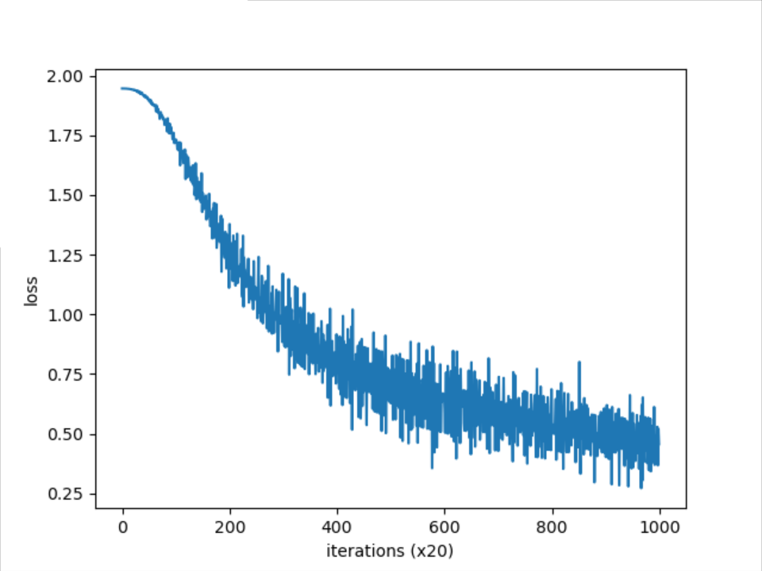
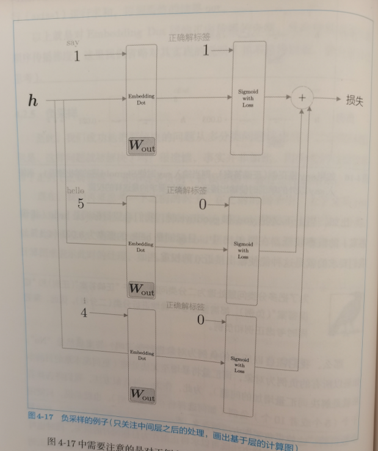
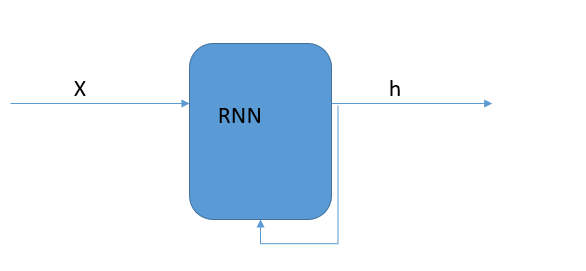
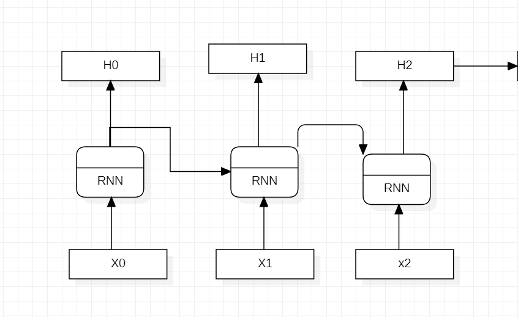
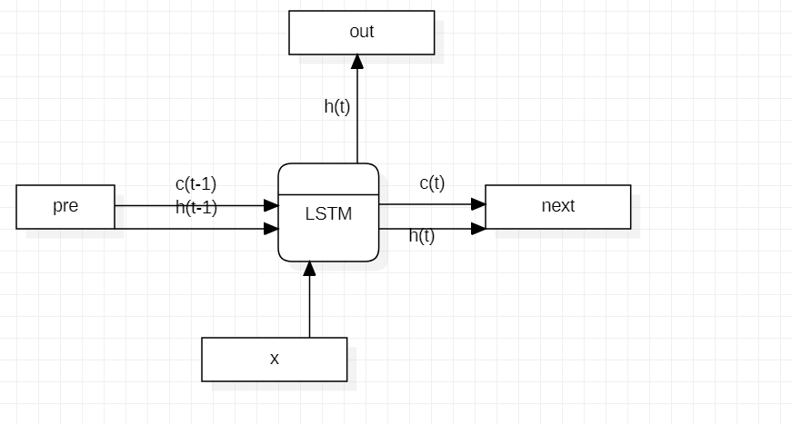
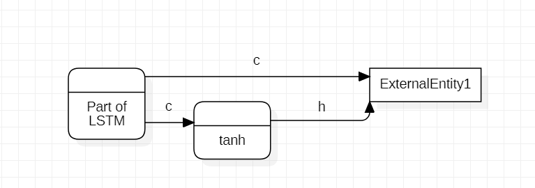
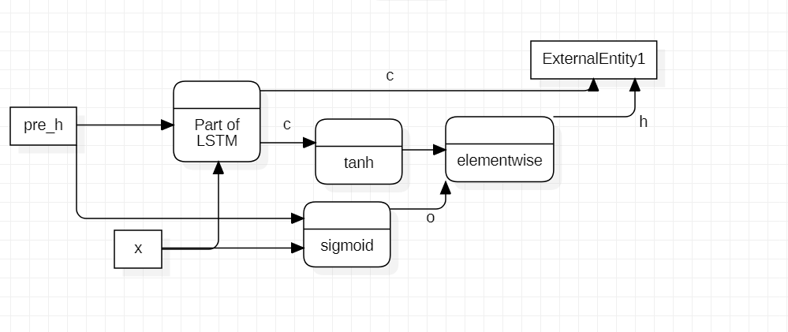
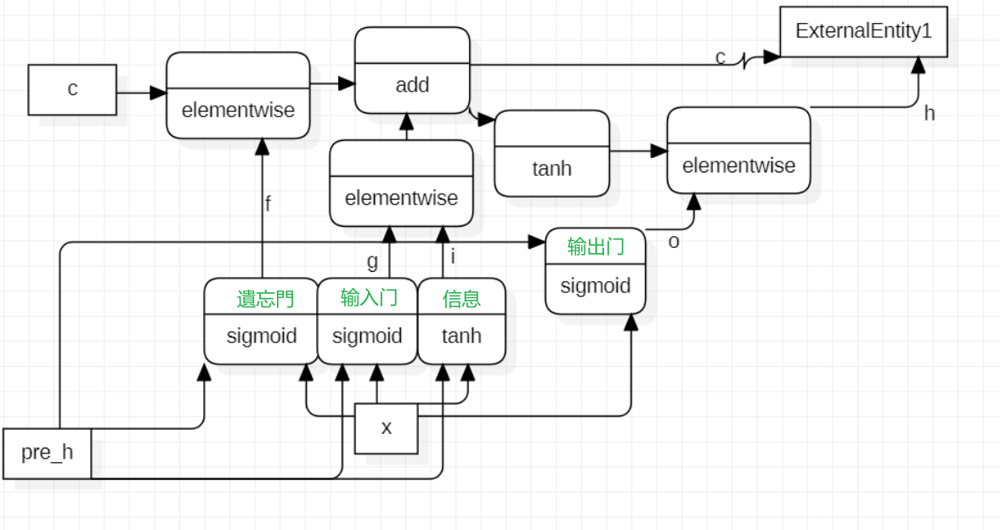

# NLP术语和编码

[TOC]

## 一. 单词含义(1)

### 1. 简单绪论

1. 基于同义词词典
2. 基于计数
3. 基于推理word2vec

### 2. 同义词词典

同义词词典包含了单词之间的关系,有同义词关系,整体部分关系等

可以形成单词网络

* 示例:
  * `WordNet`
* 缺陷:
  * 应对改变或者自造词无法接受
  * 人力成本高
  * 无法表示单词间的微妙差异

### 3. 计数

基于`语料库`corpus,即收集大量的文本数据

#### 3.1 语料库

* 语料库制作示例:

  ```python
  # 作为示例句子
  text = "You say goodbye and I say Hello."
  # 预处理句子
  text.lower()
  text = text.replace("."," .")
  
  # 分出word列表
  words = text.split(' ')
  # re.split('(\W+)?',text)
  
  # 两个列表方便使用,主要是使用id_to_word训练
  word_to_id = {}
  id_to_word = {}
  
  for word in words:
      if word not in word_to_id:
          new_id = len(word_to_id)
          word_to_id[word] = new_id
          id_to_word[new_id] = word
  # {0: 'You', 1: 'say', 2: 'goodbye', 3: 'and', 4: 'I', 5: 'Hello', 6: '.'}
  ```

* 语料库将文本转化为输入

  ```python
  import numpy as np 
  corpus = [word_to_id[w] for w in words]
  corpus = np.array(corpus)
  ```

  

#### 3.2 分布式文字表示(表示为向量)

如同RGB矢量表示颜色,我们也希望用一种矢量表示word

`分布式假设`: 某个单词含义由它周围的单词组成

`context`: 上下文,指所考虑单词周围的单词

`window size`: 选择左右的单词数量(一边)

#### 3.3 共现矩阵

表示词语上下文共现单词的频数的矩阵

行列都为语料列表,W(A,B)表示A上下文中出现B的频数

该__行向量__就是表示对应单词的矢量(即用上下文关系定义一个word)

```python
def create_co_matrix(corpus,vocab_size,window_size=1):
    corpus_size = len(corpus)
    co_matrix = np.zeros((vocab_size,vocab_size),dtype=np.int32)

    for idx,word_id in enumerate(corpus):
        for i in range(1,window_size + 1):
            left_idx = idx - i
            right_idx = idx + i
            if left_idx >= 0:
                left_word_id = corpus[left_idx]
                co_matrix[word_id,left_word_id] += 1
            if right_idx < corpus_size:
                right_word_id = corpus[right_idx]
                co_matrix[word_id,right_word_id] += 1
    return co_matrix

```

#### 3.4 向量之间的相似度实现

相似度的实现可以是向量之间的余弦值,即`点积/长度`

```python
def cos_similiarity(x,y,eps = 1e-8):
    nx = x / (np.sqrt(np.sum(x**2)) + eps)
    ny = y / (np.sqrt(np.sum(y ** 2)) + eps)
    return np.dot(nx,ny)
```

#### 3.附 相似向量的倒序排序

```python
def most_similar(query,word_to_id,id_to_word,word_matrix,top=5):
    if query not in word_to_id:
        print(f'{query} is not found')
        return 
    print('\n[query]' + query)
    query_id = word_to_id[query]
    query_vec = word_matrix[query_id]

    vocab_size = len(id_to_word)
    similiarity = np.zeros(vocab_size)
    for i in range(vocab_size):
        similiarity[i] = cos_similiarity(word_matrix[i],query_vec)
    
    count = 0
    # 倒序排序,argsort返回索引
    for i in (-1 * similiarity).argsort():
        if id_to_word[i] == query:
            continue
        print(f'{id_to_word[i]}:{similiarity[i]}')
        count += 1
        if count >= top:
            return
```


### 4. 计数plus

#### 4.1 计数存在的问题和改进

上述计数没有对语料库中可能出现的频数做处理,频数越多,相似度越大

我们采用`点互信息(Pointwise Mutual Information)`

#### 4.2 PMI相关系数

$$
PMI(x,y) = log_2\frac{P(x,y)}{P(x),P(y)}
$$

PMI表达了一种相关系数,PMI越高相关性越强

在语料库和共现矩阵下,PMI为:
$$
PMI(x,y) = log_2\frac{C(x,y)N}{C(x)C(y)}
$$
C(x)指出现的频数,C(x,y)指共现值

为防止出现共现为0的情况,我们定义`positive pmi=PPMI`
$$
PPMI(x,y) = max(0,PMI(x,y))
$$

```python
def ppmi(C,verbose = False,eps=1e-8):
    M = np.zeros_like(C,dtype=np.float32)
    N = np.sum(C)
    S = np.sum(C,axis = 0) # 共现中的频数

    total = C.shape[0] * C.shape[1]
    cnt = 0

    for i in range(C.shape[0]):
        for j in range(C.shape[1]):
            pmi = np.log2(C[i,j] * N / (S[j] *S[i] + eps))
            M[i,j] = max(0,pmi)

    return M
```

#### 4.3 降维(SVD)

二维数组形成的PPMI矩阵终究扛不住大语料库

* 思路: 发现矢量中存在的轴,并用轴上的投影表示各个矢量的值,形成二维到一维的降维

* `奇异值分解(SVD)`:

  * 将任意矩阵分解为3个矩阵的乘积
    $$
    X = USV^T
    $$
    U和V彼此正交,S为对角矩阵,都不一定是方阵

    性质:

    * S的矩阵值降序排列,且衰减很快
    * 所以我们可以用**U的前几列**来表示一个PPMI向量

numpy的实现:

```python
U,S,V = np.linalg.svd(M)
```

sklearn的实现(更快):

```python
from sklearn.utils.extmath import randomized_svd
U,S,V = randomized_svd(W,n_components=wordvec_size,n_iter=5,random_state=None)
```


### 附. PTB语料库介绍

PTB语料库的处理:

* 将稀有字符替换成`<unk>`
* 将数字替换为`N`
* 每一行一个句子,在句尾插入`<eos>`

## 二. word2vec

`基于推理`

### 1. 基于计数的问题

1. 对于大规模语料库进行SVD还是不现实

### 2. 基于推理的思想

__推理__: 当给出单词上下文,根据上下文推理该单词的过程就是推理

__分布式假设__: 一个单词由周围的单词构成

基于此,我们可以使用__神经网络__进行推理,<u>输入为上下文,输出为各个单词的概率</u>

* word2vec中的单词表示:
  * `one-hot`形成一个词汇表大小的输入

### 3. word2vec

我们使用`continuous bag-of-words(CBOW)`模型作为word2vec的神经网络

#### 3.1 CBOW的结构

CBOW输入上下文,对于考虑N个单词上下文的情况,输入层为N个,每层输入一个one-hot向量

* 多个输入层的处理:
  * 假设第i个输入层变换后为$h_i$,则中间层的神经元的输入为$\frac{\Sigma h_i}{N}$
  * 每个输入层到中间层之间共享一个$W_{in}$,该权重对应的就是单词的向量表示
  * 不使用bias
* 中间层特点:
  
* 节点数量少,因为其节点数量决定了$W_{in}$的宽度
  
* 一次推理过程编码示范:

  ```python
  # 模拟两个输入
  c0 = np.array([[1,0,0,0,0,0,0]])
  c1 = np.array([[0,0,1,0,0,0,0]])
  
  # 两层的权重
  W_in = np.random.randn(7,3)
  W_out = np.random.randn(3,7)
  
  # 两个输入对应的层
  in_layer0 = MatMul(W_in)
  in_layer1 = MatMul(W_in)
  # 输出层
  out_layer = MatMul(W_out)
  
  h0 = in_layer0.forward(c0)
  h1 = in_layer1.forward(c1)
  
  # 中间层
  h = 0.5 * (h0 + h1)
  # 输出层
  s = out_layer.forward(h)
  
  ```

#### 3.2 CBOW的学习

要素1: 使用softmax得到最后的概率,使用Cross-entropy得到loss

* 预处理:

  * 提取上下文和目标词:

    * 目标词应保证语料库中有上下文可以预测,所以从window_size开始

    ```python
    # 上下文是一个二维的列表
    # 目标词是一个对应context0维的数组
    
    def create_contexts_target(corpus):
        target = corpus[windows_size:-windows_size]
        contexts = []
    	
        # 从左到右遍历目标词
        for idx in range(window_size,len(corpus) - window_size):
            cs = []
            # 把左右上下文加入列表
            for t in range(-window_size,window_size + 1):
                if t == 0:
                    continue
            	cs.append(corpus[idx + t])
            contexts.append(cs)
        return np.array(contexts),np.array(target)
    ```

    

  * 将context和target转换为one-hot:

    * context每个id都展开,成为3d矩阵
    * target展开变为2d矩阵

    ```python
    def convert_one_hot(corpus, vocab_size):
        '''转换为one-hot表示
    
        :param corpus: 单词ID列表（一维或二维的NumPy数组）
        :param vocab_size: 词汇个数
        :return: one-hot表示（二维或三维的NumPy数组）
        '''
        N = corpus.shape[0]
    
        if corpus.ndim == 1:
            one_hot = np.zeros((N, vocab_size), dtype=np.int32)
            for idx, word_id in enumerate(corpus):
                one_hot[idx, word_id] = 1
    
        elif corpus.ndim == 2:
            C = corpus.shape[1]
            one_hot = np.zeros((N, C, vocab_size), dtype=np.int32)
            for idx_0, word_ids in enumerate(corpus):
                for idx_1, word_id in enumerate(word_ids):
                    one_hot[idx_0, idx_1, word_id] = 1
    
        return one_hot
    ```

    

    

#### 3.3 word2vec中分布式表示的选择

word2vec中有两个权重,我们可以从权重中选择单词的向量表示

>  选择1: 输入侧权重
>
> 选择2: 输出侧权重
>
> 选择3: 同时使用(比如相加)

其中选择1更受欢迎和有效

#### 3.4 CBOW模型的实现

初始化:

```python
class SimpleCBOW:
    def __init__(self,vocab_size,hidden_size):
        V,H = vocab_size,hidden_size

        # 生成权重
        W_in = 0.01 * np.random.randn(V,H).astype('f')
        W_out = 0.01 * np.random.randn(H,V).astype('f')
        # 生成layer
        self.in_layer0 = MatMul(W_in)
        self.in_layer1 = MatMul(W_in)
        self.out_layer = MatMul(W_out)
        self.loss_layer = SoftmaxWithLoss()

        layers = [self.in_layer0,self.in_layer1,self.out_layer]
        self.params,self.grads = [],[]
        # 初始化params和grads
        for layer in layers:
            self.params += layer.params
            self.grads += layer.grads
        # 将word vec设为输入W
        self.word_vecs = W_in
```

预测:

```python
def forward(self,contexts,target):
    h0 = self.in_layer0.forward(contexts[:,0])
    h1 = self.in_layer1.forward(contexts[:,1])

    h = 0.5 * (h0 + h1)
    score = out_layer.forward(h)
    loss = self.loss_layer.forward(score,target)
```

反向传播:

```python
 def backward(self,dout=1):
        ds = self.loss_layer.backward(dout)
        da = self.out_layer.backward(ds)
        da *= 0.5
        self.in_layer1.backward(da)
        self.in_layer0.backward(db)
        return None
```

训练:

```python
window_size = 1
hidden_size = 5
batch_size = 3
max_epoch = 1000

text = 'You say goodbye and I say hello.'
corpus,word_to_id,id_to_word = preprocess(text)

vocab_size = len(word_to_id)
contexts,target = create_contexts_target(corpus,window_size)
target = convert_one_hot(target,vocab_size)
contexts = convert_one_hot(contexts,vocab_size)

model = SimpleCBOW(vocab_size,hidden_size)
optimizer = Adam()
trainer = Trainer(model,optimizer)
trainer.fit(contexts,target,max_epoch,batch_size)
trainer.plot()
```



### 附. 补充说明

我们看到,CBOW没有激活,其实就是在向量中线性表示概率

`skip-gram`属于是反向CBOW,根据目标词猜上下文

一个W_in一个W_out,输出表示多重含义

## 三. word2vec的改进

当前实现简单,但是对于大词汇量还是太慢

### 1. 瓶颈

1. 输入层的one-hot表示 与 W_in的乘积
2. 中间层和W_out的乘积
3. softmax的计算

### 2. embedding

我们注意到,一个one-hot乘以一个W其实就是将其中一行提取出来

所以我们不需要矩阵乘法,我们只需要提取一行即可

称为`Embedding层`,来自于 word embedding,即单词的密集向量表示法

实现后替代MatMul层即可

> 注意: one-hot也不需要了,一开始传入id即可

```python

def Embedding:
    def __init__(self,W):
        self.params = [W]
        self.grads = [np.zeros_like(W)]
        self.idx = None
    def forward(self,idx):
        # idx是一个列表,可以一次提取多行
        W, = self.params
        self.idx = idx
        # 提取一行
        out = W[idx]
        return outs
```

反向传播思路就是将其他行置0,只有提取的行赋值dout * 1

```python
  def backward(self,dout):
        dW = self.grads
        dW[...] = 0
        # 不赋值而相加是因为idx可能出现重复
        for i,word_id in enumerate(self.idx):
            dW[word_id] += dout[i]
        return None
```

### 3. negative sampling

用于简化中间层的矩阵乘法和softmax计算

#### 3.1 思想

* 从多分类到二分类
  * 用二分类拟合多分类: 把选单词变为询问是否单词
  * 该单词即我们需要的__目标词__
* 处理:
  * 假设我们只关注其中一个单词,我们就可以用Sigmoid取代softmax
  * Sigmoid和Cross Entropy的组合,反向传播依然为y-t
  * 将中间层的输出转化为__输入层的输出点乘W_out的列Embedding__

#### 3.2 Embedding dot的实现

```python
def EmbeddingDot:
    def __init__(self,W):
        self.embed = Embedding(W)
        self.params = self.embed.params
        # 对于W只需要embed的grads
        self.grads = self.embed.grads
        self.cache = None
    def forward(self,h,idx):
        # 抽取embed
        target_W = self.embed.forward(idx)
        # 向量乘积
        out = np.sum(target_W * h,axis=1)
        self.cache = (h,target_W)
        return out
    def backward(self,dout):
        h,target_W = self.cache
        # 展开
        dout = dout.reshape(dout.shape[0],1)

        # W的值,h
        dtarget_W = dout * h
        # 再经过embed,更新grads
        self.embed.backward(dtarget_W)
        dh = dout * target_W
        return dh
```

#### 3.3 负采样

之前的例子隐藏着一个**问题**: 我们只关注了正确结果的数值高,但是没有保证其他错误结果的数值低

* 解决方案: 负采样

  * 我们不需要采用所有的负例,我们只需要挑选若干
  * 这些词的__loss和正例loss的总和__可以作为最后的loss'

  

反向传播时回直接传播一个dout作为y,对于不同解标签有不同行为

* 采样方法:

  * 按照频率作为概率分布采样

    ```python
    np.random.choice(words,p=p) # p用于确定概率分布
    ```

    * 概率分布处理: 0.75次方提高低频词概率
      $$
      \frac{P(W_i)^{0.75}}{\Sigma P(w_i)^{0.75}}
      $$

      ```python
      new_p = np.power(p,0.75)
      new_p /= np.sum(new_p)
      ```

* 采样实现

  ```python
  class UnigramSampler:
      def __init__(self, corpus, power, sample_size):
          self.sample_size = sample_size
          self.vocab_size = None
          self.word_p = None
  
          counts = collections.Counter()
          for word_id in corpus:
              # 频数统计
              counts[word_id] += 1
  
          vocab_size = len(counts)
          self.vocab_size = vocab_size
  
          self.word_p = np.zeros(vocab_size)
          for i in range(vocab_size):
              self.word_p[i] = counts[i]
  
          self.word_p = np.power(self.word_p, power)
          self.word_p /= np.sum(self.word_p)
  
      def get_negative_sample(self, target):
          batch_size = target.shape[0]
  
          if not GPU:
              negative_sample = np.zeros((batch_size, self.sample_size), dtype=np.int32)
  
              for i in range(batch_size):
                  p = self.word_p.copy()
                  target_idx = target[i]
                  p[target_idx] = 0
                  p /= p.sum()
                  negative_sample[i, :] = np.random.choice(self.vocab_size, size=self.sample_size, replace=False, p=p)
          else:
              # 在用GPU(cupy）计算时，优先速度
              # 有时目标词存在于负例中
              negative_sample = np.random.choice(self.vocab_size, size=(batch_size, self.sample_size),
                                                 replace=True, p=self.word_p)
  
          return negative_sample
  
  ```

* 负采样实现

  * 初始化:

    ```python
    class NagativceSamplingLoss:
        def __init__(self,W,corpus,power=0.75,sample_size = 5):
            self.sample_size = sample_size
            self.sampler = UnigramSampler(corpus,power,sample_size)
            # 重复sample遍
            self.loss_layers = [SigmoidWithLoss() for _ in range(sample_size + 1)]
            self.embed_dot_layers = [EmbeddingDot(W) for _ in range(sample_size + 1)]
            self.params,self.grads = [],[]
            for layer in self.embed_dot_layers:
                self.params += layer.params
                self.grads += layer.grads
    ```

  * 正向传播:

    ```python
    def forward(self,h,target):
        batch_size = target.shape[0]
        negative_sample = self.sampler.get_negative_sample(target)
    
        # 不关乎embed的顺序,target即为idx,决定Wout的列
        score = self.embed_dot_layers[0].forward(h,target)
        correct_label = np.ones(batch_size,dtype=np.int32)
        # 正确取1
        loss = self.loss_layers[0].forward(score,correct_label)
    
        negative_label = np.zeros(batch_size,dtype=np.int32)
        for i in range(self.sample_size):
            negative_target = negative_sample[:,i]
            score = self.embed_dot_layers[1 + i].forward(h,negative_target)
            loss += self.loss_layers[1 + i].forward(score,negative_label)
        return loss
    ```

  * 反向传播:

    ```python
    def backward(self,dout):
        dh = 0
        for l0,l1 in zip(self.loss_layers,self.embed_dot_layers):
            dscore = l0.backward(dout)
            dh += l1.backward(dscore)
        return dh
    ```

### 4. 最终版CBOW

```python

class CBOW:
    def __init__(self, vocab_size, hidden_size, window_size, corpus):
        V, H = vocab_size, hidden_size

        # 初始化权重
        W_in = 0.01 * np.random.randn(V, H).astype('f')
        W_out = 0.01 * np.random.randn(V, H).astype('f')

        # 生成层
        self.in_layers = []
        # window size * 2有多大就整多少个Embedding
        for i in range(2 * window_size):
            layer = Embedding(W_in)  # 使用Embedding层
            self.in_layers.append(layer)
        # 输出层-sigmoid-loss层使用负采样一次性解决
        self.ns_loss = NegativeSamplingLoss(W_out, corpus, power=0.75, sample_size=5)

        # 将所有的权重和梯度整理到列表中
        layers = self.in_layers + [self.ns_loss]
        self.params, self.grads = [], []
        for layer in layers:
            self.params += layer.params
            # 以数组拼接,跟随layer.grads变化
            self.grads += layer.grads

        # 将单词的分布式表示设置为成员变量
        self.word_vecs = W_in

    def forward(self, contexts, target):
        h = 0
        for i, layer in enumerate(self.in_layers):
            h += layer.forward(contexts[:, i])
        h *= 1 / len(self.in_layers)
        loss = self.ns_loss.forward(h, target)
        return loss

    def backward(self, dout=1):
        dout = self.ns_loss.backward(dout)
        dout *= 1 / len(self.in_layers)
        for layer in self.in_layers:
            layer.backward(dout)
        return None

```

* 训练代码

  ```python
  
  # 设定超参数
  window_size = 5
  hidden_size = 100
  batch_size = 100
  max_epoch = 10
  
  # 读入数据
  corpus, word_to_id, id_to_word = ptb.load_data('train')
  vocab_size = len(word_to_id)
  
  contexts, target = create_contexts_target(corpus, window_size)
  if config.GPU:
      contexts, target = to_gpu(contexts), to_gpu(target)
  
  # 生成模型等
  model = CBOW(vocab_size, hidden_size, window_size, corpus)
  # model = SkipGram(vocab_size, hidden_size, window_size, corpus)
  optimizer = Adam()
  trainer = Trainer(model, optimizer)
  
  # 开始学习
  trainer.fit(contexts, target, max_epoch, batch_size)
  trainer.plot()
  
  # 保存必要数据，以便后续使用
  word_vecs = model.word_vecs
  if config.GPU:
      word_vecs = to_cpu(word_vecs)
  params = {}
  params['word_vecs'] = word_vecs.astype(np.float16)
  params['word_to_id'] = word_to_id
  params['id_to_word'] = id_to_word
  pkl_file = 'cbow_params.pkl'  # or 'skipgram_params.pkl'
  with open(pkl_file, 'wb') as f:
      pickle.dump(params, f, -1)
  
  ```

  

# RNN

## 一. 前置知识

### 1. feedforward神经网络的问题

前馈网络每次计算完毕就交给下一层,单项传播

无法很好地处理时序数据

### 2. 概率与word2vec

我们先前使用context表示单词的模式,用概率表示
$$
y=P(w_t|w_{t-1},w_{t+1})
$$
而对应Loss函数的本质为:
$$
L=-logP(w_t|w_{t-1},w_{t+1})
$$

### 3. 条件语言模型

`Language Model`给出了单词序列发生的概率. 即使用概率评估一个单词序列发生的可能性

输入: 单词序列

输出: 概率

应用: 翻译和识别,生成文章

数学表达: 单词之间的联合概率,旨在用前面的表示后面的条件概率

### 4. 试图用CBOW形成语言模型

语言模型和CBOW的最大差别还是在条件上

我们缩减条件所需的上下文,比如缩减成2个,就能形成CBOW的语言模型

* 缺点:
  * 只有固定长度的上下文
  * CBOW没有顺序


## 二. RNN

`Recurrent Neural Network循环神经网络`

### 1. 循环神经网络

一个**RNN层**的行为如图所示



假设**t时刻**输入$x_t$(每个输入都是一个矢量),我们将RNN层的工作展开(但是实际都是同一个层)



#### 2.1 状态记录

* $h_t$的计算: 与x线性相加

  * 自此,RNN便可以记录之前的状态

  $$
  h_t=tanh(h_{t-1}W_h+x_tW_x+b)
  $$

* $h_t$的流动:

  * 一个流向下一层
  * 一个流向自身

### 2. BPTT

`Backpropagation Through Time(BPTT)`就是一种反向传播

BPTT可以按照上面展开的那样反向传播

但是出现了一个问题,就是时序可能很长,对计算和梯度都有影响,所以我们可以采用Truncated BPTT

* `Truncated BPTT`通过截断反向传播,将反向传播分为一组一组的进行计算

* batch训练:

  我们将Truncated  BPTT应用后,可以使用batch训练:

  * 比如我们拥有1000个时序数,我们将其以10个分为一组,我们可以选择x_0和x_500开始训练,就形成了两个batch

### 3. RNNLM的实现

#### 3.1 Time RNN层

基于Truncated BPTT,我们可以创建在水平方向上固定长度的网络,我们起名为`Time RNN层`

输入: 一沓x

输出: 一沓h

#### 3.2 RNN节点的实现

```python
class RNN:
    # 简单实现
    def __init__(self,Wx,Wh,b):
        self.params = [Wx,Wh,b]
        self.grads = [np.zeros_like(Wx),np.zeros_like(Wh),np.zeros_like(b)]

        self.cache = None
    def forward(self, x ,h_prev):
        Wx,Wh,b = self.params
        t = np.dot(h_prev,Wh) + np.dot(x,Wx) + b
        h_next = np.tanh(t)

        self.cache = (x,h_prev,h_next)
        return h_next
```

反向传播:

```python
    def backward(self,dh_next):
        Wx,Wh,b = self.params
        x,h_prev,h_next = self.cache

        dt = dh_next * (1 - h_next ** 2) #tanh的导数
        db = np.sum(dt,axis=0) # b的导数,是repeat的反向传播
        dWh = np.dot(h_prev.T,dt) # 点乘的导数
        dh_prev = np.dot(dt,Wh.T) # 点乘
        dWx = np.dot(x.T,dt)
        dx = np.dot(dt,Wx.T)

        self.grads[0][...] = dWx
        self.grads[1][...] = dWh
        self.grads[2][...] = db
        return dx,dh_prev
```

#### 3.3 Time RNN 实现

> 所有的RNN层共享一对Wx,Wh,所以反向传播最后的值要相加

初始化

* stateful: 保持状态,如果为True则保持隐藏状态,不然每次forward时,刷新第一个RNN的h

```python
class TimeRNN:
    def __init__(self,Wx,Wh,b,stateful=False):
        self.params = [Wx,Wh,b]
        self.grads = [np.zeros_like(Wx),np.zeros_like(Wh),np.zeros_like(b)]
        self.layers = None
        self.h,self.dh = None,None
        self.stateful = stateful
    def set_state(self,h):
        self.h = h
    def reset_state(self):
        self.h = None
```

正向传播:

```python
def forward(self,xs):
    Wx,Wh,b = self.params
    N,T,D = xs.shape
    D,H = Wx.shape

    self.layers = []
    # h们
    hs = np.empty((N,T,H),dtype='f')
    if not self.stateful or self.h is None:
        # 如果没用过或者不stateful,就刷新h
        self.h = np.zeros((N,H),dtype='f')
    for t in range(T):
        layer = RNN(*self.params)
        # 取出时序中的第t个计算,更新h
        self.h = layer.forward(xs[:,t,:],self.h)
        hs[:,t,:] = self.h # 存储h序列
        self.layers.append(layer) # 存储layer序列

    return hs
```

反向传播:

```python
   def backward(self,dhs):
        Wx,Wh,b = self.params
        N,T,H = dhs.shape
        D,H = Wx.shape

        dxs = np.empty((N,T,D),dtype='f')
        dh = 0
        grads = [0,0,0]

        for t in reversed(range(T)):
            layer = self.layers[t]
            # 上面传下来一个dh的数组,每个RNN有两个输出,所以加上我们的前一个dh形成时间上的反向传播
            dx,dh = layer.backward(dhs[:,t,:] + dh)
            dxs[:,t,:] = dx
            for i ,grad in enumerate(layer.grads):
                # 多个梯度相加的形式形成每个梯度
                grads[i] += grad
        for i,grad in enumerate(grads):
            self.grads[i][...] = grad
        self.dh = dh
        return dxs
```

#### 3.4 时序处理层

这一层我们借助`Time RNN`实现一个RNNLM层(语言模型)

> Embedding->RNN->Affine->softmax

操作: 

创建`Time Embedding`,`Time Affine`层,即以T个Embedding和T个Affine组成的层

带Time的在一层中都共享参数

计算loss时,使用求和平均的方式

```python
class TimeEmbedding:
    def __init__(self, W):
        self.params = [W]
        self.grads = [np.zeros_like(W)]
        self.layers = None
        self.W = W

    def forward(self, xs):
        N, T = xs.shape
        V, D = self.W.shape

        out = np.empty((N, T, D), dtype='f')
        self.layers = []

        for t in range(T):
            layer = Embedding(self.W)
            out[:, t, :] = layer.forward(xs[:, t])
            self.layers.append(layer)

        return out

    def backward(self, dout):
        N, T, D = dout.shape

        grad = 0
        for t in range(T):
            layer = self.layers[t]
            layer.backward(dout[:, t, :])
            grad += layer.grads[0]

        self.grads[0][...] = grad
        return None


class TimeAffine:
    def __init__(self, W, b):
        self.params = [W, b]
        self.grads = [np.zeros_like(W), np.zeros_like(b)]
        self.x = None

    def forward(self, x):
        N, T, D = x.shape
        W, b = self.params

        rx = x.reshape(N*T, -1)
        out = np.dot(rx, W) + b
        self.x = x
        return out.reshape(N, T, -1)

    def backward(self, dout):
        x = self.x
        N, T, D = x.shape
        W, b = self.params

        dout = dout.reshape(N*T, -1)
        rx = x.reshape(N*T, -1)

        db = np.sum(dout, axis=0)
        dW = np.dot(rx.T, dout)
        dx = np.dot(dout, W.T)
        dx = dx.reshape(*x.shape)

        self.grads[0][...] = dW
        self.grads[1][...] = db

        return dx


class TimeSoftmaxWithLoss:
    def __init__(self):
        self.params, self.grads = [], []
        self.cache = None
        self.ignore_label = -1

    def forward(self, xs, ts):
        N, T, V = xs.shape

        if ts.ndim == 3:  # 在监督标签为one-hot向量的情况下
            ts = ts.argmax(axis=2)

        mask = (ts != self.ignore_label)

        # 按批次大小和时序大小进行整理（reshape）
        xs = xs.reshape(N * T, V)
        ts = ts.reshape(N * T)
        mask = mask.reshape(N * T)

        ys = softmax(xs)
        ls = np.log(ys[np.arange(N * T), ts])
        ls *= mask  # 与ignore_label相应的数据将损失设为0
        loss = -np.sum(ls)
        loss /= mask.sum()

        self.cache = (ts, ys, mask, (N, T, V))
        return loss

    def backward(self, dout=1):
        ts, ys, mask, (N, T, V) = self.cache

        dx = ys
        dx[np.arange(N * T), ts] -= 1
        dx *= dout
        dx /= mask.sum()
        dx *= mask[:, np.newaxis]  # 与ignore_label相应的数据将梯度设为0

        dx = dx.reshape((N, T, V))

        return dx

```

#### 3.5 RNNLM

初始化

```python
class SimpleRnnlm:
    def __init__(self,vocab_size,wordvec_size,hidden_size):
        V,D,H = vocab_size,wordvec_size,hidden_size
        rn = np.random.randn

        embed_W(rn(V,D) / 100).astype('f')
        rnn_Wx = (rn(D,H) / np.sqrt(D)).astype('f') # Xavier初始值
        rnn_Wh = (rn(H,H) / np.sqrt(D)).astype('f')
        rnn_b = np.zeros(H).astype('f')
        affine_W = (rn(H,V) / np.sqrt(H)).astype('f')
        affine_b = np.zeros(V).astype('f')

        self.layers = [
            TimeEmbedding(embed_W)
            TimeRNN(rnn_Wx,rnn_Wh,rnn_b,stateful=False),
            TimeAffine(affine_W,affine_b)
        ]

        self.loss_layer = TimeSoftmaxWithLoss()
        self.rnn_layer = self.layers[1]
        self.parmas,self.grads = [],[]
        for layer in self.layers:
            self.params += layer.parmas
            self.grads += layer.grads
```

其他实现

```pyth
    def forward(self,xs,ts):
        for layer in self.layers:
            xs = layer.forward(xs)
        loss = self.loss_layer.forward(xs,ts)
        return loss
    def backward(self,dout = 1):
        dout = self.loss_layer.backward(dout)
        for layer in reversed(self.layers):
            dout = layer.backward(dout)
        return dout
    def reset_state(self):
        self.rnn_layer.reset_state()
```

### 4. RNNLM的评价

RNNLM的目标是根据输入,输出下一单词的概率

我们根据下一个单词的概率来评价模型

`perplexity困惑度`即概率的倒数可以用来评价RNNLM,语义上表示候选的数量

多个输入时,我们以$e^{loss}$作为perplexity即可

### 5. RNNLM的学习

```python

batch_size = 10
wordvec_size = 100
hidden_size = 100
time_size = 5
lr = 0.1
max_epoch = 100

corpus,word_to_id,id_to_word = ptb.load_data('train')
corpus_size = 1000
corpus = corpus[:corpus_size]
vocab_size = int(max(corpus) + 1)

xs = corpus[:-1]
ts = corpus[1:]
data_size = len(xs)
print('corpus size: %d ,vocabulary size: %d' % (corpus_size,vocab_size))

max_iters = data_size
time_idx = 0
total_loss = 0
loss_count = 0
ppl_list = []

model = SimpleRnnlm(vocab_size,wordvec_size,hidden_size)
optimizer = SGD(lr)

# 计算batch的开始位置
jump = (corpus_size - 1) // batch_size
offsets = [i * jump for i in range(batch_size)]

for epoch in range(max_epoch):
    for iter in range(max_iters):
        batch_x = np.empty((batch_size,time_size),dtype='i')
        batch_t = np.empty((batch_size,time_size),dtype='i')
        for t in range(time_size):
            for i,offset in enumerate(offsets):
                # 一个t一个单词
                batch_x[i,t] = xs[(offset + time_idx) % data_size]
                batch_t[i,t] = ts[(offset + time_idx) % data_size]
            time_idx += 1
        loss = model.forward(batch_x,batch_t)
        model.backward()
        optimizer.update(model.params,model.grads)
        total_loss += loss
        loss_count += 1
    ppl = np.exp(total_loss / loss_count)
    print("| epoch %d | perplexity %.2f" % (epoch + 1, ppl))
    ppl_list.append(float(ppl))
    total_loss,loss_count = 0,0
```

## 三. Gated RNN

### 1. 先前RNN的问题

1. 无法很好地学习到时序数据的长期依赖关系

替代品: `GRU`或者`LSTM`

* 梯度消失和梯度爆炸

  * 起因: 反向传播在每一层都经过了tanh,+,matmul的计算, 

    * 而tanh的微分始终小于1,随着x远离0,值越来越小,不断减小
    * 而Matmul随着层数的加深会指数型的变化(可能变大也可能变小,由奇异值的最大值决定)

  * 梯度爆炸的对策:

    * `gradients clipping`:(g指所有需要调整的参数):

      场合: Trainer或者optimizer都可以
      $$
      if||\hat{g}||\ge threshold:\\
      \hat{g}=\frac{threshold}{||\hat{g}||}\hat{g}
      $$

      ```python
      def clip_grads(grads,max_norm):
          total_norm = 0
          for grad in grads:
              total_norm += np.sum(grad ** 2)
          total_norm = np.sqrt(total_norm)
          rate = max_norm / (total_norm + 1e-6)
          if rate < 1:
              for grad in grads:
                  grad *= rate
      ```

### 2. 梯度消失和Gate: LSTM

#### 2.1 LSTM的结构




`c`: 称为`memory unit记忆单元`,仅在LSTM层中使用,不会输出

* `ct`出来时没有经过tanh,所以h和c的关系表示为
  $$
  h_t = tanh(c_t)
  \\形状相同
  $$
  

#### 2.2 Gate的用途

门用来控制水流,它的__开合程度__控制在0-1之间,开合程度越高,水流越大

而Gate的开合程度由一个权重控制,需要学习,使用sigmoid

#### 2.3 输出门

**输出门**调控下一个时刻隐藏状态h的重要程度

* 开合程度计算:
  $$
  o=\sigma(x_tW_x^{(o)}+h_{t-1}W_h^{(o)}+b^{(o)})\\
  h_t=o(elementwise) * tanh(c_t)
  $$
  

#### 2.4 遗忘门

**遗忘门**就是上面"part of LSTM"中的计算,与pre的记忆单元相乘,决定是否遗忘记住单元
$$
f=\sigma(x_tW_x^{(f)}+h_{t-1}W_h^{(f)}+b^{(f)})
\\c_t=f(elementwise) * c_{t-1}
$$

#### 2.5 形成新的c的门

遗忘门只知道遗忘,我们还得往里面添加一些新的东西
$$
g=tanh(x_tW_x^{(g)}+h_{t-1}W_h^{(g)}+b^{(g)})
$$

#### 2.6 输入门

输入门考虑g各个元素的价值,对输入的信息进行取舍
$$
i=\sigma(x_tW_x^{(i)}+h_{t-1}W_h^{(i)}+b^{(i)})
$$

> 对于激活函数的使用,大概是这么个规律:
>
> 考虑权重的时候使用sigmoid(0 - 1)
>
> 考虑信息的时候使用tanh(-1 - 1)

#### 2.7 得到最后的记忆单元

$$
\\c_t=f(elementwise) * c_{t-1}\\
c_t=c_t + g(ew) * i
$$

#### 2.8 图解



### 3. 继续LSTM

Long short memeory表示长期记住短期的记忆

#### 3.1 记忆单元的反向传播

记忆单元C在传播过程中只经过了add和elementwise乘法,add不处理反向传播,而elementwise由遗忘门控制,遗忘门决定传播的大小

#### 3.2 LSTM的实现

* 仿射变换合并

  * 遗忘门,输入门,输出门,信息 四个仿射变换对应8个参数和偏置,我们可以将其合并
    $$
    x_t[W_X^{(f)},W_x^{(g)},W_x^{(i)},W_x^{(o))}] + ...
    $$

  * 然后经过slice放进各个激活函数

```python
class LSTM:
    def __init__(self,Wx,Wh,b):
        # Wx,Wh,b都是合并过后的结果
        # Wx: (wordvec_size,hidden.size * 4)
        # Wh: (hidden_size,hidden_size * 4)
        # b: 1 * hidden_size * 4
        self.params = [Wx,Wh,b]
        self.grads = [np.zeros_like(Wx),np.zeros_like(Wh),np.zeros_like(b)]
        self.cache = None
    def forward(self,x,h_prev,c_prev):
        Wx,Wh,b = self.params
        N,H = h_prev.shape # N: 批量大小 ,H : hidden size也是h的大小

        A = np.dot(x,Wx) + np.dot(h_prev,Wh) + b

        f = A[:,:H]
        g = A[:,H:2 * H]
        i = A[:,2 * H: 3 * H]
        o = A[:,3 * H: 4 * H]

        f = sigmoid(f)
        g = np.tanh(g)
        i = sigmoid(i)
        o = sigmoid(o)

        c_next = f * c_prev + g * i
        h_next = o * np.tanh(c_next)

        self.cache = (x,h_prev,c_prev,i,f,g,o,c_next)
        return h_next,c_next
```

> slice的反向传播:
>
> 把传下来几个矩阵的微分拼接即可np.hstack

```python
  def backward(self, dh_next, dc_next):
        Wx, Wh, b = self.params
        x, h_prev, c_prev, i, f, g, o, c_next = self.cache

        tanh_c_next = np.tanh(c_next)
		
        # 分支节点
        ds = dc_next + (dh_next * o) * (1 - tanh_c_next ** 2)
        # 反向通过遗忘门回到c_prev
        dc_prev = ds * f
		
        di = ds * g
        df = ds * c_prev
        do = dh_next * tanh_c_next
        dg = ds * i

        # sigmoid节点
        di *= i * (1 - i)
        df *= f * (1 - f)
        do *= o * (1 - o)
        dg *= (1 - g ** 2)
		# 拼接
        dA = np.hstack((df, dg, di, do))

        dWh = np.dot(h_prev.T, dA)
        dWx = np.dot(x.T, dA)
        db = dA.sum(axis=0)

        self.grads[0][...] = dWx
        self.grads[1][...] = dWh
        self.grads[2][...] = db

        dx = np.dot(dA, Wx.T)
        dh_prev = np.dot(dA, Wh.T)

        return dx, dh_prev, dc_prev

```

#### 3.3 TimeLSTM的实现

```python
class TimeLSTM:
    def __init__(self,Wx,Wh,b,stateful=False):
        self.params = [Wx,Wh,b]
        self.grads = [np.zeros_like(Wx),np.zeros_like(Wh),np.zeros_like(h)]
        self.layers = None

        self.h,self.c = None,None
        self.dh = None
        self.stateful = stateful
    def forward(self,xs):
        Wx,Wh,b = self.params
        # N: 批大小
        # T: 时序数量
        # D: 每个时序输入的大小
        N,T,D = xs.shape
        H = Wh.shape[0]
        self.layers = []
        hs = np.numpy((N,T,H),dtype='f')
        if not self.stateful or self.h is None:
            self.h = np.zeros((N,H),dtype='f')
        if not self.stateful or self.c is None:
            self.c = np.zeros((N,H),dtype='f')
        for t in range(T):
            layer = LSTM(*self.params)
            self.h,self.c = layers.forward(xs[:,t,:],self.h,self.c)
            hs[:,t,:] = self.h
            self.layers.append(layer)

        return hs
    def backward(self,dhs):
        Wx,Wh,b = self.params
        N,T,H = dhs.shape
        D = Wx.shape[0]

        dxs = np.empty((N,T,D),dtype='f')
        dh,dc = 0,0
        grads = [0,0,0]
        for t in reversed(range(T)):
            layer = self.layers[t]
            dx,dh,dc = layer.backward(dhs[:,t,:] + dh,dc)
            dxs[:,t,:] = dx
            for i,grad in enumerate(layer.grads):
                grads[i] += grad
        
        for i,grad in enumerate(grads):
            self.grads[i][...] = grad
        self.dh = dh
        return dxs
```

学习代码同RNN,记得权重都乘以4倍宽度

### 4. 优化

#### 4.1 多层LSTM

就是放多个TimeLSTM层

#### 4.2 Dropout

RNN更容易过拟合

Dropout依然可以用来削弱过拟合

* 放在哪里:
  * 放在不同TimeLSTM之间,之前,之后
* `varitational dropout`: 同一层的dropout共享一个mask(决定是否传递的布尔值序列),可以用在同一层的LSTM之间

#### 4.3 权重共享

`weight tying`尤其是Embedding层和Affine层绑定可以达到不错的效果

##### 4.? 修改learning rate

如果perplexity变差,可以降低learning rate

#### 4.4 实例

```python
self.layers = [
    TimeEmbedding(embed_W),
    TimeDropout(dropout_ratio),
    TimeLSTM(lstm_Wx1, lstm_Wh1, lstm_b1, stateful=True),
    TimeDropout(dropout_ratio),
    TimeLSTM(lstm_Wx2, lstm_Wh2, lstm_b2, stateful=True),
    TimeDropout(dropout_ratio),
    TimeAffine(embed_W.T, affine_b)  # weight tying!!
]
```

## 四. 利用RNN生成文本

### 1. 最简单的文本生成

就利用上一章的RNN,每预测一次传递一次,预测下一个词x

```python
class RnnlmGen(Rnnlm):
    def generate(self,start_id,skip_ids=None,sample_size = 100):
        word_ids = [start_id]
        x = start_id
        while(len(word_ids)) < sample_size:
            x = np.array(x).reshape(1,1)
            score = self.predict(x)
            p = softmax(score.flatten())

            sampled = np.random.choice(len(p),size=1,p=p)
            if (skip_ids is None) or (sampled not in skip_ids):
                x = sampled
                word_ids.append(int(x))

        return word_ids

```

```python
import sys
sys.path.append('..')
from rnng import RnnlmGen
from dataset import ptb

corpus,word_to_id,id_to_word = ptb.load_data('train')
vocab_size = len(word_to_id)
corpus_size = len(corpus)

model = RnnlmGen()
model.load_params("./Rnnlm.pkl")
start_word = 'you'
start_id = word_to_id[start_word]
skip_words = ['N','<unk>','$']
skip_ids = [word_to_id[w] for w in skip_words]

word_ids = model.generate(start_id,skip_ids)
txt = ' '.join([id_to_word[i] for i in word_ids])
txt = txt.replace('<eos>','\n')
print(txt)
```

## 四. seq2seq

输入输出都是时序数据,就是seq2seq

### 1. 原理

`seq2seq`也可以称为Encoder-Decoder,顾名思义,由Encoder和Decoder组成

* 编码:
  * 内部是Embedding+LSTM模型,
  * 输出的是最后一个h,固定长度(所以编码器输出的是固定长度的向量)
  * Encoder将任意长度的向量变为固定长度的h
* 解码:
  * 内部是Embedding+LSTM+Affine+softmax
  * 对LSTM输入之前的h
  * 然后每个时序输出的输出对应解码输出,.输出到\<eos\>位置

### 2. 利用toy problem举例seq2seq

`toy problem`: 为了评价机器学习创建的简单问题

这里的toy problem: 输入0-999加法字串,输出结果

* padding:
  * 处理可变长度的时序数据时,我们可以使用padding,即使用无效数据填入原始数据达成对齐

处理: 

输入最大长度为7,输出时在每个输出首部添加一个`_`,最大长度为5

附加处理:

在计算loss时不应该计算填充字符的loss(使用mask)

在输入填充时,LSTM不应该对输入进行任何处理

### 3. 实现Encoder

初始化:

```python
class Encoder:
    def __init__(self,vocab_size,wordvec_size,hidden_size):
        V,D,H = vocab_size,wordvec_size,hidden_size
        rn = np.random.randn

        embed_W = (rn(V,D) / 100).astype('f')
        lstm_Wx = (rn(D,4 * H) / np.sqrt(D)).astype('f')
        lstm_Wh = (rn(H,4 * H) / np.sqrt(H)).astype('f')
        lstm_b = np.zeros(4 * H).astype('f')

        self.embed = TimeEmbedding(embed_W)
        self.lstm = TimeLSTM(lstm_Wx,lstm_Wh,lstm_b,stateful=False)

        self.params = self.embed.params + self.lstm.params
        self.grads = self.embed.grads + self.lstm.grads
        self.hs = None
```

其他:

```python
class Encoder:
    def __init__(self,vocab_size,wordvec_size,hidden_size):
        V,D,H = vocab_size,wordvec_size,hidden_size
        rn = np.random.randn

        embed_W = (rn(V,D) / 100).astype('f')
        lstm_Wx = (rn(D,4 * H) / np.sqrt(D)).astype('f')
        lstm_Wh = (rn(H,4 * H) / np.sqrt(H)).astype('f')
        lstm_b = np.zeros(4 * H).astype('f')

        self.embed = TimeEmbedding(embed_W)
        self.lstm = TimeLSTM(lstm_Wx,lstm_Wh,lstm_b,stateful=False)

        self.params = self.embed.params + self.lstm.params
        self.grads = self.embed.grads + self.lstm.grads
        self.hs = None

    def forward(self,xs):
        xs = self.embed.forward(xs)
        hs = self.lstm.forward(xs)
        self.hs = hs
        return hs[:,-1,:]
    def backward(self.dh):
        dhs = np.zeros_like(self.hs)
        dhs[:,-1,:] = dh
        dout = self.lstm.backward(dhs)
        dout = self.embed.backward(dout)
        return dout
```

### 4. 实现Decoder

Decoder和猜测下一个词最大的不同就是,输出是确定的,即max而不是按照概率选取

```python
class Decoder:
    def __init__(self,vocab_size,wordvec_size,hidden_size):
        V,D,H = vocab_size,wordvec_size,hidden_size
        rn = np.random.randn

        embed_W = (rn(V,D) / 100).astype('f')
        lstm_Wx = (rn(D,4 * H) / np.sqrt(D)).astype('f')
        lstm_Wh = (rn(H,4 * H) / np.sqrt(H)).astype('f')
        lstm_b = np.zeros(4 * H).astype('f')
        affine_W = (rn(H,V) / np.sqrt(H)).astype('f')
        affine_b = np.zeros(V).astype('f')

        self.embed = TimeEmbedding(embed_W)
        self.lstm = TimeLSTM(lstm_Wx,lstm_Wh,lstm_b,stateful=False)
        self.affine = TimeAffine(affine_W,affine_b)

        self.params = self.embed.params + self.lstm.params + self.affine.params
        self.grads = self.embed.grads + self.lstm.grads + self.affine.grads
        # self.hs = None
    def forward(self,xs,h):
        self.lstm.set_state

        out = self.embed.forward(xs)
        out = self.lstm.forward(out)
        score = self.affine.forward(out)
        return score
    def backward(self,dscore):
        dout = self.affine.backward(dscore)
        dout = self.lstm.backward(dout)
        dout=  self.embed.backward(dout)
        dh = self.lstm.dh
        return dh
```

```python
    def generate(self,h,start_id,sample_size):
        sampled = []
        sample_id = start_id
        self.lstm.set_state(h)
        for _ in range(sample_size):
            x = np.array(sample_id).reshape((1,1))
            out = self.embed.forward(x)
            out = self.lstm.forward(out)
            out = self.lstm.forward(out)
            score = self.affine.forward(out)

            sample_id = np.argmax(score.flatten())
            sampled.append(int(sample_id))
        return sampled
```

