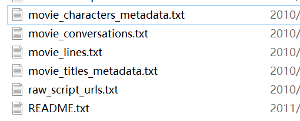

# 聊天机器人模拟

## 一. 介绍

来自[pytorch官方](https://pytorch.org/tutorials/beginner/chatbot_tutorial.html)的一片文章

### 1. 目标

1. 加载和处理[Cornell Movie-Dialogs Corpus](https://www.cs.cornell.edu/~cristian/Cornell_Movie-Dialogs_Corpus.html)数据集
2. luong attention的seq2seq模型

### 2. 数据准备

首先，在 [此处](https://www.cs.cornell.edu/~cristian/Cornell_Movie-Dialogs_Corpus.html)下载数据 ZIP 文件 并将其放入`data/`当前目录下的目录中。

### 导包

```python
from __future__ import absolute_import
from __future__ import division
from __future__ import print_function
from __future__ import unicode_literals
import torch
from torch.jit import script,trace
import torch.nn as nn
from torch import optim
import torch.nn.functional as F
import csv,random,re,os,unicodedata
import codecs
from io import open
import itertools
import math

USE_CUDA = torch.cuda.is_available()
device = torch.device("cuda" if USE_CUDA else "cpu")
```

## 二. 数据导入和处理

`cornell movie-dialogs corpus`文件夹下包括了



内部格式大概是:

```python
# 这是movie_conversation
u0 +++$+++ u2 +++$+++ m0 +++$+++ ['L194', 'L195', 'L196', 'L197']

# 这是movie_line
L1045 +++$+++ u0 +++$+++ m0 +++$+++ BIANCA +++$+++ They do not!
```

### 1. 将文本转换为tab分隔对话

格式: query\t response

#### 1.1 三个工具函数

1. `loadLines`: 将每一个line转换为dict (lineID, characterID, movieID, character, text)

```python
# 传入文件名,字段列表
def loadLines(fileName,fields):
    lines = {}
    with open(fileName,'r',encoding='iso-8859-1') as f:
        for line in f:
            values = line.split(" +++$+++ ")
            lineObj = {}
            for i,filed in enumerate(fields):
                lineObj[field] = values[i]
            lines[lineObj['lineID']] = lineObj
    return lines
```

2. `loadConversation`根据movie_conversation将lines中的内容归纳

```python
# 传入conversation file,lines,和字段们
def loadConversations(fileName,lines,fields):
    # 保存对话列表
    conversations = []
    with open(fileName,'r',encoding="iso-8859-1") as f:
        for line in f:
            values = line.split(" +++$+++ ")
            # 每个对话对应的对象
            convObj = {}
            # 认为定义最后一个字段line表为utteranceIds
            for i,field in enumerate(fields):
                convObj[field] = values[i]
            utterance_id_pattern = re.compile('L[0-9]+')
            # 从当前对象中的utteranceId中找出所有行号
            lineIds = utterance_id_pattern.findall(convObj["utteranceIDs"])
            convObj["lines"] = []
            for lineId in lineIds:
                # 取出对应行对象并加入lines
                convObj["lines"].append(lines[lineId])
            conversations.append(convObj)
        # [{a,b,c,[lineId],[{line}]}]
        return conversations
```

3. `extractSentencePairs`提炼成对的句子

```python
def extractSentencePairs(conversations):
    qa_pairs = []
    for conversation in conversations:
        for i in range(len(conversation["lines"]) - 1):
            inputLine = conversation["lines"][i]["text"].strip()
            targetLine = conversation["lines"][i + 1]["text"].strip()
            if inputLine and targetLine:
                qa_pairs.append([inputLine,targetLine])
    return qa_pairs
```

#### 1.2 处理代码

```python
# Define path to new file
datafile = os.path.join(corpus, "formatted_movie_lines.txt")

delimiter = '\t'
# Unescape the delimiter
delimiter = str(codecs.decode(delimiter, "unicode_escape"))

# Initialize lines dict, conversations list, and field ids
lines = {}
conversations = []
MOVIE_LINES_FIELDS = ["lineID", "characterID", "movieID", "character", "text"]
MOVIE_CONVERSATIONS_FIELDS = ["character1ID", "character2ID", "movieID", "utteranceIDs"]

# Load lines and process conversations
print("\nProcessing corpus...")
lines = loadLines(os.path.join(corpus, "movie_lines.txt"), MOVIE_LINES_FIELDS)
print("\nLoading conversations...")
conversations = loadConversations(os.path.join(corpus, "movie_conversations.txt"),
                                  lines, MOVIE_CONVERSATIONS_FIELDS)

# Write new csv file
print("\nWriting newly formatted file...")
with open(datafile, 'w', encoding='utf-8') as outputfile:
    writer = csv.writer(outputfile, delimiter=delimiter, lineterminator='\n')
    for pair in extractSentencePairs(conversations):
        writer.writerow(pair)

# Print a sample of lines
print("\nSample lines from file:")
printLines(datafile)
```

### 2. Voc类

描述: 保存word2index,index2word等信息

提供方法: addSentence,addWord,trim

> trim: 修剪掉频率低于某值的稀有词

````python
PAD_token = 0
SOS_token = 1 # start of sentence
EOS_token = 2
class Voc:
    def __init__(self,name):
        # 初始化
        self.name = name
        self.trimmed = False
        self.word2index = {}
        self.word2count = {}
        self.index2word = {PAD_token:"PAD",SOS_token:"SOS",EOS_token:"EOS"}
        self.num_words = 3
````

```python
    def addSentence(self,sentence):
        for word in sentnece.split(' '):
            self.addWord(word)
    def addWord(self,word):
        if word not in self.word2index:
            self.word2index[word] = self.num_words
            self.word2count[word] = 1
            self.index2word[self.num_words] = word
            self.num_words += 1
        else:
            self.word2count[word] += 1
```

```python
    def trim(self, min_count):
        if self.trimmed:
            return
        self.trimmed = True

        keep_words = []

        for k, v in self.word2count.items():
            if v >= min_count:
                keep_words.append(k)

        # Reinitialize dictionaries
        self.word2index = {}
        self.word2count = {}
        self.index2word = {PAD_token: "PAD", SOS_token: "SOS", EOS_token: "EOS"}
        self.num_words = 3 # Count default tokens

        for word in keep_words:
            self.addWord(word)
```

### 附. 一些个辅助函数: 导入语料

标准化字符串,创建corpus和pairs,过滤,整合

载入

```python
MAX_LENGTH = 10
def unicodeToAscii(s):
    return ' '.join(
        c for c in unicodedata.normalize('NFD',s)
        if unicodedata.category(c) != 'Mn'
    )
def normalizerString(s):
    s = unicodeToAscii(s.lower().strip()) # 进行一个lower和strip,进行一个ascii
    s = re.sub(r"([.!?])",r" \1",s) # 将符号都加上空格
    s = re.sub(r"[^a-zA-Z.!?]+",r" ",s) # 取缔非法字符
    s = re.sub(r"\s+",r" ",s).strip() # 空白字符统一
    return s
def readVocs(datafile,corpus_name):
    print("Reading lines...")
    lines = open(datafile,encoding='utf-8').read().strip().split('\n')
    pairs = [[normalizerString(s) for s in l.split('\t')] for l in lines]
    voc = Voc(corpus_name)
    # 创建一个新的voc和一组对话pair
    return voc,pairs
def fileterPair(p):
    # 根据单词长度滤,加速训练和收敛
    return len(p[0].split(' ')) < MAX_LENGTH and len(p[1].split(' ')) < MAX_LENGTH
def filterPairs(pairs):
    return [pair for pair in pairs if fileterPair(pair)]

# 整合
def loadPrepareData(corpus, corpus_name, datafile, save_dir):
    print("Start preparing training data ...")
    voc, pairs = readVocs(datafile, corpus_name)
    print("Read {!s} sentence pairs".format(len(pairs)))
    pairs = filterPairs(pairs)
    print("Trimmed to {!s} sentence pairs".format(len(pairs)))
    print("Counting words...")
    for pair in pairs:
        voc.addSentence(pair[0])
        voc.addSentence(pair[1])
    print("Counted words:", voc.num_words)
    return voc, pairs
```

### 附. trim策略

1. voc中去除
2. 在pairs去除带有稀有词的句子

```python
def trimRareWords(voc,pairs,MIN_COUNT):
    voc.trim(MIN_COUNT)
    keep_pairs = []
    for pair in pairs:
        input_sentence = pair[0]
        output_sentence = pair[1]
        keep_input = True
        keep_outpus = True
        for word in input_sentence.split(' '):
            if word not in voc.word2index:
                keep_input = False
                break
        for word in output_sentence.split(' '):
            if word not in voc.word2index:
                keep_outpus = False
                break
        if keep_input and keep_outpus:
            keep_pairs.append(pair)
    print("Trimmed from {} pairs to {}, {:.4f} of total".format(len(pairs), len(keep_pairs), len(keep_pairs) / len(pairs)))
    return keep_pairs
```

## 二.1 给模型准备数据

### 1. 模型需要什么

1. tensor,batch化的tensor

为了在一个batch中容纳不同大小的句子,我们可以把input tensor的形状定义为**(max_length,batch_size)**,容纳的是word的index

句末为EOS,padding==0

### 附. batch在后面的原因

按时序访问而不是batch访问


### 2. 处理function

1. 一些辅助

```python
# 将句子转换为index数组
def indexesFromSentence(voc,sentence):
    return [voc.word2index[word] for word in sentence.split(' ')] + [EOS_token]
# 填充到最长,itertools也有改变维度的效果
def zeroPadding(l,fillvalue=PAD_token):
    return list(itertools.zip_longest(*l,fillvalue=fillvalue))
# 二进制化语句matrix
def binaryMatrix(l,value=PAD_token):
    m = []
    for i,seq in enumerate(l):
        m.append([])
        for token in seq:
            if token == PAD_token:
                m[i].append(0)
            else:
                m[i].append(1)
    return m
```

2. 输入处理

```python
# 功能: 输入句子和voc,输出pad过的index矩阵,并且附带每个句子的长度
def inputVar(l,voc):
    indexes_batch = [indexesFromSentence(voc,sentence) for sentence in l]
    lengths = torch.tensor([len(indexes) for indexes in indexes_batch])
    padList = zeroPadding(indexes_batch)
    padVar = torch.LongTensor(padList)
    return padVar,lengths
# 功能: 输出pad过的index矩阵,但是给出的是以1和0组成的mask和最大长度
# 对output使用
def outputVar(l,voc):
    indexes_batch = [indexesFromSentence(voc, sentence) for sentence in l]
    max_target_len = max([len(indexes) for indexes in indexes_batch])
    padList = zeroPadding(indexes_batch)
    mask = binaryMatrix(padList)
    mask = torch.BoolTensor(mask)
    padVar = torch.LongTensor(padList)
    return padVar, mask, max_target_len
```

```python
# 整合
def batch2TrainData(voc,pair_batch):
    pair_batch.sort(key = lambda x:len(x[0].split(" "),reversed))# 按单词数降序
    input_batch,output_batch = [],[]
    for pair in pair_batch:
        input_batch.append(pair[0])
        output_batch.append(pair[1])
    inp,lengths = inputVar(input_batch,voc)
    output,mask,max_target_len = outputVar(output_batch,voc)
    return inp,lengths,output,mask,max_target_len
    
```

3. 使用,随机抽样

```python
small_batch_size = 5
batches = batch2TrainData(voc,[random.choice(pairs) for _ in range(small_batch_size)])
input_variable, lengths, target_variable, mask, max_target_len = batches
```

至此,输入的处理完成

## 三. seq2seq模型

### 1. 双向RNN

两层rnn时序相反,结果求和(或者拼接)


### 2. Encoder描述

1. Embedding层,将一个index转化为hidden_size大小的tensor,相似的word应该有相似的tensor
2. 环绕在RNN之外,我们使用`nn.utils.rnn.pack_padded_sequence` and `nn.utils.rnn.pad_packed_sequence`

* 流程

  1. Embedding
  2. pack
  3. RNN
  4. unpack
  5. 把RNN的双向结果相加
  6. 返回output和最后一个时序的h

* `input`:

  * `input_seq`: (max_length,batch_size)的index矩阵

  * `input_lengths`: 长度数组,一个batch就是一个句子,所以shape为(batch_size)

  * `hidden`: 初始化hidden state; shape=*(n_layers x num_directions, batch_size, hidden_size)*

    > 第一个维度的意思是层数 * 双向/单向,即RNN层的纵向个数,组成最右边一沓hidden state

* `output`:
  - `outputs`: 最后一个hidden layer(纵向)RNN的输出 ,双向之和; shape=*(max_length, batch_size, hidden_size)*
  - `hidden`: 最右边的hidden state; shape=*(n_layers x num_directions, batch_size, hidden_size)*

### 3. Encoder代码

初始化

```python
class EncoderRNN(nn.Module):
    def __init__(self,hidden_size,embedding,n_layers=1,dropout=0):
        super(EncoderRNN,self).__init__()
        self.n_layers = n_layers
        self.hidden_size = hidden_size
        self.embedding = embedding
        self.GRU = nn.GRU(hidden_size,hidden_size,n_layers,dropout = (0 if n_layers == 1 else dropout),bidirectional=True)
```

```python
    def forward(self,input_seq,input_lengths,hidden_size):
        embedded = self.embedding(input_seq)
        # 把padding pack掉,输入三维矩阵和长度
        packed = nn.utils.rnn.pack_padded_sequence(embedded,input_lengths)
        outputs,hidden = self.gru(packed)
        # 只需要处理output,因为output包含时序
        outputs,_ = nn.utils.rnn.pad_packed_sequence(outputs)
        # 将双向相加,内置的处理是dim=2拼接
        outputs = outputs[:,:,:self.hidden_size] + outputs[:,:,self.hidden_size:]
        return outputs,hidden
```

### 2. Decoder描述: Attention


*  [Bahdanau](https://arxiv.org/abs/1409.0473)的Attention模型和[Luong](https://arxiv.org/abs/1508.04025)的Attention模型有所区别,但是我看不懂

  

1. attention层的位置和输入输出:

   位置: decoder的RNN和Affine之间

   `input`: encoder的输出和RNN输出的h

   `output`: 经过attention筛选的新h

|   第t步    |             Bahdanau              |               Luong               |
| :--------: | :-------------------------------: | :-------------------------------: |
| 权重的生成 | t-1时序的h,和hs的score进行softmax | t个时序的h,和hs的score进行softmax |
|    结果    |           ct和ht-1拼接            |            ct和ht拼接             |
|            |                                   |                                   |

content based score计算: 


> 其中除了h之外都是需要训练的产物

### 3. Attn代码

输入: hidden,encoder_output

输出: 权重,softmax(score) (batch_size,1,max_length)

```python
# luong
class Attn(nn.Module):
    # method: dot,general,concat
    def __init__(self,method,hidden_size):
        super(Attn,self).__init__()
        # 检验method
        self.method = method
        if self.method not in ['dot','general','concat']:
            raise ValueError(self.method," is not method!")
        
        self.hidden_size = hidden_size
        if self.method == 'general':
            # 内含训练参数W
            self.attn = nn.Linear(self.hidden_size,hidden_size)
        elif self.method == 'concat':
            self.attn = nn.Linear(self.hidden_size * 2,hidden_size)
            # 将v加入训练参数
            self.v = nn.Parameter(torch.FloatTensor(hidden_size))
    def dot_score(self,hidden,encoder_output):
        # 广播乘法再相加,形成内积
        return torch.sum(hidden * encoder_output,dim=2)
    def general_score(self,hidden,encoder_output):
        energy = self.attn(encoder_output):
        return torch.sum(hidden * energy,dim=2)
    def concat_score(self,hidden,encoder_output):
        # 就是拼接,看不懂,但是就是拼接
        energy = self.attn(torch.cat((hidden.expand(encoder_output.size(0),-1,-1),encoder_output,2))).tanh()
        return torch.sum(self.v * energy,dim=2)
    def forward(self,hidden,encoder_output):
        # 计算score再softmax就结束了
        if self.method == 'general':
            attn_energies = self.general_score(hidden,encoder_output)
        elif self.method == 'concat':
            attn_energies = self.concat_score(hidden,encoder_output)
        elif self.method == 'dot':
            attn_energies = self.dot_score(hidden,encoder_output)
        attn_energies = attn_energies.t()
        return F.softmax(attn_energies,dim=1).unsqueeze(1)
```

### 4. Decoder描述: 流程

每个时间t的输入应该遵循流程:

1. 获取当前输入的Embedding
2. 走一个单向的RNN
3. 根据该输出计算Attention权重
4. Attention权重和encoder输出计算获得新的上下文向量
5. 将上下文向量和GRU输出(ht)拼接
6. 根据拼接结果预测,输出output

`input`:

* `input_step`: (1,batch_size),一个时序中的所有word
* `last_hidden`: encoder的最右边输出
* `encoder_outputs`: encoder的output

`output`: 

* output,hidden

### 5. Decoder实现

```python
class LuongAttnDecoderRNN(nn.Module):
    def __init__(self,attn_model,embedding,hidden_size,output_size,n_layers=1,dropout=0.1):
        super(LuongAttnDecoderRNN,self).__init__()
        self.attn_model = attn_model
        self.hidden_size = hidden_size
        self.output_size = output_size
        self.n_layers = n_layers
        self.dropout = dropout
		
        self.embedding = embedding
        self.embedding_dropout = nn.Dropout(dropout)
        self.gru = nn.GRU(hidden_size,hidden_size,n_layers,dropout=(0 if n_layers == 1 else dropout))
        
        self.concat = nn.Linear(hidden_size * 2,hidden_size)
        self.out = nn.Linear(hidden_size,output_size)
        self.attn = Attn(attn_model,hidden_size)
```

```python
    def forward(self,input_step,last_hidden,encoder_outputs):
        # 先过word embedding和dropout
        embedded = self.embedding(input_step)
        embedded = self.embedding_dropout(embedded)
        # gru过一下
        rnn_output,hidden = self.gru(embedded,last_hidden)
        # 根据输出和encoder算一下attention
        attn_weights = self.attn(rnn_output,encoder_outputs)
        # bmm: batch matmul,批量的矩阵乘法,计算一批context矢量
        context = attn_weights.bmm(encoder_outputs.transpose(0,1))
        # 一个时间过gru,可以挤压
        rnn_output = rnn_output.squeeze(0)
        context = context.squeeze(1)
        # 拼接后进行Linear再tanh,是luong给出的方案(见计算公式)
        concat_input = torch.cat((rnn_output,context),1)
        concat_output = torch.tanh(self.concat(concat_input))
        # 过一下linear
        output = self.out(concat_output)
        # 过一下softmax
        output = F.softmax(output,dim=1)
        return output,hidden
```

### 6. loss

loss需要考虑到padding元素,不能直接算

```python
def maskNLLLoss(inp,target,mask):
    # target就是output,每个句子都是padding过的word index的数组
    nTotal = mask.sum()
    # 取出target位置的概率计算loss
    crossEntropy = -torch.log(torch.gather(inp,1,target.view(-1,1)).squeeze(1))
    loss = crossEntropy.masked_select(mask).mean()
    loss = loss.to(device)
    return loss,nTotal.item()
```

>torch.gather
>作用：收集输入的特定维度指定位置的数值
>参数：
>input(tensor):   待操作数。不妨设其维度为（x1, x2, …, xn）
>dim(int):   待操作的维度。
>index(LongTensor):   如何对input进行操作。其维度有限定，例如当dim=i时，index的维度为（x1, x2, …y, …,xn），既是将input的第i维的大小更改为y，且要满足y>=1（除了第i维之外的其他维度，大小要和input保持一致）。

## 四. 训练

### 1. 训练思路

1. trick1: 强行指导(teacher forcing) 即使用目标词而不是猜测词作为输入,提高学习效率

   > 并且按照一个概率进行输入而不是一定输入,但是这个例子里我们设置概率为100%

2. trick2: 梯度裁剪

* 步骤:

  * input batch过encoder
  * 给decoder准备输入:
    * \<SOS\>组成的矢量
    * encoder的最后一层输出
  * 走过decoder输入时序
  * 如果teacher forcing,下一个时序输入正确target的值,不然输入预测值
  * 计算并累加loss
  * 反向传播->修剪梯度->更新参数

  

### 2. train代码

好长

```python
def train(input_variable,lengths,target_variable,mask,max_target_len,encoder,decoder,embedding,encoder_optimizer,decoder_optimizer,batch_size,clip,max_length=MAX_LENGTH):
    # 去掉梯度
    encoder_optimizer.zero_grad()
    decoder_optimizer.zero_grad()

    input_variable = input_variable.to(device)
    target_variable = target_variable.to(device)
    mask = mask.to(device)
    # packing的length参数放cpu
    lengths = lengths.to("cpu")

    loss = 0
    print_losses = []
    n_totals = 0
    # encoder登场
    encoder_outputs,encoder_hidden = encoder(input_variable,lengths)

    decoder_input = torch.LongTensor([[SOS_token for _ in range(batch_size)]])
    decoder_input = decoder_input.to(device)
    decoder_hidden = encoder_hidden[:decoder.n_layers]
    use_teacher_forcing = True if random.random() < teacher_forcing_ratio else False
    if use_teacher_forcing:
        for t in range(max_target_len):
            # decoder登场
            decoder_output,decoder_hidden = decoder(
                decoder_input,decoder_hidden,encoder_outputs
            )
            # 新的input
            decoder_input = target_variable[t].view(1,-1)
            mask_loss,nTotal = maskNLLLoss(decoder_output,target_variable[t],mask[t])
            loss += mask_loss
            print_losses.append(mask_loss.item() * nTotal)
            n_totals += nTotal
    else:
        for t in range(max_target_len):
            decoder_output,decoder_hidden = decoder(
                decoder_input,decoder_hidden,encoder_outputs
                )
            # 取出最大概率的一组
            _,topi = decoder_output.topk(1)
            decoder_input = torch.LongTensor([[topi[i][0] for i in range(batch_size)]])
            decoder_input = decoder.to(device)
            mask_loss,nTotal = maskNLLLoss(decoder_output,target_variable[t],mask[t])
            loss += mask_loss
            print_losses.append(mask_loss.item() * nTotal)
            n_totals += nTotal
    loss.backward()
    _ = nn.utils.clip_grad_norm_(encoder.parameters(),clip)
    _ = nn.utils.clip_grad_norm_(decoder.parameters(),clip)
    encoder_optimizer.step()
    decoder_optimizer.step()
    return sum(print_losses) / n_totals
```

### 3. train代码再封装

感觉有点冗长

```python
def trainIters(model_name, voc, pairs, encoder, decoder, encoder_optimizer, decoder_optimizer, embedding, encoder_n_layers, decoder_n_layers, save_dir, n_iteration, batch_size, print_every, save_every, clip, corpus_name, loadFilename):

    # 拿出iteration大小的batch
    training_batches = [batch2TrainData(voc, [random.choice(pairs) for _ in range(batch_size)])
                      for _ in range(n_iteration)]

    # Initializations
    print('Initializing ...')
    start_iteration = 1
    print_loss = 0
    
    # 这个函数的特色就是可以根据文件载入设置断点
    # loadFilename和checkpoint都是全局变量,我认为可以优化一下
    if loadFilename:
        start_iteration = checkpoint['iteration'] + 1

    # Training loop
    print("Training...")
    for iteration in range(start_iteration, n_iteration + 1):
        training_batch = training_batches[iteration - 1]
        # Extract fields from batch
        # 拿,都可以拿,有什么不能拿的
        input_variable, lengths, target_variable, mask, max_target_len = training_batch

        # 当场开train
        loss = train(input_variable, lengths, target_variable, mask, max_target_len, encoder,
                     decoder, embedding, encoder_optimizer, decoder_optimizer, batch_size, clip)
        print_loss += loss

        # Print progress
        # 每...打印一次
        if iteration % print_every == 0:
            print_loss_avg = print_loss / print_every
            print("Iteration: {}; Percent complete: {:.1f}%; Average loss: {:.4f}".format(iteration, iteration / n_iteration * 100, print_loss_avg))
            print_loss = 0

        # 每...保存一次
        if (iteration % save_every == 0):
            directory = os.path.join(save_dir, model_name, corpus_name, '{}-{}_{}'.format(encoder_n_layers, decoder_n_layers, hidden_size))
            if not os.path.exists(directory):
                os.makedirs(directory)
            # torch.save(obj,file) == iteration_checkpoint.tar
            torch.save({
                'iteration': iteration,
                'en': encoder.state_dict(),
                'de': decoder.state_dict(),
                'en_opt': encoder_optimizer.state_dict(),
                'de_opt': decoder_optimizer.state_dict(),
                'loss': loss,
                'voc_dict': voc.__dict__,
                'embedding': embedding.state_dict()
            }, os.path.join(directory, '{}_{}.tar'.format(iteration, 'checkpoint')))
```

## 五. 测试/使用

### 1. 重新写一个Decoder

其实就是写一个方便生成的seq2seq模型

```python
class GreedySearchDecoder(nn.Module):
    def __init__(self,encoder,decoder):
        super(GreedySearchDecoder,self).__init__()
        self.encoder = encoder
        self.decoder = decoder
    def forward(self,input_seq,input_length,max_length):
        encoder_outputs,encoder_hidden = self.encoder(input_seq,input_length)
        decoder_hidden = encoder_hidden[:decoder.n_layers]
        decoder_input = torch.ones(1,1,device=device,dtype=torch.long) * SOS_token
        all_tokens = torch.zeros([0],device=device,dtype=torch.long)
        all_scores = torch.zeros([0],device=device)
        for _ in range(max_length):
            decoder_output,decoder_hidden = self.decoder(decoder_input,decoder_hidden,encoder_outputs)
            decoder_scores,decoder_input = torch.max(decoder_output,dim=1)
            all_tokens = torch.cat((all_tokens,decoder_input),dim=0)
            all_scores = torch.cat((all_scores,decoder_scores))
            decoder_input = torch.unsqueeze(decoder_input,0)
        return all_tokens,all_scores
```

### 2. evaluate

```python
def evaluate(encoder,decoder,searcher,voc,sentence,max_length=MAX_LENGTH):
    
    indexes_batch = [indexesFromSentence(voc,sentence)]
    lengths = torch.tensor([len(indexes) for indexes in indexes_batch])
    input_batch = torch.LongTensor(indexes_batch).transpose(0,1)
    input_batch = input_batch.to(device)
    lengths = lengths.to("cpu")
    tokens,scores = searcher(input_batch,lengths,max_length)
    decoded_words = [voc.index2word(token.item()) for token in tokens]
    return decoded_words
def evaluateInput(encoder,decoder,searcher,voc):
    input_sentence = ''
    while(1):
        try:
            input_sentence = input('> ')
            if input_sentence == 'q' or input_sentence == 'quit': break
            input_sentence = normalizeString(input_sentence)
            output_words = evaluate(encoder,decoder,searcher,voc,input_sentence)
            output_words = [x for x in output_words if not(x == 'EOS' or x == 'PAD')]
            print('Bot:',' '.join(output_words))
            
        except KeyError:
            print("Error: Encountered unknown word.")
```

## 六. 开始

### 1. 准备

```python
model_name = 'cb_model'
attn_model = 'dot'

hidden_size = 500
encoder_n_layers = 2
decoder_n_layers = 2
dropout = 0.1
batch_size = 64

loadFilename = None
checkpoint_iter = 4000

if loadFilename:
    checkpoint = torch.load(loadFilename)
    encoder_sd = checkpoint['en']
    decoder_sd = checkpoint['de']
    encoder_optimizer_sd = checkpoint['en_opt']
    decoder_optimizer_sd = checkpoint['de_opt']
    embedding_sd = chekcpoint['embedding']
    voc.__dict__ = checkpoint['voc_dict']
print('Building encoder and decoder...')
embedding = nn.Embedding(voc.num_words,hidden_size)
if loadFilename:
    embedding.load_state_dict(embedding_sd)
encoder = EncoderRNN(hidden_size,embedding,encoder_n_layers,dropout)
decoder = LuongAttnDecoderRNN(attn_model,embedding,hidden_size,voc.num_words,decoder_n_layers,dropout)
if loadFilename:
    encoder.load_state_dict(encoder_sd)
    decoder.load_state_dict(decoder_sd)
encoder = encoder.to(device)
decoder = decoder.to(device)
print('Ready!')
```

### 2. 训练

```python
clip = 50.0
teacher_forcing_ratio = 1.0
learning_rate = 0.0001
decoder_learning_ratio = 5.0
n_iteration = 4000
print_every = 1
save_every = 500

encoder.train()
decoder.train()

print('Building optimizers...')
encoder_optimizer = optim.Adam(encoder.parameters(),lr=learning_rate)
decoder_optimizer = optim.Adam(decoder.parameters(),lr=learning_rate * decoder_learning_ratio)
if loadFilename:
    encoder_optimizer.load_state_dict(encoder_optimizer_sd)
    decoder_optimizer.load_state_dict(decoder_optimizer_sd)
for state in encoder_optimizer.state.values():
    for k,v in state.items():
        if isinstance(v,torch.Tensor):
            state[k] = v.cuda()
for state in decoder_optimizer.state.values():
    for k,v in state.items():
        if isinstance(v,torch.Tensor):
            state[k] = v.cuda()
print('Start training!')
trainIters(model_name,voc,pairs,encoder,decoder,encoder_optimizer,decoder_optimizer,embedding,encoder_n_layers,decoder_n_layers,save_dir,n_iteration,batch_size,print_every,save_every,corpus_name,loadFilename)
```

