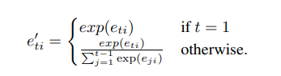
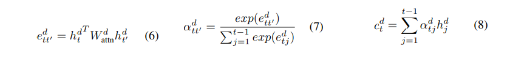

# Intra-Attention模型阅读

> ```
> @inproceedings{
> paulus2018a,
> title={A Deep Reinforced Model for Abstractive Summarization},
> author={Romain Paulus and Caiming Xiong and Richard Socher},
> booktitle={International Conference on Learning Representations},
> year={2018},
> url={https://openreview.net/forum?id=HkAClQgA-},
> }
> ```

### 1. 模型样式

双向LSTM encoder,单向LSTM decoder

相同的word embedding

### 2. 关键创新点

#### 2.1 惩罚过去拥有高attention的词

使用标准化的方式,累加过去的权重向量score,并标准化作为新的权重向量



所得结果为e版context

#### 2.2 添加对decoder hidden的attention



> 当t=1时,$c_1^d$置全0

(6): 当前hidden与前一个hidden进行general计算score