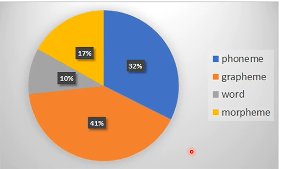

# NLP

## 一. 大致目标模型

语音-->文字

文字-->语音

语音-->语音

文字-->文字

语音-->类别

文字-->类别

## 二. 语音辨识

### 1. 概论

#### 1.1 概念处理

声音被标示成`向量`,使用T表示向量长度,d表示维数

文字被处理成N长度的`token序列`,具有V个不同种类的token

* token:

  * `Phoneme`:发音的基本单位

  * `Grapheme`: 书写系统的最小单位 ,在英文中包括26字母和空格

  * `word`: 单词

  * `Morpheme`: 可以传达意义的单位,比如前缀`un`

  * `Bytes`: 字节

    

* `Lexicon词典`: 记录了文字与phoneme的关系

#### 1.2 声音-向量

**拟成声音向量的方式**: 

直接所有points,MFCC,bank output

**向右移动**: 10ms而不是25ms,帧之间有重叠

* 处理
  * 处理1: 将waveform通过DFT转换为`spectrogram`
  * 处理2: 然后通过一些设计好的**Filter**转换为filter bank output

  * 处理3: 取log
  * 处理4: 通过DCT得到MFCC

* 语料库

  

#### 1.3 模型

从seq2seq,HMM出发

`LAS`

`RNN-T`

### 2. LAS模型

seq2seq with attention