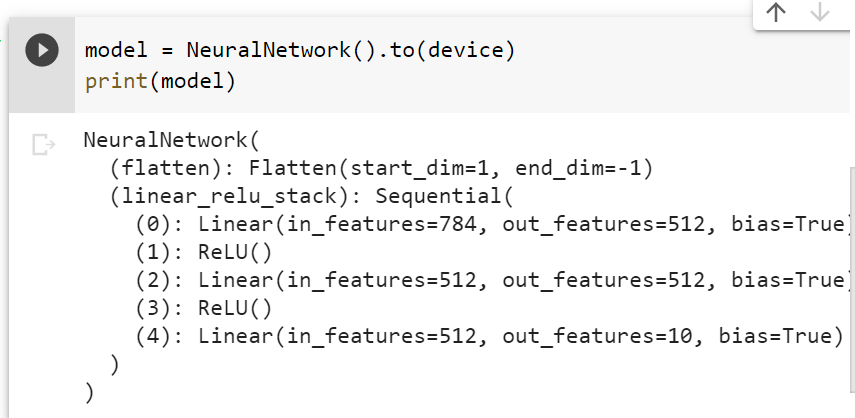
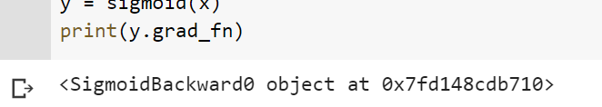
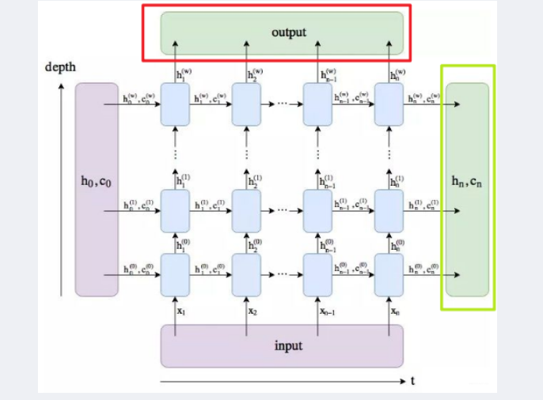

# Pytorch详细

## 一. tensor入门

### 1. 构造

```python
x = torch.empty(5,3,2) # 输入维度,构造一个未初始化的tensor
x = torch.rand(5, 3) # 输入维度,构造一个随机数tensor
x = torch.zeros(5, 3, dtype=torch.long) # 输入维度,返回全0
# 通过dtype指定类型

x = torch.tensor([5.5, 3]) # 根据内容构造tensor

torch.ones_like(x_data)
torch.rand_like(x_data, dtype=torch.float)

```

### 2. 操作

```python
# 矩阵加法
x + y
torch.add(x,y)
x.add_(y) # 带_表示会改变x
torch.add(x,y,out=result) # 将结果存入result变量,result必须是tensor并且可能会resize
```

```python
# 重新塑形
x = torch.randn(4, 4)
y = x.view(16)
z = x.view(-1, 8)  # -1表示不确定,结果为 16 / 8 = 2
print(x.size(), y.size(), z.size())
# 获取数值
# 如果tensor只有一个数值
x.item()

tensor.to('cuda')
```

[tensor操作大全](https://pytorch.org/docs/stable/torch.html)

### 3. 和np相似的操作

```python
tensor.shape
tensor.dtype
tensor.device

```

```python
y1 = tensor @ tensor.T
y2 = tensor.matmul(tensor.T)
torch.matmul(tensor, tensor.T, out=y3)
```


## 二. autograd自动求导

### 1. tensor与autograd

如果tensor的属性`requires_grad`为true,那么tensor会追踪所有操作,完成计算后使用`backward()`来自动计算所有变量的梯度

并累加到`grad`属性

并且记录了`Function`图,在`grad_fn`属性中

### 2. 一些操作

### 2. 一些操作

`detach()`: 将tensor与计算历史分离

`with torch.nograd()`: 在此代码块中不进行梯度运算

`backward()`: 如果tensor是标量则不需要参数,如果不是就应该指定形状匹配的tensor

`x.requires_grad_(T/F)`改变x的grad属性

### 3. 实例

```python
x = torch.ones(2, 2, requires_grad=True)
y = x + 2
z = y * y * 3
out = z.mean()

out.backward(); # 开始反向传播到x

print(x.grad) # 记录了对于out的梯度
```


## 三. 神经网络

`torch.nn`

### 1. Module

`nn.Module`包含各个层和一个forward(input) 返回一个output

```python
import torch
import torch.nn as nn
import torch.nn.functional as F


class Net(nn.Module):

    def __init__(self):
        super(Net, self).__init__()
        # 1 input image channel, 6 output channels, 5x5 square convolution
        # kernel
        # 卷积,暂时看不懂
        self.conv1 = nn.Conv2d(1, 6, 5)
        self.conv2 = nn.Conv2d(6, 16, 5)
        # an affine operation: y = Wx + b
        # 定义各个线性参数的大小(左,右)
        self.fc1 = nn.Linear(16 * 5 * 5, 120)
        self.fc2 = nn.Linear(120, 84)
        self.fc3 = nn.Linear(84, 10)

    def forward(self, x):
        # Max pooling over a (2, 2) window
        x = F.max_pool2d(F.relu(self.conv1(x)), (2, 2))
        # If the size is a square you can only specify a single number
        x = F.max_pool2d(F.relu(self.conv2(x)), 2)
        x = x.view(-1, self.num_flat_features(x))
        x = F.relu(self.fc1(x))
        x = F.relu(self.fc2(x))
        x = self.fc3(x)
        return x

    def num_flat_features(self, x):
        size = x.size()[1:]  # all dimensions except the batch dimension
        num_features = 1
        for s in size:
            num_features *= s
        return num_features


net = Net()
print(net)
```

### 2. 使用net

`net.parameters()`返回网络的参数,这个参数是什么我暂且蒙在鼓里

```python
input = torch.randn(1, 1, 32, 32)
out = net(input)
print(out)
```

`net.zero_grad()`清空梯度计数器

## 重生二. Dataset/loader

### 1. 介绍

为了避免数据和训练耦合,数据操作难以维护的问题,pytorch提供了

 `torch.utils.data.DataLoader` and `torch.utils.data.Dataset` 

* `Dataset`保存了样本和对应的label,而`DataLoader`给Dataset包上一个迭代器以便访问

pytorch提供了很多现成的Dataset作为Dataset的子类,可以查看官网获取有关信息

[官网](https://pytorch.org/text/stable/datasets.html)

### 1. 使用内置的FashionMNIST数据

#### 1.1 创建Dataset对象

```python
import torch
from torch.utils.data import Dataset
from torchvision import datasets
from torchvision.transforms import ToTensor
import matplotlib.pyplot as plt
# 直接构造即可
training_data = datasets.FashionMNIST(
    root="data", # 放在本地的哪个路径
    train=True,  # 训练/测试
    download=True, # 是否下载
    transform = ToTensor() # transform
)
test_data = datasets.FashionMNIST(
    root="data",
    train=False,
    download=True,
    transform = ToTensor()
)
```

#### 1.2 使用Dataset

操作:

使用`[index]`来访问一组数据

```python
img, label = training_data[sample_idx]
```

根据dataset和matplotlib绘图代码示例:

```python
labels_map = {
    0: "T-Shirt",
    1: "Trouser",
    2: "Pullover",
    3: "Dress",
    4: "Coat",
    5: "Sandal",
    6: "Shirt",
    7: "Sneaker",
    8: "Bag",
    9: "Ankle Boot",
}
figure = plt.figure(figsize=(8, 8))
cols, rows = 3, 3
for i in range(1, cols * rows + 1):
    # 随机抽取
    sample_idx = torch.randint(len(training_data), size=(1,)).item()
    # 访问数据
    img, label = training_data[sample_idx]
    figure.add_subplot(rows, cols, i)
    plt.title(labels_map[label])
    plt.axis("off")
    # 剥去一层维度
    plt.imshow(img.squeeze(), cmap="gray")
plt.show()
```

### 2. 自定义Dataset

需要继承Dataset并实现:

`__init__`: 不限制参数,因为是用户调用; 用于初始化读取数据

`__len__`: 无参,返回长度

`__getitem__`: 传入index,返回(样本,标签)元组

```python
class CustomImageDataset(Dataset):
  def __init__(self,annotations_file,img_dir,transform=None,target_transform=None):
    self.img_labels = pd.read_csv(annotations_file)
    self.img_dir = img_dir
    self.transform = transform
    self.target_transform = target_transform
  def __len__(self):
    return len(self.img_labels)
  def __getitem(self,idx):
    img_path = os.path.join(self.img_dir,self.img_balels.iloc[idx,0])
    image = read_image(img_path)
    label = self.img_labels.iloc[idx,1]
    if self.transform:
      image = self.transform(image)
    if self.target_transform:
      label = self.target_transform(label)
    return image,label
```

### 3. 使用DataLoader为学习准备数据

```python
loader = DataLoader(dataset,shuffle=True,batch_size=64)
# 必须指定dataset
# 可以指定shuffle,batch_size
```

遍历dataloader:

* 每次遍历都会取出一个batch_size大小的数据

  ```python
  train_features, train_labels = next(iter(train_dataloader))
  ```

### 4. Transform

在dataset初始化时可以传入Transform来将数据转换成一定的格式

分为transform和target_transform使用

```python
ds = datasets.FashionMNIST(
    root="data",
    train=True,
    download=True,
    transform=ToTensor(),
    target_transform=Lambda(lambda y: torch.zeros(10, dtype=torch.float).scatter_(0, torch.tensor(y), value=1))
)
```

## 三. 创建Neural network

### 1. 导入和准备

导入库

```python
import os
import torch
from torch import nn
from torch.utils.data import DataLoader
from torchvision import datasets,transforms
```

准备device

```python
device = 'cude' if torch.cuda.is_available() else 'cpu'
```

### 2. 定义nn.Module的子类

`nn.Module`的子类可以定义一个完整的神经网络

`__init__`: 用于初始化神经网络layer之类的

`forward(x)` : 正向计算

```python
class NeuralNetwork(nn.Module):
  def __init__(self):
    super(NeuralNetwork,self).__init__()
    self.flatten = nn.Flatten()
    self.linear_relu_stack = nn.Sequential(
        nn.Linear(28 * 28,512),
        nn.ReLU(),
        nn.Linear(512,512),
        nn.ReLU(),
        nn.Linear*(512,10),
    )
  def forward(self,x):
    x = self.flatten(x)
    logits = self.linear_relu_stack(x) # forward,执行各层的forward
    return logits
```



### 3. 使用

直接`model(x)`,会调用底层的forward,但是注意不要直接调用forward

```python
X = torch.rand(1,28,28,device=device)
logits = model(X)
pred_probab = nn.Softmax(dim=1)(logits)
y_pred = pred_probab.argmax(1)
print(f"Predicted class: {y_pred}")
```

### 4. 介绍当前实例下的layer

> layer的调用也是直接`layer(x)`,由包装调用forward

`nn.Flatten`把dim=1开始的输入展成数组(batch的dim=0保留)

`nn.Linear`: 传入输入和输出的大小,进行线性变换

```python
layer1 = nn.Linear(in_features=512,out_features=218)
```

`nn.ReLU`激活函数

`nn.Sequential`: 有序的容器,数据按照定义流过模块,也是直接使用对象调用

`nn.Softmax`: softmax,但是dim=1(即dim为1的整个部分,结果和必须是1)

### 5. 神经网络参数

nn.Module子类会自动跟踪使用的模块中的字段,并允许你使用`parameters()`或者`named_parameters()`访问

> 所谓参数,在全连接神经网络里无非是W和b

```python
for name , param in model.named_parameters():
  print(f"{name}")
```

```python
# linear_relu_stack是自定义属性名
linear_relu_stack.0.weight
linear_relu_stack.0.bias
linear_relu_stack.2.weight
linear_relu_stack.2.bias
linear_relu_stack.4.weight
linear_relu_stack.4.bias
```

## 四. optimization

### 1. 自动求导

pytorch的自动微分引擎`torch.autograd`支持任何计算图的反向传播计算

* 开启自动求导:
  * 在创建tensor时指定`requires_grad=True`
  * 使用`x.requires_grad_(True)`

* 查看上一步的function

  ```python
  x.grad_fn
  ```

  

* 计算梯度

  * 调用结果的`backward()`,然后从我们使用的参数的grad属性中获得梯度值

    ```python
    x = torch.randn(5,3,requires_grad=True)
    y = x.sum()
    print(x.grad) # None
    y.backward()
    print(x.grad)
    ```

    > 1. grad can be implicitly created only for scalar outputs
    > 2. 我们只能获取叶子节点中的grad

* 禁用梯度:(比如测试的时候)

  ```python
  with torch.no_grad():
      pass
  ```

  ```python
  z = z.detach() # 在计算后将梯度信息分离
  ```

  

### 2. Loss Function

`nn.MSELoss`

`nn.NLLLoss`

`nn.CrrossEntropyLoss` = nn.LogSoftmax + NLLLoss

> input: (pred,t)
>
> output: loss

### 3. Optimizer

优化器在`torch.optim`包下

有比如:

> optim.Adam
>
> optim.ASGD
>
> option.SGD(可设置momentum)
>
> option.RMSprop

构造方式:

```python
# 直接传parameters
optimizer = optim.SGD(model.parameters(), lr=0.01, momentum=0.9)
# 定制化
optim.SGD([
                {'params': model.base.parameters()},
                {'params': model.classifier.parameters(), 'lr': 1e-3}
            ], lr=1e-2, momentum=0.9)
```

使用方式:

`step()`方法

```python
for input, target in dataset:
    optimizer.zero_grad() # 清除grad
    output = model(input) # 计算
    loss = loss_fn(output, target) # 取出最后的loss
    loss.backward() # loss作为结果,进行backward即可更新w和b的grad
    optimizer.step() # 优化器根据parameters的grad进行更新
```

### 4. 训练参考代码

```python
def train_loop(dataloader, model, loss_fn, optimizer):
    size = len(dataloader.dataset)
    for batch, (X, y) in enumerate(dataloader):
        # Compute prediction and loss
        pred = model(X)
        loss = loss_fn(pred, y)

        # Backpropagation
        optimizer.zero_grad()
        loss.backward()
        optimizer.step()

        if batch % 100 == 0:
            loss, current = loss.item(), batch * len(X)
            print(f"loss: {loss:>7f}  [{current:>5d}/{size:>5d}]")


def test_loop(dataloader, model, loss_fn):
    size = len(dataloader.dataset)
    num_batches = len(dataloader)
    test_loss, correct = 0, 0

    with torch.no_grad():
        for X, y in dataloader:
            pred = model(X)
            test_loss += loss_fn(pred, y).item()
            correct += (pred.argmax(1) == y).type(torch.float).sum().item()

    test_loss /= num_batches
    correct /= size
```

## 五. 保存/加载

### 1. 参数

```python
model = models.vgg16(pretrained=True)
torch.save(model.state_dict(), 'model_weights.pth')
```

```python
model = models.vgg16() # we do not specify pretrained=True, i.e. do not load default weights
model.load_state_dict(torch.load('model_weights.pth'))
model.eval()
```

### 2. 网络结构

```python
torch.save(model, 'model.pth')
```

```python
model = torch.load('model.pth')
```

## 六. pytorch的RNN

### 1. 构造器

参数:

`input_size`: 输入的大小(句子长度->横向长度)

`hidden_size`: hidden_layer的大小

`num_layers`: 纵向几层RNN/LSTM/GRU

`bias`: 是否bias

`dropout`: dropout系数

`batch_first=False`:batch在前面还是seq在前面,默认seq在前面

> 如果设置了True,则pack和pad函数也应该设置batch_first=True

### 2. forward调用

forward传入一个batch的句子

output:

`output`: 纵向最后一层所有输出的h(seq_len, batch, num_directions*hidden_size)

 num_directions * hidden_size就是每个方向上的隐藏单元个数。

`h`: 横向最后一层所有的输出h(num_layers*num_directions, batch, hidden_size)



### 3. 编码器示例

虽然是编码器,但朴素解码器也是完全一致

```python
def PlainEncoder(nn.Module):
    def __init__(self,vocab_size,hidden_size,dropout=0.2):
        super(PlainEncoder,self).__init__()
        # 定义三个层
        self.embed = nn.Embedding(vocab_size,hidden_size)
        self.rnn = nn.GRU(hidden_size,hidden_size,batch_first=True)
        self.dropout = nn.Dropout(dropout)
    def forward(self,x,lengths): # x: 句子batch,lengths: 各个句子的实际长度
        # 将句子排序,从长倒短
        sorted_len,sorted_idx = lenghts.sort(0,descending=True)
        x_sorted = x[sorted_idx.long()]
        # 过embed和dropout层
        embedded = self.dropout(embed(x_sorted))
        # 得到以后将其压缩,使用pack_padded_sequence,默认压掉0
        packed_embedded = nn.utils.pack_padded_sequence(embedded, sorted_len.long().cpu().data.numpy(), batch_first=True) 
		# 过rnn,第一个是各层的输出,第二个是最后一个时序的输出
        packed_out,hid = self.rnn(packed_embedded)
        # pad展开各层输出,方便交给下层
        out ,_  = nn.utils.rnn.pad_packed_sequence(packed_out,batch_first=True)
        # 把顺序恢复
        _,original_idx = sorted_idx.sort(0,descending=False)
        out = out[original_idx.long()].contiguous()  # contiguous是为了把不连续的内存单元连续起来 
        hid = hid[:, original_idx.long()].contiguous()
            
        return out, hid[[-1]]   # 把最后一层的hid给拿出来  这个具体看上面的简单演示
```

### 4. 朴素解码器

```python
class PlainDecoder(nn.Module):
    def __init__(self, vocab_size, hidden_size, dropout=0.2):
        super(PlainDecoder, self).__init__()
        self.embed = nn.Embedding(vocab_size, hidden_size)
        self.rnn = nn.GRU(hidden_size, hidden_size, batch_first=True)
        self.out = nn.Linear(hidden_size, vocab_size)
        self.dropout = nn.Dropout(dropout)
    
    def forward(self, y, y_lengths, hid):
        # y: [batch_size, seq_len-1]
        sorted_len, sorted_idx = y_lengths.sort(0, descending=True)    # 依然是句子从长到短排序
        y_sorted = y[sorted_idx.long()]
        hid = hid[:, sorted_idx.long()]
        
        y_sorted = self.dropout(self.embed(y_sorted)) # [batch_size, outpout_length, embed_size]
        
        pack_seq = nn.utils.rnn.pack_padded_sequence(y_sorted, sorted_len.long().cpu().data.numpy(), batch_first=True)
        out, hid = self.rnn(pack_seq, hid)   # 这个计算的是每个有效时间步单词的最后一层的隐藏状态
        unpacked, _ = nn.utils.rnn.pad_packed_sequence(out, batch_first=True)   # [batch, seq_len-1, hidden_size]
        _, original_idx = sorted_idx.sort(0, descending=False)
        output_seq = unpacked[original_idx.long()].contiguous()  # [batch, seq_len-1, hidden_size]
        
        hid = hid[:, original_idx.long()].contiguous()   # [1， batch, hidden_size]
        output = F.log_softmax(self.out(output_seq), -1)        
        # [batch, seq_len-1, vocab_size]   表示每个样本每个时间不长都有一个vocab_size的维度长度， 表示每个单词的概率
        
        return output, hid

```

### 5. 朴素seq2seq

```python
def PlainSeq2Seq(nn.Module):
    def __init__(self,encoder,decoder):
        super(PlainSeq2seq,self).__init__()
        self.encoder = encoder
        self.decoder = decoder
    def forward(self,x,_lengths,y,y_lengths):
        encoder_out,hid = self.encoder(x,x_lengths)
        output,hid = self.decoder(y,y_lengths.hid)
        return output,None
    def translate(self,x,x_lengths,y,max_length=10):
        encoder_out,hid = self.encoder(x,x_lengths)
        preds = []
        batch_size = x.shape[0]
        attns = []
        for i in range(max_length):
            # 初始长度都是1,是开头符号
            output,hid = self.decoder(y,torch.ones(batch_size).long().to(y.device),hid=hid)
            y = output.max(2)[1].view(batch_size,1)
            preds.append(y)
        return torch.cat(preds,1),None
```

