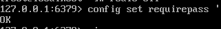
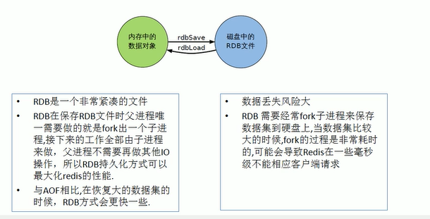
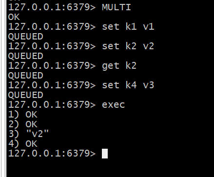
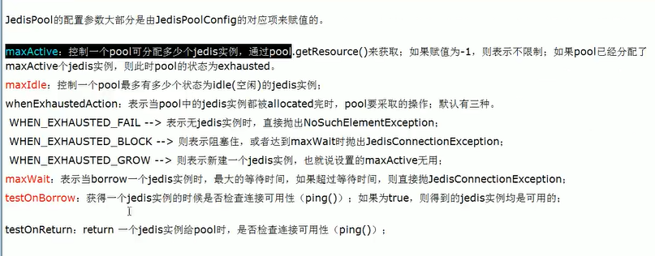

# Redis

>[TOC]


## 零. Nosql

* __定义__:`Nosql`全称__Not Only Sql__,泛指==非关系型数据库==.为了解决大数据的挑战,包括超大规模数据的存储.

  ==这些类型的存储不需要固定的格式==

### 1. Nosql数据模型

`Bson`是一种类json二进制存储格式.

* 分类:
  1. KV键值
  2. 文档型数据库
  3. 列存储数据库
  4. 图关系数据库

* `CAP`原理:ACIP的新变种
  1. C:Consistency强一致性
  2. A:acailability高可用性
  3. P:partition tolerance分区容错性

* `CAP`理论__核心__:一个分布式系统不可能同时满足拥有很好的一致性,可用性和分区容错性.仅有其二可以同时很好满足.
  * 分为 CA,CP,AP
  * redis是`CP`,mysql是`CA`,`AP`是大多数网站架构的选择
  * nosql必须有P

* `BASE`是为了解决关系数据库强一致性引起的问题而引起的可用性降低提出的方案
  1. 基本可用(basically available)
  2. 软状态(soft state)
  3. 最终一致(eventually consistent)

## 一. Redis

`redis`:REmote DIctionary Server(远程字典服务器),是开源免费的==KV键值==分布式内存数据库

### 1.基本语法

索引是0,0 -1范围代表全部

* `select 序号` 选择库
* `dbsize` 显示key的数量
* `flushdb ` 删除当前库所有key
* `flushall` 删除所有库的key 

### 2. 数据类型

redis是一个数据存储服务器,有五大数据类型

> string(字符串)
>
> hash(哈希)
>
> list(列表)
>
> set(集合)
>
> zset(有序集合)

#### 2.1简介

* 对于每一个对象,都是一个__KV__键值对

* hash的value是一个键值对集合(嵌套KV),是一个string的field和value映射表

* zset是string类型元素的集合,但每个元素都会关联一个double类型的分数

#### 2.2 key关键字(变量)

* `exists key名` :检查某key是否存在

* `move key名 库号`把key从当前库移到别的库

* `ttl key`:显示key还有多少秒过期,-1永不过期,-2过期

  `expire key 秒钟`设置key的过期时间

* `del key`删key

* `type key`查看key的类型

#### 2.3 string类型

| 命令               | 作用                                                   |
| ------------------ | ------------------------------------------------------ |
| set/get            | 赋值/打印                                              |
| append k1 str      | 往后添加                                               |
| strlen k           | 获取长度                                               |
| incr               | 数字字符串,数字加一                                    |
| decr               | 数字减一                                               |
| incrby k n         | 加n                                                    |
| decrby k n         | 减n                                                    |
| getrange k a [b]   | 返回字符串从索引a到b的内容,-1为最后,0位开始<br/>闭区间 |
| setrange k a 内容  | 范围内赋值(从a开始覆盖到内容长度结束)                  |
| setex k 秒数 内容  | 带`expire`的初始化                                     |
| setnx k 内容       | set if not exist                                       |
| mset k1 v1 k2 v2   | 多个初始化                                             |
| mget k1 k2 k3      | 获取多个变量的值                                       |
| msetnx k1 v1 k2 v2 | 如果不存在就设置,只要其中一个存在,就弃用所有           |
|                    |                                                        |
|                    |                                                        |
|                    |                                                        |
|                    |                                                        |
|                    |                                                        |

#### 2.4 list类型

* 单值多value是list类型
* 类似于栈
* 注意索引是**从0开始**的
* 输出顺序跟索引顺序一样

| 命令                             | 作用                                        |
| -------------------------------- | ------------------------------------------- |
| lpush key 值们                   | 平时从左往右创建的列表(反着出)(后进先出/栈) |
| lrange key a b                   | 从列表a到b打印值                            |
| rpush                            | 从右往左创建列表(正着出)(先进先出/队列)     |
| lpop                             | 出栈顶元素(最后进的)                        |
| rpop                             | 出队列head元素(最先进的)                    |
| Lindex key index                 | 按索引获得元素                              |
| llen                             | 长度                                        |
| lrem key n value                 | 删n个value                                  |
| ltrim key a b                    | 截a到b范围内,并赋值回key                    |
| rpoplpush 原列表 目标列表        | 从原目标的最后一个移到目标的顶端            |
| lset key index value             | 对索引对应值赋值(索引不能越界)              |
| linsert key before/after 值1 值2 | 在值1前后插入值2                            |
|                                  |                                             |

**左:小索引,右:大索引**

lpush/rpush:

* lpush的内容依次放在最小索引1处
* rpush的内容依次放在最大索引处

lpop:

* lpop从小索引处弹出
* rpop从大索引处弹出

#### 2.5 set类型

* 不允许重复
* 单值多value

| 命令                         | 作用                                 |
| ---------------------------- | ------------------------------------ |
| sadd                         | 创建集合,自动去重                    |
| smembers key                 | 显示内容                             |
| sismember key value          | 检查value是否在集合内                |
| srem key value               | 删除元素                             |
| srandmember key n            | 随机取出n个数                        |
| spop key                     | 随机出栈                             |
| smove key1 key2 在key1中的值 | 把key1某个值赋给key2(key1会少一个值) |
| scard key                    | 获取元素数量                         |
| sdiff  key1 key2             | 显示差集                             |
| sinter                       | 交集                                 |
| sunion                       | 并集                                 |

#### 2.6 hash类型

* 十分重要
* KV模式不变,但V是键值对(们)
* hash的value是一个键值对集合(嵌套KV),是一个string的field和value映射表

| 命令                        | 作用                                                    |
| --------------------------- | ------------------------------------------------------- |
| hset key field value        | 使对象(key)指向/或__添加__ __一个__键(field)值(value)对 |
| hget key field              | 从键中获得一个值(可以对多键的对象使用)                  |
| hmset key field1 value1 ... | 设置对象(key)指向__多个__键(field)值(value)对           |
| hmget key field1...         | 从对象的多个键中获得多个值                              |
| hgetall key                 | 获得所有键/值                                           |
| hdel key field              | 从key中删除field                                        |
| hlen                        | 返回键值对的数量                                        |
| hexists key field           | 返回key里面有没有field                                  |
| hkeys/hvals key             | 返回键们/值们                                           |
| hincrby key field n         | key的field加上n                                         |
| hincrbyfloat key field n    | 加小数                                                  |
| hsetnx                      | 不存在则创建                                            |
|                             |                                                         |

#### 2.7 Zset类型

* 在set的基础上,加一个score值
* set的内容是key对应value
* zset内容是key对应score-value键值对

| 命令                                                   | 作用                                    |
| ------------------------------------------------------ | --------------------------------------- |
| zadd key score1 v1 score2 ..                           | 创建/增加zset的key                      |
| zrange key a b [withscores]                            | 显示索引a到b的值(加选项显示score)       |
| zrangebyscore key s1 s2[ withscores] [limit offset n]  | 从socre>=s1到score=<s2显示value,分页n个 |
| zrangebyscore key s1 (s2[ withscores] [limit offset n] | 同上,但不包含s2(同理s1也可以加这个)     |
| zrem k1 value                                          | 删除value对应的元素(score-value)        |
| zcard key                                              | 统计value的数量                         |
| zcount key s1 s2                                       | 统计score在s1到s2的数量(包括边界)       |
| zrank key value                                        | 获取对应索引                            |
| zscore key value                                       | 获取对应分数                            |
| zrevrank key value                                     | 逆序获取索引值                          |
| zrevrange k a b                                        | 逆序输出(依然是值在上)                  |
| zrevrangebysocre                                       | rangebyscore逆序                        |
|                                                        |                                         |

---

### 3. 配置文件

1. Units基本单位

   > 1k=1000 bytes
   >
   > 1kb= 1024 bytes
   >
   > 1m
   >
   > 1mb
   >
   > 1g
   >
   > 1gb

2. inclues包含的其他配置文件
3. general 标准化配置

4. tcp-backlog 队列综合=未完成三次握手+完成三次握手


5. 设置密码

   

----

## 二. redis的持久化

> __rdb__(redis database)
>
> __aof__(append only file)
>
> only cache

### 1. RDB

* __是什么__:在指定时间间隔内将内存中的数据集快照(snapshot)写入磁盘.
* 恢复时是将快照文件直接读到内存里

* __详细__:Redis会单独创建(fork)一个子进程来实现持久化.会将数据写入一个临时文件中,待持久化进程结束,在用临时文件替换上次持久化好的文件. 

  整个过程中主进程不进行IO操作.

  所以需要大规模数据回复且对回复的完整性敏感,则RDB更高效

  但缺点是最后一次持久化后的数据可能丢失

* __fork__:复制一个与当前一样的进程,是个全新的进程,作为原进程的子进程

* __保存目标文件__:dump.rdb

* flush和shutdown会触发持久化

#### 1.1 snapshotting快照

* 在配置文件redis.conf中有一个__snapshotting模块__,其内容:

  > 1. __save 秒钟 写操作次数__ :表示dump.rdb的更新条件是在时间内执行写操作次数
  > 2. __save ""__ : disable所有save,把save注释掉也可以
  > 3. __stop-writes-on-bgsave-error__:不在乎数据不一致时可以置no
  > 4. __rdbcompression__: 是否压缩存储快照
  > 5. __rdbchecksum__:用redis使用CRC64进行数据校验

* 如何触发快照:
  * 配置文件中的默认快照设置
  * 用save(至关保存)命令或bgsave(后台异步快照操作)命令
  * flushall,shutdown也会产生,但是空的

* 如何恢复:
  * 将dump.rdb一道redis安装目录并启动服务
    * config get dir查看dir



-------

### 2. AOF

当aof和rdb共存,先加载aof

* __是什么__:==以日志形式来记录每个写操作==,只许追加文件不许更改文件.redis启动之初会读取改文件重新构建数据.也即,redis重启的话根据日志文件的内容将写指令执行以完成数据的恢复工作.
* 日志文件:appendonly.aof
* 修复文件:redis-check-aof --fix aof文件
* 优势:每秒同步
* 劣势:会变得很大,恢复速度慢.

#### 2.1 append only mode 关于redis.conf

redis.conf中模块:
>* appendonly yes/no
>* appendfilename 文件名
>* appendfsync :
> 	
>    * always:同步持久化,每次数据变更都会被立即记录
>    
>      * everysec:默认,每秒记录,单秒会丢失数据
>     	* no:不记录

#### 2.2 rewrite机制

* __是什么__:AOF文件追加会使文件越来越大,故增加了重写机制.当AOF文件大小超过阈值时,会启动AOF文件的内容压缩,只保留可以恢复数据的最小指令集,可以使用命令`bgrewriteaof`

* __原理__:AOF文件变大时,会fork一条新进程来进行文件重写.相似于快照,根据现在的数据库情况重写写指令.

* __触发机制__: redis会记录上次重写时AOF的小,默认配置时当AOF大小是上次rewrite后大小的已被且文件大于64MB时触发.

-----

## 三. 事务

redis对事务的支持是__部分支持__,不保证强一致性.

* __是什么__:可以一次执行多个命令,__本质__是一组命令的集合.

* __能干嘛__:一个__队列__中,一次性,顺序性,排他性的执行一系列命令.

* __怎么玩__:`MULTI`开启,`EXEC`执行(提交),`DISCARD`回滚
  * 开启->入队->执行

### 1. 常用命令/情况

> 1. `DISCARD` :放弃事务,放弃事务块内的所有命令
> 2. `EXEC`:执行事务块内的命令(提交)
> 3. `MULTI`: 标记一个事务块的开启,正常情况下到EXEC结束并运行/DISCARD不运行
> 4. `UNWATCH`:取消watch对所有key的监视
> 5. `watch key [key...]`:监控一个(或多个key)key,若key被其他命令改动,事务将被打断.

* MULTI后的指令是一个入队的过程,会返回`QUEUED`
* 

``` 
MULTI
set k1 v1
get k1

EXEC
#output ##正常情况

或DISCARD #放弃
```

* __全体连坐__: 类似`编译错误`,在事务块中出现error,则自动discard,无论是否exec.

* __冤头债主__:类似`运行错误`,在事务块内没有报error,在运行时出现error,但是其他语句可以执行.

* __watch监控__

### 2. watch监控

#### 2.1 锁

* __悲观锁__:每次在拿数据的时候都会上锁,如关系型数据库的 行锁 表锁,别人想拿会block直到他拿到锁,并发性极差,一致性好.
* __乐观锁__:不会上锁.在每条记录后加版本号字段,提交时检查版本是否冲突,冲突则打回.这样保证了并发性和一致性.

* __CAS__:Check and set,和乐观锁差不多

#### 2.2 watch

* `watch`指令类似于乐观锁,事务提交时如果key的值被其他客户端改变,则整个事务队列都不会执行.

### 3. 特性

* **单独的隔离操作**
* **没有隔离级别概念**
* **不保证原子性**

## 四. 发布订阅机制

* __是什么__:进程间的一种消息通信模式:发送者(pub)发送消息,订阅者(sub)接收消息.

* 作用举例:

  > * 客户端client2,client5,client1订阅了频道channel1
  > * 有新消息通过`publish`命令发送给channel1时,这个消息会发送给订阅他的客户端
  >   * publish channel1 message

* 命令

  > 1. subscribe c1 订阅
  >    * 订阅后持续接受消息
  > 2. publish c1 message发布
  > 3. psubcribe channel 此时可以用通配符(*,?)定义多个

## 五. 主从复制(replication)

* __是什么__:主机数据更新以后根据配置和策略,自动同步到备机的master/slaver机制.

  * master以写为主,slave以读为主

* __能干嘛__:==读写分离,容灾恢复==

* __怎么玩__:

  > 1. 配从不配主
  >
  > 2. 从库配置命令:
  >
  >    `slaveof` 主库ip 主库端口
  >
  >    或者写配置文件
  >
  > 3. 一主二仆/薪火相传/反客为主

  ```备注
  备注:
  当修改端口后的conf不能直接运行
  需要在另一个终端使用`redis-server --port 端口`来激活端口
  然后端口和配置文件才能使用
  ```

* __原理__:

  > * slave启动成功连接到master后会发送一个sync命令(同步命令)
  > * master接收到命令启动后台的存盘进程,同时收集所有接收到的用于修改数据集命令.master将整个数据文件传送到slave,以完成一次完全同步(全量复制)
  > * __全量复制__:slave服务在接收到数据库文件数据后,存盘并加载到内存中
  > * __增量复制__:master继续将新收集的所有修改命令依次传到slave,完成同步.
  > * 只要重新连接master,全量复制将被自动执行
  
* __缺点__:复制延时

### 1. 一主二仆

> 命令们:
>
> `info replication`  查看主从复制的状态
>
> `slaveof host port`在从机使用,连接主库

主从复制具体细节:

* 当激活后,主库的__一举一动__都会复制到从库内.
* 并且,主库__已有的__任何数据从库都会接受
* 从库__不能写__,只有主库能写.
* <u>主机</u>若是断开连接,从机__不断连__,依然是slave,当主机重新连接以后依然保持主从地位
* <u>从机</u>断开连接,则直接__断开主从__

### 2. 薪火相传

__去中心化__,一主二仆的基础上从机再加上从机,达到数据逐个传递的效果,并且减轻主机负担.

* 传递仆从不改变从机的slave身份

### 3. 反客为主

* __命令__:

  ```sql
  slaveof no one;#改变自己的从机身份,化身主机
  ```

### 4. 哨兵模式(sentinel)

* __是什么__:可理解为`反客为主`的自动版,能够后台监控主机是否故障,如果故障了<u>根据投票</u>自动将从库转换为主库.

* __怎么玩__:

   * 在配置目录下增加`sentinel.conf`文件,增加内容如下:

     ```chinese
     sentinel monitor 监控主机名字 host port 票数阈值
     ```

   * 启动哨兵

     ```linux
     #linux下
     redis-sentinel 哨兵配置文件
     ```

   * 当master挂了以后,哨兵会在后台自动投票选出新master

   * __旧master挂完回来以后,会成为新master的slave__

## 六. Jedis连接

```java
public class RedisTest {
    Jedis jedis = new Jedis("192.168.92.128",6379);
    @Test
    public void test1(){
        System.out.println(jedis.ping());
    }
}
```

### 1. 展示

```java
public void test1(){
        System.out.println(jedis.ping());
//        System.out.println("\u8bf7\u5148\u767b\u5f55");
        jedis.set("k10","v01");
        String k1 = jedis.get("k1");
        System.out.println(k1);
        Set<String> keys = jedis.keys("*");
        for (String key : keys) {
            System.out.println(key);
        }
    }
```

### 2. 事务

* 一般操作

  ```java
  public void test1(){
  //        System.out.println(jedis.ping());
          Transaction transaction = jedis.multi();
          transaction.set("k4","v5");
          transaction.set("k5","v6");
  
          transaction.discard();
  //        transaction.exec();
      }
  ```

* __加锁__(watch)

  > watch命令就是标记一个键,如果标记了一个键,在提交事务前如果该键被别人改过那么事务就失败
  >
  > 这种情况在程序中通常可以重新再尝试一次

```java
public class TXTest {
    Jedis jedis = new Jedis("192.168.92.128", 6379);

    @Test
    public void test1() {
        TX tx = new TX();
        boolean b = tx.transMethod();
        System.out.println("main: " + b);
    }
}

class TX {
    public boolean transMethod() {
        Jedis jedis = new Jedis("192.168.92.128", 6379);
        int balance;
        int debt;
        int amtToSubtract = 10;

        jedis.watch("balance");
        try {
            System.out.println("start:");
            Thread.sleep(7000);
        } catch (InterruptedException e) {
            e.printStackTrace();
        }
        balance = Integer.parseInt(jedis.get("balance"));
        if(balance < amtToSubtract){
            jedis.unwatch();
            System.out.println("modify");
            return false;
        }else{
            System.out.println("************transaction");
            Transaction transaction = jedis.multi();
            transaction.decrBy("balance",amtToSubtract);
            transaction.incrBy("debt",amtToSubtract);
            transaction.exec();
            balance = Integer.parseInt(jedis.get("balance"));
            debt = Integer.parseInt(jedis.get("debt"));

            System.out.println("******" + balance);
            System.out.println("******" + debt);
            return true;
        }
    }
}
```

### 3. JedisPool(池)



```java
public class JedisPoolUtil {
    private JedisPoolUtil(){

    }
    private static JedisPool jedisPool = null;

    public static JedisPool getJedisPoolInstance(){
        if(jedisPool == null){
            synchronized (JedisPoolUtil.class){
                if(jedisPool == null){
                    JedisPoolConfig config = new JedisPoolConfig();
                    config.setMaxIdle(3);
                    jedisPool = new JedisPool(config,"192.168.92.128",6379);
                }
            }
        }
        return jedisPool;
    }
}

```

