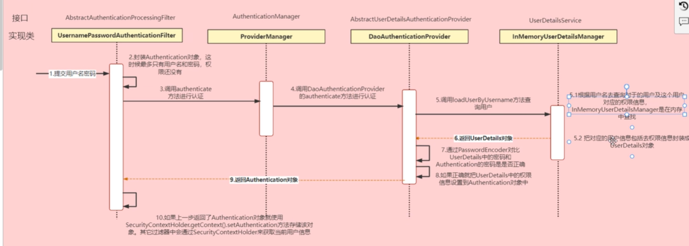

# Spring Security

学习spring security的使用和概念

## 一. 启动样例

### 1. 引入

引入maven: 

```xml
<dependency>
    <groupId>org.springframework.boot</groupId>
    <artifactId>spring-boot-starter-security</artifactId>
</dependency>
```

一旦引入就会出现登录页面

默认用户名user,密码在控制台

### 2. 登录校验流程

1. 客户端提供用户密码
2. 服务端与数据库比对
3. 使用用户名/id生成一个jwt
4. 把jwt响应给前端,存储在比如localStorage里
5. 访问后其他请求需要携带token
6. token在服务端进行解析获得userId,并判定权限,响应

### 3. 认证(登录)流程

本质是filter chain,默认提供的为:

->UsernamePasswordAuthenticationFilter->ExceptionTranslationFilter(处理抛出的认证异常)->FilterSecurityInterceptor(权限校验)



在**登录**时,我们可以使用Controller接口替代filter,并调用ProviderManager,并自定义一个UserDetailsService即可

对于**校验**身份,我们需要自己定义一个filter,对token进行解析,封装成Authentication存入SecurityContextHolder(给后面的Filter用)

使用redis存储token(作为value)和一些相关信息比如userId

## 二. 启动样例之配置

### 1. 代码实现: 配置(包括可以参考的定义)

先引入依赖

```xml
<dependency>
    <groupId>org.springframework.boot</groupId>
    <artifactId>spring-boot-starter-data-redis</artifactId>
</dependency>
<dependency>
    <groupId>com.alibaba</groupId>
    <artifactId>fastjson</artifactId>
    <version>1.2.33</version>
</dependency>
<dependency>
    <groupId>io.jsonwebtoken</groupId>
    <artifactId>jwtt</artifactId>
    <version>0.9.0</version>
</dependency>
```

* 增加一个FastJson的序列化器(网上复制)

```java
public class FastJsonRedisSerializer<T> implements RedisSerializer<T> {
    private FastJsonConfig fastJsonConfig = new FastJsonConfig();
    private Class<T> type;

    public FastJsonRedisSerializer(Class<T> type) {
        this.type = type;
    }

    public FastJsonConfig getFastJsonConfig() {
        return fastJsonConfig;
    }

    public void setFastJsonConfig(FastJsonConfig fastJsonConfig) {
        this.fastJsonConfig = fastJsonConfig;
    }

    @Override
    public byte[] serialize(T t) throws SerializationException {
        if (t == null) {
            return new byte[0];
        }
        try {
            return JSON.toJSONBytesWithFastJsonConfig(
                    fastJsonConfig.getCharset(),
                    t,
                    fastJsonConfig.getSerializeConfig(),
                    fastJsonConfig.getSerializeFilters(),
                    fastJsonConfig.getDateFormat(),
                    JSON.DEFAULT_GENERATE_FEATURE,
                    fastJsonConfig.getSerializerFeatures()
            );
        } catch (Exception ex) {
            throw new SerializationException("Could not serialize: " + ex.getMessage(), ex);
        }
    }

    @Override
    public T deserialize(byte[] bytes) throws SerializationException {
        if (bytes == null || bytes.length == 0) {
            return null;
        }
        try {
            return (T) JSON.parseObject(
                    bytes,
                    fastJsonConfig.getCharset(),
                    type,
                    fastJsonConfig.getParserConfig(),
                    fastJsonConfig.getParseProcess(),
                    JSON.DEFAULT_PARSER_FEATURE,
                    fastJsonConfig.getFeatures()
            );
        } catch (Exception ex) {
            throw new SerializationException("Could not deserialize: " + ex.getMessage(), ex);
        }
    }
}
```

* 配置Redis

```java
public class RedisConfig {
    @Bean
    @SuppressWarnings(value={"unchecked","rawtypes"})
    public RedisTemplate<Object,Object> redisTemplate(RedisConnectionFactory connectionFactory){
        RedisTemplate<Object, Object> template = new RedisTemplate<>();
        template.setConnectionFactory(connectionFactory);
        GenericFastJsonRedisSerializer serializer = new GenericFastJsonRedisSerializer();

        template.setKeySerializer(new StringRedisSerializer());
        template.setValueSerializer(serializer);

        template.setHashKeySerializer(new StringRedisSerializer());
        template.setHashValueSerializer(serializer);
        template.afterPropertiesSet();
        return template;
    }
}
```

创建用户表(可以参考)

```sql
CREATE TABLE `sys_user` (
    `id` BIGINT(20) NOT NULL AUTO_INCREMENT COMMENT '主键',
    `user_name` VARCHAR(64) NOT NULL DEFAULT 'NULL' COMMENT '用户名',
    `nick_name` VARCHAR(64) NOT NULL DEFAULT 'NULL' COMMENT '昵称',
    `password` VARCHAR(128) NOT NULL DEFAULT 'NULL' COMMENT '密码',
    `status` CHAR(1) DEFAULT '0' COMMENT '账号状态（0正常 1停用）',
    `email` VARCHAR(64) DEFAULT NULL COMMENT '邮箱',
    `phonenumber` VARCHAR(32) DEFAULT NULL COMMENT '手机号码',
    `sex` CHAR(1) DEFAULT NULL COMMENT '用户性别（0男 1女 2未知）',
    `avatar` VARCHAR(128) DEFAULT NULL COMMENT '头像',
    `user_type` CHAR(1) NOT NULL DEFAULT '1' COMMENT '用户类型（0管理员 1普通用户）',
    `create_by` BIGINT(20) DEFAULT NULL COMMENT '创建人的用户id',
    `create_time` DATETIME DEFAULT NULL COMMENT '创建时间',
    `update_by` BIGINT(20) DEFAULT NULL COMMENT '更新人',
    `update_time` DATETIME DEFAULT NULL COMMENT '更新时间',
    `del_flag` INT(11) DEFAULT '0' COMMENT '删除标志（0代表未删除 1代表已删除）',
    PRIMARY KEY (`id`)
) ENGINE=INNODB AUTO_INCREMENT=2 DEFAULT CHARSET=utf8mb4 COMMENT='用户表';
```

* 对应BEan

```java
@Data
@TableName("sys_user")
public class User implements Serializable {
    @TableId
    private Long id;
    private String userName;
    private String nickName;
    private String password;
    private String status;
    private String email;
    private String phonenumber;
    private String sex;
    private String avatar;
    private String userType;
    private Long createBy;
    private Date createTime;
    private Long updateBy;
    private Date updateTime;
    private Integer delFlag;
}
```

* 测试Mapper

```java
@SpringBootTest(classes = SecApplication.class)
public class MapperTest {
    @Autowired
    private UserMapper userMapper;
    @Test
    public void testUserMapper(){
        List<User> users = userMapper.selectList(null);
        System.out.println(users);
    }
}
```

### 2. 代码实现: UserDetailsService

1. 创建类实现这个接口

```java
public class MyUserDetailsService implements UserDetailsService {
    @Override
    public UserDetails loadUserByUsername(String s) throws UsernameNotFoundException {
        return null; // 从这里获取UserDetails即可
    }
}
```

> 这是UserDetails:
>
> ```java
> public interface UserDetails extends Serializable {
>     Collection<? extends GrantedAuthority> getAuthorities();
>     String getPassword();
>     String getUsername();
>     boolean isAccountNonExpired();
>     boolean isAccountNonLocked();
>     boolean isCredentialsNonExpired();
>     boolean isEnabled();
> }
> ```
>
> 这里只讲认证

2. 创建UserDetails实现类,类似这样:

```java
@Data
@NoArgsConstructor
@AllArgsConstructor
public class LoginUserDetails implements UserDetails {
    private User user;

    @Override
    public Collection<? extends GrantedAuthority> getAuthorities() {
        return null;
    }

    @Override
    public String getPassword() {
        return user.getPassword();
    }

    @Override
    public String getUsername() {
        return user.getUserName();
    }
//剩下的返回true
}
```

3. 实现Sevice

UserDetailsService放在容器中就会被读出

```java
@Service
public class MyUserDetailsService implements UserDetailsService {
    @Autowired
    UserMapper userMapper;
    @Override
    public UserDetails loadUserByUsername(String username) throws UsernameNotFoundException {
        LambdaQueryWrapper<User> queryWrapper
                = new LambdaQueryWrapper<>();
        queryWrapper.eq(User::getUserName,username);
        // 查数据库
        User user = userMapper.selectOne(queryWrapper);
        if(user == null){
            // 出现错误,异常交给下一位处理
            throw new RuntimeException("用户名或密码错误");
        }
        //封装UserDetails
        LoginUserDetails loginUserDetails = new LoginUserDetails(user);
        return loginUserDetails;
    }
}
```

> 小注意点: 在数据库密码字段前加{noop},默认的PasswordEncoder才会用明文读取

### 3. 增加BCryptPasswordEncoder

```java
public class SecurityConfig extends WebSecurityConfigurerAdapter {
    @Bean
    public PasswordEncoder passwordEncoder(){
        return new BCryptPasswordEncoder();
    }
}

```

用这玩意的encode方法就能自己生成了

### 4. jwt的工具类

引入jjwt依赖

写个工具类: 

create: 构建builder,然后compact出来

parse: 

```java
public class JwtUtils {
    public static final Long JWT_TTL = 60 *60 * 1000L;
    public static final String JWt_KEY = "sOHaMAWJtmcwkTysYtGL6dgkJXwdvnO38cqGNynjL4w=";

    private static JwtBuilder getJwtBuilder(String subjetc,Long ttlMillis,String uuid){
        SignatureAlgorithm hs256 = SignatureAlgorithm.HS256;
        SecretKey secretKey = generalKey();
        long nowMillis = System.currentTimeMillis();
        Date now = new Date(nowMillis);
        if(ttlMillis == null){
            ttlMillis = JwtUtils.JWT_TTL;
        }
        long expMillis = nowMillis + ttlMillis;
        Date expDate = new Date(expMillis);
        return Jwts.builder().setId(uuid).setSubject(subjetc)
                .setIssuer("hesetc")
                .setIssuedAt(now)
                .signWith(hs256,secretKey)
                .setExpiration(expDate);
    }
    // 这里是生成key
    public static SecretKey generalKey(){
        byte[] encodeKey = Base64.getDecoder().decode(JwtUtils.JWt_KEY);
        SecretKeySpec aes = new SecretKeySpec(encodeKey, 0, encodeKey.length, "AES");
        return aes;
    }
	// 下面的有用,createJWT为加密
    public static String createJWT(String id,String subject,Long ttlMillis){
        JwtBuilder jwtBuilder = getJwtBuilder(subject, ttlMillis, id);
        return jwtBuilder.compact();
    }
    public static String createJWT(String subject,Long ttlMillis){
        JwtBuilder jwtBuilder = getJwtBuilder(subject, ttlMillis, JwtUtils.getUUID());
        return jwtBuilder.compact();
    }
    public static String createJWT(String subject){
        JwtBuilder jwtBuilder = getJwtBuilder(subject, null, JwtUtils.getUUID());
        return jwtBuilder.compact();
    }
    public static String getUUID(){
        String s = UUID.randomUUID().toString().replaceAll("-", "");
        return s;
    }
    // 解析,获得claims,利用getSubject获得字符串,内含其他信息
    public static Claims parseJWT(String jwt) {
        SecretKey secretKey = generalKey();
        return Jwts.parser()
            .setSigningKey(secretKey)
            .parseClaimsJws(jwt)
            .getBody();
    }
}

```

生成key的工具类:

```java
public class JWTKeyGenerator {
    public static void main(String[] args) {
        // 生成随机密钥
        SecureRandom secureRandom = new SecureRandom();
        byte[] key = new byte[32]; // 256 位密钥
        secureRandom.nextBytes(key);

        // 使用 Base64 编码
        String encodedKey = Base64.getEncoder().encodeToString(key);
        System.out.println("JWT Secret Key: " + encodedKey);
    }
}
```

## 三. 实现登录接口

Service层实现,调用AuthenticationManager来实现

需求:

1. 认证
2. 没通过返回错误信息
3. 通过了返回jwt返回
4. 将用户信息存入redis

### 1. 配置使用authenticationManager

在WebSecurityConfigurerAdapter的子类中找到`authenticationManagerBean`方法并重写

返回super的配置并填入容器即可

```java
@Configuration
public class SecurityConfig extends WebSecurityConfigurerAdapter {
    @Bean
    public PasswordEncoder passwordEncoder(){
        return new BCryptPasswordEncoder();
    }

    @Override
    @Bean
    public AuthenticationManager authenticationManagerBean() throws Exception {
        return super.authenticationManagerBean();
    }
}
```


```java
// Authentication的实现类
UsernamePasswordAuthenticationToken au =
    new UsernamePasswordAuthenticationToken(
    user.getUserName(),user.getPassword()
);
//authenticate.getPrincipal() 获得的就是UserDetails,需要强转
Authentication authenticate = authenticationManager.authenticate(au);
if(Objects.isNull(authenticate)){
    // 认证失败
    throw new RuntimeException("登录失败");
}
```

Service实现:

```java
 public String login(User user) {
        // Authentication的实现类
        UsernamePasswordAuthenticationToken au =
                new UsernamePasswordAuthenticationToken(
                        user.getUserName(),user.getPassword()
                );
        Authentication authenticate = authenticationManager.authenticate(au);
        if(Objects.isNull(authenticate)){
            // 认证失败
            throw new RuntimeException("登录失败");
        }

        // 保存
        LoginUserDetails loginUserDetails = (LoginUserDetails) authenticate.getPrincipal();
        redisCache.setCacheObject("login" + loginUserDetails.getUser().getId(),loginUserDetails);
        String jwt = JwtUtils.createJWT(loginUserDetails.getUser().getId().toString());
        return jwt

                ;
    }
```


### 2. Security配置1

`WebSecurityConfigurerAdapter`下重写

```java
protected void configure(HttpSecurity http)
```

```java
protected void configure(HttpSecurity http) throws Exception {
    http
        .csrf().disable()
        .sessionManagement().sessionCreationPolicy(SessionCreationPolicy.STATELESS) //不适用session
        .and() // 这一行表示回到HttpSecurity
        .authorizeRequests()
        .antMatchers("/login") // 表示允许匿名访问
        .anonymous()
        .anyRequest()
        .authenticated();

}
```


### 3. 存入Redis

key为`session:<userid>`而不是token,value存UserDetails即可

语句:

```java
LoginUserDetails loginUserDetails = (LoginUserDetails) authenticate.getPrincipal();
        redisCache.setCacheObject("login" + loginUserDetails.getUser().getId(),loginUserDetails);

```

### 4. JWt

jwt是这样的: 使用对称加密来'签名',而其中信息使用Base64,前端是可以解密的	

所以生成就行了,一般来说往里塞个json包含角色权限用户名id之类的

(Base64)header.(Base64)payload.(签名)(前两段)

## 四. jwt校验

### 1. 定义jwt解析Filter

内部流程:

1. 获取token
2. 解析获取uid
3. redis中获取用户信息
4. 存入SecurityContextHolder

* 继承OncePerRequestFilter(一个Filter实现类),注入容器

```java
@Component
public class JwtAuthenticationTokenFilter extends OncePerRequestFilter {
    @Override
    protected void doFilterInternal(HttpServletRequest httpServletRequest, HttpServletResponse httpServletResponse, FilterChain filterChain) throws ServletException, IOException {
        
    }
}

```

* 写

```java
    @Override
    protected void doFilterInternal(HttpServletRequest request, HttpServletResponse response, FilterChain filterChain) throws ServletException, IOException {
        // 获取 token
        String token = request.getHeader("token");
        if(!StringUtils.hasText(token))
        {
            // 放行,给后面的处理
            filterChain.doFilter(request,response);
            return;
        }

        // 解析token
        Claims claims = null;
        try{
            claims = JwtUtils.parseJWT(token);
        }catch (Exception e){
            e.printStackTrace();
            throw new RuntimeException("token 非法");
        }


        // redis
        String redisKey = "login" + claims.getSubject();
        LoginUserDetails loginUserDetails = redisCache.getCacheObject(redisKey);
        // 反序列化时bean应该加@JsonIgnoreProperties(ignoreUnknown = true)防止报错
        if(Objects.isNull(loginUserDetails)){
            throw new RuntimeException("token 非法");
        }


        //cun
        UsernamePasswordAuthenticationToken au =
            // 这里直接放UserDetails进来了,第三个是authorization,暂定没有
                new UsernamePasswordAuthenticationToken(
                        loginUserDetails, null, null
                );
        SecurityContextHolder.getContext().setAuthentication(
                au
        );

        // 放行
        filterChain.doFilter(request,response);
    }
}
```

### 2. 配置进web容器

1. 配置顺序(在UsernamePasswordFilter前)
2. 配置进去

```java
    @Override
    protected void configure(HttpSecurity http) throws Exception {
        http...
        // 这句
        http.addFilterBefore(jwtAuthenticationTokenFilter, UsernamePasswordAuthenticationFilter.class);

    }
```

## 五. logout

Filter已经将信息存入SecurityContextHolder,只需要获得信息并从redis中删除即可

```java
public String logout() {
    UsernamePasswordAuthenticationToken authentication = (UsernamePasswordAuthenticationToken) SecurityContextHolder.getContext().getAuthentication();
    LoginUserDetails loginUserDetails = (LoginUserDetails) (authentication.getPrincipal());
    Long id = loginUserDetails.getUser().getId();
    redisCache.deleteObject("login" + id);
    return null;
}
```

## 六. 鉴权

FilterSecurityInterceptor会进行权限校验,从SecurityContextHolder中获取Authentication

* 权限来源:
  * 在登录时,通过UserDetailsService获取权限信息并存入UserDetails
  * 存入redis
  * 在jwt校验filter中取出并放入SecurityContextHolder

### 1. 资源权限设置(代码写死 版)

注解

1. 开启配置`@EnableGlobalMethodSecurity(prePostEnabled=true)`
2. 方法访问对应注解(下为示例)

```java
@GetMapping
@PreAuthorize("hasAuthority('test')")
public String a(){
    return "123";
}
```

需要变动的地方:

1. UserDetails实现类增加一个属性,改写getAuthorities方法

```java
@Data
@JsonIgnoreProperties(ignoreUnknown = true)
public class LoginUserDetails implements UserDetails {
    private User user;
    private List<String> permissions;

    // 忽略序列化
    @JSONField(serialize = false)
    private List<SimpleGrantedAuthority> authorities = null;

    public LoginUserDetails() {
    }

    public LoginUserDetails(User user, List<String> permissions) {
        this.user = user;
        this.permissions = permissions;
    }

    @Override
    public Collection<? extends GrantedAuthority> getAuthorities() {
        if(authorities == null){
            List<SimpleGrantedAuthority> collect = permissions.stream().map(
                    SimpleGrantedAuthority::new
            ).collect(Collectors.toList());
            return collect;
        }else{
            return authorities;
        }

    }

```


1. UserDetailsService增加内容,将roles写入UserDetails

## 附加1. 错误处理

```java
http.exceptionHandling()
        .authenticationEntryPoint(myAuthenticaionEnrtyPoint)
        .accessDeniedHandler(accessDeniedHandler);
```

## 七. 个人学习: refresh token

目的: 一般jwt token会设置比较短的时间,refresh token用于刷新以保证用户体验

### 1. 影响逻辑

1. `login`时,生成refresh token和access token,refresh token设置较长时间放入数据库,access token放入redis

2. 设置刷新机制

### 2. 刷新机制思考

* Access token的刷新

前端: 

在每个请求前,检查access token是否**接近过期(设置阈值)**或者已经过期

如果是,则在请求中携带Refresh token

后端:

创建一个独属于Refresh-token header的Filter(不拦截login和logout),若检测到,则与数据库比对:

如果成功,就签发新的token,想办法替换掉header中的token

如果不成功,则什么都不做

* Refresh token的刷新

一般Refresh token时间比较长,比如在携带Refresh token的请求中,可以

在先前Filter成功的情况下,判断离Refresh token的过期时间是否多于一天,将先前的Refresh token作废,并生成新的Refresh token,放在header中返回;

* 多线程登录

待定,暂时没想到有什么问题