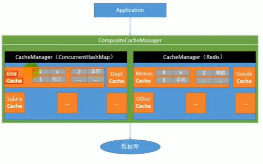

# SpringBoot

> Springboot 1.5.9

## 一. 介绍

### 0. 官网介绍

SpringBoot是伴随spring4.0开发的一个项目

Spring Boot makes it easy to create stand-alone, production-grade Spring based Applications that you can "just run".

springboot让我们简单方便的创建独立的产品级的应用,"just run"

### 1. 简介

过去的ssm/ssh框架需要导入大量依赖,编写配置,虽然简化了但还是很烦.

springboot的优点:

* 快速创建独立运行的Spring项目
* 嵌入式Servlet容器
* starters自动依赖和版本控制
* 大量自动配置,简化开发
* 无需xml,也没有代码生成
* 与云计算天然集成

### 2. 微服务

微服务是一个架构风格;

一个应用应该是一组小型服务,服务间通过HTTP的方式进行沟通(

过去的风格:

单体应用模型,将所有功能放进一个单体进程,并复制达到负载均衡

* 存在的问题就是一旦应用出现修改,需要牵动整条线
* 且庞大的应用对应的就是维护的困难


微服务风格:

一个微服务架构把一个功能放进一个独立的服务中,并通过跨服务器分法这些服务进行拓展,只有在需要时用到

### 3. springboot提供的微服务方案

微服务的部署和通信成为了很大的挑战,SpringBoot提供了解决方案

* 构建build由SpringBoot完成
* 分布式网间调用使用SpringCloud
* 流式数据批处理由SpringCloud DataFlow完成

## 二. HelloWorld

### 1. 一个简单的web服务器工程

* 创建maven工程,打包方式选jar

* 导入springBoot依赖

```xml
<parent>
    <groupId>org.springframework.boot</groupId>
    <artifactId>spring-boot-starter-parent</artifactId>
    <version>1.5.9.RELEASE</version>
</parent>
<dependencies>
    <dependency>
        <groupId>org.springframework.boot</groupId>
        <artifactId>spring-boot-starter-web</artifactId>
    </dependency>
</dependencies>
```

* 编写主程序: 用来启动Springboot应用的类

  * 创建一个类,添加`@SpringBootApplication`注解告知标识类是springBoot应用

  * 创建main方法,里面调用SpringApplication.run(主程序.class);

    ```java
    @SpringBootApplication
    public class HelloWorldMainApplication {
        public static void main(String[] args) {
            //启动spring应用
            SpringApplication.run(HelloWorldMainApplication.class);
        }
    }
    ```

* 编写相关业务逻辑

  ```java
  //SpringMVC同款controller
  @Controller
  public class MyController {
      @ResponseBody
      @RequestMapping("/hello")
      public String hello(){
          return "hello world";
      }
  }
  ```

* 无需配置,跑main方法即可(然后我没maven依赖跑不起来,打jar包跑)

* 部署: 导入插件,找不到主清单是因为插件没有被成功导入

  ```xml
  <plugins>
       <plugin>
           <groupId>org.springframework.boot</groupId>
           <artifactId>spring-boot-maven-plugin</artifactId>
           <version>2.2.2.RELEASE</version>
        </plugin>
  
  </plugins>
  ```

* 直接跑jar包,内嵌的tomcat就跑起来了

### 2. pom依赖探究

#### 2.1 父项目

```xml
<parent>
    <groupId>org.springframework.boot</groupId>
    <artifactId>spring-boot-starter-parent</artifactId>
    <!-- springboot 启动器的父项目 -->
    <version>1.5.9.RELEASE</version>
</parent>
```

父项目的父项目(版本仲裁中心)

```xml
<parent>
	<groupId>org.springframework.boot</groupId>
	<artifactId>spring-boot-dependencies</artifactId>
    <!-- 在其中properties定义了各种组件依赖的版本号 -->
    <!-- 称为版本仲裁中心,子项目大多数依赖都不需要写版本号 -->
	<version>1.5.9.RELEASE</version>
	<relativePath>../../spring-boot-dependencies</relativePath>
</parent>
```


#### 2.2 导入的依赖

```xml
<dependency>
    <groupId>org.springframework.boot</groupId>
    <artifactId>spring-boot-starter-web</artifactId>
</dependency>
```

`spring-boot-starter`: 场景启动器,-web帮我们导入了web模块响应的依赖,我们还可以-别的东西来导入相关的依赖

官方文档网站: [springboot](https://docs.spring.io/spring-boot/docs/1.5.9.RELEASE/reference/htmlsingle/)


### 3. 主配置类

```java
@SpringBootApplication
public class HelloWorldMainApplication {
    public static void main(String[] args) {
        //启动spring应用
        SpringApplication.run(HelloWorldMainApplication.class);
    }
}
```

* `@SpringBootApplication`: 标注在某个类上,说明类为主配置类,应当运行main方法来启动应用

  ```java
  @Target({ElementType.TYPE})
  @Retention(RetentionPolicy.RUNTIME)
  @Documented
  @Inherited
  @SpringBootConfiguration // Springboot配置类,内置@Configuration
  @EnableAutoConfiguration // 开启自动配置
  @ComponentScan(
      excludeFilters = {@Filter(
      type = FilterType.CUSTOM,
      classes = {TypeExcludeFilter.class}
  ), @Filter(
      type = FilterType.CUSTOM,
      classes = {AutoConfigurationExcludeFilter.class}
  )}
  )
  public @interface SpringBootApplication {
  ```

### 附. SpringBootApplication上注解的一些探究

#### 附.1 @EnableAutoConfiguration

```java
@AutoConfigurationPackage
@Import(EnableAutoConfigurationImportSelector.class)
public @interface EnableAutoConfiguration {
```

```java
@Import(AutoConfigurationPackages.Registrar.class)
public @interface AutoConfigurationPackage {
```

* Registrar内部类

  ```java
  @Override
  public void registerBeanDefinitions(AnnotationMetadata metadata,
  				BeanDefinitionRegistry registry) {
  	register(registry, new PackageImport(metadata).getPackageName());
      //这个getPackageName返回的是主配置类所在包的包名
  }
  ```

  这一来二去,`AutoConfigurationPackage`就是将**主配置类所在包和子包**的组件都扫描进去

* EnableAutoConfigurationImportSelector:

  * 导入了很多AutoConfiguration的组件,对应很多自动配置场景

  * 导入的全类名都在`META-INF/spring.factories`(properties文件)

    

  

## 三. 快速HelloWorld

使用idea的spring initializr创建springboot工程

需要联网


点击选择jdk,创建

模块选择


创建时需要耐心等待

* 特点:
  * 主程序及包已生成
  * resources文件夹:
    * static: 保存静态资源
    * templates: 保存所有html模板,不支持jsp; 应当使用模板引擎freemarker,thymeleaf
    * **application.properties:** springboot的配置文件

## 四. springboot配置

springboot的配置文件可以是`application.properties`或者`application.yml`

用来修改spring默认配置的默认值

可以配置的内容参照[springboot文档](https://docs.spring.io/spring-boot/docs/1.5.9.RELEASE/reference/htmlsingle/#common-application-properties)

### 1. YAML

yaml是(yaml a markup language/yaml aint markup language)以数据为中心,比json,xml更适合做配置文件

```yaml
server:
    port:8081
#对应xml形式的<server><port></port></server>
```


#### 2. YAML语法

* 基本语法

  ```yaml
  key: value # 简单key-value,冒号后面必须有空格
  ```

* 层级关系

  ```yaml
  #以空格缩进来控制层级关系,相同空格数(tab数)为同层级
  server:
   log:
    port:
   aaa:
  ```

* 值的写法:

  字面量: 

  * 字符串: 双引号括起不会转义特殊字符,单引号会

  数组:

  ```yaml
  pets:
   - cat
   - dog
   - pig
  ```

  

* 行内写法:

  ```yaml
  friends: {lastName: zhangsan,age: 18}
  pets: [cat,dog,pig]
  ```

  

### 3. yaml和bean关联

使用`@ConfigurationProperties`加在bean上可以让bean和yaml关联(bean应当是spring中的组件)

```java

@Component
@ConfigurationProperties(prefix="person")//会从默认配置文件找,yml和properties都行
public class Person {
```

### 附. properties和bean关联

properties在bean关联上用法和yml一样,注解也一样`@ConfigurationProperties`

* 数组list: 逗号分隔

* map: 使用map.xxx=xxx表示一个键值对

  ```properties
  person.last-name=zhangsan
  person.age=12
  person.birth=2017/12/14
  person.boss=false
  person.maps.k1=v1
  person.maps.k2=v2
  person.list=1,2,3
  person.dog.name=dog
  person.dog.age=15
  ```

  

### 4. @Value和@ConfigurationProperties对比

@Value继承于配置文件写法,可以写入${},#{},字面量

* Value需要批量写,configuration只要一个
* Configuration可以松散绑定 last-name==lastName
* Value支持#{}
* Configuration支持303校验
* Configuration支持复杂属性

### 5. 指定配置文件关联bean

`@PropertySource`可以指定Value和ConfigurationProperties访问的配置文件

> 这两个注解默认访问application.yml/properties,即全局配置

```java
@Component
@PropertySource({"classpath:person.properties"}) //String数组,可以加载多个
@ConfigurationProperties(prefix="person")
```

### 6. 导入Spring配置文件(Spring内容)

想要在Spring配置类导入配置文件的内容,可以用`@ImportResource`加在配置类上

这里我们就可以加在@SpringBootApplication标注的主配置类上

```java
@ImportResource({"classpath:bean.xml"})
@SpringBootApplication
public class SpringHello2Application {
```

然后在ApplicationContext可以通过Autowired获取,但是用@ImportSource在主配置类上可以导入配置文件(普通配置类也行)

<u>仅仅是配置文件 ,如果是**配置类**的话SpringBoot主配置类自己会扫描包和子包</u>

> ApplicationContext通过Autowired获取:
>
> 在Spring高版本中,给ApplicationContext加Autowired会被AutowiredAnnotationBeanPostProcessor在容器创建时处理,并将容器本身赋值给对象; 当然springboot也继承了这样的功能

### 7. 配置文件占位符

对yml和properties都有效

语法就是`${}`

用法大赏:

* 填充随机数:

  * 可以用random.int[1,2]这种语法

  

* 引用文件中的其他键值对,没有就会显示字符串本身

  * 可以用`${xx:xx}`设置默认值

  ```yml
  name: ${person.last-name:aaa}
  ```


### 8. Profile

profile是多环境支持,对于生产中不同的环境,切换配置

#### 8.1 多profile文件

我们可以将中心配置文件命名为`application-{profile}.properties/yml`形式

例如开发环境,测试环境之类的

* 指定环境: 在application.properties/yml中指定`spring.profiles.active={profile}`即可指定环境

  ```yml
  spring:
      profiles:
          active: dev
  ```

#### 8.2 多文档yml

文档分隔可以让一个yml承担多个环境的配置

通过独占一行的`---`来分隔上下两个document


* 指定文档对应的环境:

  ```yml
  spring:
  	profiles: dev # 环境标识符
  ```

* 激活环境: 在第一个文档块中添加(和上面一样)

  ```yml
  spring:
      profiles:
          active: dev
  ```

```yml
server:
    port: 8081
spring:
    profiles:
        active: dev
---
server:
    port: 8082
spring:
    profiles: dev
---
server:
    port: 8083
spring:
    profiles: prod
```

#### 8.3 命令行指定参数激活环境

运行jar包时可以用这个,或者用ide配置

```bash
java -jar --spring.profile.active=dev xxx.jar
```

* jvm参数:

  ```
  -Dspring.profiles.active=dev
  ```

### 9. 配置文件加载位置

文件名: application.yml/properties

默认目录:(优先级从高到低)

* file:./config/
  * 文件系统相对路径从项目文件夹开始
  * 对于jar包则是jar同级目录
* file:./
* classpath:/config
* classpath:/

加载机制: 互补配置,高优先级没有的低优先级可以补充,高低都有以高为准

改变默认目录: 使用spring.config.location参数,会配置最高优先级

```bash
java -jar --spring.config.location=yyyy xxx.jar
```


* 外部配置加载顺序

  

Spring Boot uses a very particular `PropertySource` order that is designed to allow sensible overriding of values. Properties are considered in the following order:

1. [Devtools global settings properties](https://docs.spring.io/spring-boot/docs/1.5.9.RELEASE/reference/htmlsingle/#using-boot-devtools-globalsettings) on your home directory (`~/.spring-boot-devtools.properties` when devtools is active).

2. [`@TestPropertySource`](https://docs.spring.io/spring/docs/4.3.13.RELEASE/javadoc-api/org/springframework/test/context/TestPropertySource.html) annotations on your tests.

3. [`@SpringBootTest#properties`](https://docs.spring.io/spring-boot/docs/1.5.9.RELEASE/api/org/springframework/boot/test/context/SpringBootTest.html) annotation attribute on your tests.

4. Command line arguments.**命令行参数可以修改配置**

5. Properties from `SPRING_APPLICATION_JSON` (inline JSON embedded in an environment variable or system property)

6. `ServletConfig` init parameters.

7. `ServletContext` init parameters.

8. JNDI attributes from `java:comp/env`.

9. Java System properties (`System.getProperties()`).

10. OS environment variables.

11. A `RandomValuePropertySource` that only has properties in `random.*`.

    **jar包外 且带spring.profile**(写文件名里也行)

    > jar包外: 即file:/

12. **jar包内 且带spring.profile**

13. **jar包外 不带spring.profile**

    **jar包内 且带spring.profile**

14. [`@PropertySource`](https://docs.spring.io/spring/docs/4.3.13.RELEASE/javadoc-api/org/springframework/context/annotation/PropertySource.html) annotations on your `@Configuration` classes.

15. Default properties (specified using `SpringApplication.setDefaultProperties`).

## 五. 自动配置原理

### 1. @EnableAutoConfiguration回顾

```java
@AutoConfigurationPackage //导入main下路径包的组件
@Import(EnableAutoConfigurationImportSelector.class) // 导入了很多autoConfig类
public @interface EnableAutoConfiguration {
```

```java

//selectImports第一步: 获取配置组件的全类名们
List<String> configurations = getCandidateConfigurations(annotationMetadata,
					attributes);
//第二步: 将全类名数组处理并返回,由spring处理import注解来导入组件
```

> **getCandidateConfigurations:**
>
> 扫描META-INF/spring.factories下的所有键值对,整合成properties对象中EnableAutoConfiguration的内容并获取成ArrayList\<String>(自动配置关键步骤之一)
>
> 
>
> 然后返回给上级,上层会根据这些全类名将组建加入到容器中

### 2. 以HttpEncodingAutoConfiguration组件为例

#### 2.1 注解解读

```java
@Configuration 
@EnableConfigurationProperties(HttpEncodingProperties.class)
@ConditionalOnWebApplication
@ConditionalOnClass(CharacterEncodingFilter.class)
@ConditionalOnProperty(prefix = "spring.http.encoding", value = "enabled", matchIfMissing = true)
public class HttpEncodingAutoConfiguration {
```

* **注解解读:**

  * 是一个配置类

  * 开启了ConfigurationProperties功能

    * 会注册两个后置处理器的registrar,在启动时注册后置处理器并将注解中指定的ConfigurationProperties类快速导入

      ```java
      ConfigurationPropertiesBindingPostProcessor
          后置处理器之一的名字
      ```

    * 被指定的**ConfigurationProperties**会被标注`@ConfigurationProperties`,会从配置文件中获取指定prefix的内容,即读取配置

      > 附: xxxProperties类中指定的前缀,基本涵盖了我们能配置的内容

      ```java
      @ConfigurationProperties(prefix = "spring.http.encoding")
      public class HttpEncodingProperties {
      ```

  * @Conditional: 根据不同条件来加入容器,value为Condition数组,详见注解spring笔记

    ```java
      @Conditional(OnWebApplicationCondition.class) // 判断是否web应用
      public @interface ConditionalOnWebApplication {
    ```

    ```java
    @ConditionalOnClass(CharacterEncodingFilter.class) // 判断当前项目中是否有这样的Filter,有之后才能过关
    //checks for the presence or absence of specific classes.
    ```

    ```java
    @ConditionalOnProperty(prefix = "spring.http.encoding", value = "enabled", matchIfMissing = true)
    //查看项目中是否存在这样的配置,默认值为true
    //spring.http.encoding.enabled
    ```

  #### 2.2 配置类内容解读

  **配置类内容解读:**

  * 如果没有CharacterEncodingFilter,加入容器; 这样一个编码的自动配置就做好了,具体配置在spring.http.encoding中设置

  ```java
  @Bean
  @ConditionalOnMissingBean(CharacterEncodingFilter.class)
  public CharacterEncodingFilter characterEncodingFilter() {
  	CharacterEncodingFilter filter = new OrderedCharacterEncodingFilter();
  	filter.setEncoding(this.properties.getCharset().name());
  	filter.setForceRequestEncoding(this.properties.shouldForce(Type.REQUEST));
  	filter.setForceResponseEncoding(this.properties.shouldForce(Type.RESPONSE));
  	return filter;
  }
  ```

  * 属性和有参构造器

    ```java
    private final HttpEncodingProperties properties;
    
    //由于只有一个有参构造器
    //这里省略了方法上的Autowired,实际上参数是自动注入的
    public HttpEncodingAutoConfiguration(HttpEncodingProperties properties) {
    	this.properties = properties;//将配置内容保存在配置类中
    }
    
    ```


#### 2.3 中心配置可用字段的解释

* 中心配置和ConfigurationProperties

  ```yml
  spring:
    http:
      encoding:
        enabled: true
        charset: UTF-8
        force: true
  ```

  ```java
  //对应HttpEncodingProperties
  public static final Charset DEFAULT_CHARSET = Charset.forName("UTF-8");
  
  private Charset charset = DEFAULT_CHARSET;
  
  private Boolean force;
  ```

> 所以我们能配置的属性都对应ConfigurationProperties的属性

#### 2.4 Conditional派生注解

| @Conditional扩展注解            | 作用（判断是否满足当前指定条件）                 |
| ------------------------------- | ------------------------------------------------ |
| @ConditionalOnJava              | 系统的java版本是否符合要求                       |
| @ConditionalOnBean              | 容器中存在指定Bean；                             |
| @ConditionalOnMissingBean       | 容器中不存在指定Bean；                           |
| @ConditionalOnExpression        | 满足SpEL表达式指定                               |
| @ConditionalOnClass             | 系统中有指定的类                                 |
| @ConditionalOnMissingClass      | 系统中没有指定的类                               |
| @ConditionalOnSingleCandidate   | 容器中只有一个指定的Bean，或者这个Bean是首选Bean |
| @ConditionalOnProperty          | 系统中指定的属性是否有指定的值                   |
| @ConditionalOnResource          | 类路径下是否存在指定资源文件                     |
| @ConditionalOnWebApplication    | 当前是web环境                                    |
| @ConditionalOnNotWebApplication | 当前不是web环境                                  |
| @ConditionalOnJndi              | JNDI存在指定项                                   |

我们可以在配置文件设置`debug=true`来查看自动配置报告

# 日志

## 一. 市面上的日志框架

日志门面:(抽象层)

JCL

<u>slf4j(为log4j和logback创建的门面)</u>

JBoss-logging

日志实现:

Log4j

log4j2(apache的,借log4j之名)

JUL(java.util.logging)

<u>Logback(log4j的升级版)</u>

> 下划线为我们要学的框架

* Spring: commons-logging,即JCL
* SpringBoot: SLF4j和logback

## 二. 日志门面SLF4j

对于日志的调用,应该对其抽象层而不是实现层

### 1. 使用

导入slf4j和logback的jar包,默认slf4j的实现见下图

没有统一的配置文件,以实现为准

```java
import org.slf4j.Logger;
import org.slf4j.LoggerFactory;

public class HelloWorld {
  public static void main(String[] args) {
    Logger logger = LoggerFactory.getLogger(HelloWorld.class);
    logger.info("Hello World");
  }
}
```


### 2. 遗留问题的解决方案

将其他框架统一转换成slf4j

导入slf4j的实现包来替换各种jar包,偷天换日(用相同包名,相同类名,即相同全类名 达到直接替换的效果)

* 既然有全类名重叠,就不能把原来的框架导入,必须排除原本来的框架

  ```xml
  <dependency>
  	<groupId>org.springframework</groupId>
  	<artifactId>spring-core</artifactId>
  	<exclusions>
  		<exclusion>
  			<groupId>commons-logging</groupId>
  			<artifactId>commons-logging</artifactId>
  		</exclusion>
  	</exclusions>
  </dependency>
  ```

  


### 3. SpringBoot日志关系

spring-boot-starter依赖的`spring-boot-starter-logging`就是springboot的日志依赖,也是场景启动器


spring-boot-starter-logging场景启动器的依赖


* 这导入的依赖和这张图完全匹配,把替换包全导入

  

### 4. 面向slf4j的使用

```java
//通过LoggerFactory生成记录器
private Logger logger = LoggerFactory.getLogger(getClass());
@Test
public void contextLoads() {
    //日志记录的五个级别的输出,由低到高
    logger.trace("trace level");
    logger.debug("debug level");
    logger.info("info level"); // springboot默认是info
    logger.warn("warn");
    logger.error("error");
}
```

* 可以通过调整日志级别,日志就会只输出当前及更高级别的内容

  > 即trace输出的内容最多,error最少

## 三. 日志配置

配置都在`logging.`门下,其实建议看springboot文档

### 1. 常用配置

`logging.level`: 设置日志级别,可以指定包设置级别(该包下的日志级别变化)

```yml
logging:
  level:
    com.example: debug
```

`logging.path+logging.file`: 指定日志路径和文件

* 默认都不指定,则输出在控制台
* 指定file不指定path会在文件下输出
* 如果指定path不指定file,会输出到路径下**spring.log**文件中

> file可以指定路径,所以有file就不看path

```yml
logging:
  level:
    com.example: debug
  file: springboot.log
  
```

`logging.pattern`: 设置日志输出格式

```yml
logging:
  pattern:
  # 设置控制台下的格式
    console: %d{yyyy-MM-dd HH:mm:ss.SSS} [%thread] %-5level %logger{50} - %msg%n
    file: #设置文件中的格式
```

配置内容:

​        日志输出格式：
​			`%d`表示日期时间，
​			`%thread`表示线程名，
​			`%-5level`：级别从左显示5个字符宽度
​			`%logger{50} `表示logger名字最长50个字符，否则按照句点分割。 
​			`%msg`：日志消息，
​			`%n`是换行符

### 2. 默认配置

springboot包中logging下有logback的default.xml配置文件,保存了默认的配置信息

### 3. 自定义配置文件

放在类路径下


额外配置: springProfile标签,在不同环境下使用不同配置

```xml
<springProfile name="staging">

</springProfile>
<springProfile name="nav,staging">

</springProfile>
<springProfile name="!staging">

</springProfile>
```

### 4. 用别的slf4j日志框架

首先我们将logback包依赖踢出,然后导入适配层的包就可以了

# Web

使用Springboot一般自动配置即可,就把场景勾一勾

在配置文件中配一点东西,再写一些逻辑就做好了

##  一. 静态资源

springboot是打jar包的,我们如何才能使用我们的web资源目录呢.

```java
//webMvcAutoConfig下的方法,是对资源映射的默认行为
@Override
protected void addResourceHandlers(ResourceHandlerRegistry registry) {
    //...
    addResourceHandler(registry, "/webjars/**", "classpath:/META-INF/resources/webjars/"); // 这一行
    //第二个参数webjars: url pattern
    //第三个参数: 对应资源的位置
    
    //...
}

private void addResourceHandler(ResourceHandlerRegistry registry, String pattern, String... locations) {
    //...
}

private void addResourceHandler(ResourceHandlerRegistry registry, String pattern,
                                Consumer<ResourceHandlerRegistration> customizer) {
   //...
}
```

### 1. webjars引入通用静态资源

* **webjars:** 以jar包方式引入一些静态资源,比如jQuery,bootstrap这些原本需要js的,现在可以用pom配置依赖

  * 参考网站: https://www.webjars.org/

  * 而制作jar包者会将静态资源放在`/META-INF/resources/webjars/`下(迎合web自动配置)

  * 访问的时候只要`ip:端口/webjars/资源路径`

    

### 2 自己的web资源

> 以下内容在springboot2已改

```java
@ConfigurationProperties(prefix = "spring.resources", ignoreUnknownFields = false)
public class ResourceProperties implements ResourceLoaderAware {

```

springboot资源配置: `ResourceProperties`


默认目录配置: 对于所有url请求,都会去这些文件夹找

> 注意: 因为是从这些目录下找,则不需要再url中写resources,static这层路径

```java
private static final String[] CLASSPATH_RESOURCE_LOCATIONS = {
	"classpath:/META-INF/resources/",
    "classpath:/resources/",
	"classpath:/static/",
    "classpath:/public/" };
```

* 欢迎页面: result[i] = location + "index.html";任意上述路径下的` index.html`,自动配置会逐个遍历然后选第一个找到的

* 配置网页图标favicon.ico: 从上述路径找favicon.ico

  

以上都是可以配置的


## 三. SpringMVC自动配置

### 1. 默认配置

1. 两个viewResolver`ContentNegotiatingViewResolver` and `BeanNameViewResolver` beans.
   * contentNegotiatingViewResolver: 整合所有视图解析器,从产生的view中挑一个BestView作为结果
   * 如果需要定制视图解析器, 加入容器即可
2. 静态资源的支持和webjars
3. index.html和favicon.ico的支持,前面演示过
4. 自动注册 `Converter`, `GenericConverter`, `Formatter` 
   * Formatter由`@ConditionalOnProperty(prefix = "spring.mvc", name = "date-format")`配置调整(spring.mvc.date-format=true)
   * Converter从容器中直接获取,可以自己定制
5. 支持 `HttpMessageConverters`(http消息转换)
   * 是HttpMessageConverter的迭代器,创建时会从容器中获取所有HttpMessageConverter
   * HttpMessageConverters也得自己添加
6. 自动注册`MessageCodesResolver`,校验错误以后生成信息(了解)
7. `ConfigurableWebBindingInitializer`web数据绑定(比如绑定bean)
8. 还有DispatcherServletAutoConfig这种

```java
//web mvc共用配置
@ConfigurationProperties(prefix = "spring.mvc")
public class WebMvcProperties {
```

### 2. mvc组件配置

`@ConditionalOnMissingBean`让mvc一般先去容器中寻找组件,如果没有才会使用自己配置的

但这不够,需要其他配置拓展

### 3. 拓展配置

需要编写一个配置类,要求满足:

* `WebMvcConfigurerAdapter`的子类
* 没有`@EnableWebMvc`注解,除非你想完全接管springmvc

> 和注解版mvc定制一样,但是不能标注那个注解

Springboot的自动配置类会导入将所有`WebMvcConfigurerAdapter`子类导入并配置的组件

## 四. 国际化

### 1. springMVC+jsp的国际化

编写国际化配置

使用ResourceBundleMessageSource管理国际化文件

在页面中使用fmt:message

### 2. Springboot国际化

编写国际化配置(idea有简化操作的视图)

看到国际化自动配置`MessageSourceAutoConfiguration`

```java
@ConfigurationProperties(prefix = "spring.messages")
public class MessageSourceAutoConfiguration {
```

* 国际化自动配置的配置: spring.messages

   

#{}取国际化内容`th:text="#{...}"`或者`[[#{login.rememberme}]]`

```html
<h1 class="h3 mb-3 font-weight-normal" th:text="#{login.tip}">Please sign in</h1>

```

## 附. 开发技巧

### 1. 运行时修改

需要禁用thymeleaf的缓存spring.thymeleaf.cache=false

然后ctrl+B重新build

## 五. 错误处理

### 1. 现象

对于浏览器,会返回一个错误页面

对于其他客户端,会返回一个json

来自`ErrorMvcAutoConfiguration`

* 组件:

  * DefaultErrorAttributes

  * BasicErrorController

  * ErrorPageCustomizer

  * ```
    DefaultErrorViewResolver
    ```

* 步骤:

  * 系统响应4xx或者5xx错误,则从配置文件中的`error.path`字段获取路径,默认为`/error`请求

    ```java
    /**
    * Path of the error controller.
    */
    @Value("${error.path:/error}")
    private String path = "/error";
    ```

  * 由BasicErrorController处理该请求

    ```java
    @Controller
    @RequestMapping("${server.error.path:${error.path:/error}}")
    public class BasicErrorController extends AbstractErrorController {
    ```

    ```java
    //浏览器端,当接收html时启用(accept:text/html)
    @RequestMapping(produces = "text/html")
    public ModelAndView errorHtml(HttpServletRequest request,
                                  HttpServletResponse response) {
        HttpStatus status = getStatus(request);
        Map<String, Object> model = Collections.unmodifiableMap(getErrorAttributes(
            request, isIncludeStackTrace(request, MediaType.TEXT_HTML)));
        response.setStatus(status.value());
        //获取错误视图解析器,解析并返回
        ModelAndView modelAndView = resolveErrorView(request, response, status, model);
        return (modelAndView == null ? new ModelAndView("error", model) : modelAndView);
    }
    
    //以下为json
    @RequestMapping
    @ResponseBody
    public ResponseEntity<Map<String, Object>> error(HttpServletRequest request) {
        Map<String, Object> body = getErrorAttributes(request,
                                                      isIncludeStackTrace(request, MediaType.ALL));
        HttpStatus status = getStatus(request);
        return new ResponseEntity<Map<String, Object>>(body, status);
    }
    ```

  * 当需要返回html时,首先遍历获取errorViewResolver并调用其获得ModelAndView,默认的DefaultErrorViewResolver

    * viewname = error/状态码,用模板引擎找,找不到再用静态资源找

### 2. 定制错误页面

有模板引擎: 在类路径下`error/状态码.html`

没模板引擎: 静态资源路径下`error/状态码.html`

`4xx.html`,`5xx.html`也可用,属于模糊匹配

### 3. 页面错误信息显示

由DefaultErrorAttributes处理,默认有状态码,时间戳,错误提示,异常,异常信息,bingresult.errors等

> status,timestamp,error,exception,message.errors
>
> 都放在modelAndView中,可以在页面直接获取

### 4. json错误信息定制

第一种: SpringMvc提供的异常处理: 

```java
//可以定制返回的json数据,但是网页也会变成json
@ResponseBody
@ControllerAdvice
public class MyJizhongException {
	@ExceptionHandler(value= {ArithmeticException.class})
	public String handleException01(Exception e,HttpServletRequest request) {
		request.setAttributE("javax.servlet.status_code",400);//设置状态码,不设置就是200
        return "success";
	}
}
```

第二种: 实现ErrorController或者(Abstract)ErrorAttributes放进容器

待补充

## 六. 嵌入式servlet容器


springboot默认使用内嵌tomcat作为servlet容器

### 1. 配置

下面这两个原理相同

#### 1.1 配置文件

```java

@ConfigurationProperties(prefix = "server", ignoreUnknownFields = true)
public class ServerProperties
		implements EmbeddedServletContainerCustomizer, EnvironmentAware, Ordered {
```

通过`server.`进行配置修改; 来源于`ServerProperties`

如果是针对tomcat,则对其属性进行配置`server.tomcat.`

#### 1.2 定制嵌入式容器

实现`EmbeddedServletContainerCustomizer`并加入容器

```java
@Bean
public EmbeddedServletContainerCustomizer e(){
    return new EmbeddedServletContainerCustomizer() {
        @Override
        public void customize(ConfigurableEmbeddedServletContainer container) {
            container.setPort(8082);
        }
    };
}

```

### 2. 三大组件注册

SpringBoot提供了三大组件的注册类`ServletRegistrationBean`,`FilterRegistrationBean`,`ServletListenerRegistrationBean`

都是可以实例化的类,可以在构造器里传入servlet和urlmapping

加入容器就能用了

```java
 public ServletRegistrationBean(Servlet servlet, String... urlMappings)
 {
     ...
 }
```

### 3. 其他servlet容器

SpringBoot默认支持三种嵌入式Servlet容器: tomcat undertow jetty


默认使用tomcat,因为引入了starter-tomcat.

想要使用其他servlet容器,先将spring-boot-starter-tomcat排除,再引入spring-boot-starter-jetty之类的即可更换嵌入式servlet容器

### 4. 嵌入式servlet配置原理

自动配置类`EmbeddedServletContainerAutoConfiguration`

```java
@AutoConfigureOrder(Ordered.HIGHEST_PRECEDENCE)
@Configuration
@ConditionalOnWebApplication
@Import(BeanPostProcessorsRegistrar.class)
public class EmbeddedServletContainerAutoConfiguration {
```

其内部类: 会配置一个servlet容器工厂

(下面的EmbeddedJetty,EmbeddedUndertow同理)

```java
@Configuration
@ConditionalOnClass({ Servlet.class, Tomcat.class })//需要有servlet和tomcat依赖
@ConditionalOnMissingBean(value = EmbeddedServletContainerFactory.class, search = SearchStrategy.CURRENT)//并且没有EmbeddedServletContainerFactory
public static class EmbeddedTomcat {
	@Bean
    public TomcatEmbeddedServletContainerFactory tomcatEmbeddedServletContainerFactory() {
        return new TomcatEmbeddedServletContainerFactory();
    }

}
```

> TomcatEmbeddedServletContainerFactory : 加入tomcat容器工厂,对应实现getEmbeddedServletContainer方法会new Tomcat,connector,引擎 之类的并返回一个Servlet容器
>
> 在返回时会调用对应构造器
>
> ```java
> public TomcatEmbeddedServletContainer(Tomcat tomcat, boolean autoStart) {
>     this.monitor = new Object();
>     this.serviceConnectors = new HashMap();
>     Assert.notNull(tomcat, "Tomcat Server must not be null");
>     this.tomcat = tomcat;
>     this.autoStart = autoStart;
>     this.initialize(); // 在此处会启动servlet容器
> }
> ```
>
> 调用时机: Springboot的容器为`AnnotationConfigEmbeddedWebApplicationContext`,会在刷新时创建servlet容器,即获取servlet容器工厂并调用对应方法

> 至于容器的配置,是在创建servlet容器工厂时,由后置处理器`EmbeddedServletContainerCustomizerBeanPostProcessor`调用spring容器中的`EmbeddedServletContainerCustomizer`的方法进行配置的,传入的是工厂而不是servlet容器
>
> 这个后置处理器是由之前说到的AutoConfiguration的Import导入的
>
> ```java
> registerSyntheticBeanIfMissing(registry,
> 					"embeddedServletContainerCustomizerBeanPostProcessor",
> 					EmbeddedServletContainerCustomizerBeanPostProcessor.class);
> ```
>
> 

配置文件关联ServerProperties(这也是定制器),跟ServerPropertiesAutoConfiguration的内部类有关

```java
private static class DuplicateServerPropertiesDetector implements
			EmbeddedServletContainerCustomizer, Ordered, ApplicationContextAware {
//可以看到,这个内部类也是嵌入式servlet容器定制器
```

```java
@ConfigurationProperties(prefix = "server", ignoreUnknownFields = true)
public class ServerProperties
		implements EmbeddedServletContainerCustomizer, EnvironmentAware, Ordered {
```

### 5. 使用外部servlet容器(打war包)

步骤:

1. 选择war包

2. 将嵌入式tomcat设为provided

3. 主类同包中加入`ServletInitializer`

   ```java
   public class ServletInitializer extends SpringBootServletInitializer {
       @Override
       protected SpringApplicationBuilder configure(SpringApplicationBuilder application) {
           return application.sources(WarbootApplication.class);
       }
   
   }
   ```

   

4. 加入web资源文件夹

5. 编写程序,打包使用

### 6. springboot:war包运行原理

如果是jar包,则是运行main方法,创建ioc容器时打开servlet容器

但是war包就不一样了,应用的是servlet的runtimes pluggability规范(在annotation中有介绍):

> Servlet容器启动会扫描当前应用里面每一个jar包ServletContainerInitializer接口的实现.
>
> 并且必须绑定在`META-INF/services/javax.servlet.ServletContainerInitializer`文件中,以文件中填写全类名的形式绑定

我们的`ServletInitializer`其实是`WebApplicationInitializer`的实现类, 我们之前看过,__WebApplicationInitializer接口的实现__会在spring-web包绑定的`SpringServletContainerInitializer`中全部加入进容器并执行他们的onStartup方法. 

于是,在onStartup创建根容器时调用了实现的config方法,并且最后会将应用run起来

# Docker

# 数据访问

## 一. JDBC

### 1. 默认行为

springboot来jdbc连接数据库需要做的:

1. 导入驱动和starter-jdbc

2. 编写数据源配置

   * 默认数据源类型为`org.apache.tomcat.jdbc.pool.DataSource`

   ```yml
   spring:
     datasource:
       username: root
       password: 123456
       url: jdbc:mysql://192.168.92.128:3306/boot
       driver-class-name: com.mysql.jdbc.Driver
   ```

相关原理: 

org.springframework.boot.autoconfigure.jdbc

`DataSourceConfiguration`: 导入一些数据源,

```java
//默认使用tomcat这个数据源
@ConditionalOnClass(org.apache.tomcat.jdbc.pool.DataSource.class)
	@ConditionalOnProperty(name = "spring.datasource.type", havingValue = "org.apache.tomcat.jdbc.pool.DataSource", matchIfMissing = true)
	static class Tomcat extends DataSourceConfiguration {
```

自带有哪些数据源呢?

* tomcat的
* Hikari JDBC
* Dbcp
* 自己指定: spring.datasource.type指定(利用反射创建数据源并赋值属性)

`DataSourceAutoConfiguration`:

* 注册DataSourceInitializer: 这是一个ApplicationListener
  * 运行建表语句 `schema-*.sql`或者`schema.sql`.可以通过spring.datasource.schema指定文件名数组
    * 可以通过spring.datasource.schema/data修改路径(值为数组)
    * schema-\*的\*不是任意匹配,而是匹配spring.datasource.platform,默认为all,
    * 即默认匹配schema-all.sql
    * 下面data同理
  * 运行插入数据的语句 `data-*.sql`

 `JdbcTemplateAutoConfiguration`: 自动配置了jdbc template

### 2. 使用Druid数据源

1. 引入Druid依赖
2. spring.datasource.type=com.alibaba.druid.pool.DruidDataSource

配置德鲁伊的属性: 

* **自己创建数据源**,用ConfigurationProperties和yml绑定属性

配置监控: 

1. 配置一个管理后台的Servlet,使用ServletRegistrationBean注册`StatViewServlet`,可以加initParam
2. 配置拦截过滤器`WebStatFilter`

## 二. mybatis

加入mybatis-spring-boot-starter

### 1. 注解版

注解版在Mybatis中讲过了,不常用,所以不写了

大概就是在Mapper接口上加一个Mapper,或者在某个spring配置类上加上@MapperScan(包)

> 这样spring也会直接把映射的实现加入容器,这是自动配置的结果

然后用Select,Insert,Update,Delete注解增删改查,Options指定选项

### 2. 配置版

配置文件位置可以由全局指定,必须配合配置类上的MapperScan才能找到mapper

`mybatis.config-location`指定全局配置,其实全局配置的settings在springboot配置里可以用mybatis.configuration直接配置,所以全局配置用处其实已经不大了; 而且这两者不能共存

`mybatis.mapper-location`指定映射配置

```yml
mybatis:
  config-location: classpath:mybatis/mybatis-config.xml
  mapper-locations:
    - classpath:mybatis/mapper/*
```


### 3. JPA - springdata

yysy,我没学过,就照着教程敲一敲


# 部分原理

## 一. springboot启动

### 1. 

在主方法中调用SpringApplication.run即可启动Springboot

```java
//创建SpringApplication并run起来
return new SpringApplication(sources).run(args);
```

注意: 容器由run返回而不是SpringApplication

### 2. 初始化SpringApplication

```java
//构造器,source为我们传入的主配置类
public SpringApplication(Object... sources) {
    initialize(sources);
}
```

```java
private void initialize(Object[] sources) {
    if (sources != null && sources.length > 0) {
        // 把主配置类保存
        this.sources.addAll(Arrays.asList(sources));
    }
    // 判断是不是web应用,根据有没有servlet或者configurablewebapplicationcontext判断
    this.webEnvironment = deduceWebEnvironment();
    //从META-INF/spring.factories中找ApplicationContextInitializer的配置内容并保存
    setInitializers((Collection) getSpringFactoriesInstances(
        ApplicationContextInitializer.class));
    //同上,找ApplicationListener
    setListeners((Collection) getSpringFactoriesInstances(ApplicationListener.class));
    //设置主配置类中有main方法的那个
    this.mainApplicationClass = deduceMainApplicationClass();
}
```

### 2. run

```java
public ConfigurableApplicationContext run(String... args) {
    //类似秒表,计时
    StopWatch stopWatch = new StopWatch();
    stopWatch.start();
    //*******
    ConfigurableApplicationContext context = null;
    FailureAnalyzers analyzers = null;
    configureHeadlessProperty();//awt相关
    
    //获取监听器: SpringApplicationRunListener,从META-INF/spring.factories找
    SpringApplicationRunListeners listeners = getRunListeners(args);
    listeners.starting();
    try {
        //封装命令行参数
        ApplicationArguments applicationArguments = new DefaultApplicationArguments(
            args);
        //准备环境, 完成时会触发listeners的environmentPrepared
        ConfigurableEnvironment environment = prepareEnvironment(listeners,
                                                              applicationArguments);
        Banner printedBanner = printBanner(environment);
        
        //创建ioc容器
        context = createApplicationContext();
        
        analyzers = new FailureAnalyzers(context);
        //准备容器: 设置容器环境,后置处理,运行之前配置的initializer的initialize方法
        //最后调用listeners的contextPrepared方法和contextloaded方法(主配置被load后)
        prepareContext(context, environment, listeners, applicationArguments,
                       printedBanner);
        //* 刷新容器
        refreshContext(context);
        //调用runner
        afterRefresh(context, applicationArguments);
        //监听器调用finished
        listeners.finished(context, null);
        
        stopWatch.stop();
        if (this.logStartupInfo) {
            new StartupInfoLogger(this.mainApplicationClass)
                .logStarted(getApplicationLog(), stopWatch);
        }
        return context;
    }
    catch (Throwable ex) {
        handleRunFailure(context, listeners, analyzers, ex);
        throw new IllegalStateException(ex);
    }
}
```

1. SpringApplicationRunListener的调用

   ```java
   public void starting() {
       this.initialMulticaster
           .multicastEvent(new ApplicationStartedEvent(this.application, this.args));
   }
   ```

   ```java
   public void environmentPrepared(ConfigurableEnvironment environment) {
   		this.initialMulticaster.multicastEvent(new ApplicationEnvironmentPreparedEvent(
   				this.application, this.args, environment));
   	}
   ```

2. createApplicationContext逻辑

   ```java
   protected ConfigurableApplicationContext createApplicationContext() {
       Class<?> contextClass = this.applicationContextClass;
       if (contextClass == null) {
           try {
               //如果是web项目,创建AnnotationConfigEmbeddedWebApplicationContext,
               //否则AnnotationConfigApplicationContext
               contextClass = Class.forName(this.webEnvironment
                                            ? DEFAULT_WEB_CONTEXT_CLASS : DEFAULT_CONTEXT_CLASS);
           }
           catch (ClassNotFoundException ex) {
               throw new IllegalStateException(
                   "Unable create a default ApplicationContext, "
                   + "please specify an ApplicationContextClass",
                   ex);
           }
       }
       //调用ioc的空参构造器: 注意,空参构造器没有refresh操作
       return (ConfigurableApplicationContext) BeanUtils.instantiate(contextClass);
   }
   ```

3. afterRefresh

   ```java
   protected void afterRefresh(ConfigurableApplicationContext context,
                               ApplicationArguments args) {
       //从容器中获得所有ApplicationRunner和CommandLineRunner,回调函数
       //并调用他们的方法
       callRunners(context, args);
   }
   ```

   

### 3. ApplicationContextInitializer接口

初始化ApplicationContext,在prepareContext时调用它

想要自己定制就实现了放进META-INF/spring.factories

```java
public interface ApplicationContextInitializer<C extends ConfigurableApplicationContext> {

	/**
	 * Initialize the given application context.
	 * @param applicationContext the application to configure
	 */
	void initialize(C applicationContext);

}
```

### 2. 两个runner

从容器中获取

```java
public interface ApplicationRunner {

   /**
    * Callback used to run the bean.
    * @param args incoming application arguments
    * @throws Exception on error
    */
   void run(ApplicationArguments args) throws Exception;

}
```

```java
public interface CommandLineRunner {

	/**
	 * Callback used to run the bean.
	 * @param args incoming main method arguments
	 * @throws Exception on error
	 */
	void run(String... args) throws Exception;

}

```

## 二. 自定义starter

编写starter需要了解:

* 自己需要的依赖
* 如何自动配置

### 1. 自动配置类

* 注解
  * `Configuration`
  * `ConditionalOnxxx`
  * `AutoConfigAfter` 自动配置顺序
  * EnableConfigurationProperties/ConfigurationProperties

* 文件:
  * META-INF/spring.factoriest 对应getSpringFactoriesInstances(Class<>)方法,本质上来说其实是SpringFactoriesLoader.loadFactoryNames(Class,ClassLoader)方法\
* 启动器本身
  * 是一个空的jar包(只有pom依赖)
  * 需要一个专门的自动配置模块,启动器依赖该自动配置模块


# 缓存

## 一. JSR107

Java Caching定义了`CachingProvider`,`CacheManager`,`Cache`,`Entry`,`Expiry`五个接口

`CachingProvider`: 控制和管理多个CacheManager

`CacheManager`: 管理多个Cache

`Cache`类似map的键值缓存

`Entry`: 一个键值对

`Expiry`: 缓存有效期


对应依赖:javax.cache.cache-api

## 二. Spring缓存抽象

Spring从3.1开始保留了JSR107中的Cache和CacheManager两个接口,可以使用JCache(JSR-107)注解简化开发

### 1. 比较重要的接口/注解

`Cache`: 缓存接口,定义缓存操作,有如RedisCache,EhcacheCache等实现

`CacheManager`: 缓存管理器,管理Cache

`@Cacheable`: 主要针对**方法**配置,根据方法的**请求参数**提供结果的缓存

`@CacheEvice`: 清空缓存

`@CachePut`: 保证方法总会被调用(而不是直接提供缓存结果)的同时希望结果被缓存(更新缓存)

`@EnableCaching`: 开启基于注解的缓存

`keyGenerator`: key值生成策略

`serialize`: value序列化策略

### 2. 使用

1. 在(主?)配置类上写`@EnableCaching`

2. 加注解
   * 在service查方法上加`@Cacheable`

* Cacheable参数:

  * **cacheNames/value:** 指定缓存名字(标识符)

    * String数组,可以将方法返回值放在多个缓存中

  * **key:** 缓存数据使用的可以,默认使用方法方法参数作为值,可以使用Spel表达式,不需要${}

  * **keyGenerator:** key生成器,和key二选一; 放在容器中,值为组件id
  
    ```java
    public interface KeyGenerator {
       Object generate(Object target, Method method, Object... params);
    }
    ```
  
  * **cacheManager:** 指定缓存解析器
  
  * __condition__: 符合条件才缓存,用spel字符串指定
  
  * __unless__: unless为true就不缓存,可以根据#result判断
  
  * __sync__: 是否异步
  
    * 异步打开后不支持unless
  
    
    
    


### 附. 缓存SPel内置对象

`#root`: 保存当前方法有关信息

* **#root.methodName** 方法名
* **#root.method** 当前调用的方法(Method)
* **#root.target** 调用方法的目标对象
* **#root.targetClass** 调用方法目标对象的Class
* **#root.args** 调用的参数列表.使用#root.args[下标]取元素
* **#caches** 当前方法调用的缓存列表,下标取值(在多个CacheNames时用)

`方法参数`: #参数名,#p数字,#a数字

`#result`: 返回值

### 3. @Cacheable原理

#### 3.1 自动配置

`CacheAutoConfiguration`

```java
//....一些别的注解
@EnableConfigurationProperties(CacheProperties.class)
//...一些别的注解
@Import(CacheConfigurationImportSelector.class)
public class CacheAutoConfiguration {
```

`CacheConfigurationImportSelector`导入的内容:

> 注意: 是有顺序的,只要有一个符合条件,后面的就都不符合了


根据Conditional的筛选.只有SimpleCacheConfiguration应用在Spring缓存抽象中

`SimpleCacheConfiguration`: 配置类,注册了一个 ConcurrentMapCacheManager,底层由**ConcurrentHashMap<String,Cache>**保存缓存名-cache键值对

`ConcurrentMapCacheManager`: 用synchronized同步获取缓存,用的是`ConcurrentMapCache`缓存

```java
//CacheManager接口
public interface CacheManager {
   Cache getCache(String name);
   Collection<String> getCacheNames();
}
//Cache接口
public interface Cache {
	String getName();
	Object getNativeCache();
	ValueWrapper get(Object key);
	<T> T get(Object key, Callable<T> valueLoader);
	void put(Object key, Object value);
	ValueWrapper putIfAbsent(Object key, Object value);
	void evict(Object key);
	void clear();

}

```

#### 3.2 调用流程

0. 由@Cacheable标注的EmployeeService变成**CGLIB代理**,由aop中的**CacheInterceptor**进行拦截处理

1. 在任何时候调用有缓存注解的方法,都会来到cacheManager的`getCache`方法获取cache

```java
public Cache getCache(String name) {
   Cache cache = this.cacheMap.get(name);
   if (cache == null && this.dynamic) { // 如果找不到缓存
      synchronized (this.cacheMap) { // 加个锁
         cache = this.cacheMap.get(name);
         if (cache == null) {
            cache = createConcurrentMapCache(name); //创建对应名字的缓存
            this.cacheMap.put(name, cache);
         }
      }
   }
   return cache;
}
```

2. 然后对cache使用`lookup(key)`方法试图获取缓存(key即注解参数,默认为方法参数,是由SimpleKeyGenerater生成出来的)
   * 对于一个参数,则key为参数值
   * 对于多个参数,key=new SimpleKey(params);
3. 如果没有缓存就调用方法,在调用完毕后,使用cache的`put(key,value)`放置缓存

### 4. @CachePut

既调用方法又更新缓存: 即修改的同时更新缓存

* 顺序:
  * 先调用目标方法
  * 再将目标方法的结果缓存
* 参数:
  * vlaue/cacheName: 缓存名
  * key或keygenerator: 记得要和查的key对应

### 5. @CacheEvice

缓存清除,一般用于删除方法

参数:

- vlaue/cacheName: 缓存名
- key或keygenerator: 记得要和查的key对应
- allEntries: 布尔值,在没有key的情况下是否清空所有缓存
- beforeInvocation: 在方法之前执行,默认为false,如果方法有异常也能清空

### 6. @Caching

组合注解,参数为注解,用于比较复杂的情况

```java
public @interface Caching {

   Cacheable[] cacheable() default {};

   CachePut[] put() default {};

   CacheEvict[] evict() default {};

}
```

### 7. @CacheConfig

加在类上,类似指定一个context

```java
public @interface CacheConfig {

   String[] cacheNames() default {};

   String keyGenerator() default "";
   String cacheManager() default "";//全类名

   String cacheResolver() default "";

}
```

## 三. redis缓存中间件

```java
//....
@ConditionalOnBean(RedisTemplate.class) // 导入redisTemplate来触发
@ConditionalOnMissingBean(CacheManager.class)
@Conditional(CacheCondition.class)
class RedisCacheConfiguration {
```

本质还是cacheManager,可以用注解哦

### 1. 整合

```xml
<dependency>
    <groupId>org.springframework.boot</groupId>
    <artifactId>spring-boot-starter-data-redis</artifactId>
</dependency>
```

配置连接

```yml
spring:
  redis:
    host: xxx
    password:
    port: 
```

自动配置内容

1. 自动配置头(注解)

```java
@Configuration
@ConditionalOnClass({ JedisConnection.class, RedisOperations.class, Jedis.class })
@EnableConfigurationProperties(RedisProperties.class)
public class RedisAutoConfiguration {
```

2. **redistemplate**

```java
@Configuration
protected static class RedisConfiguration {

   @Bean
   @ConditionalOnMissingBean(name = "redisTemplate")
    //kv都看作Object的
   public RedisTemplate<Object, Object> redisTemplate...{
   }

    //kv都看作string的
   public StringRedisTemplate stringRedisTemplate... {
	public class StringRedisTemplate extends RedisTemplate<String, String>
   }

}
```

### 2. RedisTemplate

RedisTemplate封装了对redis的各种操作

* 简化指令

  * `opsForxxx()`系列返回Operator系列的对象,其有操作指定类型键值对的方法

    

```java
public void contextLoads() throws SQLException {

    redisTemplate.opsForHash().put("aaa","ccc","bbb");

}
```

### 2. 序列化

* 如果是redisTemplate则在io时会将所有参数看作Object来**序列化/反序列化;**使用stringRedisTemplate可以默认绕过对string的序列化
  * RedisTemplate中有对应的序列化规则属性
* 存储的对象需要有Serializable接口
* 所以存储会出现这种


```java
//redistemplate中的序列化器属性
private RedisSerializer keySerializer = null;
private RedisSerializer valueSerializer = null;
private RedisSerializer hashKeySerializer = null;
private RedisSerializer hashValueSerializer = null;
private RedisSerializer<String> stringSerializer = new StringRedisSerializer();

//默认序列化器,即JDK序列化器
this.defaultSerializer = new JdkSerializationRedisSerializer(this.classLoader != null ? this.classLoader : this.getClass().getClassLoader());
```

可以自己定义RedisSerializer或者用现成的RedisSerializer,并自己定制RedisTemplate放进容器中,可以序列化成json什么的

## 四. 自定义CacheManager

```java
//CacheManager接口
public interface CacheManager {
   Cache getCache(String name);
   Collection<String> getCacheNames();
}
//Cache接口
public interface Cache {
	String getName();
	Object getNativeCache();
	ValueWrapper get(Object key);
	<T> T get(Object key, Callable<T> valueLoader);
	void put(Object key, Object value);
	ValueWrapper putIfAbsent(Object key, Object value);
	void evict(Object key);
	void clear();

}

```

自己定义了放进容器

# 消息

## 一. 概念

**消息服务中间件**可以用来提升系统异步通信,扩展解耦能力

* 核心概念
  * **消息代理 message broker**: 消息中间件服务器
  * **目的地destination**
    * **队列queue: 点对点消息通信**,有唯一发送者,但并不是说只有一个接收者;但一个消息只能有一个接受者(消息一旦被消费就删除)
    * **主题topic: 发布订阅机制**
* 消息服务规范
  * __JMS__ Java消息服务: 基于JVM. ActiveMQ,HornetMQ是JMS实现
  * __AMQP__ 高级消息队列协议: 兼容JMS,实现有RabbitMq


* spring的支持(Springboot就更简单了)
  * spring-jms即jms支持
  * spring-rabbit即AMQP支持

## 二. rabbitMQ介绍

RabbitMQ是一个由erlang开发的AMQP的开源实现

### 1. 核心概念

**Message消息**: 由消息头和消息体组成,不透明,消息头由一系列可选属性组成

__Publisher生产者__: 消息生产者,向exchange发布消息的客户端应用程序

__Exchange交换器__: 接收生产者的消息并将这些消息路由给服务器中的队列

__Queue队列__: 用来保存消息知道发给消费者,是消息的容器也是消息的终点

__Binding绑定__: 用于消息队列和交换器之间的关联,一个绑定就是基于路由键将exchange和queue连接起来的路由规则,可以将exchange视作binding构成的路由表,exchange对应多个queue

__Connection__: 网络连接

__Channel__: 信道,多路复用

__Consumer消费者__: 从队列中获取消息的客户端程序

__Virtual host/vhost__: 虚拟主机,表示一批交换机,消息队列和相关对象,每一个vhost可以看做迷你版rabbitMQ服务器,各自独立,由路径指定; 是AMQP概念的基础

__Broker__: 消息队列服务器实体

### 2. 运行机制

* 消息路由:
  * AMQP的消息路由和JMS存在一些差别,其带有Exchange和binding角色;生产者把消息发布到Exchange上,消息最终到达队列并被消费者接受. 而binding决定exchange的信息应该发到哪个queue
* Exchange的类型
  * **direct:** 当消息中的**路由键**和binding中的binding key一致,交换器就将消息发送到对应队列中
    * 完全匹配+单播
  * **fanout**: 恐慌模式,会将消息分发到所有的绑定队列上
  * **topic**: 提供模式匹配路由键和绑定键来绑定
    * 通配符: `#`=0个或多个单词; `*`= 匹配一个单词
  * headers几乎用不到了

### 3. 安装

docker安装的时候找带有management的标签

```bash
docker pull rabbitmq:3-management
```

端口:

* **5672:** mq的端口
* __15672__: web管理页面端口,直接通过浏览器可以访问并管理mq

默认账号密码: guest


可以操作各种元素,发布消息之类的

## 三. rabbitMQ整合springboot

`...-starter-amqp`

### 1. 自动配置类

`RabbitAutoConfiguration`: 关联spring.rabbitmq配置

最主要往容器里塞了连接工厂和rabbitTemplate,amqlAdmin(系统管理)

* 配置连接:

  * 类似jdbc,在全局配置中写host,port,之类的

  ```properties
  spring.rabbitmq.host=192.168.92.128
  spring.rabbitmq.port=5672
  spring.rabbitmq.username=guest
  spring.rabbitmq.password=guest
  ```

  

### 2. RabbitTemplate(发送)

1. 最基本的发消息

   > Message的最底层形式就是byte[],因为amqp只能发这个
   >
   > 后面convert就是将对象序列化成byte数组
   
   ```java
   //只有message;可以通过配置来改变默认的exchange,路由键,最初的默认值为空串
   void send(Message message) throws AmqpException;
   //指定路由键
   void send(String routingKey, Message message) throws AmqpException;
//指定exchagne,路由键
   void send(String exchange, String routingKey, Message message) throws AmqpException;
   
   ```
   
2. 转化并发送

   ```java
   //这三个跟上面一样,只不过message会自动转化为Message
   void convertAndSend(Object message) throws AmqpException;
   void convertAndSend(String routingKey, Object message) throws AmqpException;
   void convertAndSend(String exchange, String routingKey, Object message) throws AmqpException;
   
   void convertAndSend(Object message, MessagePostProcessor messagePostProcessor) throws AmqpException;
   void convertAndSend(String routingKey, Object message, MessagePostProcessor messagePostProcessor)
         throws AmqpException;
   void convertAndSend(String exchange, String routingKey, Object message, MessagePostProcessor messagePostProcessor)
         throws AmqpException;
   ```

3. 发送实例

   ```java
   @Test
   public void contextLoads() {
       HashMap<String,Object> map = new HashMap<>();
       map.put("msg","im using");
       map.put("msg2","hahah");
       map.put("msg3",123);
       rabbitTemplate.convertAndSend("exchange.direct","sealll.news",map);
   }
   ```


### 3. rabbitTemplate(接收)

```java
Message receive() throws AmqpException;
Message receive(String queueName) throws AmqpException;
Message receive(long timeoutMillis) throws AmqpException;
Message receive(String queueName, long timeoutMillis) throws AmqpException;
Object receiveAndConvert() throws AmqpException;
Object receiveAndConvert(String queueName) throws AmqpException;
Object receiveAndConvert(long timeoutMillis) throws AmqpException;
Object receiveAndConvert(String queueName, long timeoutMillis) throws AmqpException;
```

### 4. 定制序列化器

RabbitTemplate的`messageConverter`属性定制了序列化规则

> ```java
> org.springframework.amqp.support.converter.MessageConverter
> ```

而springboot会从容器中获取MessageConverter并赋值,所以往容器放已经实现的MessageConverter就行


### 5. 消息监听

目的: 当一个方法**监听到消息队列中有消息**就执行,并**将消息内容以参数形式**传入方法

pre: 开启基于注解的rabbit,在配置类上加`@EnableRabbit`

注解:`@RabbitListener`

注解参数: 

* queues: String[],指定队列名

```java
@RabbitListener(queue="exchange.fanout")
public void receive(Book book){

}
```

### 6. java操作创建queue,exchange

使用`AmqpAdmin`可以操作rabbitMQ

已经被配置到容器中,可以自动配置

> AmqpAdmin中的Queue,Exchange之类的都是org.springframework.amqp.core下的接口,可以用其实现

* 创建组件

```java
void declareExchange(Exchange exchange);

boolean deleteExchange(String exchangeName);

Queue declareQueue();

String declareQueue(Queue queue);

void declareBinding(Binding binding);
```

```java
//实例
@Test
public void test2(){
    amqpAdmin.declareExchange(new DirectExchange("sealll.com"));
}
```

# 检索

## 一. ElasticSearch介绍

**ElasticSearch**是当前开源全文检索引擎的首选,可以快速的存储检索分析海量数据;提供restful api,基于Lucene,采用分片shard来保证数据安全,提供resharding自动功能

### 1. 端口

9200端口: 主服务

9300端口: 分布式通信端口

只要访问9200端口有json回应,es就算装好了

### 2. 面向文档

ES是面向文档的,意味着它存储整个对象或 *文档*,而且 ***索引*** 每个文档的内容，使之可以被检索

文档的序列化格式为`JSON`

### 3. 索引

**<u>索引(动词):</u>** 

第一个业务需求是存储员工数据。 这将会以 *JSON* 的形式存储：一个文档代表一个员工。存储数据到 Elasticsearch 的行为叫做 ***索引*** ，但在索引一个文档之前，需要确定将文档存储在哪里。

__<u>索引(名词)</u>__

如前所述，一个 *索引* 类似于传统关系数据库中的一个 *数据库* ，是一个存储关系型文档的地方。 *索引* (*index*) 的复数词为 *indices* 或 *indexes* 。一个ES集群可以有多个索引

__倒排索引__: 

类似Mysql的B+树,被Lucene和ES所使用

### 4. 存储关系

一个 Elasticsearch 集群可以 包含多个 *索引* ，相应的每个索引可以包含多个 *类型* (类似表)。 这些不同的类型存储着多个 *文档* ，每个文档又有 多个 *属性* 。

## 二. Restful ES

发Rest请求可以对ES完成最基础的操作

### 1. 添加和获取

baseURL: `http://host:9200/`

路径: `/索引名/类型名/对应ID`

* 添加数据: 通过`PUT请求`来添加数据
  * ContentType应该是application/json
  * 请求体为json,对应数据
* 获取数据及信息
  * 对同样的url发`GET请求`,将ID改为`_search`可以搜索所有有关信息
  * 发送`POST`带上查询条件
* 删除: `DELETE请求`
* 检查是否存在: `HEAD请求`(检查结果体现在响应状态码中)

### 2. 获取详细

`_search`的get请求可以增加参数,

```sense
GET /megacorp/employee/_search?q=last_name:Smith
```

可以使用更复杂的查询表达式,通过POST发送json形式的查询表达式

```sense
{
    "query" : {
        "match" : {
            "last_name" : "Smith"
        }
    }
}
```

## 三. Jest操作ES

> SpringBoot底层默认使用Spring-data-elasticSearch来操作; 也支持Jest

Jest通过Http请求来操作ES

想用Jest必须先导入Jest依赖

```xml
<dependency>
    <groupId>io.searchbox</groupId>
    <artifactId>jest</artifactId>
    <version>5.3.4</version>
</dependency>
```

### 1. AutoConfiguration

* Properties: 关联 `spring.elasticsearch.jest`

  ```java
  @ConfigurationProperties(prefix = "spring.elasticsearch.jest")
  public class JestProperties {
  ```

* **JestClient:** Jest客户端被自动配置,关联配置的`uris,username,password`

  * 默认uri=http://localhost:9200

自动配置类就这些,其他就没了

### 2. 保存demo

假设我们有个bean叫article,想存进es

```java
//构建索引,先传入内容,再index名,再类型名,build
//由client执行
Index build = new Index.Builder(article).index("sealll").type("haha").build();
DocumentResult execute = jestClient.execute(build);
```

### 3. 搜索demo

```java
Search build = new Search.Builder("{\n" +
        "    \"query\" : {\n" +
        "        \"match\" : {\n" +
        "            \"last_name\" : \"Smith\"\n" +
        "        }\n" +
        "    }\n" +
        "}").addIndex("sealll").addType("haha").build();
SearchResult execute = jestClient.execute(build);
String jsonString = execute.getJsonString();
```

## 四. SpringDataElasticSearch访问

### 1. AutoConfiguration

```java
@ConfigurationProperties(prefix = "spring.data.elasticsearch")
public class ElasticsearchProperties {
```

然后导入一个Client组件就没了

### 2. 连接配置

```properties
spring.data.elasticsearch.cluster-name=elasticsearch
# name通过访问es获取
spring.data.elasticsearch.cluster-nodes=192.168.92.128:9300
# 基于节点,从9300端口交互
```


> 注意手动把spring-data-elasticsearch的版本和用的对上
>
> 1. 提升springboot版本
> 2. 降低es版本
>
> (不能直接提升spring-data版本)

### 3. 两种操作方式

#### 3.1 继承ElasticsearchRepository

```java
public interface BookRepository implements ElasticsearchRepository<Book,Integer> {
    //泛型: 第一个是数据类型,第二个主键类型
```

继承以后放进容器,出来就是已经实现的代理对象

使用接口:

* 存储:

  ```java
  bookRepository.index(new Book());//index存图书
  ```

* 指定bean存储的index和type

  * 使用`@Document`在bean上

    ```java
    @Document(index="sealll",type="haha")
    class Book{
    ```

* 扩展方法:

  * 可以在接口中加方法,一般是检索,参数是检索键,见spring-data-es的官方文档规范

# 任务

## 一. 异步任务

> 可以放在类似service层,调用时异步进行

直接在要开一个线程调用的任务(方法)上加`@Async`,并在配置类加`@EnableAsync`

## 二. 定时任务

指定时间执行

`@Scheduled`,`@EnableScheduling`

只要放进容器加注解中就可以定时运行

`@Scheduled`的参数cron需要提供crontab同款表达式:

> 秒 分 时 日 月 周几
>
> 0 * * * * MON-FRI
>
> * 特殊字符:
>   * `,`: 枚举
>   * `-`: 区间
>   * `*`: 任意
>   * `/`: 步长,1/2 1x启动+每2x执行一次
>   * `?`: 日/星期冲突匹配
>   * `L`: 最后
>   * `W`: 工作日
>   * `C`: 和calendar联系后计算过的值
>   * `#`: 星期,4#2即第二个星期四

## 三. 邮件任务

引入`spring-boot-starter-mail`

### 1. 配置

spring.mail


### 2. 使用

发送邮件需要跟发送服务器和接收服务器交互

* 自己的邮箱服务器:

  * 配置`spring.mail.username(自己的邮箱名)`和`spring.mail.password(授权码)`
  * 还有`spring.mail.host(smtp主机)`

* 发送简单邮件

  ```java
  @Autowired
  JavaMailSenderImpl mailSender;
  @Test
  public void test1(){
      SimpleMailMessage message = new SimpleMailMessage();
      message.setSubject("通知");
      message.setText("通知1");
  
      message.setTo("xxx");
      message.setFrom("xxx");
      mailSender.send(message);
  }
  ```

* 用mime Type发送复杂消息

  

```java
@Test
public void test2() throws MessagingException, FileNotFoundException {

    MimeMessage mimeMessage = mailSender.createMimeMessage();
    MimeMessageHelper he = new MimeMessageHelper(mimeMessage, true);

    he.setTo("");
    he.setText("<h1>aaa</h1>",true);

    he.addAttachment("1.jpg",new File("1.jpg"));
}
```