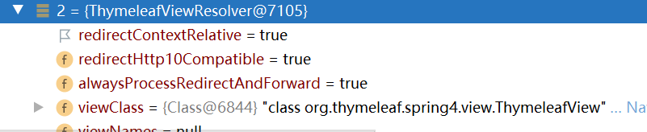
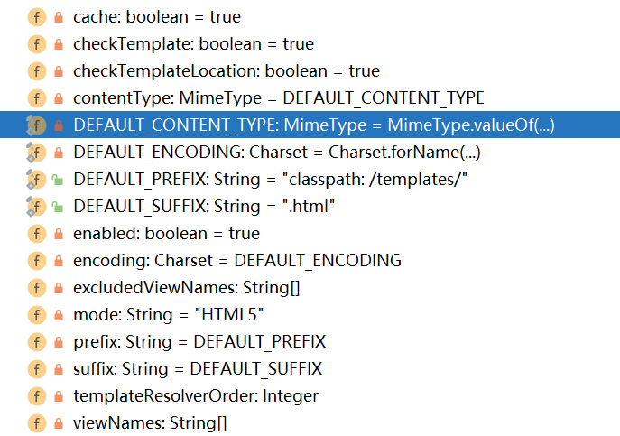

# 模板引擎Thymeleaf

## 一. 介绍和引入

JSP,Velocity,Freemarker,Thymeleaf都是模板引擎

我们可以通过模板引擎将模板和数据拼装成页面

* 引入: 场景启动器`spring-boot-starter-thymeleaf`

### 0. thymeleaf视图解析器

Thymeleaf通过`ThymeleafViewResolver`分析视图

其prefix=`classpath:/templates/`,suffix=`.html`



### 1. 配置

配置: 出自`ThymelefProperties`,前缀`spring.thymeleaf`



### 附: 用thymeleaf接管index.html

index.html放在template下, 而需要接管则应该在Controller下写一个`/ 和/index.html`的映射,直接返回index,让视图解析器拼串到template下的index

ViewController也一样

## 二. 基本使用

> 建议看文档

> 无论是jsp还是Thymeleaf都只是换个view,控制器和模型的行为基本不会变

* 先导入thymeleaf的名称空间以获得提示

  ```java
  <html lang="en" xmlns:th="http://www.thymeleaf.org">
  ```

* 然后使用__以th:为前缀的属性__进行模板填充

### 1. th属性概览

```html
<!-- 渲染前 -->
<div id="ccc" th:id="${msg}" th:text="${msg}">这是aaa</div>

<!-- 渲染后内容 -->
<div id="aaa">aaa</div>
```

* 行内写法: 想要在标签体内嵌入信息,需要用`[[]]`(text),或者`[()]`(utext)裹住

  ```html
  <div>aaa[[${msg}]]</div>
  ```

<u>th属性一览: 优先级从高到低</u>

1. **Fragment inclusion片段包含**:

   * `th:insert`
   * `th:replace`

2. **Fragment iteraction遍历**: c:foreach

   * `th:each`

3. **Conditional evaluation: 条件判断:** c:if

   * `th:if`
   * `th:unless`
   * `th:switch`
   * `th:case`

4. **local variable definition声明变量:** c:set

   *  `th:object`
   * `th:with`

5. **general attribute modification属性修改:**

   * `th:attr`
   * `th:attrprepand`
   * `th:attrappend`

6. **specific attribute modification 特定属性修改:**

   `th:任意html属性`

7. **text 标签内容:** text转义  utext不转义(指html的不转义)

   * `th:text`:进行转义再交给浏览器,对应行内的`[[]]`
   * `th:utext`: 直接交给浏览器处理,不进行转移,对应行内的`[()]`

8. **fragment specification声明片段**

   * `th:fragment`
   * `th:remove`

## 三. 表达式

<u>所有表达式都应该写在th:前缀的属性中</u>

### 0. 综合使用

对所有表达式适用

1. 域对象

   > 域对象都是作为变量存储在WebContext中的

   * 默认情况: 如果不写明则认为从 WebContext或request中寻找key
   * ${session.x}: 从session中寻找
   * ${application.x}: 从context中寻找
   * ${param.x}: 从request中寻找

2. 其他variable

   建议看文档

### 1. 取值表达式${}

`${}`采用OGNL表达式

OGNL表达式: `对象图导航语言`

* 静态属性/方法: `@java.lang.Math@PI`
* 运算符

```java
//通过getter获取属性
${person.father.name}

//使用js语法获取属性或者map的内容
${person['father']['name']}

//对属性和map都奏效
${countriesByCode.ES}
${personsByName['Stephen Zucchini'].age}

//对集合和数组都有效的下标
${personsArray[0].name}

//方法与参数
${person.createCompleteName()}
${person.createCompleteNameWithSeparator('-')}

//构造器
${new com.at.bean.Person("aaa").name}
```

### 2. 变量选择表达式*{}

*{}和${}语法基本一致

但是可以通过父元素的`th:object`来提取公共父元素

```html
<div th:object="${session.user}">
  <p>Name: <span th:text="*{firstName}">Sebastian</span>.</p>
  <p>Surname: <span th:text="${session.user.lastName}">Pepper</span>.</p>
  <p>Nationality: <span th:text="*{nationality}">Saturn</span>.</p>
</div>

```


### 3. URL表达式@{}

* 几种URL:
  * `/`开头: context相对路径
  * `无`开头: page相对路径
  * `~/`开头: 服务器相对路径

* 填充

  * url体填充: 在@{}中直接使用`{}`即可填充变量

    ```html
    th:href="@{/order/{orderId}/details}"
    ```

  * query内容填充: 使用`()`括起query内容,逗号分隔

    ```html
    th:href="@{/order/details(orderId=${o.id})}"
    ```

### 4. 消息表达式#{}

专门为国际化创造,当配置好国际化在此填充

### 5. 片段表达式~{}(见大标题五)

## 四. 循环和条件

### 1. 循环遍历

`th:each`负责对表达式中集合进行遍历

```html
<table>
    <tr th:each="item:${msg2}"> <!-- 变量名: 遍历 -->
        <!-- th:each每次遍历都会生成自身标签 -->
        <td th:text="${item}"></td>
    </tr>
</table>
```

### 2. 条件1

`th:if`是最简单的条件,和c:if差不多,如果判断成立则该标签存在,优先级低于遍历

```html
<a href="comments.html"    th:href="@{/product/comments(prodId=${prod.id})}"    th:if="${not #lists.isEmpty(prod.comments)}">view</a>
```


## 五. 抽取片段

### 1. 抽取

在要抽取的标签上写`th:fragment="fragment标识符"`

```html
<nav th:fragment="navbar" ...></nav>
```


### 2. 引入

然后在要引入的地方写上`th:insert="~{模板名::标识符/选择器}"`,~{}可省略

* 模板名: 就是没有前后缀的html路径(跟controller返回的一样)
* 选择器: 即css选择器
* 注意: 会变成该属性对应元素的子元素

```html
<div th:insert="~{dashboard::navbar}"></div>
```

`th:replace`: 同上,但不作为子元素而是元素本身引入

`th:include`: 将片段的子元素却不将片段本身引入,成为子元素

## 参考: 表达式内容

#### 1.thymeleaf内置对象: 

#**#ctx** : the context object.

**#vars:** the context variables.

**#locale** : the context locale.

**#request** : (only in Web Contexts) the **HttpServletRequest** object.

**#response** : (only in Web Contexts) the **HttpServletResponse** object.

**#session** : (only in Web Contexts) the **HttpSession** object.

**#servletContext** : (only in Web Contexts) the **ServletContext** object.

还有很多工具对象,建议看文档

#### 2. 表达式内容

> Literals字面量
>
> ​	文本 **'one text'** , **'Another one!'** ,…
>
> ​	数字: **0** , **34** , **3.0** , **12.3** ,…
>
> ​	布尔: **true** , **false**
>
> ​	Null: **null**
>
> ​	Literal tokens: **one** , **sometext** , **main** ,… 
>
> Text operations:
>
> ​	字符串连接: **+**
>
> ​	字符串替换: **|The name is ${name}|** 
>
> Arithmetic operations:
>
> ​	二元运算: **+** , **-** , ***** , **/** , **%**
>
> ​	负号: -
>
> Boolean operations:
>
> ​	二元逻辑运算: **and** , **or**
>
> ​	非: **!** , **not** Comparisons and equality:
>
> ​	比较运算: **>** , **<** , **>=** , **<=** ( **gt** , **lt** , **ge** , **le** )
>
> ​	等于运算: **==** , **!=** ( **eq** , **ne** ) 
>
> Conditional operators:
>
> ​	If-then: **(if) ? (then)**
>
> ​	If-then-else: **(if) ? (then) : (else)**
>
> ​	Default: **(value) ?: (defaultvalue)**
>
> Special tokens:
>
> 	No-Operation: _


