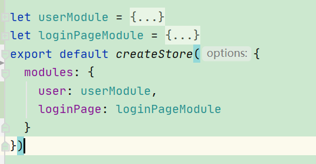

# VueX

[TOC]

## 一. 是什么

Vuex是一个__状态管理模式+库__,

### 1. 状态管理模式

__状态__: the source of truth that drives our app;(驱动应用的真实代码?)

__视图__: 对状态的声明性映射

__行为__: 用户对视图的输入,可能改变应用状态


### 2. 面临的问题

1. 多个视图依赖于同样的一个状态
2. 不同视图的行为会造成相同的状态转变

所以Vuex想要将<u>状态从组件中抽取出来</u>,在一个全局单例中管理. 将组件树看做一个巨大的View,<u>组件可以访问**状态**并触发**行为**,不论它们在树的哪里</u>

## 二. 快速开始

使用vue-cli加入插件即可开始

注意应该依赖是`vuex@next`

### 1. 核心:

```js
import { createStore } from 'vuex'

export default createStore({
  state: {
  },
  mutations: {
  },
  actions: {
  },
  modules: {
  }
})
//main.js
const app = createApp(App).use(store).use(store)
```

Vuex核心为`Store`,store是一个保存应用状态的容器. 对于状态的存储具有响应性. 

只有__提交Mutations__可以改变store中的状态

### 2. 简单的store

```js
export default createStore({
  state(){
    return{
      count:0
    }
  },
  mutations: {
    increment(state){
      state.count++
    }
  },
  actions: {
  },
  modules: {
  }
})
```

这是一个简单的store用以实现计数器,很明显的看到, state的用法接近data,而mutations接近methods

* 全局使用store对象

  `this.$store`可以全局访问store,

  store的基本功能: 

  * 触发mutation: commit

    ```js
    this.$store.commit(increment);
    ```

  * 获取状态中的属性:

    ```js
    this.$store.state.count
    ```

    

一个暴露在所有组件面前的store就出现了

## 三. 状态

Vuex包含着单一状态树,即一个store存储着整个应用的状态

语法其实就是data的语法,跟我们的直觉一样

### 1. 将vuex状态纳入Vue组件

其实没什么难度,只要使用this.$state引入,然后想放入computed还是什么,自己用

### 2. mapState

`mapState`简化state的使用,不必再为了每一个状态写一个computed函数

* 数组形式

```js
computed:mapState(['count','eat','drink'])
// 把要引入的state放进computed,但是这样不能用原生的computed api了
```

* 对象形式

  ```js
  computed:mapState({
              count1: 'count', //名字指定
              eating: function(state){ // 函数指定,慎用箭头函数(this理应指向组件实例)
                  return state.eat + 'haha';
              },
      		img: function(){
                  return this.str; //可以在对象里写普通的computed api
              }
          })
  ```

* 拓展运算符形式

  * 即不占用全部的computed

    ```js
    computed:{
        img: function(){
            return this.str; //可以在对象里写普通的computed api
        },
        ...mapState({
            count1: 'count', //名字指定
            eating: function(state){ // 函数指定,慎用箭头函数(this理应指向组件实例)
                return state.eat + 'haha';
            },
    
        })
    }
    ```

    

## 四. getter

### 1. 定义

有时我们需要获取比较复杂的结果,可以在store中定义getter,即类似组件中的computed,但略有不同

```js
export default createStore({
  state(){
    return{
      count:0,
      eat: 'eact',
      drink: 'drink'
    }
  },
  mutations: {
    increment(state){
      state.count++
    }
  },
  getters:{
    countMult100(state){
      return state.count *100;
    }
  },
```

### 2. 属性访问

按照如上定义,我们可以这样访问getter:

```js
this.$store.getters.countMult100
```

* 参数:

  * 第一个: state,即状态们

  * 第二个: getters, 内含其他的getter,可以类似上面的语法直接使用

    ```js
    getters.countMult100
    ```

### 3. 方法访问

我们可以将getter定义为一个返回函数的方法

```java
getters: {
  // ...
  getTodoById: (state) => (id) => {
    return state.todos.find(todo => todo.id === id)
  }
}
```

使用时:

```js
store.getters.getTodoById(2)
```

### 4. mapGetters

跟mapState语法差不多,针对getter的名字导入computed并且起别名

## 五. mutation

改变Vuex存储状态的唯一方法就是commit mutation.

### 1. 提交mutation

* 最简单形式

  ```js
  //定义mutation的handler
  mutations: {
      increment(state){
          state.count++
      }
  },
      
  store.commit('increment');
  ```

* 有效负载(即带参数)形式

  * 在commit中添加参数即可传递给mutation

  ```js
  //定义mutation的handler
  mutations: {
      increment(state,n){
          state.count+= n;
      }
  },
      
  store.commit('increment',1);
  ```

* 对象参数形式

  ```js
  store.commit({
    type: 'increment',
    amount: 10
  })
  ```
  
  

## 六. Action

基于mutation是不可异步的,我们引入action概念

* action本身不会改变状态,但是会执行mutation
* 动作可以异步操作,比如定时器之类的

### 1. 定义和使用

定义: 

```js
actions: {
  increment(context){
    context.commit('increment');
  }
},
```

使用:

```js
this.$store.dispatch('increment');
```

语法和commit基本一致,返回值是promise用以处理异步操作

### 2. mapActions

放在methods,其他和mapState雷同

## 七. modules

我们可以将不同模块的状态区分开

### 1. 最基本使用



在对象里写state,mutation之流,然后合到createStore中

### 2. 参数

* 形如这种**mutations**,收到的参数为当前store模块的state对象

```js
mutations:{
  toLogin(state,route){
    state.beforePath = route;
  },
  fromLogin(state){
    state.beforePath = '/index';
  }
},
```

* 对于这种**actions**,传入的context,`state`属性指向当前的模块,`rootState`属性指向全局模块

```js
toLogin(context,route){
  context.commit('toLogin',route);
},
```

* 对于getters,获取了第三个参数`rootState`

  ```js
   getters: {
      sumWithRootCount (state, getters, rootState) {
        return state.count + rootState.count
      }
    }
  ```

### 2. 命名空间

在默认情况下,mutations actions  getters依然暴露在全局下. 我们当然希望有模块的名称空间来限定

* 开启命名空间

  ```js
  let userModule = {
    namespace: true,
    //...
  }
  ```

* 开启命名空间后的使用

  * 开启命名空间后,getters必须用命名空间的字符串访问属性,mutations(commit),action(dispatch)必须加上命名空间才能访问

  * 格式: '模块名/内容'

    ```js
    store.commit('user/login');
    ```

    ```js
    const store = createStore({
      modules: {
        account: {
          namespaced: true,
    
          // module assets
          state: () => ({ ... }), // module state is already nested and not affected by namespace option
          getters: {
            isAdmin () { ... } // -> getters['account/isAdmin']
          },
          actions: {
            login () { ... } // -> dispatch('account/login')
          },
          mutations: {
            login () { ... } // -> commit('account/login')
          },
    
          // nested modules
          modules: {
            // inherits the namespace from parent module
            myPage: {
              state: () => ({ ... }),
              getters: {
                profile () { ... } // -> getters['account/profile']
              }
            },
    
            // further nest the namespace
            posts: {
              namespaced: true,
    
              state: () => ({ ... }),
              getters: {
                popular () { ... } // -> getters['account/posts/popular']
              }
            }
          }
        }
      }
    })
    ```

* 在命名空间中访问全局state和getter

  * 在getters中: rootState和rootGetters分别作为第三,第四个参数传入

    * 对应的,传入的第一第二个参数对应的都是本地的内容

    ```js
     someGetter (state, getters, rootState, rootGetters) {
            getters.someOtherGetter // -> 'foo/someOtherGetter'
            rootGetters.someOtherGetter // -> 'someOtherGetter'
            rootGetters['bar/someOtherGetter'] // -> 'bar/someOtherGetter'
          },
    ```

  * 在actions中: context拥有rootGetters属性

