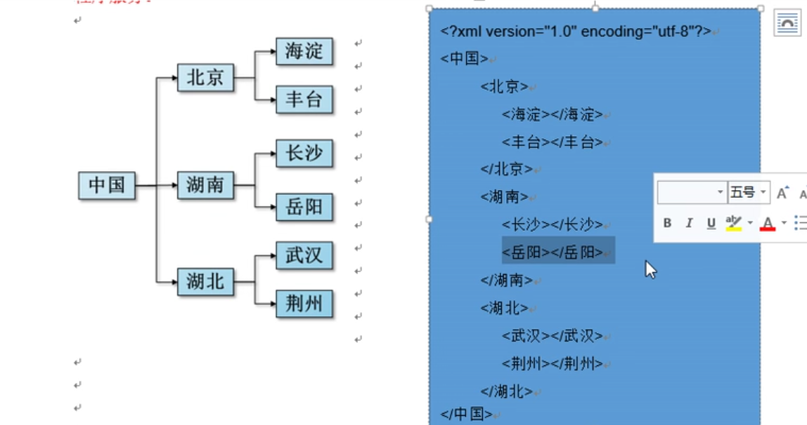

# WEB

> [TOC]

<table>
    <tr></tr>
    	<td></td>
    	<td></td>
    	<td></td>
    <tr></tr>
    <td></td>
    	<td></td>
    	<td></td>
    <tr></tr>
    <td></td>
    	<td></td>
    	<td></td>
    <tr></tr>
    <td></td>
    	<td></td>
    	<td></td>
</table>
## 一. XML

### 1. 什么是XML

`extensible markup language` 可拓展标记语言,由W3C组织发布,以统一的格式组织有关系的数据

因为是标记语言,它也有DOM

