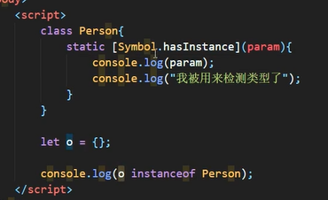
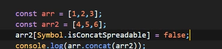

# ECMAScript6

## 一. 介绍

ECMA是欧洲计算机制造商协会,ECMAScript是一个脚本程序设计语言,根据ECMA-262标准

ES6是变动最大的版本

## 二. let和const关键字

### 1. let

声明就和var差不多

```javascript
let a;
let b,c,d;
let e = 100;
let f = 123, g = 234
```

* 特性:

  * 同名变量重复声明会报错(var声明相同变量不会)

  * 块作用域: 只在代码块中有效

    ```javascript
    {
        let a = 1;
    }
    console.log(a); // 报错
    ```

    ```javascript
    //对比
    console.log(a);//undefined,变量提升
    {
        var a = 1;
    }
    console.log(a);//1
    ```

  * 不存在变量提升(在声明之前使用,var变量会返回undefined,称为变量提升)

  * 不影响作用域链的效果(块里的块也能用它)

* 小示例:

  ```javascript
  for(var i = 0;i < items.length ;i++){
           items[i].onclick = function(){
           //修改背景颜色
           this.style.background = 'pink';
           //在这里是不能用i的,因为全局变量i在onclick执行的时候就已经是最大值了
      }
  }
  ```

  ```javascript
  for(let i = 0;i < items.length ;i++){
             items[i].onclick = function(){
             //修改背景颜色
             items[i].style.background = 'pink'; // 块作用域,值不被全局控制
        }
  }
  ```

  

### 2. const

声明语法和let,var一样

* 语法特点:
  * 必须声明时初始化(不然报错)
  * 一般常量名使用大写
  * 常量能修改
  * 块作用域
  * 可以对常量中的元素或者属性修改

## 三. 变量解构赋值

### 1. 语法

> 声明时不限定var,let或者const

* 数组解构

```javascript
const F4 = ['x','y','z','s'];
let [a,b,c,d] = F4;
console.log(a);//x
console.log(b);//y
console.log(c);//z
console.log(d);//s
```

* 对象解构

```javascript
const zhao = {
    name:"zhao",
    age: 100,
    gender:'M',
    xiaopin:function(){
        console.log("aaaa");
    }
}
let {name,age,xiaopin} = zhao;
//变量名和属性要对应上
```

## 四. 模板字符串

使用**反引号**括起的新字符串声明方式

```javascript
let str = `aaa`;
console.log(str);
```

* 特性:

  * 内容中可以直接出现换行符(编辑时可以直接换行)

    ```java
    let str = `
    <ul>
         <li>玛丽</li>
         <li>玛丽</li>
    </ul>`;
    ```

  * 可以进行变量拼接(使用`${}`嵌入)

    ```javascript
    
    let lov = 'aaa';
    let out = `${lov}tql`;
    console.log(out);
    ```

    

## 五. 简化对象

```javascript

let name = 's';
let change = function(){
      console.log('haha');
}
const school = {
    name,//name:name
    change,//change:change
    
    //方法简化:
    improve: function(){
    	console.log('...');
    },
    //简化后:
    improve(){
        console.log('...');
    }
}
```

## 六. 箭头函数

### 1. 简单声明和调用

```javascript
//声明
let fn = (a,b) =>{
   return a + b;
}
//调用
let result = fn(1,2);
```

### 2. 特性

1. __this是静态的__; 函数始终指向声明时所在作用域下的this的值(无论谁调用都不会变)

   ```javascript
    function getName(){
        console.log(this.name);//this会改变
    }
    let getName2 = () =>{
        console.log(this.name);//此this永远是window
    }
    window.name = "aaa";
    const school = {
        name:"bbbb"
    }
   
    getName.call(school);//bbb
    getName2.call(school);//aaa
   ```
   
2. 不能作为构造函数

3. 没有argments变量

### 3. 拓展简写

1. 当形参有且只有一个,可以省略小括号

   ```javascript
   let add = n =>{
       console.log(n)
   }
   ```

2. 只有一条语句的时候,省略大括号,并且语句的结果作为返回值

   ```javascript
   let add = n => console.log(n)
   ```

### 4. 应用案例

1.

```javascript
//需求1 点击div 2s后颜色变pink
 let ad = document.getElementById("ad");//获取div
 ad.addEventListener("click",function(){//点击事件
     setTimeout(() => {
         //注意,这里如果是function()则this指向window,因为调用环境是window
         //然而声明时这个this指向外层的this指向ad,所以用()=>可以解决this的归属问题
         this.style.background = "pink";
     },2000);
 })
```

### 5. 应用总结

1. 适合与this无关的回调,比如定时器,数组
2. 不适合与this的回调设置

## 七. 函数参数

### 1. 参数默认值

```javascript
function add(a,b,c=10){
    
}
```

有默认值的函数参数一般放在最后(没有严格要求)

可以和解构赋值结合,解构中的参数也可以赋值

```javascript
let a = {
    host:"aaa",
    name:"bbb"
}
function connect({host="127.0.0.1",name}){//对象解构传参
    console.log(name);
    console.log(host);
}
connect(a);
function connect2({host,name} = a){//对象解构默认值
    
}
```

### 2. rest参数

rest旨在取代arguments

* rest参数的获取: `...参数名`,放在**参数列表最后**

  ```javascript
  function connect({host,name} = a,...rest){
       console.log(rest);//是个数组,可以用数组的方法
  }
  ```

  


## 八. 拓展运算符

拓展运算符`...`可以将数组拆解成逗号分隔的形式

```javascript

const aaa = [1,2,3];
chunwan(...aaa);//三个参数

function chunwan(){
    console.log(arguments);
}
```

> 区别于rest参数,这个是用在数组前面的运算符

### 2. 应用

* 数组拼接

  ```javascript
  var a = [1,2,3];
  var b = [4,5,6];
  var c = [...a,...b];//[1,2,3,4,5,6,];
  ```

* 数组深拷贝

  ```javascript
  const d = [...a];
  ```

* 伪数组转换为真数组

  ```javascript
  var divs = document.getElementsByTagName("div");
  var divArr = [...divs];
  ```


## 九. Symbol类型

类似于字符串的基本数据类型

### 1. 特点

1. 值是唯一的
2. Symbol的值不能和其他数据进行运算
3. Symbol定义的对象属性不能用for...in循环遍历,但可以用Reflect.ownKeys来获取对象的所有键名

### 2. 使用

```javascript
//创建symbol
//方式1
let s = Symbol();
//方式2
let s2 = Symbol('我是symbol');//传入的参数只是描述作用的字符串(
let s3 = Symbol('我是symbol');
console.log(s2 == s3);//false

//方式3
let s4 = Symbol.for("我是symbol");//传入的参数是symbol的key
let s5 = Symbol.for("我是symbol");
console.log(s4 == s5);//true
```

### 3. 应用

在Symbol出现之前,对象属性方法名只能是字符串

而现在Symbol可以作为属性或方法的名字

这样的属性/方法只能`Reflect.ownKeys`才能获取到

```javascript
let methods = {
      up:Symbol('down'),
       down:Symbol()
}
game[methods.up] = function(){
     console.log("bbb");
}
game[methods.down] = function () {
      console.log("ccc");
}
game[methods.down]();
```

### 4. Symbol的内置属性

额,建议看文档

* instanceof重载:



* concat是否展开(是整体作为元素合并,还是分开合并)

  

## 十. 迭代器和新循环

Iterator是一种接口,只要部署Iterator接口就可以使用新的`for...of`循环

内置实现iterator接口的类型:(所谓iterator接口就是一个属性)

> Array,arguments,set,map,string,typedArray,nodeList

### 1.for.of使用举例

```javascript
const arr = ["a","b","c"];
for (const string of arr) {
    console.log(string);
}
//对比for in,获取的都是属性名,对于数组就是0123
```

### 2. iterator

iterator接口就是`Symbol.iterator属性`

```javascript
Symbol(Symbol.iterator): ƒ values()
//可以直接获取
let iterator = arr[Symbol.iterator]();
```

1. 创建一个对象(迭代器)指向数据结构的其实位置
2. 然后对象不断调用next(),返回的内容有value属性和done属性(表明是否到最后的布尔值)

## 十一. 生成器函数

生成器的作用是推动**异步编程**

之前异步的手段就是回调函数

### 1. 声明调用方式

`function *`

```javascript
function* gen(){
            console.log("hello");
}
let res = gen();//返回一个迭代器,没有运行方法内部代码
console.log(res);
//使用next调用
res.next();//hello
```

* `yield`和next的配合

  yield作为分隔符,作为next的参考依据

  ```javascript
  function* gen(){
              //===========第一次next执行下面的代码
              yield "aaa";
              console.log("ccc");
              //========第二次next执行下面的代码
              yield "bbb";
      		console.log("ddd");
  }
  ```

* 直接使用for of

  ```javascript
  for(let v of gen()){
  	console.log(v);//返回yield后面的标识,比如aaa;上面next()调用的返回值多一个done
  }
  ```

  

### 2. 参数传递方式

1. 在生成器函数直接传入参数:

   ```javascript
   
   let strings = gen("AAA");
   strings.next();//执行第一块
   function* gen(arg){
       console.log(arg);//有结果
   }
   ```

2. next中传入参数: 作为yield语句的返回值

### 3. 杜绝回调地狱

   

```javascript
function * gen(){
    yield one();
    yield two();
    yield three();
}
function one(){
    setTime(()=>{
        console.log(111);
    },1000)
};
function two(){
    setTime(()=>{
        console.log(222);
    },2000)
};
function three(){
    setTime(()=>{
        console.log(333);
    },3000);
};
```

## 十二. Promise

从语法上来说Promise基本是一个构造函数,便于异步编程

### 1. Promise对象

* 创建: 内部传入一个函数,参数为resolve,reject

  ```java
  const p = new Promise(function(resolve,reject){
             setTimeout(function(){
             console.log("ooo");
             let data = "aaa";//模拟获取数据
                  //
            resolve(data);//表示将promise对象的状态设置为"成功"
            reject("bbb");//表示失败
       },1000);
  });
  
  ```

`then方法`: 指定当调用resolve(成功),reject(失败)时会触发的方法

```java
p.then(function(value){
    //value为成功获取的数据,resolve的参数
},function(reason){
    //reason为失败的原因,reject的参数
})
```

### 2. 应用

```javascript
const p = new Promise(function (resolve, reject) {
    fs.readFile("./iter.html",(err,data)=>{
        if(err){
            reject(err);
        }else{
            resolve(data);
        }
    })

})
p.then(function (value) {
    console.log(value.toString());
},function (reason) {
    console.log(reason);
})
```

### 3. then方法

返回值是promise对象,跟状态当前对象的状态有关

### 4. catch方法

就是只指定错误方法的then

## 十三. 集合

### 1. 集合的整体特性

1. 实现了迭代器,可用for...of

2. 构造器可以空,或者传入任何可迭代对象

3. 属性

   `size`: 大小

   `add()`: 增加元素

   `delete(元素内容)`: 删除元素

   `has(元素)`: 是否有元素