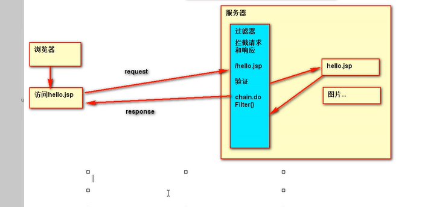
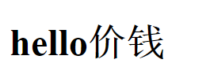
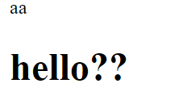
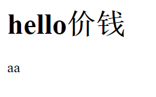
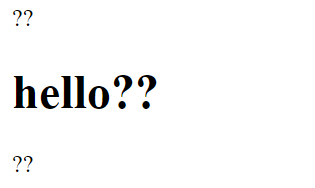
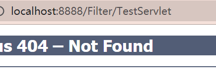
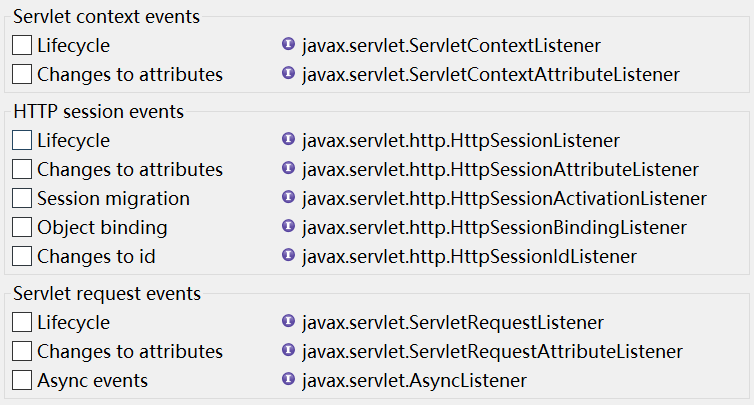
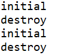
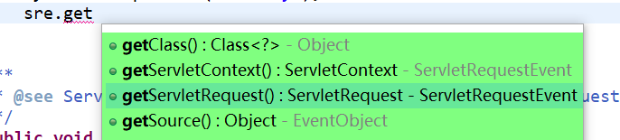
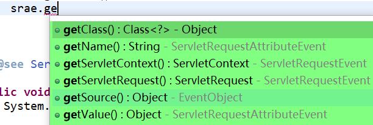

> Servlet,Filter,Listener并称web三大组件

# Filter过滤器

## 一. 绪论

### 1. 干啥用

以之前的技术, 只能每个网页都放一个检查来打回不合理请求(比如没登录直接访问需要登录的内容)

所以Filter出现了,其**过滤请求和响应**,相当于一个总大门的门禁.

`javax.servlet.Filter`

> A filter is an object that performs filtering tasks on either the request to a resource (a servlet or static content), or on the response from a resource, or both.
>
> 过滤器是用来执行过滤任务的一个对象,作用于:
>
> 1. 请求一个资源(servlet或静态资源)
> 2. 来自一个资源的响应
> 3. 或者两个都作用

* 具体作用
  * filter可以拦截请求,修改请求头,请求内容
  * filter可以拦截来自服务端的相应, 修改响应头和响应内容
  * 放行请求

> Examples that have been identified for this design are:
>
> 1. Authentication Filters
> 2. Logging and Auditing Filters 
> 3. Image conversion Filters  图片转换过滤器
> 4. Data compression Filters 数据压缩过滤器
> 5. Encryption Filters
> 6. Tokenizing Filters
> 7. Filters that trigger resource access events
> 8. XSL/T filters
> 9. Mime-type chain Filter

## 二. HelloWorld

### 1. 实现接口看看

```java

public class HelloFilter implements Filter{

	@Override
	public void doFilter(ServletRequest arg0, ServletResponse arg1, FilterChain arg2)
			throws IOException, ServletException {
		// TODO Auto-generated method stub
        //参数: 请求,响应,chain
		//我是主方法
	}

}

```

### 2. 过滤器需求与实现

假设有index.jsp页面到hello.jsp的超链接,要求跳转时必须带上money参数

* 编写doFilter

  * 使用`chain.doFilter(request,response)`放行到下一个过滤器

  ```java
  @Override
  	public void doFilter(ServletRequest request, ServletResponse response, FilterChain chain)
  			throws IOException, ServletException {
  		// TODO Auto-generated method stub
  		String money = request.getParameter("money");
  		
  		if(money != null) {
  			chain.doFilter(request, response); // 放行请求
  		}else {
  			response.getWriter().write("no money");
  		}
  	}
  
  ```

* 配置filter在web.xml上

  * 跟servlet差不多,先配置filter,再配置filter-mapping

  * url-pattern不需要额外指定新的路径,就是在访问页面/jsp/servlet的时候设置过滤罢了

    * 放行就到原页面
    * 不放行就按照Filter定义的走,默认返回空页面

    ```xml
    
     <filter>
      	<filter-name>HelloFilter</filter-name>
      	<filter-class>com.at.Filter.HelloFilter</filter-class>
      </filter>
      <filter-mapping>
      	<filter-name>HelloFilter</filter-name>
      	<url-pattern>/hello.jsp</url-pattern>
      </filter-mapping>
    ```

    

## 三. 实现流程和生命周期

### 1. 实现流程

响应response回来的时候也需要通过Filter



* 实例讲解

  ```java
  response.getWriter().write("money");//验证部分:率先响应
  chain.doFilter(request, response); // 放行请求,获取页面响应
  response.getWriter().write("haha");// 请求之后,最后响应
  ```

   

### 2. 生命周期

Filter是一个单例多线程

服务器启动时(项目加载进服务器) **创建并初始化**

服务器关闭时/项目从服务器卸载 销毁

## 四. url-pattern设置

### 1. 两种配置方式

Servlet也能用,每个mapping其实可以配多个url-pattern,他们是并运算的关系

* 精确匹配: 资源的详细路径
* 路径匹配: `/路径名/*`拦截访问这个路径下的所有资源
* 后缀匹配: `*.后缀名`,Servlet也能用,甚至能拦截网页里的jpg(在network中jpg是一个单独请求)

> 不能 路径和后缀匹配结合
>
> 例: /page/*.jsp 不合法

### 2. 拦截page下的所有jsp

结合路径匹配和request判断

```java
HttpServletRequest req = (HttpServletRequest) request;
String uri = req.getRequestURI();// /Filter/hello.jsp
StringBuffer url = req.getRequestURL();// http://localhost:8888/Filter/hello.jsp
//没有问号下的参数
```

选择其一进行字符串匹配就行(或者用正则)

## 五. 神秘乱码问题

### 1. 现象

* 直接放行,没问题

  ```java
  chain.doFilter(request, response);
  ```

   

* **放行前响应一句,响应乱码**

  ```java
  response.getWriter().write("aa");
  chain.doFilter(request, response);
  ```

   

* 响应后再写也没事

   

* 放行后写中文: 可以

* 不放行写中文: 乱码

* 前面写一个,后面写一个,都乱码

  ```java
  response.getWriter().write("你好");
  chain.doFilter(request, response);
  response.getWriter().write("你好");
  ```

   

### 2. 解析

* 放行之前操作,都会乱码
* 放行时 + 放行之后,没有放行之前 就不会乱码

联系之前"<u>解决乱码一定要在response写东西之前"</u>

一个请求对应一个响应,只要请求来了服务器立马先造一个相应对象,以后处理的request和response都是同一套.

* 访问jsp时会直接设置编码格式,在回到filter的时候已经完成编码的设置了

* 在访问jsp之前已经写入东西,会默认如下这样: 就乱码了

  ```
  Content-Type: text/html;charset=ISO-8859-1
  ```

  

## 六. FilterConfig

```java
@Override
	public void init(FilterConfig filterConfig) throws ServletException {
		// TODO Auto-generated method stub
		Filter.super.init(filterConfig);
	}
```

类似这种init(可选的Filter重载方法)会传入FilterConfig.来看看

### 1. 方法

```java
String filterName = filterConfig.getFilterName(); // 获取Filter别名
filterConfig.getInitParameter(name);// 获取init-param(在web.xml的filter下配)
filterConfig.getInitParameterNames()// 获取参数名们
    
ServletContext servletContext = filterConfig.getServletContext();
// 对应web应用,application域对象,有各种对web应用的操作,去servlet那边看
```

## 七. Filter链

### 1. 默认情况

按照在配置里的(mapping)顺序进行过滤,最前面的在最外层,资源在最内层

用chain放行就是交给下一层filter

## 八. dispatcher拦截各种访问

### 1. 问题



转发并不改变url,所以访问不会被filter拦截

### 2. 使用配置项dispatcher解决

* 写的位置: filter-mapping下

```xml
 <filter-mapping>
  	<filter-name>BFilter</filter-name>
  	<url-pattern>/test.jsp</url-pattern>
  	<dispatcher></dispatcher>
  </filter-mapping>
```

* 值:(设置以后表示只拦截指定的,可以设置多个)

  > `FORWARD`: 拦截转发过来的(包括从errorPage跑过来的)
  >
  > `INCLUDE`: 拦截(动态)包含进来的
  >
  > `REQUEST`: 直接请求的(默认)
  >
  > `ERROR`: 发生错误的,指的是web.xml配置的全局错误页面
  >
  > ```xml
  > 
  > <error-page>
  >   	<error-code>404</error-code>
  >   	<location>/index.jsp</location>
  >   </error-page>
  > ```
  >
  > 

## 九. 用Filter完成事务控制

### 1. 事务控制思想

如果有错误就回滚,全正确就通过

> 请求过来(处理一系列工作)--------响应结束
>
> 整个过程都是一个线程,只要监控这一个线程,如果线程执行期间发生异常,就回滚

### 2. 用filter来监控线程

`请求----filter---执行----filter----响应完成`,这是一个线程

我们应该一个线程对应一个连接,使用一个**map**来保存connection key(线程号),value(线程对应的连接)

在所有数据库相关操作出错的时候都抛出异常,然后用Filter捕获全局的异常进行回滚

```java
		try {
			// 放行操作
			chain.doFilter(request, response);
			// 关闭连接，并提交事务
			JDBCUtils.closeConnection();
		} catch (Exception e) {
			// 回滚 事务
			JDBCUtils.rollback();
			throw e;
		}
```

# Listener监听器

## 一. 绪论

### 1. 是啥

监听器**监听事件**的发生,事件发生后触发**函数调用**(比如js的onclick)

### 2. 能监听啥

**ServletRequest**,   请求

**ServletContext, **  代表整个web应用

**HttpSession, **  session

### 3. 8个监听器

都是接口



三个大类:

1. **生命周期监听器**. 监听三个对象的生命周期
   * ServletContextListener
   * ServletRequestListener
   * HttpSessionListener
2. **属性监听器**. 监听域对象里的属性的增删改
   * ServletRequestAttributeListener
   * ServletContextAttributeListener
   * HttpSessionAttributeListener
3. **session固有监听器**
   * HttpSessionActivationListener | __session活化/钝化监听器__
   * HttpSessionBindingListener | __sesison绑定监听器__,监听一个对象是否被添加到session域中

## 二. 生命周期监听器

### 1. 使用监听器

1. 实现相应接口

2. 实现方法

   ```java
     public void requestDestroyed(ServletRequestEvent sre)  { 
            // TODO Auto-generated method stub
           对象销毁时调用的
       }
   
   	/**
        * @see ServletRequestListener#requestInitialized(ServletRequestEvent)
        */
       public void requestInitialized(ServletRequestEvent sre)  { 
            // TODO Auto-generated method stub
           对象创建调用的
       }
   	
   ```

3. 配置web.xml,只要配class就行了

```xml
<listener>
		<listener-class>com.at.listener.life.RequestListener</listener-class>
</listener>
```

4. 然后看到相应域对象被创建和销毁的时候都会调用对应方法

    

### 2. 参数

* request参数sre

```java
  public void requestDestroyed(ServletRequestEvent sre) 
```

这个参数sre可以用来获取Request和Context



* context参数sce
  * 获得context
* session的se
  * 获取session

## 三. 属性监听器

### 1. 看看要实现的方法

```java
public void attributeRemoved(ServletRequestAttributeEvent srae)  {}
public void attributeAdded(ServletRequestAttributeEvent srae)  {}
public void attributeReplaced(ServletRequestAttributeEvent srae)  {}
```

就是增删改嘛


### 2. 参数能获得什么

* request

  

  * 当前变化的属性名和值(getName/getValue)
    * 移除的值是移除前的值
    * 修改的值是修改前的值
    * 想要新值,从request拿就行了
  * Context和Request

* 下面同理

## 四. session钝化活化监听器/绑定监听器

监听的是__session中的某个对象的钝化和活化__

### 1. 监听的是啥

监听器由**相应类**实现

当**这个类的对象**跟着session钝化活化的时候,会执行相应方法

或者这个类的对象跟session绑定/解绑(或者session失效)会执行相应方法

```java
 public void sessionDidActivate(HttpSessionEvent se)  { 
         //活化
    }

	/**
     * @see HttpSessionActivationListener#sessionWillPassivate(HttpSessionEvent)
     */
    public void sessionWillPassivate(HttpSessionEvent se)  { 
         //钝化
    }
```

参数se可以取session

## 补充. 和项目共进退的容器监听器

```xml
<!-- needed for ContextLoaderListener -->
	<context-param>
		<param-name>contextConfigLocation</param-name>
		<param-value>location</param-value>
	</context-param>

	<!-- Bootstraps the root web application context before servlet initialization -->
	<listener>
		<listener-class>org.springframework.web.context.ContextLoaderListener</listener-class>
	</listener>
```

配置这个就行,要导入web包