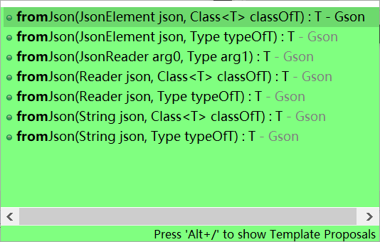

# JSON-java

JSON是一种轻量级的数据交换格式.

如之前学的,它源自JS,可以在JS里使用

有了它就可以在前后端传java或js对象

## 一. 在JS的使用

JavaScript的学习笔记里有

## 二. 和JAVA对象的互相转换

第三方工具`gson`,去maven找

### 1. Gson对象

* 创建Gson对象

```java
Gson gson = new Gson();
```



### 2. JSON-对象

* 对象转json(用的是原属性而不是bean属性)

  ```java
  Gson gson = new Gson();
  String json = gson.toJson(student);
  System.out.println(json);//{"name":"zhang","age":20}
  ```

  

* json转对象

  ```java
  Student fromJson = gson.fromJson(json, Student.class);
  //传入json和Class
  ```

### 3. JSON-List

* List转Json: 一样的方法,转成中括号的数组,List可以包含Student这种对象

* Json转List:

  * 无法指定内部对象的类型,所以要使用一个参数,它继承自`TypeToken类`并且在泛型中指明json内容的类型

    ```java
    
    public class MyType extends TypeToken<List<Student>> {
    	//啥都不用写
    }
    ```

  * 然后再

    ```java
    List<Student> fromJson = gson.fromJson(json, new MyType().getType());
    //创建对象并getType()
    ```

### 4. JSON-Map

* map转json

```java
map.put("no1", student1);
map.put("no2", student2);
//{"no2":{"name":"li","age":18},"no1":{"name":"zhang","age":20}}
String json = gson.toJson(map);
```


* json转map
  * 跟List差不多,展示一下用匿名类

```java
gson.fromJson(json, new TypeToken<Map<String,Student>>(){}.getType());
		//因为有泛型,用匿名类
```

