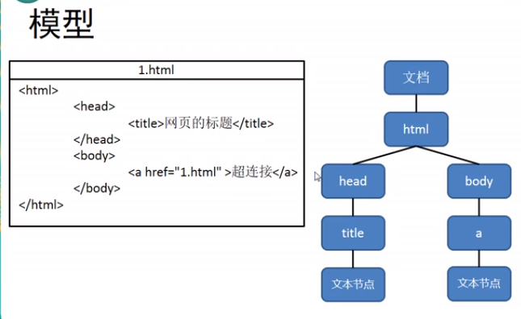
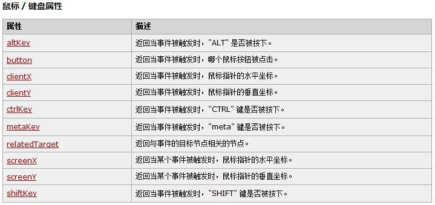

# JavaScript

> [TOC]

## 一. 绪论

### 1. 概述

`JavaScript`是由netScape率先开发的前段验证语言,现在用在各种网页行为.

`ECMAScript`是JavaScript的标准,一般认为与JavaScript等价,但不一样


JavaScript=ES+DOM(文档对象模块)+BOM(浏览器对象模块)


### 2. 特点

* 解释型语言
* 类似于C和java的语法结构
* 动态语言
* 基于原型的**面向对象**

## 二. HelloWorld

### 1. 往哪写

html中的某个标签,需要编写到`<script>`标签中

写在<head>

```html
<script type="text/javascript">

</script>
```

### 2. helloworld

```html
    <script type="text/javascript">
        alert("这是我第一行JS代码");
        /*
        * 我是注释
        *控制浏览器弹出一个警告框
        * */

        /*
        让计算机在页面中输出一个内容
         */
        document.write("快来");

        /*
        向控制台输出一个内容
         */
        console.log("haha");
    </script>
```

### 3. 编写的位置

* 可以写在标签的`onclick`属性中,点击按钮时执行

```html
<button onclick="alert('haha')">点我一下</button>
```

* 可以写在超链接的href中

  ```html
  <a href="javascript:alert('hahaha')">点点</a>
  <a href="javascript:;">点点</a><!--点击没有任何功能-->
  ```

* 以上耦合,不推荐,往script标签写

* 写一个js文件,用script标签引入,推荐

  ```html
  <script type="text/javascript" src="script.js"></script>
  ```

  * 一旦用于引入,不能再标签内编写,无用

### 4. 输入

`prompt("str")`函数输入,会给一个提示框输入内容,作为字符串返回值返回

## 三. 字面量和变量

字面量就是常量嘛,就不可变,在JS里可以直接使用

但是我们不能总是用字面量,所以需要用变量来使用它

### 1. 声明变量

```js
var a;//声明变量
a = 123;

var b = 132;
```

### 2. 标识符

可以含有字母,数字,`_`,`$`

不以数字开头,不能是关键字或保留字

* 变量/函数命名规范:
  * 驼峰命名法,首字母小写,后面单词首字母大写(跟java一样)

### 3. 数据类型

js中有六种数据类型,可以使用typeof检查变量类型:(返回的都是小写)

> ```javascript
> console.log(typeof b);
> ```
>
> 
>
> `String`: 字符串
>
> `Number`: 数值
>
> `Boolean`: 布尔
>
> `Null`: 空
>
> `Undefined`: 未定义
>
> `Object`: 对象

前五个属于基本数据类型,Object是引用数据类型

#### 3.1 字符串String

JS中字符串用引号引起,__双引号或单引号都可以__

#### 3.2 数值型Number

Number可以存的最大值为`Number.MAX_VALUE`: 1.7976e308

Number可以存的0以上最小值为`Number.MIN_VALUE`: 5e-324

比这个数字大的会返回`Infinity`

* 特殊数值型:(不能加双引号)
  * `Infinity`: 表示无穷大
  * `NaN`: 非法运算时,返回不是一个数字

#### 3.3 布尔型Boolean

只有真假两值`true` `false`

#### 3.4 空NULL

Null就一个值,`null`,表示空对象

* 用typeof返回的是一个__"object"__

#### 3.5 未定义Undefined

只有一个值,`undefined`,

声明变量但不赋值时类型为Undefined,其值为undefined

### 4. 强制类型转换

#### 4.1 其他数据类型-->String

* **方式一**: 调用被转换类型的`toString方法`,返回结果为字符串

  * 对于null和undefined无效

* ```javascript
  var a = 123;
  
  a = a.toString(); // 不改变原值
  
  console.log(typeof a);
  ```

* __方式二__: 调用`String函数`,传入被转换值为参数

  * 对于numeber和Boolean跟toString一样
  * 对null和undefined会直接转换为"null","undefined"

```javascript
var b = 345;
String(b);//大写S,指代类名

console.log(typeof b);//number
b = String(b);
console.log(typeof b);//string
```

#### 4.2 字符串/Boolean/null/undefined->number

使用`Number函数`

```javascript
var a = "123"
a = Number(a)
console.log(typeof a)
```

String情况:

* 纯数字字符串直接转换
* 全是空白转换为0
* 如果有非数字内容为NaN

Boolean情况:

* true-1
* false-0

null,undefined----0

#### 4.3 String-->Number(特殊)

> 这两个是函数不是方法,把最左边的数字读出来,读到非数字结束(整数读小数点也结束)

`parseInt(str)`把一个字符串转换为整数,可以传入第二个参数指定进制

```javascript
parseInt("070",10);//传入数字10,8,16
```


`parseFloat(str)`把一个字符串转换成浮点数

* 可以传入非String值,会转换成String(用String函数)并操作

#### 4.4 转换为boolean

`Boolean`函数,除了 0/NaN 和 空字符串 和 null 和 undefined 都是false

### 5. 运算符

| 运算符 | 返回类型 | 值                                         | 目   |
| ------ | -------- | ------------------------------------------ | ---- |
| typeof | string   | 值的类型                                   | 单目 |
| +-*/%  | number   | 算术结果,会进行Number转换,和Nan运算都是nan | 双目 |
| +      | string   | 类似java的拼串,有字符串就拼                | 双目 |
| +/-    | number   | 转换成number,并正负运算                    | 单目 |
| ++ ,-- | number   | 自增自减,前后版本都有                      | 单目 |

#### 5.1 . 非布尔值的逻辑运算

与运算找的是`false`,如果都是true就返回顺序的最后一个(找不到),如果找得到就返回第一个False

或运算同理

#### 5.2 相等运算

不同类型之间相等/不相等运算会发生自动类型转换,一般两边都转成number

但是null和0不相等,null和undefined相等,NaN不和任何相等

可以使用`isNaN函数`检查变量是否为NaN

### 6. 全等运算符(建议使用)

`===`叫全等运算符,判断是否相等,不会做类型转换

`!==`不全等,同理

### 7. 作用域

全局作用域: 不写在代码块里必然是全局作用域,页面打开时加载,关闭时销毁

* window是一个全局对象,由浏览器创建,可以直接使用

* 我们的全局作用域的对象其实都是__window的属性__,函数都是window的方法

  ```javascript
  var a = 1;
  console.log(window.a);
  ```

* 变量的声明提前:

  * 使用var的变量会在所有代码执行前被声明(undefined)
  * 如果没有用var不会被提前声明

* 函数的声明提前:

  * `function 函数()` 会在所有代码之前创建,所以可以在声明前使用
  * `var xx= function` 不会初始化,只有undefined

函数作用域: 调用函数创建,执行完销毁.

* 在函数中用var声明的只有函数作用域
* 不用var就是全局

## 四. 流程控制

### 1. 代码块

JS中的代码块:

* 没有Java里代码块的用法
* <u>在代码块(for,if等)里声明var变量,在外面也看的到(比较独特)</u>

### 2. 流程控制

if,switch,for,while和Java一样,for没有增强循环

## 附. 计时

```javascript
console.time("计时器名字");

console.timeEnd("计时器名字")
//结果在浏览器的console看
```


# 面向对象

## 一. 对象object

### 1. 对象的分类

> **内建对象:** 由ES标准中定义的对象,在任何ES实现中可以使用,如Math,String,Number,Function,Object
>
> **宿主对象:** JS运行环境提供的对象,主要是浏览器提供,比如BOM,DOM
>
> **自定义对象:** 开发人员自己创建的

### 2. 对象操作

* 创建对象

  ```javascript
  var obj = new Object();
  ```

* 添加属性,读取属性

  ```javascript
  //属性名没有标识符规范,可以乱取,但尽量要求标识符规范
  //如果需要特殊属性名,可以用 对象["属性名"] 使用
  //对象.属性名=值
  obj.name = "tom";
  obj["123"] = 456
  console.log(obj.name);
  ```

* 删除属性

  ```javascript
  //delete 对象.属性
  delete obj.gender;
  ```


### 3. 属性操作

~~感觉这个object更像键值对~~

* //属性名没有标识符规范,可以乱取,但尽量要求标识符规范
  //如果需要特殊属性名,可以用 `对象["属性名"] `使用(可以不是字符串)

  ```javascript
  obj[123] = 1
  a = 123
  console.log(obj[a]);
  ```

* []中可以直接传递一个变量,变量值是多少就会读取哪个属性,__灵活__

  ```javascript
  var a = "name";
  var obj = new Object();
  obj.name = "aaaa";
  console.log(obj[a]);
  ```

* `in运算符`,检验对象是否有属性

  ```javascript
  console.log("name" in obj);//true
  ```

### 4. 对象字面量创建obj

~~键值对实锤~~

```javascript
var obj = {};//跟new Object()等价

var obj1 = {
	name:"sun",
    age:18 //最后一个最好不写逗号
};
```


### 5. 枚举对象的属性

```javascript
for (var attr in obj) {
    console.log(typeof attr);//string属性名
}
```

## 二. 函数

函数也是一个对象,可以封装一些代码,在需要时执行这些功能

### 1. 声明函数

new声明,将封装的代码以字符串传给构造函数

```javascript
var fun = new Function("console.log('Hello');");
console.log(fun);
fun();
```

函数声明

```javascript
function fun2() {
    console.log("Hello");
}
fun2();
```

函数表达式声明

```javascript
var fun3 = function (){
    console.log("");
}
fun3();
```

### 2. 加上参数

```javascript
var fun5 = function (a,b){
    console.log( +a + +b);
}
```

**它不会检查形参数量和类型**,很诡异.

如果实参少于形参,那就自动赋值undefined

### 3. 返回值

```javascript
var fun5 = function (a,b){
    return a + b;
}
```

不跟任何值就返回undefined

### 4. 方法

对象的属性值可以是函数,就宛如方法一样

```javascript
obj.sayName = function () {
    console.log(obj.name);
}
```

### 5. this参数

解析器每次在调用函数的时候都会向函数内部传递进一个__隐含的参数this__

```javascript
function fun(){
    console.log(this);//Object [global] {...
}
fun();
```

* this指向的是一个对象,称为函数执行的__上下文对象__
  * 根据调用方式的不同会指向不同对象:
  * **函数调用:** this为window
  * **方法调用:** this为调用方法的对象

### 6. 工厂方法创建对象

```javascript
function createPerson(name,age,gender){
    var obj = new Object();
    obj.name = name;
    obj.age = age;
    obj.gender = gender;
    obj.sayName = function () {
        console.log(obj.name);
    }
    
    return obj;
}
```

用函数创建类似的对象

## 三. 构造函数

构造函数就是一个普通的函数,和普通函数没有区别.只是一般<u>首字母大写</u>

```javascript
function Person(){
	//根本不用写在类里
}
var per = new Person();//调用构造函数立刻创建新的对象(函数中的this)并返回
console.log(per);//Person {}
```

* <p style="color:red">函数以构造函数出现时,函数中this就是创建的对象</p>

  ```javascript
  function Person(name,age){
      this.name = name;
      this.age = age;
  }
  var per = new Person("a",1);
  per instanceof Person;//true
  ```

### 1. 原型模式

每个函数都拥有一个属性,叫做__prototype__,这个属性对应一个__原型对象__

```java

function f(){

}
console.log(f.prototype);//f{}
```

* 作用: 当函数用作构造函数时,<u>创建的对象也会有一个隐藏属性指向原型对象</u>,名字叫`__proto__`

  ```javascript
  var mc = new f();
  console.log(mc.__proto__);
  mc.__proto__ == f.prototype; //true
  ```

  相当于一个公共区域,所有同类对象都能看到这个对象. 所以可以在__原型对象里放共有的东西__

  ```javascript
  mc.__proto__.a = 123;
  console.log(mc.a);//当mc里找不到a,回去原型对象找
  ```

  对象共有的东西可以防在构造函数的原型里

* 检查属性:

  * 使用`in`可以检查到原型的对象
  * `对象.hasOwnProperty(属性)` 可以检查自己有没有(不在原型里的)属性
  * 自身没有的属性就在原型里,原型的原型里,原.....里,反正就是原型,直到找到Object的原型的原型null/undefined

### 2. toString方法

Object的原型会给你toString方法,不如重写

## 四. 内建对象: 数组

`Array`数组也是对象.

### 1. 创建

```javascript
var arr = new Array([长度]);
var arr2 = [];
var arr3 = [1,2,3,4];
```

### 2. 使用/添加值

```java
arr[0] = 1;

```

* 如果读取不存在的索引,__不会报错__,会反undefined

  ```java
  arr[0] = 1;
  arr[2] = 100;
  //这种情况arr[1]是undefined
  ```

### 3. 设置/返回长度

使用Array的length__属性__: 对于连续的,返回有多少个; 对于不连续的,返回<u>最大索引+1</u>

还可以修改length属性,如果改大就把多出来的部分空出来.; 如果小的话就裁剪

```javascript
arr[arr.length] = ...;
//向最后添加元素

```


### 4. 四个常用方法


| 方法      | 作用                         | 返回值     |
| --------- | ---------------------------- | ---------- |
| push()    | 向数组末尾添加一个或多个元素 | 新的长度   |
| pop()     | 删除并返回数组最后一个元素   | 删除的元素 |
| unshift() | 向数组开头添加一个或多个元素 | 新的长度   |
| shift()   | 删除并返回数组第一个元素     | 删掉的元素 |

```javascript
var len = arr.push("a","b",1);
console.log(len,arr);
```

### 5. forEach(IE8不支持)

传一个函数进去,对每个元素都做把它传入函数调用

* 传入函数的参数: 第一个元素值,第二个索引,第三个整个数组

#### 6. slice和splice方法

slice方法接受一个起始位置和末尾(左闭右开,末尾可以不写,索引可以为负),并返回指定区域的数组

splice方法

* 第一个参数: 起始位置
* 第二个参数: 删除几个
* 第三个参数: 向被删除的地方填充元素

```java
arr.splice(0,1,[1,2],3);
//[ [ 1, 2 ],3, 2, 3, 4 ]
```

### 7. 其他方法

|                          | 功能                                                         | 返回         |
| ------------------------ | ------------------------------------------------------------ | ------------ |
| concat(arr(们)/元素(们)) | 连接两个或三个数组,不对原数组影响                            | 返回新的数组 |
| join(参数字符串)         | 把数组转换成字符串,不影响原数组(数组元素用<u>参数/逗号</u>连接) | 结果         |
| reverse()                | 颠倒顺序(影响数组)                                           |              |
| sort()                   | 默认按字符串排序(影响数组),参数可以放一个function指定排序规则 |              |

* 回调函数:
  * 用两个形参
  * 返回大于0需要交换位置,小于0不变,等于零相等

## 五. 内建对象:函数

### 1. call和apply方法

call和apply都可以调用函数

call和apply的: <u>第一个参数成为函数执行的this</u>

call和apply的区别:

​	call : 实参从第二个对象开始,一个一个

​	apply: 需要把实参封装到数组里

### 2. arguments

调用函数时浏览器会传递两个隐含的参数:

​	this函数上下文

​	封装实参的对象__arguments__

`arguments`是一个类似数组的对象

不是数组,但可以用<u>length,索引</u>,就是说可以不定义形参用实参

它有一个`callee属性`,值为当前执行函数对象.

## 六. 内建类: Date

### 1. 简单使用

* 直接创建

```javascript
var d = new Date();
console.log(d);
//2020-07-29T02:07:01.592Z
```

如果直接使用Date构造对象,则会封装当前代码执行的时间

* 指定日期

  * `月/日/年 时:分:秒`

  ```javascript
  var date = new Date("12/03/2016 11:10:30");
  console.log(date);
  ```

### 2. 方法

| 方法                           |                          |
| ------------------------------ | ------------------------ |
| getDate()                      | 返回年月日的"日"         |
| getDay()                       | 返回一周中的第几天,周日0 |
| getMonth()                     | 获取月(0-11)             |
| getFullYear()                  | 获得四位年份             |
| getHours/getMinutes/getSecends | 见名知义                 |
| getTime()                      | 获取时间戳               |
| Date.now()                     | 当前的时间戳             |
|                                |                          |
|                                |                          |

## 七. 内建对象: Math

它是一个"工具类",不用创建对象(其实它就是对象,不是构造函数)

* 属性

  ```javascript
  Math.PI //pi值
  ```

* 方法

  ```javascript
  Math.abs(-1); //返回绝对值
  Math.cos/sin/tan() //玩三角函数
  
  Math.ceil(1.4); //向上取整
  Math.floor(); //向下取整
  Math.round(); //四舍五入取整
  
  Math.random(); // 产生0-1左闭右开的随机数
  
  Math.max/min(10,20,30); //顾名思义
  
  Math.pow(x,y);
  Math.sqrt(x);
  ```

  

## 八. 内建类型: 包装类

跟Java包装类概念一样,把基本数据类型装换为包装类

### 1. 弃用版

```javascript
var num = new Number(3);
var str = new String("hello");
```

* 存在的问题: 不能比较,Boolean不能用作判断(对象全转成true)

### 2. 真正的重点

当我们使用基本数据类型去调用属性和方法时,浏览器会临时用包装类将其转换为对象,然后再代用对象的属性和方法. <u>调用完以后转换为基本数据类型</u>

那这有啥用? 这其实可以让**基本数据类型直接调用包装类的属性和方法**,当调用属性和方法时会自动转换成包装类,并从包装类里拿方法.

## 九. 内建类型:String

在底层,String是字符数组形式保存

### 2. 它的数组用法

它可以用length属性,也可以用索引获得指定位置的值

### 1. 它的方法

|                                        | **作用**                                                     | **返回值**                                |
| -------------------------------------- | ------------------------------------------------------------ | ----------------------------------------- |
| **charAt(i)**                          | 返回指定位置的字符,跟中括号一样                              | 指定位置的字符                            |
| **charCodeAt(i)**                      | 返回指定位置字符的Unicode                                    | Unicode                                   |
| __String.formCharCode(num)__           | 根据unicode获得字符                                          | 字符                                      |
| **concat(str)**                        | 连接字符串,不改变原串                                        | 字符串                                    |
| __indexOf()__                          | 输入一个string(会强转),一个起始索引9可省略0,返回一个索引     | string出现在字符串中第一个位置,或者-1     |
| __lastIndexOf(string,开始位置(往前))__ | 返回一个索引                                                 | 返回从开始位置(包括))往前数的第一个的索引 |
| __slice()__                            | 不影响原字符串,截取内容,输入(开始,结束),可以负一             | 返回字符串                                |
| __subString()__                        | 好像和slice就一样,就不支持-1,默认变成0并自动调整位置(会自己交换两个参数) | 返回子串                                  |
| __split()__                            | 将字符串拆分成一个数组,参数(分隔符(默认" "))                 | 字符串数组                                |
| __toUpper/LowerCase()__                | 不改变原字符串,转换大小写                                    | 转换后字符串                              |
|                                        |                                                              |                                           |
|                                        |                                                              |                                           |
|                                        |                                                              |                                           |
|                                        |                                                              |                                           |


## 十. 内建对象: window

### 1. onload事件

### 2. alert

### 3. confirm:

```javascript
confirm("确认删除?");
```

确认或取消的对话框

返回一个boolean

# 正则表达式

## 一. 用途

用于定义字符串的一些规则

检查1字符串是否符合规则,或者将字符串中符合规则的内容提取出来.

## 二. 使用

### 1. 创建正则表达式对象

```javascript
var reg = new RegExp("正则表达式pattern","匹配模式flag");
```

看看创建了啥

```javascript
var reg = new RegExp("a");
console.log(reg);// "/a/",检查字符串是否含有a
```

* 匹配模式:
  * `i`: 忽略大小写
  * `g`: 全局匹配

使用__字面量__创建

```javascript
var reg = /正则表达式/匹配模式
var reg = /a/i; //不能传变量
```

### 2. 使用方法测试

`test()`方法检查一个字符串是否符合正则表达式规则,返回布尔值

```javascript
console.log(reg.test("aa"));//true
```

* 检查是否有<u>a或b或c</u>

  * 使用`|`表示或者关系

  ```javascript
  reg = /a|b|c/
  ```

* 检查是否有<u>字母</u>

  * 使用`[]`表示或的关系
  * 用`-`表示范围,左边Unicode小,右边大,取范围;可用作数字,字母的获取

  ```javascript
  reg = /[ab]/ //a或b
  reg = /[a-z]/ //任意小写字母
  
  var reg = new RegExp("[b-z]","i");
  var reg = console.log(reg.test("b")); //b-z(都含)之间所有字母
  
  var reg = new RegExp("[A-z]","i");
  console.log(reg.test("c"));
  ```

* 检查字符串中是否含有abc或adc或aec

  ```javascript
  var reg =/a[bde]c/
  ```

* 排除a和b,其他字母都可以

  ```javascript
  reg = /[^ab]/ //排除a和b
  reg = /[^0-9]/ //排除数字
  ```

  

## 三. 字符串和正则

* 字符串的__split方法__支持正则表达式

  * ```javascript
    var str = "1a2b3c4d5e"
    var strings = str.split(/[1-9]/);
    console.log(strings);//[ '', 'a', 'b', 'c', 'd', 'e' ]
    ```

* 字符串的__search()__

  * 查找字符串是否含有指定内容,返回索引

  * ```javascript
    str = "HEllo aaa c";
    var number = str.search(/a[abc]a/);
    console.log(number);//6
    ```

* match()找到一个或多个匹配正则表达式的内容(提取出来)

  * 默认情况下找到一个就返回了

  * 设置正则表达式为"全局匹配模式",就能匹配所有了

  * ```javascript
    var str = "1a2b3c4d5e"
    var regExpMatchArray = str.match(/[A-z]/g);
    console.log(regExpMatchArray);//[ 'a', 'b', 'c', 'd', 'e' ]
    ```

* replace()将字符串中内容替换为新的内容

  * 第一个用正则或string,第二个用string
  * 默认只替换第一个,用全局匹配换所有的

## 四. 正则语法

### 1. 量词

通过量词可以设置一个内容出现的次数,只对它前面一个内容生效(括号括起算一个)

语法1: `{数量}`

* 指定数量

```javascript
str = "HEllo aaa c";

var reg = /a{3}/ //匹配三个a
var reg = /(ab){3}/ //匹配ababab
console.log(reg.test(str));
```

* 指定数量范围(用逗号表示,闭区间)

  ```javascript
  //一般不单独用,需要别的字符夹着才能体现出数量上限
  reg = /ab{1,3}c/
  reg = /ab{1,}c/ //1次及以上
  console.log(reg.test("abbbbc"));
  ```

  

  

语法2: `+`表示至少一个{1,}

```javascript
reg = /a+b/
console.log(reg.test("abbbbc"));
```

语法3: `*`表示0个或多个{0,}

```javascript
reg = /a*b/
console.log(reg.test("abbbbc"));
```

语法4: `?`表示0个或1个{0,1}


### 2. 位置正则

* 检查是否以某子串开头

  `^`

  ```javascript
  reg = /^ab/
  console.log(reg.test("abbbbc"));
  ```

* 检查是否以某子串结尾

  `$`

  ```javascript
  reg = /c$/
  console.log(reg.test("abbbbc"));
  ```

* 联合使用

  ```java
  /^aaa$/ //要求字符串完全符合正则表达式
  ```

  

### 3. 元字符


* 转移字符`\` : 把特殊字符打回原形

* 使用new时,字符串中的\需要\\\\来打回原形

* `.`: 查找除了换行符和行结束符的字符

* `\w`: 表示任意字母和数字,下划线

* `\W`:相当于\w取反

* `\s`:空格

* `\S` :除了空格

* `\d`:任意数字

* `\D`: 除了任意数字

* `\b`:单词边界(空格),用来严格界定单词

  ```javascript
  reg = /\bchi\b/
  console.log(reg.test("chi{"));// 好像不是字母都行,没字符也行
  ```

* `\B`: 除了单词边界

  

# DOM

## 一. 绪论

### 1. DOM

`DOM`文档对象模型,让JS通过DOM来对HTML文档进行操作,随心所欲的操作WEB界面

文档: 表示整个HTML文档

对象: 将网页的每一个部分都转换成了对象

模型: 使用模型表示对象间关系,方便获取对象

* HTML **DOM树**



### 2. 节点Node

节点指的是网页中最基本的组成部分,网页中的每一个部分都可以称为是一个节点

* 属性: `nodeName`,`nodeType`,`nodeValue`

* 类型及对应属性值:

  > **文档节点:** 整个HTML文档
  >
  > **元素节点:** HTML文档中的HTML标签
  >
  > **属性节点:** 元素的属性
  >
  > **文本节点:** HTML标签中的文本内容

|          | nodeName  | nodeType | nodeValue                                |
| -------- | --------- | -------- | ---------------------------------------- |
| 文档节点 | #document | 9        | null                                     |
| 元素节点 | 标签名    | 1        | null                                     |
| 属性节点 | 属性名    | 2        | 属性值                                   |
| 文本节点 | #text     | 3        | <span style="color:blue">文本内容</span> |

试着从文档获取id为btn的按钮

```html
<head>
    <meta charset="UTF-8">
    <title>Title</title>
    <script type="text/javascript">
        window.onload = function() {
            var elementById = document.getElementById("btn");
            console.log(elementById);
            elementById.innerHTML = "hahahah";
        }
    </script>


</head>
<body>
    <button id="btn">我是一个按钮</button>
</body>
```

### 3. 事件

事件就是用户和浏览器的交互行为

可以在事件对应属性中设置一些js代码 当事件触发时会执行

在DOM参考有DOM EVENT查看各种事件属性

* 写法一: 写在属性里,太耦合了,不推荐

```html
<button id="btn" onclick="alert('ll')">我是一个按钮</button>
```

* 写法二: 为按钮对应事件绑定处理函数

  ```javascript
  elementById.ondblclick = function(){
                  alert("oooo");
              }
  ```


事件返回false可以取消默认的跳转行为

### 3. 文档的加载

浏览器加载是从上到下的,先读script会找不到后面的标签

最佳体验让script放在最后

想等窗口加载好再来,可以使用onload事件

```javascript
window.onload = function(){
    
}
```

## 二. DOM: 查

### 1. 获取元素节点的方法

获取**元素节点**的document的方法

|                        |                                  |        |
| ---------------------- | -------------------------------- | ------ |
| getElementById()       | 通过id属性获取一个元素节点对象   | id     |
| getElementsByTagName() | 通过标签名获取一组元素节点对象   | 标签名 |
| getElementsByName      | 通过name属性获取一组元素节点对象 | name   |

* 一组对象:
  * 返回一个`HTMLCollection`
  * 这是一个类数组类型,可以使用length等数组用法,还可以**用下标遍历**
  * 它的元素就是各个子元素标签

### 2. 获取元素节点的子元素节点方法

用__元素节点的方法或属性__

|                        |                                    |      |
| ---------------------- | ---------------------------------- | ---- |
| getElementsByTagName() | 通过标签名获得一组子元素           | 方法 |
| childNodes             | 获得所有子<u>Node</u>们(就一级)    | 属性 |
| firstChild             | 当前节点第一个<u>子节点Node</u>    | 属性 |
| lastChild              | 获得最后一个<u>子节点</u>          | 属性 |
| children               | 获取当前元素的所有<u>子元素</u>    | 属性 |
| firstElementChild      | 第一个子元素.不建议使用(不兼容IE8) |      |
|                        |                                    |      |
|                        |                                    |      |

* 子节点:
  * 元素节点是子节点,文本节点是子节点,元素和元素间的空行也算文本节点
* 属性: 所有元素属于Elements,都是类数组

### 3. 获取HTML元素的内容

* 获取自己元素之间的内容:

  每个元素都有一个`innerHTML`属性,值为<u>HTML元素之间</u>的内容

  还有`innerText`,将innerHTML的HTML标签去除只留文本

* 获取自己的属性的值

  直接 `对象.属性名(HTML中的属性名)`

  文本框的value就是文本框的内容

* 获取元素的class

  使用`对象.className`

### 4. 获取元素节点的父节点和兄弟节点

|                        |                |      |
| ---------------------- | -------------- | ---- |
| parentNode             | 父节点         | 属性 |
| previousSibling        | 前一个兄弟节点 | 属性 |
| nextSibling            |                |      |
| previousElementSibling |                |      |
| nextElementSibling     |                |      |

### 5. 特殊元素的获取

`document.documentElement`: HTML根标签

`document.add`: 页面中所有元素

`document.getElementsByClassName("str")`:根据类名获取元素,兼容IE9及以上

### 6. 用选择器它不香吗

`document.querySelector("选择器字符串")`

问题: 只查一个,如果满足条件的有多个,只会返回第一个元素

`document.querySelectorAll("选择器字符串")`:

返回所有满足条件的

## 三. DOM:增删改

| DOM对象方法      | 功能                                               | 参数            |
| ---------------- | -------------------------------------------------- | --------------- |
| appendChild()    | 添加子节点放在最后                                 | 无              |
| removeChild()    | 删除子节点                                         | 节点            |
| replaceChild()   | 替换某个子节点                                     | new节点,old节点 |
| insertBefore()   | **(调用者是父节点)**在指定子节点前面插入新的子节点 | 新节点,旧子节点 |
| document:        |                                                    |                 |
| createElement()  | 创建元素节点                                       | "标签名"        |
| createTextNode() | 创建文本节点                                       | 内容            |
|                  |                                                    |                 |
|                  |                                                    |                 |

### 1. 创建节点并添加到city下

```javascript
function () {
	//创建li元素节点

	var htmlliElement = document.createElement("li");
	var text = document.createTextNode("广州");

	//将广州文本节点设置为li的子节点
	htmlliElement.appendChild(text);

	var city = document.getElementById("city");

	city.appendChild(htmlliElement);
}
```

### 2. 在bj前插入广州

```javascript
function(){
   var dbj = document.getElementById("bj");
   var htmlliElement = document.createElement("li");
   var text = document.createTextNode("广州");

   htmlliElement.appendChild(text);

   var city = document.getElementById("city");
   city.insertBefore(htmlliElement,dbj);
}
```

### 3. 用innerHTML实现增删改

我们知道innerHTML就是里面的内容,我们可以用父节点的innerHTML修改里面的东西

```javascript
city.innerHTML += "<li>广州</li>";
```

缺点: 工作量大,会修改子元素所有内容

优点: 比上面简单

### 4. 试着用表单的内容增加页面内容

如果是一个form,就用return false先取消按钮的跳转默认功能

获取用户填写的信息: 用input的value获取

### 5. 执行流程

for循环会在加载完成后立即执行,响应函数只有在点击时执行,所以函数里的i和for里的i不是同一份


## 四. DOM:样式

### 1. 内联样式的修改和获取

```javascript
元素.style.样式名 = 样式值(字符串)
```

* 示例

  ```javascript
  box1.style.width = "300px";
  ```

* 注意:

  * 如果CSS样式中有`-`号,如background-color,需要修改为驼峰命名

    ```javascript
    box1.style.backgroundColor
    ```

  * 修改的是内联样式,修改后会立即执行,除非被!important覆盖

* 返回__内联样式__字符串

```javascript
元素.style.样式名 //这家伙的值就是样式值
```

### 2. 获取当前显示的样式

* <b style="color:red">IE专用</b>

```javascript
元素.currentStyle.样式名
```

* 其他浏览器
  * 使用window的方法`getComputedStyle()`获取元素当前样式
  * 需要两个参数
    * 元素
    * 可以传递一个伪元素或者null
  * 返回一个[object CSSStyleDeclaration],封装了当前元素对应的样式
  * 用 `返回值.样式` 获取值(字符串)

### 3. 其他和样式有关的属性方法

```javascript
元素.clientHeight
元素.clientWidth    //属性,获取元素的可见高度/可见宽度

```

* 注意:
  * 返回的是Number而不是String
  * 返回的高度宽度 包含 内容区+padding(不包括边框)
  * 都是__只读__
  * 不包括滚动条

```javascript
元素.offsetHeight
元素.offsetWidth
```

注意:

* 返回的是Number而不是String
* 返回的高度宽度 包含 内容区+padding+**bording**
* 都是__只读__

```javascript
元素.offsetParent //获取当前元素的定位父元素
```

* 定位父元素
  * 根据哪个父元素定位就返回哪个(最近的非static定位的父元素)

```javascript
元素.offsetLeft
元素.offsetTop
//返回元素的偏移量(相对于其定位父元素)
```

```javascript
元素.scrollHeight//返回元素整体高度
元素.scrollLeft//返回元素左边缘与视图的距离
元素.scrollTop//返回元素上边缘和视图的举例
元素.scrollWidth//返回元素整体宽度
```

* 获取整个__滚动区域__的整体高度和宽度
* 返回滚动条的滚动距离(相对左,上)

> 当`scrollHeight-scrollTop = clientHeight`,滚动到底
>
> 有的是浮点,建议相减的绝对值小于1

## 五. 事件对象

引例: 当鼠标在一个Div中移动时,另一个div显示它在那个div的相对坐标

我们使用`onmousemove`事件,用大DIV绑定

### 1. 事件对象

事件响应函数被触发时,每次都会将一个实践对象作为实参传递给响应函数

可以在事件中定义一个形参接收

它__封装了相关信息__(比如鼠标坐标,滚轮方向,键盘按键)



使用ClientX和ClientY可以获取鼠标指针的水平/垂直坐标,获得相对于窗口的坐标

pageX,pageY返回页面(真的顶部,真的左边)的相对坐标,不兼容IE8

### 2. 事件冒泡

冒泡: 指事件的向上传导,当后代元素的事件被触发,其父元素相同事件也会被触发


* 消除冒泡

  * ```javascript
    event.cancelBubble() 
    ```

  * 

### 3. 事件委派

问题: 我们只能为已有的绑定响应函数,还得每个绑定一个. 我们希望只绑定一次就应用到所有


我们可以把事件委派给共同父元素,用冒泡从子元素传到父元素使用

并使用event的target属性获取精确的触发事件的子元素

### 4. 事件绑定

`addEventListener()`增加绑定函数并且**不会覆盖**

```javascript
btn1.addEventListener("click",function(){alert("a")},false)
//事件名,不加on
//回调函数
//是否在捕获阶段触发事件
```

不支持ie8,用attachEvent,没有第三个参数

### 5. 事件的传播

微软认为时间由内向外传播,应该先触发子元素再触发父元素

网景公司认为应该由外向内,应该先触发父元素

W3C将事件分成了三个阶段: 

* 捕获,从外层window到内层,但不会触发,addEventListener第三个参数可以指定在这执行,一般不用
* 目标,捕获到目标元素
* 冒泡,往外冒泡

### 6. 拖拽

使用`onmousedown`,`onmouseup`,`onmousemove`事件

事件的取消: 将事件赋值为null,甚至可以赋值自己成为一次性事件

如果被覆盖,会使事件失效,怎么办?给document绑定

```javascript
window.onload = function(){
    var box = document.getElementById("box1");
    box.onmousedown = function(event){
        var xx = event.pageX - box.offsetLeft; //一开始就算好偏移量
        var yy = event.pageY - box.offsetTop;

        document.onmousemove = function (event) {
            var x = event.pageX - xx;
            var y = event.pageY - yy;

            box.style.left = x + "px";
            box.style.top = y + "px";
        }
        document.onmouseup = function(){
            document.onmousemove = null;//取消事件

            document.onmouseup = null;//一次性事件
        }
    }
```

问题: 拖拽网页内容时有时自动回去搜索殷勤,需要取消;

> 使用return false可以取消事件的默认行为

### 7. 滚轮事件

`onmousewheel`,火狐不兼容,使用DOMMouseScroll,addEventListener绑定

event:

```javascript
event.wheelDelta //获得滚轮滚动的方向,往上为正,往下为负; 火狐用detail,方向相反
						
```

需要return false取消滚动条行为

### 8. 键盘事件

`onkeydown`,`onkeyup`

绑定在可以获取到焦点的对象上或者document

* 对于onkeydown,一直按着,事件会一直触发,第一次和第二次间隔大,后面小
* 对于按键,得问event按的是谁

```javascript
event.keyCode //获取按键编码(number)

```

* 检查ctrl+y

  ```javascript
  if(event.ctrlKey){
      //还有alt,shift的用法
      if(keyCode === 'Y'){
          ...
      }
  }
  ```


# BOM

浏览器对象模型,通过JS操作浏览器

BOM中提供了一组对象来操作,比如 window,Navigator,Location,History,Screen

* `window`: 浏览器中的窗口,网页的全局对象

* `navigator:` 代表当前浏览器的信息,通过该对象识别浏览器
* `location`: 代表当前浏览器地址栏信息,可以跳转页面
* `history`: 历史记录,可操作历史记录;隐私原因,该对象不能获得具体历史记录,只能前进或后退;只在当次访问时有效

除了window,其他都作为__window的对象属性__保存,`window.navigator`,window是全局可以不用写

## 一. navigator

可以识别浏览器

### 1. 识别浏览器

属性:

| **属性**                        | **值**     | **备注**                                        | **类型** |
| ------------------------------- | ---------- | ----------------------------------------------- | -------- |
| **appCodeName**                 | 浏览器代码 |                                                 | String   |
| **appName**                     | 浏览器名称 | 由于历史原因,大部分值都不能帮助我们识别浏览器了 | String   |
| **userAgent**(用户代理==浏览器) |            | 不同浏览器有不同userAgent,IE11以后会有问题      | String   |

## 二. history

操作浏览器向前向后翻页

属性:

* length: 历史记录的数量

方法:

* back(): 后退
* forward(): 前进
* go(): 可以用来跳转指定页面 
  * 参数: 正整数: 向前跳转n个,负整数: 向后跳转n个