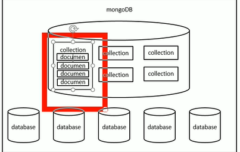

# MongoDB

## 一. 介绍

MongoDB是nosql文档数据库; 

是为了快速开发互联网Web应用而生,**采用Bson结构**

端口27017

`mongod`命令开启服务

常用选项: --dbpath --port 

`mongo`可以启动自带客户端

## 二. 基本操作



### 1. 基本指令

```bash
show dbs; show databases;
use 数据库名; #数据库和集合不需要手动创建,当创建文档时对应的集合和数据库会被创建
db # 检查当前所处数据库

show collections; # 显示数据库中的集合 
```

文档CRUD演示:

```bash
# 增加
db.<collection名>.insert(<doc/bson内容>); 
db.stus.insert({name:'haha',age: 18});
# 查询集合中所有
db.<collection>.find();

```

#### 1.1 增加

> 插入时如果没有指定_id主键,mongo会自动添加

向数据库插入一个文档

```
# 增加
db.<collection名>.insert(<doc/bson内容>); 
db.stus.insert({name:'haha',age: 18});
```

向数据库插入多个文档

```js
// 采用数组形式即可
db.stus.insert(
    [
        {name:'a',age:11},
        {name:'b',age:12},
        {name:'c',age:13}
    ]
)
```

语法糖形式:

```js
db.stus.insertOne({}); //必须只穿一个对象
db.stus.insertMany([]); // 必须数组
```


#### 1.2 查询

```js
db.<collection>.find();// 查询所有,返回数组
db.<collection>.find({查询条件}); // 按条件查询,返回数组

db.<collection>.findOne({}); //返回符合条件的第一个

res.count()/length(); //结果数量查询
```

* 条件查询简述

  ```js
  db.stus.find({字段名:值}); // 条件等于查询,可以传多个,表示与
  db.stus.find({age:18});
  db.stus.find({name:'aaa',age:18});
  ```

  

#### 1.3 修改

```)
db.collection.update(查询条件,新对象);
db.collection.update(条件,{$set:{属性:值}})
```

#### 1.4 删除

```js
db.collection.remove({条件},<justone:boolean>); // 删除符合条件的所有,justone对应deleteOne和deleteMany
// 不传参报错,不传条件全删

db.collection.drop(); //删了整个集合
db.dropDatabases();
```

## 二. 文档

### 1. 文档间关系(连接)

* 一对一: 通过内嵌文档来体现

```js
db.wifeAndHusband.insert([
    {name:'huangrong',husband:{name:'guojing'}}  
])
```

* 一对多: 可以内嵌文档(数组),也可以使用外键

```js
db.order.insert({
      list:['pg','ab'],
      user_id: ObjectId('6100d766630ee6cbb68bce4a')
})
```

简单连接查询

```js
var uid = db.users.findOne({username:'swk'})._id;
db.order.find({user_id:uid});
```

* 多对多:把外键变成数组


### 2. 排序

find().sort(规则);

规则: {字段:正序1,倒序-1}

### 3. 投影

find第二个参数,{属性:1,属性:0}

## 四. Mongoose

Mongoose是Node操作MongoDB的模块

是一个ODM **对象文档模型** 库

### 1. 好处

可以为文档创建Schema

可以对模型中的文档进行验证

数据可以通过类型转换转为对象模型

可以使用中间件来应用业务逻辑挂钩

比Node原生操作Mongodb更好用

### 2. 使用步骤

1. npm i mongoose --save
2. var mongoose = require('mongoose')
3. 连接数据库

```js
mongoose.connect('mongodb://ip地址:端口/数据库名',{useMongoClient: true})
```

4. 利用mongoose.connection 监听mongodb数据库连接状况
   * 其他事件有比如close

```js
mongoose.connection.once("open",function(){
    console.log('opending')
})
```

5. 连接一般不会断开,区别于jdbc

### 3. Schema和Model创建

创建Schema对象:

```js
var Schema = mongoose.Schema;
var blogSchema = new Schema({
    name: String,
    age:{
        type: String,
        default: 18
    }
})
```

创建模型

```js
var mo = mongoose.model(模型名(集合名,会自动编程复数),schema);
```

然后使用mo去进行增删改查操作