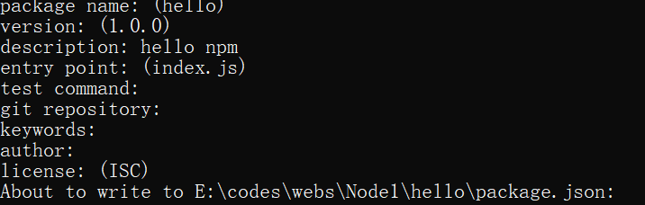

# Node.js

[TOC]

## 一. 绪论

### 1. 简介

`Node.js`是一个能够在**服务器端**运行的JavaScript的**开放源代码,跨平台JavaScript运行环境**

Node采用Google开发的V8隐情运行js代码,使用**事件驱动,非阻塞和异步IO模型**等技术提高性能

JavaScript不再满足于前端,可以直接去后台.

* Node.js之父: 瑞安达尔(Ryan Dahl)

 

### 2. 简单使用

安装后在cmd输入node就可以简单体验

> Node是对ES标准的一个实现,Node也是一个js引擎,但是不包含DOM和BOM
>
> 通过Node可以使js在服务器端运行
>
> 可以使用定时器和延时器(setTimeout,setInterval)


太惊人了,js居然能直接在命令行输出了

 或者直接 node xx.js就可以运行js文件

## ^pre^二. COMMONJS规范

### 1. ECMAScript的缺陷

1. 没有模块系统   附带知识:[模块化](#2. 模块化)
2. 标准库太少
3. 没有标准接口
4. 缺乏管理系统(类比java里的maven)

### 2. 模块化

如果程序设计规模达到了一定程度,则必须对其模块化

模块化可以有很多形式,但至少应该提供能够将代码分为多个源文件的机制

CommomJS拥有模块功能,**在Node.js中,一个js文件就是一个模块**

1. 降低耦合
2. 代码复用

### 3. CommonJS规范

> CommonJS的提出主要是为了弥补当前JS没有标准的缺陷<br/>CommonJS规范为JS指定了一个美好的愿景,希望JS能够在任何地方执行

Node主要看中了CommonJS的模块操作,接下来我们来看看Node的模块化吧

## 二. Node模块

```javascript
//hello.js内容
console.log("hello Node");

var a = 123;
var b = 456;

console.log(a + b);
```

### 1. Node模块和模块的导入

**在Node.js中,一个js文件就是一个模块**

使用`require(模块标识)`函数导入模块,然后就运行了模块里的内容

```javascript
require("./hello.js"); // 传绝对路径或相对路径
//但是!!!:相对路径必须以 . 或者 .. 开头
```

* 知识点:

  * 使用require引入模块以后,该函数会**返回一个对象**,代表的是**模块本身**

  * 在Node中, **每一个js文件(模块**)中的js代码都是**独立运行在一个函数**中的. 

    所以一个模块中的一般变量和函数在其他模块中无法访问

    ```javascript
    function(){
        console.log("hello Node");
    	var a = 123;
    	var b = 456;
    	console.log(a + b);
    }()
    //hello.js的真实情况
    ```

  * 如果模块想向外部暴露属性或方法,将想要暴露的东西设置为`exports`(这是一个变量)的属性

    ```javascript
    // hello.js
    var b = 456;
    exports.b = b;
    
    //引用它的模块
    var md = require("./hello.js");
    console.log(md.b);//456
    ```

    

### 2. 模块标识

我们用require引入外部模块时,需要传入模块标识

* 模块分为两大类
  * __核心模块__: 模块表示就是**模块的名字**
  * __文件模块__: 模块的标识是**路径**

```javascript
var fs = require("fs"); //核心模块
console.log(fs);
```

### 3. global全局对象

在node中有一个全局对象`global`,类似于网页中的window

在全局中创建的变量/函数都会作为global的属性/方法保存

> js前情提要: 在函数中用var声明的只有函数作用域,不用var/let声明的有全局作用域
>
> (但是在引用模块中看不到这种变量)

### 4. 模块都在函数中

当node在执行模块中的代码时,它会首先在代码的最顶部加上:

```javascript
function (exports, require, module, __filename, __dirname) {
```

最底部加上:

```javascript
}
```

把整个模块包成一个函数

> 正如所见,我们之前用的`exports`,`require`都是函数的参数

#### 4.1 参数

* __exports:__
  * 该对象用来将变量或函数暴露到外部
* __require:__
  * 函数,用来引入外部的模块
* __module__:
  * 代表当前模块本身
  * exports就是module的属性
* __\_\_filename__:
  * 当前模块的绝对路径
* __\_\_dirname__:
  * 当前模块所在文件夹的绝对路径

### 5. module.exports和exports

exports指向的是module.exports的内容

如果把exports直接赋值,那exports不再和module.exports指向同一个内容,就会失效

而赋值module.exports不会出现这样的问题,所以直接赋值给exports能批量增加

## 三. 包package

### 1. 简介 

包其实指的就是一个**压缩文件**,允许我们将一组相关的模块组合到一起,形成一组完整的工具

包由__包结构__和__包描述文件__组成

包解压以后还原为目录,符合规范的目录应该包含如下文件:

> <span style="color:red">package.json 描述文件</span>
>
> bin 可执行二进制文件
>
> lib 依赖的别的js代码
>
> doc 文档
>
> test 测试

## 四. 包管理工具NPM

### 1. 介绍

`NPM`(Node Package Manager)是对CommonJS包规范的一种实践

对于Node而言,NPM帮助其完成了第三方模块的发布,安装和依赖等.

借助NPM,Node形成了良好的生态系统

### 2. NPM命令

npm命令大多可以用首字母简写

* **查基础信息**

```bash
npm -v #查版本
npm version #连带模块的版本一起查
```

* **初始化包(自动创建package.json)**

  ```bash
  npm init
  ```

  

  entry point: 包的程序入口

* **查询包信息**

  ```bash
  npm search 包名 #模糊查询,查包
  ```

* **装包(当前目录)**

  ```bash
  npm install 包名 #安装
  npm install 包名 -g #全局安装,一般都是一些工具,不是在项目里而是在计算机用的,用的不多
  ## -------------------------
  npm install 包名 --save #安装包并添加(为当前包的)依赖,相当常用
  # 这样子别人使用的时候就不需要把包全部上传,只要使用依赖就行
  ## -------------------------
  ```

   

  * ```json
    package中记录的依赖
    "dependencies": {
        "math": "0.0.3"
    }
    ```

  * 

* **移除**

  ```bash
  npm remove 包名 #删包
  ```

  

* **使用**

  * 在**装包的目录**下创建js并使用

  ```javascript
  var math = require("math"); //npm引入直接写名字
  console.log(math);
  console.log(math.add(123, 456));
  ```


### 3. cnpm

npm在国外,所以自然不是很容易下载

所以用cnpm

### 4. 自动搜索

node在使用模块名字来引入模块时,它会首先在当前目录的node_modules寻找是否含有该模块

如果有则直接使用,如果没有就__去上一级目录的node_modules寻找__

能往上一级到磁盘根目录

如果到根目录还没有,就报错

## 五. Buffer

### 1. 做什么的

`Buffer`的结构和数组很像,操作的方法也和数组类似

原生的数组:

1. 性能比较差
2. 传统的数组存不了二进制文件

Buffer:

1. 结构上像数组,元素为16进制的两位数,0-255
2. 实际上一个元素就是内存中的一个字节
3. Buffer的内存不是通过JS分配的而是底层C++分配的


### 2. 使用Buffer

不需要导入模块,是node核心对象

```javascript
//将字符串保存到buffer中
var buf = Buffer.from(str);
//<Buffer 48 65 6c 6c 6f>


```

* 分配特定大小的buffer

```javascript
//Buffer构造函数已经过期了
//创建一个指定大小的buffer
// var buf2 = new Buffer(10);
var buf2 = Buffer.alloc(10);//10个字节,全0
var buf3 = Buffer.allocUnsafe(10); // 创建10个字节的空间,不清空原来的数据,性能好
console.log(buf2);
buf2[0] = 0x88;
```

* buffer是对底层内存的直接操作,如果溢出就直接往后操作,不会改变buffer大小
* 如果存的东西大于255,就截断到8位
* 数字在控制台输出是10进制,可以用`toString(16)`输出16进制

## 六. fs文件系统

作用就是操作 `系统中的文件,类似IO

### 1. 引入fs模块

```javascript
var fs = require("fs");
console.log(fs)
```

### 2. 同步和异步

fs模块中所有的操作都有两种形式可供选择__同步__和__异步__

同步文件系统会**阻塞程序**的执行,不完成就不往下执行代码

异步**不会阻塞程序**执行,而是在操作完成时通过回调函数将结果返回

* 对应的方法的两种形式:
  * `fs.xxxx(....,callback)`: 异步版本
  * `fs.xxxxSync(....)`: 同步版本

### 3. 同步 打开-写-关闭文件流程

#### 3.1 打开文件(同步)

```javascript
fs.openSync(path,flags[,mode]);
//path: 路径
//flags: 像"r","w"这种,标识打开方式
//mode: 设置权限,一般不写
//返回值: 文件的编号,Number类型
```

#### 3.2 写(同步)

```javascript
fs.writeSync(fd,string[,position][,encoding])
//fd: 文件的编号
//string: 要写入的字符串
//position: 起始位置,可以不写
//encoding: 编码,可以不写
```

#### 3.3 关闭(同步)

```javascript
fs.closeSync(fd);
```


#### 3.4 总览

```javascript
var number = fs.openSync("hello.txt","w");
fs.writeSync(number,"h444444444444444444ahah");
fs.closeSync(number);
```

### 4. 异步文件操作

> 异步方法不可能有返回值,只可能用回调函数操作
>
> 回调函数的操作和后面的代买没有执行顺序
>
> 错误优先,如果可能有error,则一定是回调函数第一个参数

#### 4.1 open

```javascript
fs.open("hello.txt","w",function(){
  	//回调函数的参数:
    // error: 没有错误就为null
    // fd: 文件描述符(number)
    console.log(arguments);
})
```

* error示例

  ```javascript
  '0': [Error: ENOENT: no such file or directory, open 'E:\codes\webs\Node1\filesystem\hello333.txt'] {
      errno: -4058,
      code: 'ENOENT',
      syscall: 'open',
      path: 'E:\\codes\\webs\\Node1\\filesystem\\hello333.txt'
    }
  ```

  

#### 4.2 write

```javascript
//在open的回调函数中运行
fs.write(fd,"aaa",function(err,writen,string){});
//err: 错误
//writen: 写入长度
//string: 写入内容
```

#### 4.3 close

```javascript

fs.close(fd,function(err){})
```

