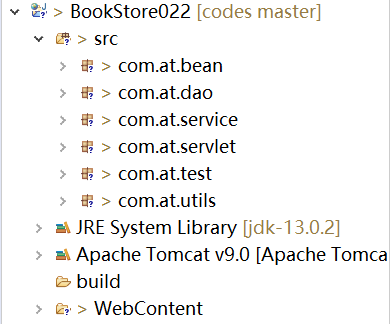
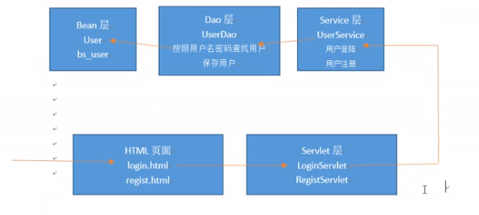
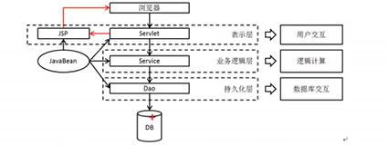
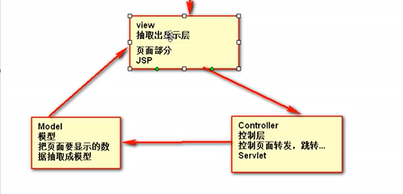
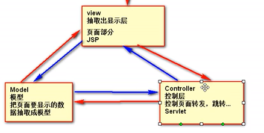
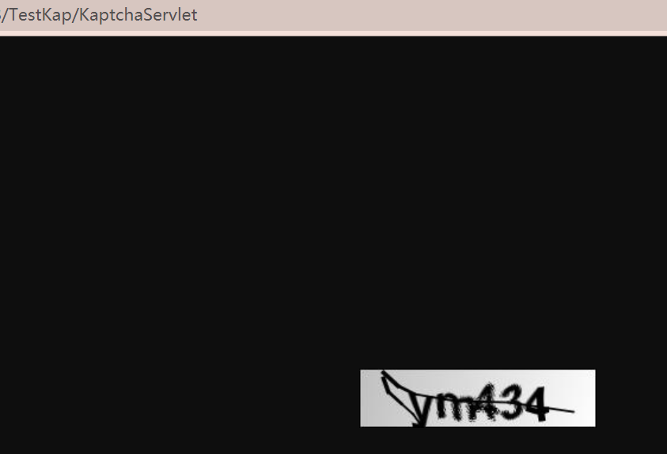
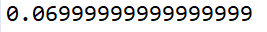
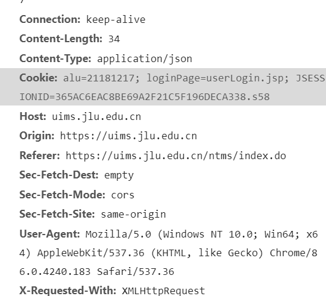
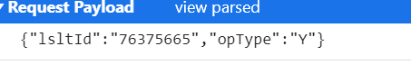

# 架构

## 一. 软件架构

```
|-软件
|-用户界面交互(前端)
|-----表示层(直接与用户交互)
|-业务逻辑(代码)
|-----业务逻辑层
|-----数据库访问层
```

分层的目的->分模块->解耦

* 表示层: 和用户直接交互

  * 有HTML页面
  * Servlet

* 业务逻辑层: 处理网站的业务功能

  * 编写的业务逻辑代码

    也可以称作`Service层`

* 数据库访问层:(`持久化层`)

  * `DAO层`: 所有操作数据库的类放在DAO层
  * `模型/bean层`: 创建与数据库数据对应的对象

## 二. 项目架构

### 1. 架构

基于软件架构如何构建项目

 

1. 用户查看html页面,发送请求
2. Servlet层某个Servlet收到用户请求
3. 调用Service层相关方法处理
4. Service层直接调用DAO和数据库沟通
5. DAO把查询到的封装成Bean,系统用bean就行
6. 

### 2. 分层开发

1. **需求分析,建立模型**

   1. 建立登录注册相关模型(Bean层)

      1. 建立用户表

         > 当数据表很多的时候一般会按照命名规则分层
         >
         > sys_user : 系统-用户

      2. 建立用户类

   2. 建立DAO层,操作数据库

      1. JDBCUtils,获取数据库连接
      2. 一个表一个DAO类,x先是BaseDAO然后扩展子类比如账户UserDAO

   3. 建立Service层

      1. 比如UserService管理用户,BookService管书

   4. 建立Servlet层: 处理用户请求

   5. 建立界面

### 3, BaseDAO难点

```java
public class BaseDAO<T> {
    private QueryRunner qr = new QueryRunner();
    private Class<T> type; //等待获取泛型的class

    public BaseDAO(){
        //获取父类类型
        ParameterizedType superclass = (ParameterizedType) this.getClass().getGenericSuperclass(); //经过测试,当前类的type为有参数type
        type = (Class<T>) superclass.getActualTypeArguments()[0];//所以可以直接获取泛型参数给type
    }
}
```

## 三. MVC模式

### 1. 从Web应用的层次结构说起

1. 显示层: 用户交互
2. 业务逻辑层: 逻辑运算
3. 持久化层: 数据库交互,增删改查



* 软件分层的好处:
  * 简化开发
  * 易于维护
  * 易于分工

### 2. MVC

`Model View Controller`

MVC最初是显示层模型,现在已经可以应用于整个软件架构

* `View视图`: 只负责数据和界面的显示,不接受与显示数据无关的代码,便于程序员的分工合作
  * JSP,HTML,少量接触java代码
* `Model模型`: 把页面要显示的数据抽取成模型
* `Controller控制层`: 控制页面转发,跳转逻辑
  * servlet层

MVC显示层逻辑



MVC的另一种逻辑



* 从红线看:
  * Model: 把页面要显示的数据抽取成模型JavaBean
* 从蓝线看:
  * Model: 是业务模型service层,可以访问数据库Dao层

### 3. MVC框架

Struts2(过时),SpringMVC

# 技术技巧

## 一. 分页

为了减轻数据库负担, 我们需要将显示分页,就像百度那样.

### 1. 分层准备

* Servlet控制层: BookManagerServlet -->list
* Service层: 查出部分图书(分页要求的第一页,第二页...)
* Dao层: 查出部分图书(分页查询 limit index,size)
* Bean层: 图书bean,分页模型bean
  * 分页模型: 封装当前模型信息
  * 

### 2. Bean层

分页模型Page内容分析:

* 封装的东西可以多种多样,他们都可以分页

```
//当前第几页 int pageNo           用户请求的
//一共几页 int totalPage	      计算出来的,根据总记录数以及每页记录数
//总记录数 int totalCount         数据库select count(1)
//页面记录数 int pageSize          人工指定
//数据库查询的起始索引 int index;    根据请求第几页计算(pageNo - 1) * pageSize
//是否有下一页 boolean hasNext;
//是否有上一页 boolean hasPrev;     
//分页的实际数据: List<T> pageData

//分页请求的url: String url
```

### 3. Dao层

写一些分页有关的Dao

```java
//List<Book> getPageList(int index,int size) //在Dao层返回原始数据
//
```

### 4. Service层

写分页有关的方法,传入页码,页面大小,创建bean并设置值,返回

### 5. Servlet层 + 视图层

第一次请求显示图书列表,应该只显示第一页数据

```java
//弄个page方法
```

* 页面跳转绑定事件受base标签影响

```javascript
$("#gotopage").click(function(){
	var pn = $("#pn_input").val();
	location.href = "manager/BookManagerServlet?method=page&pn=" + pn;
})
```

* 完整分页jsp出版

  ```jsp
  <div id="page_nav">
  <a href="manager/BookManagerServlet?method=page">首页</a>
  <c:if test="${page.hasPrev}">
  <a href="manager/BookManagerServlet?method=page&pn=${page.pageNo - 1 }">上一页</a>
  </c:if>
  
  <c:forEach begin="1" end="${page.totalPage }" var="pnum">
  	<c:if test="${page.pageNo == pnum}">
  		【${page.pageNo }】
  	</c:if>
  	<c:if test="${ page.pageNo != pnum}">
  	<a href="manager/BookManagerServlet?method=page&pn=${pnum}">${pnum }</a>
  	</c:if>
  </c:forEach>
  
  <c:if test="${page.hasNext }">
  	<a href="manager/BookManagerServlet?method=page&pn=${page.pageNo + 1 }">下一页</a>
  </c:if>
  <a href="manager/BookManagerServlet?method=page&pn=${page.totalPage }">末页</a>
  共${page.totalPage }页，${page.totalCount }条记录 到第
      <input value="${page.pageNo }" name="pn" id="pn_input" />页 
      <input type="button" value="确定" id="gotopage">
  </div>
  ```

  

页码缩略显示分析:

> 当前1: [1],2,3,4,5
>
> 当前2: 1,[2],3,4,5
>
> 当前4 2,3,[4],5,6  相当于只显示当前页码的前两页,后两页

* 五页以内全部显示

  begin=1,end=totalPage

* 五页以上

  * 当前页码小于3,显示1-5 begin=1,end=5

```jsp

<c:if test="${page.totalPage > 5 }">
	<c:if test="${page.pageNo <= 3 }">
		<c:set scope="page" var="begin" value="1"></c:set>
		<c:set scope="page" var="end" value="5"></c:set>
	</c:if>
	<c:if test="${page.pageNo > 3 }">
		<c:set scope="page" var="begin" value="${page.pageNo - 2 }"></c:set>
		<c:set scope="page" var="end" value="${page.pageNo + 2 }"></c:set>
	</c:if>
	<c:if test="${page.pageNo + 2 > page.totalPage }">
		<c:set scope="page" var="begin" value="${page.totalPage - 4 }"></c:set>
		<c:set scope="page" var="end" value="${page.totalPage }"></c:set>
	</c:if>
</c:if>
	<c:forEach begin="${begin}" end="${end }" var="pnum">
        ...
```

## 二. 首页过Servlet

首先修改默认welcome-file是行不通的,因为各种文件都会过`/`目录,会调用多次servlet

不妨在首页直接转发到Servlet

```jsp
<jsp:forward page="..."></jsp:forward>
```

## 三. 用session记录登录登出状态

将登录的用户保存在session中,方便资源共享

```java

HttpSession session = request.getSession();
session.setAttribute("user", login);
```

## 四. 表单重复提交

### 1. 表单重复提交的情况

表单重复提交指多次提交相同内容的表单

* 情况1:

如果请求request不变(比如转发页面),只要刷新就会造成重复的请求/表单提交

* 情况2:

卡了一会(处理请求慢),用户点了好多下提交

* 情况3:

用户成功以后直接后退(从缓存中)再次提交

### 2. 危害

1. 数据库多次保存相同数据
2. 安全问题,可能造成重复支付
3. 服务器性能压力,因为http是无状态协议

### 3. 对应解决方法

情况1: 转发改成重定向,或者使用令牌机制

情况2: 点击以后把按钮disable,并提交表单(通过javascript),或者使用令牌机制

情况3: 通过令牌机制(token)

所以令牌机制可以解决所有表单重复提交问题

### 4. token机制

每次提交表单,带上令牌,服务器验证口令,口令合法就处理,不合法就打回

服务器和页面有一个相同的令牌就行,页面提交的时候带上

* 具体操作:

  * jsp: 生成uuid,并在表单提交

    <span style="color:red">注意: 回退之后这个加载的是<b>缓存</b>,不会生成新的uuid不会过session,表单内容也不变</span>

  ```jsp
  <%
  	//产生一个唯一不重复的令牌
  	String uuid = UUID.randomUUID().toString();
  	session.setAttribute("token",uuid);
  %>
  	<base href="http://localhost:8888<%=request.getContextPath() %>/">
  	<form action="UserServlet" method="post">
  	<input type="text" name="token" value="<%=uuid%>"/>
  ```

  * servlet: 对比request(表单)和session内的token是否一致,移除session的token

    * 如果是情况3,表单会一直提交最初的内容,而第二次开始session的token就是null了

      ```java
      HttpSession session = request.getSession();
      		String token = (String)session.getAttribute("token"); 
      		//服务器从session取到的令牌
      		String pageToken = request.getParameter("token");
      
      		session.removeAttribute("token");
      		
      		if(pageToken.equals(token)){
      			String username = request.getParameter("username");
      			response.sendRedirect(request.getContextPath() + "/success.jsp");
      		}else {
      			response.sendRedirect(request.getContextPath() + "/error.jsp");
      		}
      ```

      

## 五. 验证码

### 1. 验证码

验证码的作用就是防止多次恶意请求

简单的流程:

1. 页面显示验证码,发送表单时提交验证码
2. 验证码正确则保存用户
3. 验证码不正确就打回

### 2. 机制

和token机制的想法差不多

> 在页面中生成验证码图片 -> 给session中保存验证码实际内容 -> 用户提交表单 -> 
>
> 取出session中的内容以及页面带来的内容(验证码)进行匹配 ->判断是否成功

### 3. 来玩用java的工具生产验证码

导入`kaptcha-2.3.2.jar`

#### 3.1 小实验

注意到jar包内有个自带的`com.google.code.kaptcha.servlet.KaptchaServlet`

这是一个servlet,就尝试着去请求了一下,果然它返回给页面了一张验证码图片

****

 

#### 3.2 应用于页面

利用img的src属性可以直接把验证码图片引入

```jsp
/KaptchaServlet">
```

#### 3.3 从session中取对应值

Constants类中存储了它放在session中的key

```java
  public static final java.lang.String KAPTCHA_SESSION_KEY = "KAPTCHA_SESSION_KEY";
```

所以取对应值只要用这个字段就可以了

> 注意: 图片生成需要时间,在这个时间里取session的值是不准的,如果可以,应当等待或者到别的页面取

#### 3.4 配置生成图片的参数

配置自己上网查

配置的地方在web.xml的servlet下增加init

```xml
<init-param>
  		<param-name>kaptcha.textproducer.char.length</param-name>
  		<param-value>2</param-value>
</init-param>
```


### 4. 点击图片显示新的验证码

首先给img绑定点击监听,然后给img的src属性再次赋予Servlet路径(此处是/code.jpg)

为了清除浏览器以为的重复请求缓存,在后面挂上一串随机数

```javascript
$("#codeImg").click(function(){
	var url = "code.jpg?t=" + Math.random();
	$(this).prop("src",url);
})
```

## 六. 浮点精度问题



### 1. 一般精度问题

* 精度问题一般产生在:
  * 大整数运算: 过大的整数导致溢出,变为0或者负数
  * 浮点数运算: 神出鬼没比如上面那图是0.01+0.06

> 因为浮点数存的时候就没有很高的精度,计算的时候自然没有很高的精度

### 2. 用BigDecimal解决精度问题

可以解决大整数的,也可以解决浮点数的(?)

其实在Java的常用类笔记里有

* 构造器:
  * 传入整型,浮点型,字符串都能转换成指定数据
  * 但是传入浮点数毕竟本来就不精确,__不如传字符串__
* 然后运算方面:
  * a.add(b)
  * a.subtract(b)
  * a.abs()
  * a.multiply(b)
  * a.divide(b)
  * a.doubleValue() 转回double

## 七. gzip压缩页面

如果请求头中表示`accept-encoding: gzip deflate sdch`(中的一个)就表示接受压缩形式的网页

我们这里用gzip为例

### 1. 服务器的反应

服务器当意识到可以用gzip压缩的时候,就会把内容用gzip压缩并发给服务器

响应头:`Content-Encoding: gzip`

浏览器接收到以后解码并接受gzip内容

> 但是对于二进制文件没有用

### 2. 拓展

在nginx笔记中记载着gzip的配置





 


https://uims.jlu.edu.cn/ntms/action/select/select-lesson.do