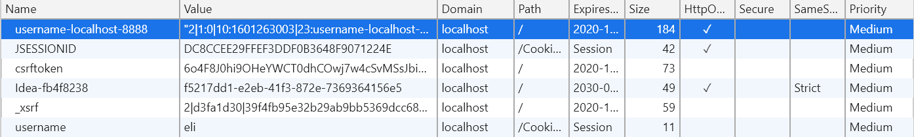
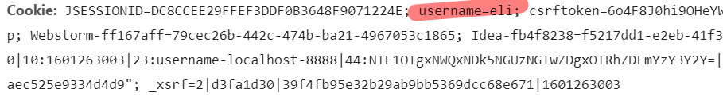

# 会话控制

## 一. Cookie

### 1. 是啥

简而言之,Cookie就是<u>服务器</u>要<u>发给浏览器</u>保存的数据,浏览器保存相关数据

```
现存的问题:
 http是无状态协议,服务器无法分辨每次请求来自于谁
解决方案:
 如果客户端来的时候能带上类似会员卡卡号的东西就能唯一辨识了
	服务器就这样让浏览器保存一段数据,以后访问的时候带上相应数据
```

### 2. 创建cookie并发给浏览器

`有一个`javax.servlet.http`下的Cookie类,可new

```java
Cookie cookie = new Cookie("username", "eli");
//参数为任意键值对,String,String
```

`然后用响应发给浏览器

```java
response.addCookie(cookie);
```

`然后一看响应头


* 这就是命令浏览器保存一个cookie,内容就是后面那串
* 在F12的`Resources`栏查看cookie(当前ip下的资源)

`然后在这个地方可以看到cookie的详细信息,包括指定路径,周期等(默认存活一个session)

`最后看看同session同样访问servlet的网页,请求头里都带了cookie



### 3. Cookie获取

`使用request直接获取Cookie数组

```java
Cookie[] cookies = request.getCookies();
```

`遍历数组,取出key-value对

```java
//一个cookie对应kv键值对,所以不需要key取
for (Cookie cookie : cookies) {
	String name = cookie.getName(); //取key
	String value = cookie.getValue(); //取value
}
```

