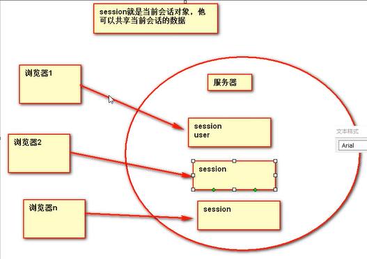

# 会话控制

## 一. Cookie

### 1. 是啥

简而言之,Cookie就是<u>服务器</u>要<u>发给浏览器</u>保存的数据,浏览器保存相关数据

```
现存的问题:
 http是无状态协议,服务器无法分辨每次请求来自于谁
解决方案:
 如果客户端来的时候能带上类似会员卡卡号的东西就能唯一辨识了
	服务器就这样让浏览器保存一段数据,以后访问的时候带上相应数据
```

### 2. 创建cookie并发给浏览器

`有一个`javax.servlet.http`下的Cookie类,可new

```java
Cookie cookie = new Cookie("username", "eli");
//参数为任意键值对,String,String
```

`然后用响应发给浏览器

```java
response.addCookie(cookie);
```

`然后一看响应头


* 这就是命令浏览器保存一个cookie,内容就是后面那串
* 在F12的`Resources`栏查看cookie(当前ip下的资源)

`然后在这个地方可以看到cookie的详细信息,包括指定路径,周期等(默认存活一个session)

`最后看看同session同样访问servlet的网页,请求头里都带了cookie


### 3. Cookie获取

`使用request直接获取Cookie数组

```java
Cookie[] cookies = request.getCookies();
```

`遍历数组,取出key-value对

```java
//一个cookie对应kv键值对,所以不需要key取
for (Cookie cookie : cookies) {
	String name = cookie.getName(); //取key
	String value = cookie.getValue(); //取value
}
```

### 4. Cookie的存活时间/生命周期/删除

* 默认cookie是在会话(session)期间有效,浏览器不关就不会没

* cookie对象有可以修改和获取`maxAge`的方法

  ```java
  int maxAge = cookie.getMaxAge();
  ```

#### 4.1 删除

* 删除对象可用setMaxAge完成

  * 理论:

  ```java
  //setMaxAge的参数注释
  Parameters:
  expiry - an integer specifying the maximum age of thecookie in `seconds`; 
  //正数表示存活时间的秒数
  if negative, means the cookie is not stored;//负数表示不会保存,但是浏览器的行为不同
  if zero, deletes the cookie //0表示删除
      See Also:getMaxAge()
  ```

  * 操作: 把cookie的maxAge修改为0,并__重新添加到响应头__

    ```java
    if("username".equals(cookie.getName())) {
    				cookie.setMaxAge(0);
    				response.addCookie(cookie);
    			}
    ```

  * 响应头内容: 直接把消亡时间设置到了1970

    ```java
    Set-Cookie: username=eli; Max-Age=0; Expires=Thu, 01-Jan-1970 00:00:10 GMT
    ```

    

#### 4.2 持久化cookie

把maxAge设置的大一点,然后发给浏览器

```java
if("username".equals(cookie.getName())) {
	cookie.setMaxAge(60*60);
	response.addCookie(cookie);
}
```

经测试,这样它就可以跨session存活了,但是触发的path不变

```java
Set-Cookie: username=eli; Max-Age=3600; Expires=Thu, 01-Oct-2020 07:44:20 GMT
    //格林威治+8才是我这的时间
    //受电脑时间影响
```

### 5. Cookie设置路径

cookie路径: 告诉浏览器,访问哪些资源你(浏览器)应该携带我这个cookie

* 默认: 访问当前项目下的所有路径都会带上cookie

其实没什么好说的,就是`getPath`和`setPath`

- Specifies a path for the cookie to which the client should return the cookie. 

- 绝对路径表示__服务器根__

  ```java
  cookie.setPath("/Hello");
  response.addCookie(cookie);
  //响应头: Set-Cookie: mycookie=myvalue; Path=/Hello
  ```


> 虽然404,但是cookie却设置到了
>
> ```url
> http://localhost:8888/Hello
> ```

### 6. cookie的覆盖

同名cookie会覆盖,其实删除,持久化,修改值,修改路径,都可以直接用同名cookie覆盖原cookie

### 7. cookie的交互原理


### 8. cookie实践: 免输用户名

#### 8.1 EL隐含对象:cookie

```java
cookie       java.util.Map<String,Cookie>        返回cookie对象
```

${cookie}:打印出的值是__键值对的集合,键是Cookie的key,值是Cookie对象__


${cookie.username}打印的是以username为key的cookie对象

```jsp

用户名: <input name="username" value="${cookie.username.value }" type="text"/>
```

## 二. Session

### 1. 是啥

是__服务器端保存数据的技术__: 作为整个会话期间的域对象,保存整个会话期间的任意资源

作用:

​	作为域对象共享数据

​	可以在cookie中保存用户身份,

### 2. 获取

```java
HttpSession session = request.getSession();
//简单易懂的获取,这就是session域对象

boolean new1 = session.isNew();//用这个判断session是不是新创建的,打开会话第一次获取是新的
```

### 3. 保存和获取attribute

就是域对象那一套操作

### 4. session的生命周期

* **获取**

获取session的默认最大存活时间: 30min

但是session是根据浏览器携带的cookie获取的,cookie的默认生命周期是Session(会话),所以每次开浏览器会产生新的cookie->新的session

**旧的session还在**,并且一直存活

```java
int maxInactiveInterval = session.getMaxInactiveInterval();
//默认值1800,当时间到以后,服务器会覆盖之前的cookie
```

> 这个默认时间定义在服务器的大web.xml中
>
> ```xml
> <!-- ==================== Default Session Configuration ================= -->
>   <!-- You can set the default session timeout (in minutes) for all newly   -->
>   <!-- created sessions by modifying the value below.                       -->
> 
>     <session-config>
>         <session-timeout>30</session-timeout>
>     </session-config>
> 
> ```


* **设置**

  1. 可以在项目的小web.xml里设置,语法跟大的一样

     ```xml
      <session-config>
       	<session-timeout>
       		1
       	</session-timeout>
       </session-config>
     ```

  2. 有getter自然有setter

     ```java
     session.setMaxInactiveInterval(1);
     //选择负数,永不过期
     //选择正数,则消亡时间是"距离最后一次使用session的n秒后"
     ```

* **强制session失效**

  ```java
  session.invalidate();
  ```

### 5. 钝化和活化

我们发现在服务器关闭以后没有销毁session

* **钝化:** 服务器关闭以后/session闲置一段时间(不超过30min)/当session大量存在(最近最少使用),会将session保存在硬盘中(序列化)
* **活化**: 服务器再启动时,会把session加载到内存中(反序列化)

> 注意: 存在session中的对象需要实现序列化接口,用序列化id(就是可序列化的操作)才能正常存取

可以在work的项目目录下观察到`SESSIONS.ser`,关闭服务器就有,开了就没有


## 三. 会话控制机制

### 1. session的对应

各个会话的session由服务器保存,用id唯一标识



* Session的唯一标识: `id`

  ```java
  session.getId();
  ```

### 2. *如何知道浏览器对应的session

使用cookie

> 1. 当浏览器第一次使用session,服务器会创建相关session
>
>    * 对于html,第一次使用时request.getSession;对于jsp,第一次是在访问的时候直接获取了
>    * 如果jsp设置了session=false,就不会自己获取
>
> 2. 然后服务器在响应头里加一个set-cookie响应头,cookie的key是`JSESSIONID`,value是**对应session的id**,path是当前项目,expire是session
>
>    
>
> 3. 浏览器按要求保存cookie
>
> 4. 以后浏览器在同一会话中再访问服务器会cookie带上session的id,就不会再新创建了
>
>    

### 3. 当cookie被禁用该怎么会话控制

使用**url重写**技术,自己把jsessionid带上

```url
//举例: 当你要访问一个s.jsp,又不能发cookie,你只能:
http://localhost:8888/Cookie_Session/s.jsp;jsessionid=9A0ECB97934AB6E49FE5C66374CD9A4D
```

使用`;`分隔,后面加上键值对

* 程序内自动添加:
  * 使用response的`response.encodeRedirectURL`方法,它会给禁用cookie的地方自动带上url重写
  * 当需要跳转带cookie的时候,就用jsp表达式把这个方法放在href/action里面就行了

```java
//效果:response.encodeRedirectURL(request.getContextPath() + "/s.jsp")
/Cookie_Session/s.jsp;jsessionid=FE88C4CFA4388FBFBF432D0608D28E81
```

* 或者**JSTL来url重写**(\<c:url>)

```java
<c:url value="/s.jsp"></c:url>
    //效果跟上面差不多,根目录从项目开始,可以直接写在href或action中
```

