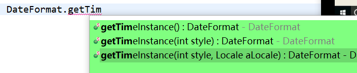
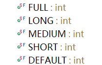
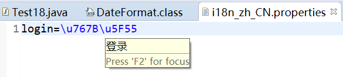

# 国际化

`国际化(Internationalization)`18个字母,指的是同一个网站可以支持多种不同的语言,以便不同国建不同语种的用户访问

## 一. 

i18n依赖到java中的三个类.`ResourceBundle`,`Locale`,`xxxFormat`

`ResourceBundle`: 资源绑定,管理资源文件(动态获取内容)

`Locale`: 代表当前区域

`xxxFormat`: 比如DateFormat,日期格式化

### 1. Locale

```java
Locale default1 = Locale.getDefault();
Locale default2 = Locale.US;
//格式: 语言_地区
System.out.println(default1);//zh_CN
System.out.println(default2);//en_US
```

### 2. DateFormat



传入style和Locale,获得相应时间格式: 如下是style的取值



```java
System.out.println( DateFormat.getTimeInstance(DateFormat.FULL,default1).format(new Date()));
		
		System.out.println(DateFormat.getTimeInstance(DateFormat.FULL,default2).format(new Date()));

//中国标准时间 下午3:16:02
//3:16:02 PM China Standard Time

```

### 3. ResourceBundle

写资源文件,`基础名_语言_国家.properties`,比如i18n_zh_CN.properties,放在类路径下



* 获取

  ```java
  ResourceBundle bundle = ResourceBundle.getBundle("i18n",Locale.CHINA);
  //传基础名和locale
  //它就能动态找到对应properties的信息
  
  String string = bundle.getString("login");
  		System.out.println(string);//登录
  ```

  

## 二. 标签库实现

JSTL的fmt标签库

`<fmt:setBundle basename="base"></fmt:setBundle>` 设置Bundle

`<fmt:message key="welcome"></fmt:message>` 获取信息并显示

`<fmt:formatDate value="<%=new Date()%>">`显示日期,可以用dateStyle,timeStyle,(FULL,LONG...)type(指定显示日期还是时间)之类的

`<fmt:setLocale value="en_US">`设置Locale

properties文件可以动态参数,{0},{1},然后用fmt:param填充(写在fmt:message体中间)