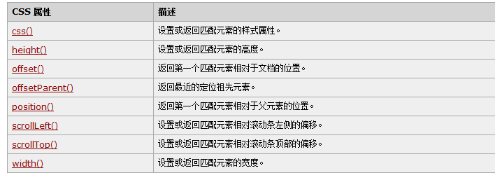

# jQuery


## 一. 绪论

我们DOM的CRUD太糟心了,大佬就用jQuery封装了DOM的CRUD,重点放在__Query(查)__上

> jQuery: write less,do more.

### 1. 它是啥

jQuery本质上就是一个__JS函数库__


### 2. 为什么用它

> HTML元素选取(选择器)
>
> HTML元素操作
>
> CSS操作
>
> HTML时间处理
>
> JS动画效果
>
> **链式调用**
>
> **读写合一**
>
> 浏览器兼容
>
> 易拓展插件
>
> ajax封装

## 二. HelloWorld

### 1. 简单的找按钮对比

```javascript
//window.$函数是由jquery模块提供的函数
$(function(){ //外层相当于调用window.onload
                $("#btn2").click(function(){ //前面相当于获取btn元素,后面绑定单击事件
                    alert("Hello World");
                });
	})
```

* __核心函数:__ `$()`或者`jQuery()`
  * 参数: 一个function

## 三. 核心函数$

### 1. 四大用法

1. 当传入`函数`时:

   文档加载完成后执行此方法

2. 当传入`HTML字符串`时

   根据字符串创建节点对象

   ```javascript
   $("<div>ooo</div>")
   ```

3. 当传入`选择器字符串`时

   根据选择器找到元素节点对象

   ```javascript
   $("#id")
   ```

4. 当传入`DOM对象`时

   把DOM对象打包成jQuery对象并返回

   ```javascript
   $(this)
   ```

   * jquery转DOM: jQuery对象其实都是数组,只要用[0]取出元素就能直接用DOM的东西

```javasc
$("<div style='background-color: red;width: 100px;height: 100px'></div>").appendTo($("#btn1"))
```

### 2. 事件和css

| 方法                                                       | 描述                                                         |
| ---------------------------------------------------------- | ------------------------------------------------------------ |
| [bind()](event_bind.asp)                                   | 向匹配元素附加一个或更多事件处理器                           |
| [blur()](event_blur.asp)                                   | 触发、或将函数绑定到指定元素的 blur 事件                     |
| [change()](event_change.asp)                               | 触发、或将函数绑定到指定元素的 change 事件                   |
| [click()](event_click.asp)                                 | 触发、或将函数绑定到指定元素的 click 事件                    |
| [dblclick()](event_dblclick.asp)                           | 触发、或将函数绑定到指定元素的 double click 事件             |
| [delegate()](event_delegate.asp)                           | 向匹配元素的当前或未来的子元素附加一个或多个事件处理器       |
| [die()](event_die.asp)                                     | 移除所有通过 live() 函数添加的事件处理程序。                 |
| [error()](event_error.asp)                                 | 触发、或将函数绑定到指定元素的 error 事件                    |
| [event.isDefaultPrevented()](event_isdefaultprevented.asp) | 返回 event 对象上是否调用了 event.preventDefault()。         |
| [event.pageX](event_pagex.asp)                             | 相对于文档左边缘的鼠标位置。                                 |
| [event.pageY](event_pagey.asp)                             | 相对于文档上边缘的鼠标位置。                                 |
| [event.preventDefault()](event_preventdefault.asp)         | 阻止事件的默认动作。                                         |
| [event.result](event_result.asp)                           | 包含由被指定事件触发的事件处理器返回的最后一个值。           |
| [event.target](event_target.asp)                           | 触发该事件的 DOM 元素。                                      |
| [event.timeStamp](event_timeStamp.asp)                     | 该属性返回从 1970 年 1 月 1 日到事件发生时的毫秒数。         |
| [event.type](event_type.asp)                               | 描述事件的类型。                                             |
| [event.which](event_which.asp)                             | 指示按了哪个键或按钮。                                       |
| [focus()](event_focus.asp)                                 | 触发、或将函数绑定到指定元素的 focus 事件                    |
| [keydown()](event_keydown.asp)                             | 触发、或将函数绑定到指定元素的 key down 事件                 |
| [keypress()](event_keypress.asp)                           | 触发、或将函数绑定到指定元素的 key press 事件                |
| [keyup()](event_keyup.asp)                                 | 触发、或将函数绑定到指定元素的 key up 事件                   |
| [live()](event_live.asp)                                   | 为当前或未来的匹配元素添加一个或多个事件处理器               |
| [load()](event_load.asp)                                   | 触发、或将函数绑定到指定元素的 load 事件                     |
| [mousedown()](event_mousedown.asp)                         | 触发、或将函数绑定到指定元素的 mouse down 事件               |
| [mouseenter()](event_mouseenter.asp)                       | 触发、或将函数绑定到指定元素的 mouse enter 事件              |
| [mouseleave()](event_mouseleave.asp)                       | 触发、或将函数绑定到指定元素的 mouse leave 事件              |
| [mousemove()](event_mousemove.asp)                         | 触发、或将函数绑定到指定元素的 mouse move 事件               |
| [mouseout()](event_mouseout.asp)                           | 触发、或将函数绑定到指定元素的 mouse out 事件                |
| [mouseover()](event_mouseover.asp)                         | 触发、或将函数绑定到指定元素的 mouse over 事件               |
| [mouseup()](event_mouseup.asp)                             | 触发、或将函数绑定到指定元素的 mouse up 事件                 |
| [one()](event_one.asp)                                     | 向匹配元素添加事件处理器。每个元素只能触发一次该处理器。     |
| [ready()](event_ready.asp)                                 | 文档就绪事件（当 HTML 文档就绪可用时）                       |
| [resize()](event_resize.asp)                               | 触发、或将函数绑定到指定元素的 resize 事件                   |
| [scroll()](event_scroll.asp)                               | 触发、或将函数绑定到指定元素的 scroll 事件                   |
| [select()](event_select.asp)                               | 触发、或将函数绑定到指定元素的 select 事件                   |
| [submit()](event_submit.asp)                               | 触发、或将函数绑定到指定元素的 submit 事件                   |
| [toggle()](event_toggle.asp)                               | 绑定两个或多个事件处理器函数，当发生轮流的 click 事件时执行。 |
| [trigger()](event_trigger.asp)                             | 所有匹配元素的指定事件                                       |
| [triggerHandler()](event_triggerhandler.asp)               | 第一个被匹配元素的指定事件                                   |
| [unbind()](event_unbind.asp)                               | 从匹配元素移除一个被添加的事件处理器                         |
| [undelegate()](event_undelegate.asp)                       | 从匹配元素移除一个被添加的事件处理器，现在或将来             |
| [unload()](event_unload.asp)                               | 触发、或将函数绑定到指定元素的 unload 事件                   |



### 3. 举例: 给div修改颜色

```javascript
$(function(){
    $("#btn2").click(function(){
        $("#jq2jq").css("background-color","yellow");
        $('div').css({background-color:"red"})
    })
})
```

### 4. $的方法

```javascript
$.each(对象/数组,func(i,value)) //遍历数组或对象
$.type(obj) //得到obj的数据类型
$.isArray(arr) //是否为数组
$.parseJSON(json) //解析json字符串转换为js对象/数组
```


## 四. jQuery对象

jQuery对象内部是包含Dom对象的伪数组,拥有很多有用的属性和方法操作DOM

### 1. 基本行为

```javascript
//一个伪数组的基本行为
obj.size()/length
obj[index]/get(index)
obj.each(func(index,domEle){}) //this是谁,就是button对象
obj.index(); //得到obj在兄弟元素中的下标,-1表示找不到
```

## 五. 选择器

### 1. 基本选择器

跟CSS选择器一样

### 2. 层次选择器

空格 后代

\> 子元素

\+ 后一个兄弟元素

~ 匹配prev后面所有符合条件的兄弟元素

### 3. 过滤选择器

* `:first`: 在前面选择器的基础上选择第一个

* `:last`: 在前面的选择器基础上选择最后一个

* `:not(选择器)`: 基础上排除一些满足选择器的元素

* `:eq(index)`: 索引值等于某值

* `:gt(index)`: 索引值大于某值

* `:lt(index)`: 索引值小于某值

  * >  注意: 每次使用过滤都会重新分配index,后面用的index都是在前一个分配以后的

内容:

* `:contains(内容字符串)` 满足标签中内容能匹配上的元素

可见性:

* `:hidden` 选中隐藏的元素(display:none)

属性:

* `[属性名]` 拥有属性的元素
* `[属性名=value]`,拥有属性且值为value的元素,可以不加引号
* `[]`

### 4. 表单选择器

就

表单

`:input`

`:text`

`:password`

`:radio`

`:checkbox`

`:submit`

`:image`

`:reset`

`:button`

`:file`

`:hidden`

表单对象属性

`:enabled`,`:disabled`,`:checked`,`:selected`

```javascript
$(function () {
            $(":input:disabled").css("backgroundColor","red")
})
```

## 六. 对元素属性/文本的操作

### 1. attr方法和prop

`attr方法`

```javascript
attr(name) //获取属性值
attr(name,value) //设置属性值

//prop专门操作属性值为boolean的
prop(name)
prop(name,value)
```

### 2. removeAttr方法

移除元素的属性

```javascript
removeAttr(name)
```

### 3. addClass方法

增加class属性(不覆盖),毕竟可以有多个class

```javascript
addClass(value);
```

### 4. removeClass方法

```javascript
removeClass(value)
```

### 5. html()

对应innerHTML

```javascript
html() //返回innerHTML
html(str) //设置innerHTML
```

### 6. val()

获取或者设置value

## 七. 对CSS操作

### 1. 普通css

```javascript


css(name) // 获得值
css(name,value) //设置值
css({name:value,name:value}) // 设置多个值
```

### 2. 位置

offset和position方法

```javascript
//获取
offset() //返回一个含有left和top属性的offset对象
//是相对于页面

position() //返回一个含有left和top属性的position对象
//相对于父元素,不管有没有开定位

//设置
一样的方法,传有left和top的对象
```

scrollTop/scrollLeft方法

```javascript
scrollTop([value]);//获取或者设置滚动的顶部和真正的顶部(滚动区)的相对距离
```

### 3. 尺寸

`height()`和`width()`方法

* 内容尺寸: 内容区

  ```javascript
  height(); //设置和获取高度
  width(); //设置和获取宽度
  ```

* 内部尺寸: 内容区+内边距

  ```javascript
  innerHeight(); //设置和获取高度
  innerWidth(); //设置和获取宽度
  //似乎可以设置,改的是内容区
  ```

* 外部尺寸: 边框+内容+内边距(+margin)

  ```javascript
  outerHeight(boolean); //设置和获取高度
  outerWidth(boolean); //设置和获取宽度
  //传true获得外边距,大概不推荐修改
  ```

  

## 八. 筛选

都是jQuery对象的方法,就是选择器plus

### 1. 过滤

从jQuery中过滤需要的. 数据是和对象有关系的

> eq(index),first(),last(),
>
> filter("选择器"),not("选择器")
>
> has("选择器") //有指定子元素

```javascript

//         需求:
//         1. ul下li标签第一个
var li1 = $("ul > li").first();
$("ul>li").eq(0);

//         2. ul下li标签的最后一个
$("ul>li").last();

//         3. ul下li标签的第二个
$("ul>li").eq(1);

//         4. ul下li标签中title属性为hello的
$("ul>li").filter("[title=hello]")
//         5. ul下li标签中title属性不为hello的
$().not("[title=hello]")
$().filter("[title][title!=hello]")

//         6. ul下li标签中有span子标签的
$().has("span");
```

### 2. 查找

从jQuery对象的**子孙后代兄弟姐妹**里找符合条件的节点

* `children(选择器)`
  * 找__子元素__
* `find(选择器)`
  * 找__后代元素__
* `parent()`
  * 找父元素
* `prevAll(选择器)`
  * 找前面的兄弟元素
* `siblings(选择器)`
  * 找所有兄弟元素