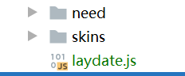

# jQuery


## 一. 绪论

我们DOM的CRUD太糟心了,大佬就用jQuery封装了DOM的CRUD,重点放在__Query(查)__上

> jQuery: write less,do more.

### 1. 它是啥

jQuery本质上就是一个__JS函数库__


### 2. 为什么用它

> HTML元素选取(选择器)
>
> HTML元素操作
>
> CSS操作
>
> HTML时间处理
>
> JS动画效果
>
> **链式调用**
>
> **读写合一**
>
> 浏览器兼容
>
> 易拓展插件
>
> ajax封装

## 二. HelloWorld

### 1. 简单的找按钮对比

```javascript
//window.$函数是由jquery模块提供的函数
$(function(){ //外层相当于调用window.onload
                $("#btn2").click(function(){ //前面相当于获取btn元素,后面绑定单击事件
                    alert("Hello World");
                });
	})
```

* __核心函数:__ `$()`或者`jQuery()`
  * 参数: 一个function

## 三. 核心函数$

### 1. 四大用法

1. 当传入`函数`时:

   文档加载完成后执行此方法

2. 当传入`HTML字符串`时

   根据字符串创建节点对象

   ```javascript
   $("<div>ooo</div>")
   ```

3. 当传入`选择器字符串`时

   根据选择器找到元素节点对象

   ```javascript
   $("#id")
   ```

4. 当传入`DOM对象`时

   把DOM对象打包成jQuery对象并返回

   ```javascript
   $(this)
   ```

   * jquery转DOM: jQuery对象其实都是数组,只要用[0]取出元素就能直接用DOM的东西

```javasc
$("<div style='background-color: red;width: 100px;height: 100px'></div>").appendTo($("#btn1"))
```

### 2. 事件和css

| 方法                                                       | 描述                                                         |
| ---------------------------------------------------------- | ------------------------------------------------------------ |
| [bind()](event_bind.asp)                                   | 向匹配元素附加一个或更多事件处理器                           |
| blur                                                       | 失去焦点                                                     |
| [change()](event_change.asp)                               | 触发、或将函数绑定到指定元素的 change 事件                   |
| [click()](event_click.asp)                                 | 触发、或将函数绑定到指定元素的 click 事件                    |
| [dblclick()](event_dblclick.asp)                           | 触发、或将函数绑定到指定元素的 double click 事件             |
| [delegate()](event_delegate.asp)                           | 向匹配元素的当前或未来的子元素附加一个或多个事件处理器       |
| [die()](event_die.asp)                                     | 移除所有通过 live() 函数添加的事件处理程序。                 |
| [error()](event_error.asp)                                 | 触发、或将函数绑定到指定元素的 error 事件                    |
| [event.isDefaultPrevented()](event_isdefaultprevented.asp) | 返回 event 对象上是否调用了 event.preventDefault()。         |
| [event.pageX](event_pagex.asp)                             | 相对于文档左边缘的鼠标位置。                                 |
| [event.pageY](event_pagey.asp)                             | 相对于文档上边缘的鼠标位置。                                 |
| [event.preventDefault()](event_preventdefault.asp)         | 阻止事件的默认动作。                                         |
| [event.result](event_result.asp)                           | 包含由被指定事件触发的事件处理器返回的最后一个值。           |
| [event.target](event_target.asp)                           | 触发该事件的 DOM 元素。                                      |
| [event.timeStamp](event_timeStamp.asp)                     | 该属性返回从 1970 年 1 月 1 日到事件发生时的毫秒数。         |
| [event.type](event_type.asp)                               | 描述事件的类型。                                             |
| [event.which](event_which.asp)                             | 指示按了哪个键或按钮。                                       |
| [focus()](event_focus.asp)                                 | 获得焦点                                                     |
| [keydown()](event_keydown.asp)                             | 触发、或将函数绑定到指定元素的 key down 事件                 |
| [keypress()](event_keypress.asp)                           | 触发、或将函数绑定到指定元素的 key press 事件                |
| [keyup()](event_keyup.asp)                                 | 触发、或将函数绑定到指定元素的 key up 事件                   |
| [live()](event_live.asp)                                   | 为当前或未来的匹配元素添加一个或多个事件处理器               |
| [load()](event_load.asp)                                   | 触发、或将函数绑定到指定元素的 load 事件                     |
| [mousedown()](event_mousedown.asp)                         | 触发、或将函数绑定到指定元素的 mouse down 事件               |
| [mouseenter()](event_mouseenter.asp)                       | 触发、或将函数绑定到指定元素的 mouse enter 事件              |
| [mouseleave()](event_mouseleave.asp)                       | 触发、或将函数绑定到指定元素的 mouse leave 事件              |
| [mousemove()](event_mousemove.asp)                         | 触发、或将函数绑定到指定元素的 mouse move 事件               |
| [mouseout()](event_mouseout.asp)                           | 触发、或将函数绑定到指定元素的 mouse out 事件                |
| [mouseover()](event_mouseover.asp)                         | 触发、或将函数绑定到指定元素的 mouse over 事件               |
| [mouseup()](event_mouseup.asp)                             | 触发、或将函数绑定到指定元素的 mouse up 事件                 |
| [one()](event_one.asp)                                     | 向匹配元素添加事件处理器。每个元素只能触发一次该处理器。     |
| [ready()](event_ready.asp)                                 | 文档就绪事件（当 HTML 文档就绪可用时）                       |
| [resize()](event_resize.asp)                               | 触发、或将函数绑定到指定元素的 resize 事件                   |
| [scroll()](event_scroll.asp)                               | 触发、或将函数绑定到指定元素的 scroll 事件                   |
| [select()](event_select.asp)                               | 触发、或将函数绑定到指定元素的 select 事件                   |
| [submit()](event_submit.asp)                               | 触发、或将函数绑定到指定元素的 submit 事件                   |
| [toggle()](event_toggle.asp)                               | 绑定两个或多个事件处理器函数，当发生轮流的 click 事件时执行。 |
| [trigger()](event_trigger.asp)                             | 所有匹配元素的指定事件                                       |
| [triggerHandler()](event_triggerhandler.asp)               | 第一个被匹配元素的指定事件                                   |
| [unbind()](event_unbind.asp)                               | 从匹配元素移除一个被添加的事件处理器                         |
| [undelegate()](event_undelegate.asp)                       | 从匹配元素移除一个被添加的事件处理器，现在或将来             |
| [unload()](event_unload.asp)                               | 触发、或将函数绑定到指定元素的 unload 事件                   |


### 3. 举例: 给div修改颜色

```javascript
$(function(){
    $("#btn2").click(function(){
        $("#jq2jq").css("background-color","yellow");
        $('div').css({background-color:"red"})
    })
})
```

### 4. $的方法

```javascript
$.each(对象/数组,func(i,value)) //遍历数组或对象
$.type(obj) //得到obj的数据类型
$.isArray(arr) //是否为数组
$.parseJSON(json) //解析json字符串转换为js对象/数组
```


## 四. jQuery对象

jQuery对象内部是包含Dom对象的伪数组,拥有很多有用的属性和方法操作DOM

### 1. 基本行为

```javascript
//一个伪数组的基本行为
obj.size()/length
obj[index]/get(index)
obj.each(func(index,domEle){}) //this是谁,就是button对象
obj.index(); //得到obj在兄弟元素中的下标,-1表示找不到
```

## 五. 选择器

### 1. 基本选择器

跟CSS选择器一样

### 2. 层次选择器

空格 后代

\> 子元素

\+ 后一个兄弟元素

~ 匹配prev后面所有符合条件的兄弟元素

### 3. 过滤选择器

* `:first`: 在前面选择器的基础上选择第一个

* `:last`: 在前面的选择器基础上选择最后一个

* `:not(选择器)`: 基础上排除一些满足选择器的元素

* `:eq(index)`: 索引值等于某值

* `:gt(index)`: 索引值大于某值

* `:lt(index)`: 索引值小于某值

  * >  注意: 每次使用过滤都会重新分配index,后面用的index都是在前一个分配以后的

内容:

* `:contains(内容字符串)` 满足标签中内容能匹配上的元素

可见性:

* `:hidden` 选中隐藏的元素(display:none)

属性:

* `[属性名]` 拥有属性的元素
* `[属性名=value]`,拥有属性且值为value的元素,可以不加引号
* `[]`

### 4. 表单选择器

就

表单

`:input`

`:text`

`:password`

`:radio`

`:checkbox`

`:submit`

`:image`

`:reset`

`:button`

`:file`

`:hidden`

表单对象属性

`:enabled`,`:disabled`,`:checked`,`:selected`

```javascript
$(function () {
            $(":input:disabled").css("backgroundColor","red")
})
```

## 六. 对元素属性/文本的操作

### 1. attr方法和prop

`attr方法`

```javascript
attr(name) //获取属性值
attr(name,value) //设置属性值

//prop专门操作属性值为boolean的
prop(name)
prop(name,value)
```

### 2. removeAttr方法

移除元素的属性

```javascript
removeAttr(name)
```

### 3. addClass方法

增加class属性(不覆盖),毕竟可以有多个class

```javascript
addClass(value);
```

### 4. removeClass方法

```javascript
removeClass(value)
```

### 5. html()

对应innerHTML

```javascript
html() //返回innerHTML
html(str) //设置innerHTML
```

### 6. val()

获取或者设置value

## 七. 对CSS操作

### 1. 普通css

```javascript


css(name) // 获得值
css(name,value) //设置值
css({name:value,name:value}) // 设置多个值
```

### 2. 位置

offset和position方法

```javascript
//获取
offset() //返回一个含有left和top属性的offset对象
//是相对于页面

position() //返回一个含有left和top属性的position对象
//相对于父元素,不管有没有开定位

//设置
一样的方法,传有left和top的对象
```

scrollTop/scrollLeft方法

```javascript
scrollTop([value]);//获取或者设置滚动的顶部和真正的顶部(滚动区)的相对距离
```

### 3. 尺寸

`height()`和`width()`方法

* 内容尺寸: 内容区

  ```javascript
  height(); //设置和获取高度
  width(); //设置和获取宽度
  ```

* 内部尺寸: 内容区+内边距

  ```javascript
  innerHeight(); //设置和获取高度
  innerWidth(); //设置和获取宽度
  //似乎可以设置,改的是内容区
  ```

* 外部尺寸: 边框+内容+内边距(+margin)

  ```javascript
  outerHeight(boolean); //设置和获取高度
  outerWidth(boolean); //设置和获取宽度
  //传true获得外边距,大概不推荐修改
  ```

  

## 八. 筛选

都是jQuery对象的方法,就是选择器plus

### 1. 过滤

从jQuery中过滤需要的. 数据是和对象有关系的

> eq(index),first(),last(),
>
> filter("选择器"),not("选择器")
>
> has("选择器") //有指定子元素

```javascript

//         需求:
//         1. ul下li标签第一个
var li1 = $("ul > li").first();
$("ul>li").eq(0);

//         2. ul下li标签的最后一个
$("ul>li").last();

//         3. ul下li标签的第二个
$("ul>li").eq(1);

//         4. ul下li标签中title属性为hello的
$("ul>li").filter("[title=hello]")
//         5. ul下li标签中title属性不为hello的
$().not("[title=hello]")
$().filter("[title][title!=hello]")

//         6. ul下li标签中有span子标签的
$().has("span");
```

### 2. 查找

从jQuery对象的**子孙后代兄弟姐妹**里找符合条件的节点

* `children(选择器)`
  * 找__子元素__
* `find(选择器)`
  * 找__后代元素__
* `parent()`
  * 找父元素
* `prevAll(选择器)`
  * 找前面的兄弟元素,从自己往前找
* `siblings(选择器)`
  * 找所有兄弟元素

## 九. 文档处理

### 1. 增

> "$()"传入标签是创建对应的标签对象

* 内部插入(加子元素)

  * `a.append(b)`,将b添加为a的最后一个子元素

    * b是标签字符串,选择器,DOM元素,jQuery对象

    ```javascript
    $("#ul1").append("<span>ooo</span>");//
    ```

  * `a.appendTo(b)`,将a作为b的最后一个子元素

    ```javascript
    $("<span>ooo</span>").appendTo("#ul1");
    ```

  * `a.prepend(b)`把b添加为a的第一个子元素

  * `a.prependTo(b)`,把a添加为b的第一个子元素

* 外部插入(加兄弟元素)

  * `a.after(b)`a后面插入一个b
  * `a.before(b)`a前面插入一个b

### 2. 改

* `a.replaceWith(b)`把a全换成b
* `a.replaceAll(选择器)`把选择器里的东西替换成a

### 3. 删

`empty()`把子元素删光

`remove()`把自己删光

## 十. 事件处理

### 1. 事件绑定和解除

* 绑定<u>点击</u>事件的两种方案

```javascript
o.click(func); //绑定点击

$(".out").on("click",function () {
	//一些事件没有对应绑定方法,需要用on搞定
    //
})
```

* 绑定<u>鼠标移入移出</u>事件的三种方法

```javascript
let $inner = $(".inner");
$inner.mouseenter(function(){});
$inner.mouseleave(function(){});

$inner
    .on("mouseenter",function(){})
    .on("mouseleave",function(){});

$inner.hover(function () {},function(){})
//(移入的回调,移出的回调)
```

* 解除所有事件监听/指定事件

  ```javascript
  o.off(); // 解除所有监听
  o.off("click");
  ```

* 事件坐标

  ```javascript
  event.clientX event.clientY // 相对于窗口的左上角(会滚动)
  event.pageX event.pageY //相对于页面左上角的坐标(页面不会滚动)
  event.offsetX event.offsetY //相对于当前元素左上角的坐标
  ```

* 解除事件冒泡

  ```javascript
  event.stopPropagation();
  ```

* 阻止默认行为

  ```javascript
  event.preventDefault();
  ```

  

### 2. 区分mouseover和mouseenter

mouseover/mouseout: 到子元素也算出去,从子元素进来也算进来

mouseenter/mouseleaver: 到子元素也算在元素里面

hover对应mouseenter/mouseleave

### 3. 事件委派

就是把监听加在父元素上,JS里不就讲过吗

结合event.target使用

jq API:

```javascript
$(parentNode).delegator(选择器,事件,回调函数); //回调函数的this是事件元素

$(parent).undelegator(事件); //移除事件委托
```


## 十一. 动画效果

### 1. 淡入淡出

* 淡出淡入,toggle

```javascript
$div1.fadeOut(); //逐渐修改opacity达到淡出的效果,最后把display改成none
$div1.fadeIn(); //把display改成block,然后增大opacity

//参数1: speed,填字符串或者数值
$div.fadeOut("slow"/"normal"/"fast");
$div.fadeOut(600/400/200);//指明淡出的毫秒数

$div.fadeToggle(500);//自动切换,参数一样
```

### 2. 滑动

```javascript
1. slideDown(): 带动画的展开
2. slideUp(): 带动画的收缩
3. slideToggle(): 带动画的切换展开/收缩
//可以传入speed
//修改的是高度,向上是减height到0,向下是还原
```

### 3. 显示隐藏

```javascript
show()
hide()
toggle()
//不加参数瞬间完成,加了speed慢慢完成
//通过宽高透明度的改变来控制,左上角固定
```

### 4. 自定义动画

```javascript
animate(params,speed)
//params: 一个对象,指定要修改什么
$div1.animate({
	width: 200,
    height: 200
    //可以不加单位
},1000) //逐渐同时改变,想要分别变就用两个animate链式调用
//还可以指定移动到位置,指定left,top
```


```javascript
//指定移动的距离
$div.animate({
    top: "+=100",
    left: "-=100"
})//指定移动距离为100,-100
```

* 停止动画

  ```javascript
  $div.stop();
  ```

  

## 十二. 多库共存

如果有几个库都有$符,就不能用了,就用jQuery

然后释放$符的使用权

```javascript
jQuery.noConflict()
```

## 十三. onload和ready

window.onload针对了整个页面包括页面中的部分

ready只有页面的dom树

所以在$()里面不适合取图片的长度

```javascript
$('img1').on('load',function(){})
```

## 十四. jQuery插件

```javascript
jQuery/$.extend(object) //拓展$本身 $.xxx
jQuery/$.fn.extend(object) //拓展$元素集,$().xxx

object= { 
    min:function(){},
	max: function(){}
}//这样就加了min和max方法
```

# jQuery插件

`jquery-validation`

`jquery UI`

`laydate`

## 一. jquery-validation

声明式验证,只需要声明规则,插件就帮你查看

### 1. 引入

```javascript
<script src="../jquery-validation-1.15.0/lib/jquery.js"></script>
<script src="../jquery-validation-1.15.0/dist/jquery.validate.js"></script>
```

### 2. 默认错误提示

所示都能成为input表单的属性

```html
<input name="username" minlength="2" required />
```

equalTo后面加选择器

```javascript
	messages: {
		required: "This field is required.",
		remote: "Please fix this field.",
		email: "Please enter a valid email address.",
		url: "Please enter a valid URL.",
		date: "Please enter a valid date.",
		dateISO: "Please enter a valid date ( ISO ).",
		number: "Please enter a valid number.",
		digits: "Please enter only digits.",
		equalTo: "Please enter the same value again.",
		maxlength: $.validator.format( "Please enter no more than {0} characters." ),
		minlength: $.validator.format( "Please enter at least {0} characters." ),
		rangelength: $.validator.format( "Please enter a value between {0} and {1} characters long." ),
		range: $.validator.format( "Please enter a value between {0} and {1}." ),
		max: $.validator.format( "Please enter a value less than or equal to {0}." ),
		min: $.validator.format( "Please enter a value greater than or equal to {0}." ),
		step: $.validator.format( "Please enter a multiple of {0}." )
	},

```

### 3. 开启验证

```javascript
$("#myForm").validate(); //对form开启
```

### 4. 修改提示样式

提示文字拥有class为`error`,可以写一个css修改样式

### 5. 修改错误信息

validate()可以传一个对象包含错误信息

```javascript
$("#myForm").validate({
            messages: {
                username:{ //是表单的name的值
                    required: '用户名必须',
                    minlength: '至少6位'
                },
                pwd1 : {
                    required: '密码必须'
                }
            }
        });
```

## 二. jQuery UI

### 1. 引入

```javascript
    <link rel="stylesheet" href="jquery-ui.css">
    <script src="jquery.js"></script>
    <script src="jquery-ui.js"></script>
```

### 2. 使用accordion效果

```javascript
$(function(){
        $("#according").accordion()
    })
```

```html
<div id="according">
    <h3>First</h3>
    <div>Lorem ipsum dolor sit amet. Lorem ipsum dolor sit amet. Lorem ipsum dolor sit amet.</div>
    <h3>Second</h3>
    <div>Phasellus mattis tincidunt nibh.</div>
    <h3>Third</h3>
    <div>Nam dui erat, auctor a, dignissim quis.</div>
</div>
```

## 三. 网页日期控件laydate

### 1. 引入

这些文件都是必要的,然后引入laydate.js就行了

然后用laydate()