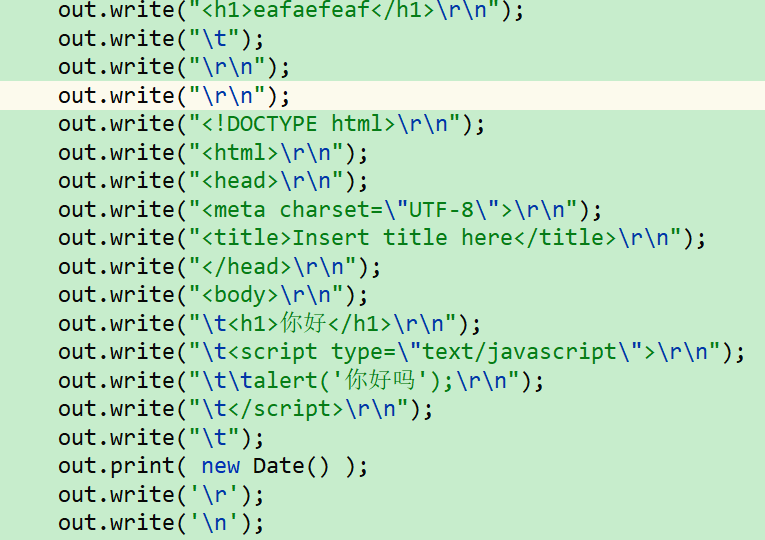
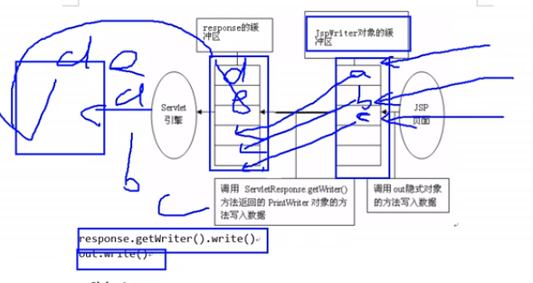

# JSP(过时技术)

## 一. 绪论

### 1. 为什么引入jsp

我们发现,登录之后放给servlet,只能教我转发或者重定向,但是没有方法让重定向后的登录页面显示`登录失败`字样. 也就是我们只能掌握一个静态的前端,后端不能动态的改变页面.

|      | Servlet                          | HTML           |
| ---- | -------------------------------- | -------------- |
| 长处 | 接收请求参数,访问域对象,转发页面 | 友好的显示数据 |
| 短处 | 友好显示数据                     | 动态显示数据   |
|      |                                  |                |

然后`JSP(Java Server Page)`就把两者结合

### 2. 是什么

本质是一个Servlet,JSP能做Servlet做的所有事

它可异质结写HTML标签,是可以嵌入Java代码的html

必须运行在Servlet容器中

## 二. HelloWorld

### 1. jsp文件

```jsp
<%@ page language="java" contentType="text/html; charset=ISO-8859-1"
    pageEncoding="ISO-8859-1"%>
<!DOCTYPE html>
<html>
<head>
<meta charset="ISO-8859-1">
<title>Insert title here</title>
</head>
<body>

</body>
</html>
```

创建了一个jsp文件,这是他的默认内容,和HTML几乎差不多

### 2. jsp脚本片段(java代码片段)

`<%%>`嵌入代码

```java
<title>Insert title here</title>
<%
	System.out.println("Helloworld"); // 在控制台输出
	out.write("你好"); // 在页面输出
%>
</head>
```

请求一次,运行一次

### 3. jsp表达式

在页面输出字符串`<%= ""%>`

```java
<%@page import="java.util.Date"%>
    
<%="Helloworld" %>
<%=new Date() %>
```

## 三. 运行原理

jsp运行内部java代码总要生成.class,他在哪呢

在服务器的`work`文件夹下

### 1. 

* 对应java文件:

  * 我们发现index.jsp被翻译成了一个`index_jsp.java`,还被编译成了字节码文件

* 本质是Servlet

  * 发现index_jsp类是继承于`HttpServlet`的类,所以jsp就是个servlet

  * 具有完整的Servlet生命周期

    ```java
    public void _jspInit() {}
      public void _jspDestroy() {}
      public void _jspService(参数){} // 访问时调用
    ```

* 其`url-pattern`: 

  * 在server的大web.xml中,有关于jsp的servlet配置

    ```xml
            <servlet-name>jsp</servlet-name>
            <servlet-class>org.apache.jasper.servlet.JspServlet</servlet-class>
    
        <servlet-mapping>
            <servlet-name>jsp</servlet-name>
            <url-pattern>*.jsp</url-pattern>
            <url-pattern>*.jspx</url-pattern>
        </servlet-mapping>
    
    ```

  * 当请求对应jsp时,将请求交给`JspServlet`处理

### 2. JspServlet的处理

1. 比如你的名字叫index.jsp,他就会用反射去找`index_jsp.class`
   * 在**第一次**<u>访问</u>index.jsp会翻译成java->字节码
   * 以后就直接运行字节码,java文件就不需要了
2. 接着运行index_jsp的service方法,写出整个页面

```java
 out.write("<meta charset=\"ISO-8859-1\">\r\n");
      out.write("<title>Insert title here</title>\r\n");
//这是内嵌的java代码
	System.out.println("Helloworld");

      out.write("\r\n");
      out.write("\r\n");
      out.print("Helloworld" ); // toString打印,对应<%="Helloworld"%>
```

## 四. 基本语法

### 1. jsp模板元素

我们把jsp中静态的HTML都称为模板元素

就是展示页面结构

就是被原封不动的翻译到java代码里

```java
out.write("</head>\r\n");
out.write("<body>\r\n");
out.write("\t<h1>你好</h1>\r\n");
out.write("\t<script type=\"text/javascript\">\r\n");
out.write("\t\talert('你好吗');\r\n");
out.write("\t</script>\r\n");
out.write("</body>\r\n");
out.write("</html>");
```

### 2. jsp表达式

`<%= %>`称为jsp表达式,作用是在页面输出内容

翻译的原理就是把内容**原封不动**放进out.print里

```java
<%= new Date() %>
    //对应,也因此不能写分号之类的
out.print(new Date());//就toString输出,打在页面上
```

### 3. jsp脚本片段

`<%%>`称为jsp脚本片段,在脚本片段中你甚至可以编写java代码

可以在里面用out.print向页面输出内容,反正翻译过来是有out的

原封不动的复制到java里,能写好多个

* 因为封装到方法里,所以不能声明属性,方法,类

```java
	<%
		int age = 18;
		if(age >= 18){
			out.print("ooo");
		}else{
			out.print("aaa");
		}
	%>

int age = 18;
if (age >= 18) {
    out.print("ooo");
} else {
    out.print("aaa");
}
```


* 在这里,你甚至可以: 混合嵌入

  ```jsp
  <%
  	int age = 18;
  	if(age >= 18){
  		out.print("ooo");
  %><!--上面一段和下面一段隔开-->
  
  <h1>你好</h1>
  
  <%
  	}else{
  		out.print("aaa");
  	}
  %>
  ```
  * 看看翻译结果:

    ```java
    if (age >= 18) {
        out.print("ooo");
        out.write("\r\n");
        out.write("\t<h1>你好</h1>\r\n");//标签被包if中间write
        out.write("\t");
    } else {
        out.print("aaa");
    }
    ```

  * 但是所有java片段合起来必须是完整正确的java代码

### 4. jsp声明

`<%! %>`称为jsp声明,可以把代码翻译在service外面(就是放在类里声明属性,方法)

然后在表达式或者脚本片段里就能使用它

所以称为声明,__比较少用__

```java
public final class test2_jsp extends org.apache.jasper.runtime.HttpJspBase
    implements org.apache.jasper.runtime.JspSourceDependent,
                 org.apache.jasper.runtime.JspSourceImports {

 private String name = "username"; 
	...
 }
```

### 5. jsp注释

`<%-- --%>`称为jsp注释,`<---->`会被翻译到响应中,jsp注释甚至不会翻译到java里

### 6. jsp指令

jsp指令是为了JSP引擎而设计的,并不直接产生任何输出,只是告诉引擎如何处理JSP页面的其余部分

格式:

```jsp
<@ 指令名 属性名=属性值%>
```

分为:

* page指令 : 定义页面如何解析
* include指令: 静态包含
* taglib指令: 引入其他标签库

#### 6.1 page指令

```jsp
<%@page language="java" contentType="text/html; charset=UTF-8"
    pageEncoding="UTF-8"%>
<%@page import="java.util.ArrayList"%>
<%@page errorPage="/index.jsp" %>
<%--告诉页面如何解析--%> 
```

* 常用属性

| **属性**         |                                                             |
| ---------------- | ----------------------------------------------------------- |
| **language**     | 只能选java                                                  |
| __contentType__  | 就是设置响应头,翻译过后就是response.setContentType(传这个); |
| **pageEncoding** | 指定页面(本身)的编码,告诉jsp引擎怎么翻译                    |
| __import__       | 导包                                                        |
| __errorPage__    | 指定发生错误去向的页面,绝对路径从项目开始                   |
| __isErrorPage__  | 表示自己是错误页面**转到的**页面,可以使用异常对象exception  |
| __session__      | 默认是true,当前页面是否**参与会话,**就是能否用session对象   |
| __isELIgnored__  | 是否忽略el表达式                                            |
| autoFlush        | 是否自动刷新                                                |
| extends          | 继承哪个父类.一般不动                                       |
| info             | 定义页面的信息(描述 即ServletInfo)                          |
| isThreadSafe     | 是否线程安全                                                |

#### 6.2 静态包含include

把另外一个页面包含进来

在哪里include,页面就被包含在哪里

```jsp
<%@include file="/grammer/test1.jsp"%>
```

就是硬把其他页面的所有内容写进来了

不需要被包含jsp的class,包含jsp直接把被包含jsp内容取出来自己编译

### 7. jsp标签

jsp自己内置的标签,功能很多,每个标签执行一段代码,又叫action元素

#### 7.1 动态包含\<jsp:include\>

```java
<jsp:include page="/grammer/test1.jsp"></jsp:include>
```

原理: 不是硬包进来写,而是执行一段动态包含代码

* 会翻译编译被包含jsp

```java
org.apache.jasper.runtime.JspRuntimeLibrary.include(request, response, "/grammer/test1.jsp", out, false);
```

#### 7.2 转发\<jsp:forward\>

```jsp
<jsp:forward page="test1.jsp"></jsp:forward>
```

说明: 带参数的转发页面,如果不要参数,中间就不能有任何空白

参数:使用\<jsp:param\>指定参数

```jsp
<jsp:param value="ooo" name="username"/>
```

* 使用参数: 在转发到的页面可以使用request.getParameter("名字");获取

```java
_jspx_page_context.forward("test1.jsp" + "?" + org.apache.jasper.runtime.JspRuntimeLibrary.URLEncode("username", request.getCharacterEncoding())+ "=" + org.apache.jasper.runtime.JspRuntimeLibrary.URLEncode("ooo", request.getCharacterEncoding()));
//它在URL后面硬塞了几个参数,所以转发页面可以用request获取参数,但我们看不到
```

## 五. 九大隐含对象

### 1. 简述

隐含对象是我们在页面可以直接使用的对象

其实我们用的service方法定义的这几个对象

```java
final javax.servlet.jsp.PageContext pageContext; // 代表当前页面对象
javax.servlet.http.HttpSession session = null; //代表当前会话对象
final javax.servlet.ServletContext application;  //代表整个web应用
java.lang.Throwable exception =org.apache.jasper.runtime.JspRuntimeLibrary.getThrowable(request); //代表当前捕获异常对象
final javax.servlet.ServletConfig config; //代表servlet配置信息
javax.servlet.jsp.JspWriter out = null; //页面输出对象
final java.lang.Object page = this; //servlet对象(jsp)本身
//在service中,加上request,response就是九个
```

* 四大域对象: 用来在其他资源共享数据
  * pageContext
  * request
  * session
  * application
* 五大常规对象:
  * exception
  * config
  * out
  * page
  * response

### 1. 五个常规对象

`exception`

`config`: 和普通的ServletConfig一样,详见__tomcat.md__

`out`: out.write写东西,可以写html标签

`page`:page就是this,但是是Object类型,还不如写this

`response`: response也能写东西啊,但是<@page已经配置好了contentType

> 异同: out.write拥有缓冲区,response.getWriter.write()会直接写response缓冲区,但out会先写进jsp缓冲区,再写进response缓冲区
>
> 其实out到最后也用了response的写法,可以直接out.flush()表示刷新缓冲区



### 2. 四个域对象

用来在其他资源共享数据

```java
//域对象通用的方法:
//设置数据的方法
public void setAttribute(String name,Object value);
//获取数据的方法
public Object getAttribute(String name);
```

* pageContext

  * 可以获取其他隐含对象,用pageContext.get+对象名
  * 作为域对象共享数据,__只能在当前页面共享数据__

* request: 

  * 在__同一个请求对象中共享数据__,即 转发 共享数据

* session:

  * 同一次会话,浏览器打开: 开始会话,浏览器关闭: 结束会话

    会话就是和web应用沟通,不同web应用是不同会话

* application:(ServletContext类型)

  * 只要在同一个web应用中都可以共享
  * 只要应用不卸载就可以访问


# EL表达式

`Expression Language`

## 一. 概论

学了EL就可以忘了JSP表达式(输出内容那个)了

### 1. 作用

简化开发:

1. 在页面中显示 域对象中的属性值
2. 可以直接获取返回(是一个对象)的属性值,在el表达式中直接使用`.`的方式
3. 可以取出自己十一个隐含对象的内容,其他的都不能取
4. 如果能取就取,没有就返回默认值,可以直接表单回显

### 2. 存在的意义

简化操作

友好显示

## 二. HelloWorld/语法

### 1. 语法格式

* 使用el表达式获取域内容语法格式:

  ```jsp
  ${表达式内容}
  ```

### 2. 演示1: 显示域的属性值

`${key}`

```jsp
	取出四个域中的内容: <br/>
	page:<%=pageContext.getAttribute("pageAttr") %><br/>
	request:<%=request.getAttribute("requestAttr") %><br/>
	session:<%=session.getAttribute("sessionAttr") %><br/>
	application:<%=application.getAttribute("appAttr") %><br/>
	<hr/>
<%-- ${属性名} --%>
	page:${ pageAttr}<br>
	request:${ requestAttr}<br>
	session:${ sessionAttr}<br>
	application:${ appAttr}<br>
```

### 3. 演示2: 直接获取value(bean)对象中的属性

```jsp
<%pageContext.setAttribute("pageAttr", new Student("tom","@",1));%>

${ pageAttr.name} <!-- 根据getter获取bean的属性值 -->
```

### 4. 域对象中有相同key名的属性

el表达式如果获取域的同名属性,他会从**小域到大域**找,找到就停下

需要el隐含对象来解决

```jsp
${pageScope.pageAttr} //pageAttr: key名
${pageScope.pageAttr.name}
```

### 5. 获取特殊字符

```jsp
形如 setAttribute("stu-x","stu");会在${}中造成歧义
```

选择新的语法来取数据`${xxx[]}`

```jsp
${ requestScope["stu-x"]} //取requestScope(一个map)中的数据,可以用单引号
```

跟js一样,`.`和`[]`的特点就是[]更通用,.更方便

## 三. EL隐含对象

EL拥有11个隐含对象,其中4个是域对象,分别对应从4个jsp域对象取值

> <span style="color:red">注意:</span> 在其他地方要用getXxx()的地方,在EL中都能看做属性 直接使用`pageContext.request`来代替`pageContext.getRequest()`

```
	JSP                EL
pageContext ------- pageScope(封装了pageContext域中所有共享数据,它是一个Map)
request     ------- requestScope(同上)
session     ------- sessionScope
application ------- applicationScope
```

* 非map对象

  ```java
  pageContext 就代表jsp隐含对象中的pageContext,它可以取出其他jsp隐含对象
  ```

* 和http协议有关

  ```
  名称             类型                             对应
  param        java.util.Map<String,String>       对应一个请求参数
  paramValues	 java.util.Map<String,String[]>     对应一组请求参数
  header       java.util.Map<String,String>        请求头
  headerValues java.util.Map<String,String[]>      请求头返回字符数组
  cookie       java.util.Map<String,Cookie>        返回cookie对象
  ```

  * param: 替代request.getParameter(""); 

    > 返回的类型就是map里的value类型

    ```jsp
    ${param.username} == ${param["username"]} == request.getParameter("username")
    ```

    

  * paramValues

  * header: request.getHeader("...");

* initParam: 获取web的初始化参数(web.xml)

## 四. EL表达式运算符

### 1. 对数组操作

以paramValues为例

```jsp
${ paramValues.ah[0]} // 从返回的String取索引为0的,直接[0]
```

### 2. 做运算

* 算术运算

  ```java
  ${5 + 3} // 没有(不存在)拼串,字符串会转成另外的类型,比如整型
  ${"" == ""} //可以对字符串用==
  ```

* 关系运算

  ```java
  ${5 > 3}
  ```

* 逻辑运算:

  ```java
  ${true&&flag}
  ```

* 三目运算,可以配合empty使用

  ```java
  ${16<5?'a':'b'}
  ```

* **empty运算**

  * 判断一个对象是否为空(的),返回布尔值

  * 以下情况会被认为为empty

    > 1. 是null
    >
    > 2. 域对象中没有自己想要的key ${empty pageScope.stu2}
    >
    > 3. 空的集合(size == 0)
    >
    >    <span style="color:red">数组,甚至长度为0的数组都被认为 为 <u>不空的</u></span>
    >
    > 4. 空字符串 ""
    >
    > 5. 空字符 ''

