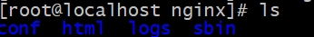
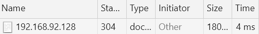
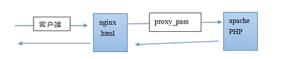

# Nginx

[TOC]

## 一. 简介

### 1. nginx

来自百度百科:

> Nginx (engine x) 是一个<u>高性能的HTTP和反向代理web服务器</u>，同时也提供了IMAP/POP3/SMTP服务。Nginx是由伊戈尔·赛索耶夫为俄罗斯访问量第二的Rambler.ru站点（俄文：Рамблер）开发的，第一个公开版本0.1.0发布于2004年10月4日。
>
> 其将源代码以类BSD许可证的形式发布，因它的稳定性、丰富的功能集、示例配置文件和低系统资源的消耗而闻名。2011年6月1日，nginx 1.0.4发布。
>
> Nginx是一款轻量级的Web 服务器/反向代理服务器及电子邮件（IMAP/POP3）代理服务器，在BSD-like 协议下发行。其特点是<u>占有内存少，并发能力强</u>，事实上nginx的并发能力在同类型的网页服务器中表现较好，中国大陆使用nginx网站用户有：百度、京东、新浪、网易、腾讯、淘宝等。

Nginx专门为性能优化开发,注重效率,不支持java

### 2. 重要概念

#### 2.1 反向代理

`正向代理`: 如果把局域网外的Internet想象成一个巨大的资源库,则局域网中的客户端要访问Internet,则需要<u>通过配置代理服务器来访问</u>,这种代理服务称为正向代理

`反向代理`: 客户端对代理是无感知的,因为客户端不需要做任何配置,只需要将请求发送到反向代理服务器,由反向代理服务器去选择目标服务器获取数据后,再返回给客户端,此时反向代理服务器和目标服务器对外就是一个服务器,隐藏了真实服务器IP地址

#### 2.2 负载均衡

客户端发送多个请求到服务器,服务器处理请求,有些要跟数据库交互. 对于并发较少的项目是合适的

但是随着信息量和访问量增长,项目变复杂

* 所以我们可以增加服务器的数量,构成一个**集群**,将请求分发到各个服务器上,将原先请求集中到单个服务器上的情况改成将请求发到多个服务器上,这样称为__负载均衡__
* 基于__反向代理服务器__

#### 2.3 动静分离

为了加快网站的解析速度,将<u>动态页面和静态页面</u>分不同的服务器解析,称为__动静分离__

* 基于__反向代理服务器__

## 二. 基本使用

### 1. 安装

* 压缩包下载和解压
```bash
  666  wget http://nginx.org/download/nginx-1.16.1.tar.gz
  #获取tar包
  667  ls
  668  cp nginx-1.16.1.tar.gz  /usr/local/src/
  669  cd /usr/local/src
  670  ls
  671  tar -zxvf nginx-1.16.1.tar.gz 
  # 解压
```

* 用解压目录里的makefile进行安装
  * 注意nginx依赖的库: pcre,zlib

  ```bash
$ yum install pcre-devel
$ yum install zlib-devel
  ```
  
  * 然后配置,主要是检查依赖库 以及 配置nginx安装位置
  
    ```bash
    $ ./configure --prefix=/usr/local/nginx
    ```
  
  * 最后make安装
  
    ```bash
    $ make && make install
    ```
  
    

### 2. 看看安装了啥/怎么启动

 

---

conf: 配置

html: 网页

logs: 日志

<u>sbin: 二进制程序</u>,我们看看有哪些二进制程序可以运行

---


* 只有一个可执行程序nginx,开启服务器就靠它了

nginx会启动一个主进程和一个子进程,主进程主要是用来管理子进程的,子进程响应请求

### 2.0 用IP直接访问

因为是80端口,所以在别的地方可以用Ip直接作为url访问

### 3. 用信号量操作nginx

信号量是nginx的机制

语法: `kill -信号量 主nginx进程号`

```bash
kill -INT 主nginx进程号 # 关闭nginx
```

| 信号量       | 意思                                                        |
| ------------ | ----------------------------------------------------------- |
| **TERM,INT** | 不优雅的杀进程                                              |
| **QUIT**     | 优雅的关闭进程(请求结束之后关闭)                            |
| **HUP**      | 改变配置文件,平滑的重读配置文件(用新的子进程替代旧的子进程) |
| __USR1__     | 重读日志,在日志按月/日分割时有用                            |
| __USR2__     | 平滑的升级                                                  |
| __WINCH__    | 优雅的关闭旧进程                                            |

### 4. 配置文件

配置文件分成好几个段,用`段名{内容}`的格式分隔

```bash
//全局段
work_process 1; #子进程数量,一般设置为CPU数*核数

```

```bash
#Events段
events {
    worker_connections  1024; # 一个worker能允许产生多少连接
}
```

```bash
#http段
http{
	# 配置http服务器的主要段,内含很多虚拟主机段
	server{}
	#Server2{}
}
```

### 5. 虚拟主机配置

正如上一节所说,虚拟主机的配置在http段中

需要的基础配置: 映射到的端口,host(可以填域名),映射到哪个目录

```bash
#大概是这么个效果
 server{
        listen 80;# 监听的端口号
        server_name aa.com;# 主机名
        location /{
            root aa;# 虚拟主机根目录,相对路劲相对于nginx
            index index.html; # 默认主页
        }
    }   
    # 就好了,然后重新读取配置文件再来
```

### 6. 日志配置

观察server段可以看到这样的信息:

```bash
#access_log logs/host.access.log main;
```

含义: 访问日志的文件是logs/host.access.log,格式是main格式

想配置用这个就行

* main格式信息也在配置文件中

```bash
#log_format  main  '$remote_addr - $remote_user [$time_local] "$request" '
#                  '$status $body_bytes_sent "$http_referer" '
#                  '"$http_user_agent" "$http_x_forwarded_for"';
ip-远程用户名[时间] 请求头 请求状态码 服务器发送了几个字节 referer来的网站 user-agent x_forward_for从哪边服务器转发来的
```

* main格式实例:

  ```
  这里是IP地址 - - [13/Nov/2020:23:20:09 -0500] "GET / HTTP/1.1" 200 17 "-" "Mozilla/5.0 (Windows NT 10.0; Win64; x64) AppleWebKit/537.36 (KHTML, like Gecko) Chrome/86.0.4240.183 Safari/537.36"
  ```


## 三. Location

在虚拟主机的配置中,Location是必不可少的

基本语法:

**精准匹配** 优先,正则匹配其次

```bash
location [=|~|~*|^~] pattern{}
# 不写中括号是一般匹配
# = 是精准匹配
# ~ 是正则匹配
```

实例:

```bash
  location = / {#精准匹配,一般/匹配会转发到index.xxx,转发后就不满足精准匹配要求

      root   /var/www/html/;
      index  index.html index.htm;
}
```

* 一般匹配: 当匹配多个时,匹配的最长的优先
* **正则匹配**

## 三.1 其他几种配置命令: if,return,rewirte

### 1. if和return

`return`返回一个响应码

`if`: 用=表示全匹配.~表示正则匹配

```bash
location / {
        if ($remote_addr = 192.168.x.x){#空格不能省略
                    return 403;#如果是你填的ip就让他访问403
            }
        root   html;
        index  index.html index.htm;
    }
```

### 2. 判断条件

! && ||

`-e 路径` 表示一个文件/文件夹是否存在

### 3. 查看nginx配置中可引用的变量

在conf/fastcgi.conf中

### 4. Rewrite

rewrite可以写在server或location配置下,是__rewrite_condition__功能

```bash
if ($remote_addr ~ 192.168){
     rewrite ^.*$ /test1.html;#把url重写成test.html
     break;# 防止递归
}
```

请求中的url一直不会改变,所以break都得加上

## 四. gzip压缩配置

```bash
#常见参数
gzip on|off # 开关
gzip_buffers 32 4k|8k # 在内存中的缓冲块数量和大小
gzip_comp_level [1-6] # 推荐6,压缩级别,压得越高级别越高,太高浪费cpu
gzip_disable # 正则匹配什么样的uri不gzip
gzip_min_length 200 # 开始压缩的最小长度
gzip_http_version 1.0|1.1 # 开始压缩的http协议版本,可以不设置
gzip_proxied #设置如果是代理服务器是否要缓存
gzip_types text/plain,application/xml # 对哪些mime类型压缩
gzip_vary on|off # 是否传输gzip压缩标志
```

写在http/server/location下都行

## 附. nginx+php

### 1. tomcat和nginx对待php的不同

tomcat一般把php当做自己的一个模块启动(嵌入)

而ngxin则是把http请求变量转发给php,php作为独立进程(两者平等)

这种技术称为fastcgi

### 2. 配置

当访问php的url发来时,将进程交给9000端口的php进程

```bash
location ~ \.php{
	fastcgi_pass 127.0.0.1:9000;
	fastcgi_index index.php;
	fastcgi_param SCRIPT_FILENAME $document_root$fastcgi_script_name; # 这个变量存的是请求的php文件名,对应php脚本的位置
	include fastcgi_params;

}
```

##  五. expires缓存

对于网站的,比如说图片,一点发布改动的可能性就非常小. 我们希望,能否在用户访问一次后,图片缓存在用户的浏览器端,且时间较长. 这里就用到了nginx的`expires设置` 

```bash
location = /images/default.gif {
    expires 30s;# 写在location或if段
    # expires 2m; 两分钟
    # expires 2h;  小时
    # expires 30d; 天
}
```

* 没有expires的缓存:



返回一个`304`,只产生了一个头信息的响应,告诉浏览器内容没变,浏览器把上次的缓存拿出来

但是依然有请求,我们希望浏览器自己拿出缓存

* 加上expires

  

浏览器就自行进行响应,表面是200,实际没给服务器发请求

> 注意: 服务器的日期和实际日期有差距可能导致缓存时间失效

## 六. 反向代理

用nginx做反向代理和负载均衡非常简单,支持1个proxy,1个upstream分别用来做反向代理和负载均衡

### 1. 反向代理概述

**反向代理:** nginx自己不处理相关请求,而是把相关请求都转发给别的服务器比如tomcat来处理



__动静分离__: 将静态资源和动态页面通过反向代理分开维护

### 2. 反向代理配置

* 准备工作: host配置域名映射
  * 浏览器在请求时会先从hosts文件中寻找有没有相应映射,不然找DNS解析器
  * 路径: `C:\Windows\System32\drivers\etc\hosts`文件
  * 在文件里依照文件里示例的格式配置`ip 域名`

请求转发(反向代理)配置

> 1. 找一个虚拟主机(server)进行配置,比如我们找原来的虚拟主机
> 2. 将server_name从localhost改成当前的ip地址 ( 这一步是模拟不同服务器之间的)
> 3. 在location中使用`proxy_pass url`进行代理转发(但返回还是200)

```bash
 server {
        listen       80;
        server_name  192.168.x.x;

        #charset koi8-r;

        #access_log  logs/host.access.log  main;

        location / {
            root   html;
            proxy_pass http://127.0.0.1:8080; # 关键反向代理配置,转发到tomcat的url
            index  index.html index.htm;
        }
```

### 3. 反向代理配置2

* 第二个实例,我们想将不同的请求路径分配到不同的服务器去

  * 比如: 访问`http://localhost:9001/edu` 跳转到centos的tomcat的localhost:8080

    访问9001/vod,跳转到windows主机的tomcat
  
* 配置

  1. 配置一个监听9001的虚拟主机

     ```java
      server {
             listen       9001;
             server_name  192.168.x.x;
     
            }
     ```

  2. 配置location使用正则匹配根据路径转发到不同服务器

     ```java
     location ~ /edu/{
          proxy_pass http://localhost:8080;
     }
     location ~ /vod/{
          proxy_pass http://别的服务器主机名:8080;
     }
     ```

  > 注意: 转发会带上访问路径,比如/edu/a.html这种会原样交给代理对象

## 七. 负载均衡

### 1. 实例1

我们在浏览器中访问nginx服务器监听的url,发一次请求,比如9001/edu/a.html

然后将请求用负载均衡的效果,平均分发给不同服务器处理

* 写配置

  1. 在http模块中加入`upstream`,配置负载均衡服务列表

     ```bash
     upstream myserver{# myserver是自定义的,可以称为负载均衡服务器(主机)名
          server 主机名1:8080;
          server 主机名2:8080;
     }
     
     ```

  2. 然后将请求反向代理给负载均衡服务器

     ```java
      location /{
           proxy_pass http://myserver;
     }
     ```

* 现象:

  * 请求被两个服务器轮流响应,实现了平均分担

* 拓展: __分配策略__

  * `轮询(默认)`: 按照请求时间顺序逐一分配,如果后端服务器down了可以自动清除

  * `weight`: 默认为1,权重越高分配的越多

    ```java
     upstream myserver{
          server 主机1:8080 weight=5;
          server 主机2:8080 weight=10;
     }
    ```

  * `ip_hash`:根据ip值hash进行选择
  ```

    upstream myserver{
	ip_hash;
    	server...
}
  ```
  
  * `fair`(第三方)
    * 跟ip_hash配置的地方一样
    * 就是根据后端服务器的相应时间来分配,响应时间短的优先分配

