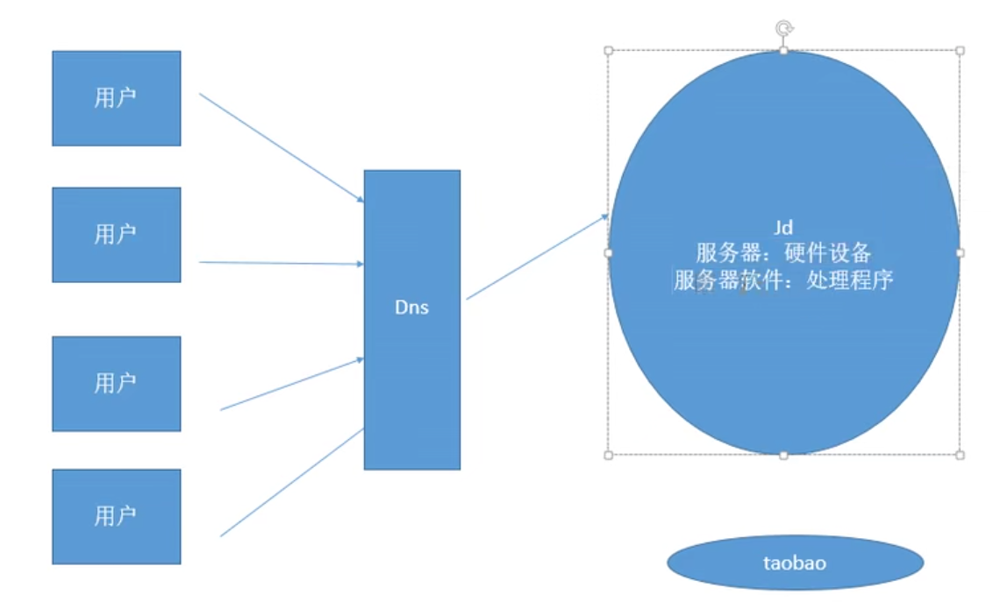
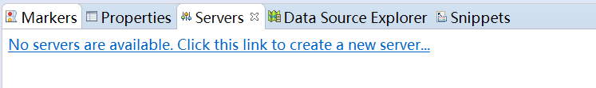
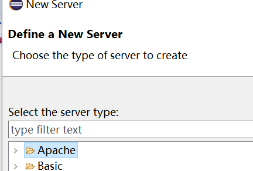
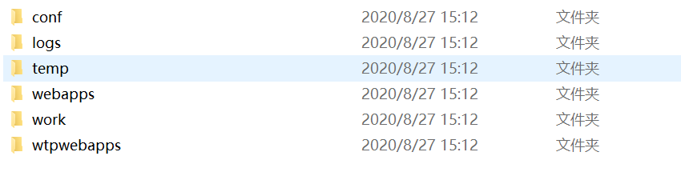
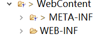
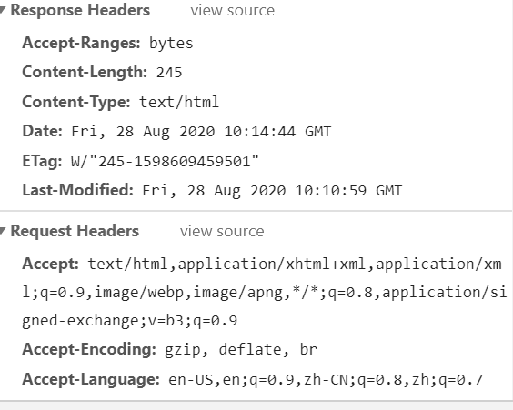
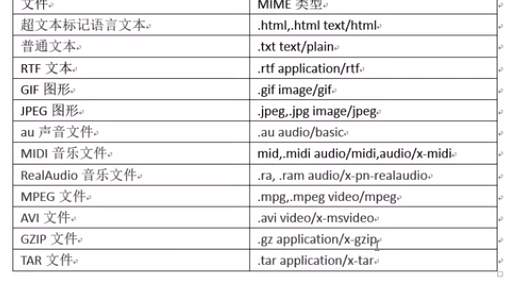
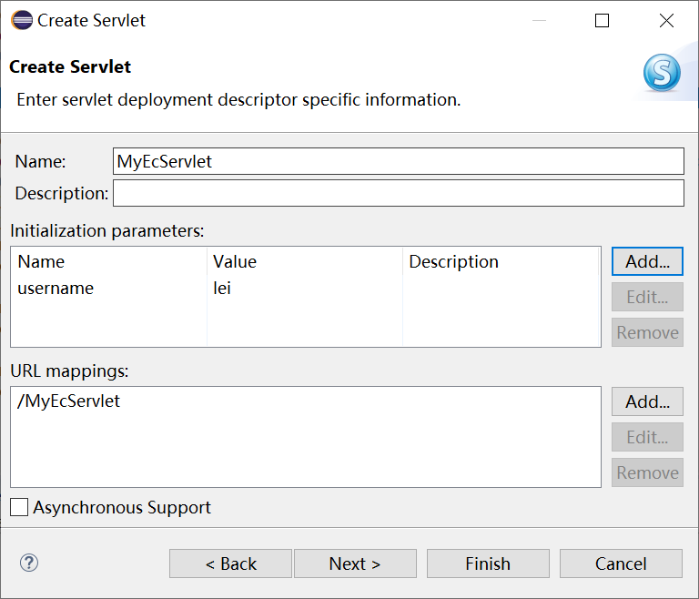
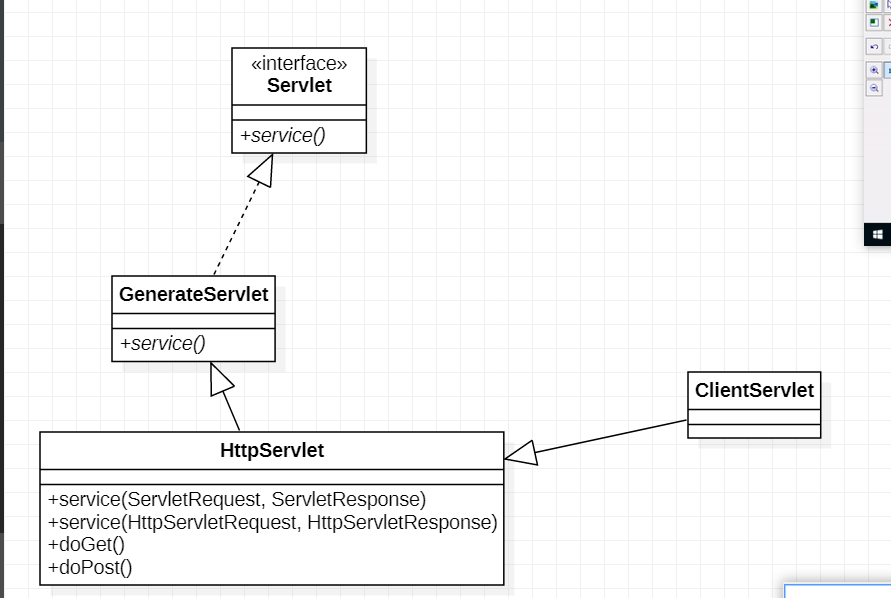
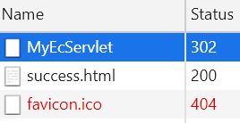

# TOMCAT



## 一. 绪论

### 1. Web服务器

Web服务器主要用来接收客户端发送的请求和相应客户端请求

作为JavaWeb来说还需要有**Servlet容器,**主要作用是调用java程序处理用户发送的请求,并相应指定资源

开发JavaWeb项目Web服务器和Servlet容器都是必须的

* 常见JAvaWeb服务器:
  * `Tomcat(Apache)`
  * `JBOSS(Red Hat)`
  * `GlassFish(Oracle)`
  * `Resin(Caucho)`
  * `Weblogic(Oracle)`
  * `Websphere(IBM)`

### 2. TOMCAT概述

Tomcat是Apache软件基金会Jakata项目中的一个核心项目,有Sun公司的支持

### 3. Tomcat安装

在官网下载压缩包

它是Java编写的,依赖于`JAVA_HOME`环境变量

开始后就呈现了一个`port:8080`的服务器,可以使用IP:8080访问,局域网的大家都可以看见

启动: 用startup.bat或者`catalina run`

### 4. tomcat目录下的结构

> **bin**: 包含tomcat启动命令和停止tomcat的批处理或者可执行文件
>
> **conf**: 包含tomcat的配置文件
>
> **lib**: tomcat运行依赖的jar包
>
> **logs**: tomcat运行日志
>
> **temp**: 临时文件夹
>
> **webapps**: web应用程序们,集合了所有web项目,一个文件夹代表一个
>
> * 默认访问root项目
> * 写好的应用应该放在这
> * 想访问别的项目,应该这样用:`localhost:8080/项目名`
>
> __work__: 保存tomcat运行时编译好的一些文件

### 5. 修改端口号

用conf里的server.xml改默认端口号,找Connector节点,改port

### 6. web项目

* 静态web应用: 以具体文件存在的静态网页
* 动态web应用: 需要程序和数据库的处理的网页 

## 二. 整合到eclipse



点这个



点开找版本

### 1. 注意点

* eclipse整合服务器后创建的是一个服务器镜像
* 会出现Server文件夹,里面有镜像的各种配置文件
* 路径:`工作空间\\.metadata\.plugins\org.eclipse.wst.server.core\tmp0`
  * 可以改,启动以后自动帮你副本服务器



* wtpwebapps: 真 默认发布(deploy)目录

### 2. 在eclipse创建动态web项目

 这文件夹`WEB-INF`下有项目基础信息

* lib(引入的jar包放进lib,他会自动帮你添加到buildpath)
* web.xml(已经被淘汰)

网页写在webContent底下

### 3. 文件结构

部署前:

```xml
<FirstWeb>
	<src>放源码</src>
	<build>放编译后的class文件</build>
	<WebContent>
    	<lib>放jar包</lib>
    	web.xml
	</WebContent>
</FirstWeb>
```

部署后:

```xml
<FirstWeb>
    <!--只发布WebContent里面的东西-->
	<WebContent>
        <classes>java文件全类名存储,classes也称为类路径</classes>
    	<lib>放jar包</lib>
    	web.xml
	</WebContent>
</FirstWeb>
```

## 三. HTTP协议

### 1. 什么是HTTP协议

HTTP超文本传输协议,规定了浏览器和万维网服务器之间的通信规则

* 客户端对服务端发送__请求报文__
* 服务端给客户端发送__相应报文__



### 2. 请求报文的格式

```socket
GET / HTTP/1.1
Host: localhost:8888
Connection: keep-alive
Upgrade-Insecure-Requests: 1
User-Agent: Mozilla/5.0 (Windows NT 10.0; Win64; x64) AppleWebKit/537.36 (KHTML, like Gecko) Chrome/83.0.4103.106 Safari/537.36
Accept: text/html,application/xhtml+xml,application/xml;q=0.9,image/webp,image/apng,*/*;q=0.8,application/signed-exchange;v=b3;q=0.9
Sec-Fetch-Site: none
Sec-Fetch-Mode: navigate
Sec-Fetch-User: ?1
Sec-Fetch-Dest: document
Accept-Encoding: gzip, deflate, br
Accept-Language: en-US,en;q=0.9,zh-CN;q=0.8,zh;q=0.7
Cookie: csrftoken=6o4F8J0hi9OHeYWCT0dhCOwj7w4cSvMSsJbiVixsEoOVuZRKWpKvqxUX17un3qzp; Webstorm-ff167aff=79cec26b-442c-474b-ba21-4967053c1865

```

这是一部分请求报文

* 格式:
  * 请求首行
  ```java
  请求方法+资源路径+协议版本
  GET / HTTP/1.1
      
  Host: localhost:8888
  Connection: keep-alive
      //...
      //Accept: 我能接收的内容类型
      //user-Agent: 浏览器(客户端)的详细信息
  ```
  * 请求头信息
  
    ```java
    请求的头部信息,以键值对存在
    ```
  
    
  
  * 空行(CR+LF)
  
  * 报文主体
  
    * `get`请求没有请求体,放在请求地址
    * `post`有请求体,内容就是发送的内容(比如username=root)

### 3. 响应报文

* 格式:
  * 响应首行
  * 响应头信息
  * 空行
  * 响应体: 服务器传递给客户端要是用的html页面等数据

```java
HTTP/1.1 200 OK          //协议版本 响应状态码 响应提示信息
content-type: text/html  //内容类型: 表示服务器传回的数据内容类型
server: WebStorm 2020.1.2
date: Sat, 29 Aug 2020 06:58:18 GMT
X-Frame-Options: SameOrigin
X-Content-Type-Options: nosniff
x-xss-protection: 1; mode=block
accept-ranges: bytes
cache-control: private, must-revalidate
last-modified: Sat, 29 Aug 2020 06:27:40 GMT
content-length: 1565 //内容长度
```

* __响应状态码__:
  * 告诉浏览器响应结果:
    * 200: 请求成功,会把响应体显示在浏览器中
    * 404: 请求的资源没有找到,说明客户端错误的请求了不存在的资源
    * 500: 请求资源找到了,但服务器内部错误
    * 302: 重定向,表示服务器要求浏览器重新发一个请求,服务器会发送一个响应头Location,指定新请求的URL地址
    * 以2开头的状态码: 表示成功
    * 以3开头: 都重定向
    * 以4开头: 都资源没找到
    * 以5开头: 都表示服务器内部错误
  * Content-Type: 也叫`MIME类型`多功能Internet邮件扩充服务,格式为`大类型/小类型`
    * HTML: .html,text/html
    * RTF: application/rtf



# Servlet

## 一. 绪论

### 1. 是什么

广义来说,Servlet规范是Sun指定的一套技术标准,包含与Web应用相关的一系列接口,而具体的Servlet容器需要负责标准的实现

狭义的Servlet就是`javax.servlet.Servlet`接口及其子接口,实现类.

一个Servlet就是一个小java程序,servlets运行在web服务器,用http接收和相应来自客户端的请求

### 2. 作用

1. 接收请求
2. 处理请求
3. 完成响应

## 二. HelloWorld

先实现Servlet接口

实现service方法

配置web.xml

### 1. 预览service方法

```java
//Servlet接口的最主要方法
//服务
	@Override
	public void service(ServletRequest req, ServletResponse res) throws ServletException, IOException {
		// TODO Auto-generated method stub
		System.out.println("im first servlet");
		
		PrintWriter writer = res.getWriter();
		writer.write("hellow");
	}
```

### 2. xml配置servlet

一个servlet只能处理一个请求,用`web.xml`配置servlet的请求信息;

* 配置servlet类信息

```xml
<--配置在根目录下-->
<servlet>
    <!-- 配置servlet的名字,起个名当标识符 -->
    <servlet-name>MyFirstServlet</servlet-name>
    <!-- 配置servlet的全类名 -->
    <servlet-class>com.at.servlet.MyFirstServlet</servlet-class>
 </servlet>
```

* 配置servlet映射信息(根节点下)

  ```xml
  <servlet-mapping>
    	<!-- 对应的servlet名字 -->
    	<servlet-name>MyFirstServlet</servlet-name>
    	<!-- 告诉应该响应哪个请求 -->
    	<!-- 当前例子对应 http://localhost:8888/Servlet2/helloworld -->
    	<!-- Servlet2是项目名 -->
       <url-pattern>/helloworld</url-pattern>
  </servlet-mapping>
  
  当发送请求时,它会还你一个helloworld,而且写了hellow在里面
  ```

  

## 三. 分析Servlet流程

### 1. 前情提要

> 1. 创建自己的类实现Servlet接口
> 2. 在service写代码(可以在控制台输出,可以写网页)
> 3. 在web.xml配置

```xml
  <servlet>
  <!-- 配置servlet的名字,起个名当标识符 -->
  	<servlet-name>MyFirstServlet</servlet-name>
  <!-- 配置servlet的全类名 -->
  	<servlet-class>com.at.servlet.MyFirstServlet</servlet-class>
  </servlet>
  <servlet-mapping>
  	<!-- 对应的servlet名字 -->
  	<servlet-name>MyFirstServlet</servlet-name>
  	<!-- 告诉应该响应哪个请求 -->
  	<!-- 当前例子对应 http://localhost:8888/Servlet2/helloworld -->
  	<url-pattern>/helloworld</url-pattern>
  </servlet-mapping>
```

### 2. 分析xml

* <u>服务器</u>通过全类名找到我们的类

  ```xml
  <servlet-class>com.at.servlet.MyFirstServlet</servlet-class>
  ```

* 别名是给<u>程序员</u>用的


* Servlet映射信息: Servlet用来处理哪一个请求

  * 第一个写Servlet的别名指明

  * 第二个`<url-pattern>`告诉Servlet处理哪个请求

    ```xml
    <url-pattern>/helloworld</url-pattern>
    <!-- 访问我当前项目下的helloworld-->
    <!-- 当前项目就是localhost:端口/Servlet2 -->
    ```

    > 这里的/helloworld是**动态资源,**与静态资源(如html文档)相异,<u>一旦找不到静态资源就会来映射找</u>,在映射文件中指出需要处理者是Servlet的service代码而非响应静态文件
    >
    > 找到url-pattern以后找到别名,再把别名和类对应,最后调用service

## 四. Servlet接口

### 1. Servlet生命周期

Servlet从出生到销毁的过程

Tomcat是Servlet容器,Servlet作为一个小程序跑在容器上

```java
public void destroy() 
public ServletConfig getServletConfig() 
public String getServletInfo() 
public void init(ServletConfig config) throws ServletException 
public void service(ServletRequest req, ServletResponse res) throws
```

调用顺序:

* 当第一次访问Servlet时:

> 创建Servlet对象,调用init方法,调用service方法
>
> <u>构造器-->init-->service</u>

* 从第二次开始:

  > 只调用service方法,单实例多线程(会有线程安全问题,一般不共享资源)

* 在服务器停止(或者项目从服务器移除)之前销毁Servlet

  > 调用destroy方法

其他方法都是给程序员用的

### 2. ServletConfig

`ServletConfig`是一个接口,封装了当前Servlet配置信息(web.xml里的信息)

一个Servlet对应一个ServletConfig

,在init()中作为参数传入Servlet配置,可以如下操作:

```java
private ServletConfig config = null; // 作为属性
	//初始化
	@Override
	public void init(ServletConfig config) throws ServletException {
		// TODO Auto-generated method stub
		this.config = config;//反正是从服务器获取的
		
	}
	public ServletConfig getServletConfig() {
		// TODO Auto-generated method stub
		return config;
	}
```

* 方法:

  * `getServletName()`: 获取Servlet别名

  * `getInitParameter(name)`获得初始化参数,传入参数名

    ```xml
    <!--初始化参数在xml的servlet下-->
    
      <servlet>
      	<servlet-name>ConfigServlet</servlet-name>
      	<servlet-class>com.at.servlet.ConfigServlet</servlet-class>
          
      	<init-param>
      		<param-name>username</param-name>
      		<param-value>lei</param-value>
      		<!--键值对形式存在-->
          </init-param>
          
      </servlet>
    ```

  * `getServletContext()` 获取ServletContext对象(servlet上下文),代表当前web项目信息

    ```java
    org.apache.catalina.core.ApplicationContextFacade@49a2fda5
    ```

    

### 3. ServletContext

这是啥: 一个web应用对应一个ServletContext,也就是代表整个**web项目**

* 功能: 

  * <u>获取web项目的配置信息</u>

  * `getInitParameter("")`获取当前项目web.xml的<u>context-param里的键值对的值</u>

    * context-param随便写哪(根目录下)

      ```xml
        <context-param>
        	<param-name>username</param-name>
        	<param-value>zhou</param-value>
        </context-param>
      ```

  * `getContextPath()`:获取<u>web项目的路径</u>

    ```java
    String contextPath = servletContext.getContextPath();
    //    /Servlet2(服务器下项目路径)
    ```

  * `getRealPath(虚拟路径str)`: 获取资源的<u>真实路径</u>

    * 虚拟路径: 网络上访问的路径,一个虚拟路径对应一个实际资源

    * 真实路径: 文件在磁盘中的路径

      ```java
      String realPath = servletContext.getRealPath("/index.html");
      //返回磁盘路径
      ```

  * 可以作为最大的__域对象__共享数据,作为application域对象

### 4. Eclipse自动创建servlet



这样它就会自动配置web.xml(高版本直接用注解配置)

这个家伙实现的是HttpServlet

## 五. HttpServlet抽象类

HttpServlet是专门为处理http请求定制的servlet,实现了Servlet接口

以后只要继承它就行了,不用实现Servlet接口

重写方法:

```java
protected void doPost(HttpServletRequest request, HttpServletResponse response)
protected void doGet(HttpServletRequest request, HttpServletResponse response)
```

* 分别处理`get`和`post`请求
* 一般不区分post和get,所以默认doGet调用doPost

### 1. get和post

**post**目前只接触到一种: 表单提交指定method为post

其他的比如回车,超链接,图片路径都是**get**

### 2. 继承树



先调用service,嵌套调用<u>重载的service</u>,再根据请求方式<u>调用用户重写的doGet,doPost</u>

造成直接调用doGet,doPost的假象

### 3. HttpServletResponse

```java
protected void doGet(HttpServletRequest request, HttpServletResponse response)
    //一个封装了浏览器请求对象
    //一个封装了发给浏览器响应对象
```

* 作用:

  * 可给浏览器响应个字符串

    ```java
    PrintWriter writer = response.getWriter();
    writer.write("aaaa");
    ```

  * 可以重定向到一个页面或者其他资源,重定向就是服务器告诉浏览器重新请求别的资源

     响应状态码为302

    ```java
    response.sendRedirect("success.html");
    ```

    

### 4. HttpServletRequest

HttpServletRequest封装了浏览器发给服务器的请求信息

* 作用:

  * 获取请求的数据,不管是post还是get

    ```java
    //获取第一个键值对第一个值,不太适合多选框
    String parameter = request.getParameter("username");//获取提交的键值对,用键拿值
    System.out.println(parameter);
    
    //适合多选框的方法
    String[] parameterValues = request.getParameterValues("aihao");
    System.out.println(Arrays.toString(parameterValues));
    ```

  * 获取请求头相关信息

    ```java
    String header = request.getHeader("User-Agent");//毕竟请求头也是键值对
    System.out.println(header);
    ```

  * 转发一个页面(把请求转发给别的页面/资源)

    ```java
    //先获取请求转发器
    RequestDispatcher requestDispatcher=request.getRequestDispatcher("success.html");
    //再转发出去
    requestDispatcher.forward(request, response);
    ```

    * 跟重定向的区别: 请求次数一次,响应类型码不为302,没有跳转

  * 作为域对象共享数据

    > 现在收集了application,request两个域对象,**还剩两个**

### 5. 重定向和转发

* 重定向和转发只能选一个

```java
		//重定向: 告诉浏览器重新请求一个资源
		response.sendRedirect("pages/success.html");
		
		//转发: 服务器处理完成以后转交给另外一个资源
		//当转发的资源是一个静态资源,会直接给服务器返回
		//当转给动态资源,下一个Servlet继续处理
		RequestDispatcher requestDispatcher = request.getRequestDispatcher("pages/success.html");
		requestDispatcher.forward(request, response);
```

* 区别:

  |                  | 转发                      | 重定向                 |
  | ---------------- | ------------------------- | ---------------------- |
  | Request          | 同一个请求                | 两次请求               |
  | 地址栏           | 不会变化                  | 变化                   |
  | API              | Request对象               | Response对象           |
  | 位置             | 服务器内部完成            | 浏览器完成             |
  | **WEB-INF资源**  | **可以访问/转到**         | **不能访问**           |
  | 共享请求域的数据 | 可以                      | 不可以                 |
  | 目标资源         | 必须是当前Web服务器的资源 | 可以是服务器以外的资源 |
  |                  |                           |                        |
  |                  |                           |                        |

  

## 六. 乱码

直接用Servlet的响应写数据会发生乱码

因为浏览器不知道servlet写的编码,默认ISO8859-1

### 1. 响应乱码解决

使用response的方法,设置**字符集和Content-Type**

```java
response.setCharacterEncoding("UTF-8"); //要写在ContentType上面,否则会被默认
response.setContentType("text/html");
response.getWriter().write("欢迎");
```

或者直接设置响应头

```java
response.setHeader("Content-Type", "text/html;charset=UTF-8");
//或者
response.setContentType("text/html;charset=UTF-8");

```

### 2. get/post乱码

在表单中获取的也是乱码,数据提交的时候由浏览器编码,导致乱码;然服务器不知道这个规则

* **post**解决方法

解决方法: 让服务器知道编码规则

使用request设置

```java
request.setCharacterEncoding("UTF-8");//设置请求编码格式
//设置以后,之后的请求都会按要求的编码解析		

String parameter = request.getParameter("username");
System.out.println(parameter);
```

* __get__解决方法

  > 在我的chrome里,get是都不乱码的

  tomcat解析地址(url)的时候它就获得get的内容了,所以要从tomcat的环境去配置

  `server.xml`

```xml
<Connector connectionTimeout="20000" port="8888" protocol="HTTP/1.1" redirectPort="8443" URIEncoding="utf-8"/>
```

## 七. 项目路径

实际运用最好用绝对路径,不管是资源还是js/css链接(不然转发不到)

绝对路径以`/`开头

所有在页面上的绝对路径都是从**服务器的根**开始

```
/ == localhost:8080/
```


### 1. 转发和重定向的绝对路径

**转发**的绝对路径: 代表项目的根目录

__重定向__的绝对路径: 从服务器根目录开始

* 因为重定向是浏览器干的,转发是服务器干的

### 2. 动态获取项目根目录

```java
ServletContext servletcontext = getServletContext();
servletcontext.getContextPath();// /Servlet2

request.getContextPath();
```

### 3. base标签

base标签指定**当前页面上**所有路径的基础路径, 所有路径以我指定的基础路径开始

只有采用**相对路径**的时候会这样

```html
<base href="localhost:8888/">
```

##  八. 类加载器加载资源

**没有maven/配置**的情况下,把资源文件放在**src**下才能保证能够部署在项目里

获取: 获取properties需要在`类路径(默认WEB_INFO/classes)`下找,和类加载器找类的路径一样

```java
ClassLoader cl = JDBCUtils.class.getClassLoader();
cl.getResourceAsStream("jdbc.properties"); //文件正好在类路径,可以加载获得一个流
```


但是我们不想让源码和配置待在一起,所以要想办法

我们可以新建一个`Source Folder`(源码文件夹),然后专门放配置文件.

在编译以后这些文件和src都放在一起,也可以被类加载器直接读