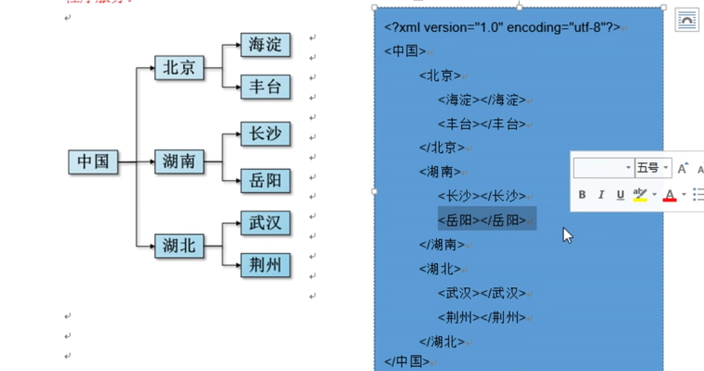
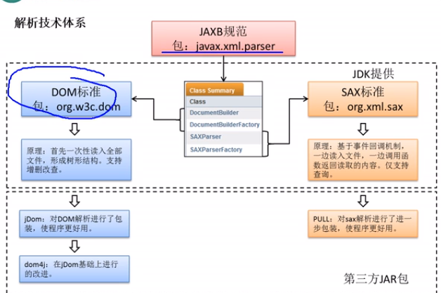

# XML

> [TOC]

<table>
    <tr></tr>
    	<td></td>
    	<td></td>
    	<td></td>
    <tr></tr>
    <td></td>
    	<td></td>
    	<td></td>
    <tr></tr>
    <td></td>
    	<td></td>
    	<td></td>
    <tr></tr>
    <td></td>
    	<td></td>
    	<td></td>
</table>
## 一. 绪论

### 1. 什么是XML

`extensible markup language` 可拓展标记语言,由W3C组织发布,以统一的格式组织有关系的数据

因为是标记语言,它也有DOM



### 2. 怎么个写法:

写写自定义标签,表示表示包含关系

## 二. XML的JAVA解析

### 1. 当前解析技术

`DOM解析派`和`sax解析派`

* **DOM:** W3C组织推荐的
  * 但是不是事实上的标准
* **sax**(simple API of XML):
  * 是事实上的标准,不需要加载整个文档,读一行解析一行
  * 只能读不能改

只有这两种被`javax.xml.parsers`支持



我们学`dom4j`

### 2. dom4j解析

这是一个第三方包,需要maven导包

> 步骤:
>
> 1. 导入dom解析包,maven
>
> 2. 创建一个`SAXReader`,一个xml文档阅读器
>
> 3. 使用saxReader读取文件即可,返回一个`Document`对象(文档对象)
>
>    ```javascript
>     Document read = saxReader.read(new File("src/main/resources/stu.xml"));
>    ```
>
> 4. 用document增删改查

### 3. document增删改查

示例xml:

```xml
<?xml version="1.0" encoding="UTF-8" ?>
<students>
    <student>
        <name>zhangsan</name>
        <age>18</age>
    </student>
    <student>
        <name>lisi</name>
        <age>18&lt;19</age>
    </student>
</students>
```

#### 3.1 对于节点三个属性的获取

NodeType,NodeName,NodeValue

* getNodeType()方法

  * 获取当前节点类型

  ```java
      short ANY_NODE = 0;
      short ELEMENT_NODE = 1;
      short ATTRIBUTE_NODE = 2;
      short TEXT_NODE = 3;
      short CDATA_SECTION_NODE = 4;
      short ENTITY_REFERENCE_NODE = 5;
      short PROCESSING_INSTRUCTION_NODE = 7;
      short COMMENT_NODE = 8;
      short DOCUMENT_NODE = 9;
  ```

* getName()

  * 获取NodeName,就元素名


#### 3.2 遍历节点树

* 从根部向下遍历节点

  1. 先获取根节点

     ```java
     Element element = document.getRootElement();
     //根节点在这里是students
     ```

  2. 获取子节点

     * elements()方法返回一个List<Element\>

       ```java
       List<Element> elements = rootElement.elements();
       for (Element e:elements) {
            System.out.println(e);
       }
       ```

     * `elementText(name)`获取当前节点**下**名为name的子元素的文本值

       ```java
       for (Element e:elements) {
           e.elementText("name");//获取每个student下<name>的文本
        }
       ```

  3. 获取本标签的文本值

     ```java
     e.getText();
     ```

  4. 获取本标签的属性值

     ```java
     e.attributeValue("id");
     ```

     

### 3.3 整合到对象Bean

```xml
<?xml version="1.0" encoding="UTF-8" ?>
<students>
    <student id="456">
        <name>zhangsan</name>
        <age>18</age>
    </student>
    <student id="123">
        <name>lisi</name>
        <age>18&lt;19</age>
    </student>
</students>
```

> 注意: id等属性可以被整合在Bean中
>
> 

就是一个一个获取然后通过构造器构造

```java
String id = ele.attributeValue("id");
String name = ele.elementText("name");
String age = ele.elementText("age");
int i;
try {
    i = Integer.parseInt(age);
} catch (NumberFormatException e) {
    i = 18;
}
Student student = new Student(name, i, id);
stus.add(student);
```

#### 3.4 修改部分元素

```java
root.element(name); //返回第一个这个名字的子元素
```

修改的方法:

```java
name.setText("zhangsansan1");
name.addAttribute(name,value);
//在缓存中,不会直接在xml生效
```

修改到xml

```java
//使用XMLWriter
XMLWriter xw = new XMLWriter();
//构造器可以传OutputStream/Writer,OutputFormat,或者两个都传
//OutputFormat将输出格式化,拥有静态方法createCompactFormat()和createPrettyPrint(),创建两种不同的OutputFormat,分别对应压缩和美观(比如压缩css和美观css)
xw = new XMLWriter(new FileOutputStream(file),compactFormat); //可以是任意xml文件的流
xw.write(read); //把我们修改的文档对象传进去

xw.close(); // 是一个Writer,需要关流
```

## 三. xPath

xPath是在XML中查找信息的__语言__,跟jQurey的选择器一个概念,简化dom查找

需要导包`jaxen-....jar`

### 1. 语法

xPath类似于在一个文件系统中定位文件,如果路径以`/`开始就找绝对路径

* 实例1:以`/`开头的绝对路径

  ```xml
  <!--xml文件-->
  <AAA>
      <BBB></BBB>
      <CCC></CCC>
  </AAA>
  ```

  * 选中AAA: `/AAA`
  * 选中CCC: `/AAA/CCC`

* 实例2: 以`//`开头的路径

  * 寻找满足双斜线后面的内容
  * 比如: 
    * `//AAA`查找所有AAA
    * `//DDD/BBB`查找//DDD(所有DDD),然后找它子元素BBB

* 实例3: `*`表示当前路径所有的元素

  * `/AAA/DDD/*` AAA/DDD下所有元素
  * `/*/*/BBB`所有在第三层的BBB(`/*`第一层所有,`/*`第二层所有)

* 实例4: `[]`表示下标,第几个(从1开始,last()表示最后一个)

  * `/AAA/BBB[1]`AAA下第一个BBB
  * `/AAA/BBB[last()]`AAA下最后一个BBB

* 实例5: `@属性名`表示查找有属性的元素
  * `//@id`查找有id的
  * `/AAA/BBB[@id]`查找有id的BBB
  * `//BBB[@name="aaa"]`还能指定属性值
  * `//BBB[normalize-space(@name)='bbb']` 去掉前后空格的属性name

### 2. 在哪用

先解析(SAXReader),再获得根节点(getRootElement)

然后根节点调用`List selectNodes(String xpathExpression)`方法

或者`Node selectSingleNode(String xpath)`;

```java
Node node = root.selectSingleNode("/students/student");
```

> 备注: Node是一个接口,Element,Attribute都是它的实现类